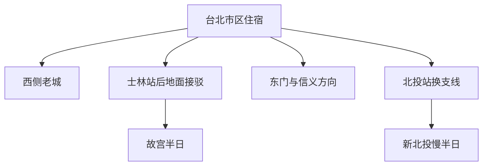

# 台北旅行指南

台北坐落在群山环绕的盆地里，繁华街区与山林温泉相距不远。大稻埕的茶行、布铺和老店屋，延续着昔日商贸街区的面貌；万华的庙宇仍是日常信仰的一部分。向东走，信义区的高楼与商场展现出现代都会的另一面。故宫的文物收藏之外，牛肉面馆、街边茶店和夜市也构成了认识台北的线索：传统与现代并存，城市生活丰富而具体。

> 建议停留：主城 2–3 天；加入北投或其他独立片区后 4 天 
> 旅行关键词：老商街、寺庙建筑、故宫、牛肉面、夜市、城市眺望 
> 最近核查：2026-09-06；下文用时与优先级为编辑估计

## 城市速览

**首访先选三件事。** 在大稻埕留一个不赶路的下午，看店屋立面、布业与茶店怎样共享街道；为故宫保留一段完整的室内参观时间；再选台北 101 或象山理解盆地与高楼的关系。101 以电梯换取视野，象山需要连续爬阶；阴雨低云时，两者都可以舍弃。

| 项目 | 旅行信息 |
|---|---|
| 主要旅行价值 | 老城商业与信仰生活、文物收藏、密集餐饮，以及山地环绕的现代都市 |
| 建议停留 | 2 天选老城与故宫；3 天增加信义区；4 天再留北投半日至一日 |
| 季节选择 | 较凉爽时适合街区慢走；夏季把户外放早晚。台风、强降雨与地震可能改变交通和开放范围 |
| 预算特点 | 面馆、饭铺和街区步行可控制预算；住宿、付费观景与温泉会显著拉高支出 |
| 步行强度 | 老城低至中等，但骑楼高差和站内换乘耗脚力；象山连续台阶为中至高 |
| 最适合的组合 | 上午一座场馆，下午一个街区，晚餐就近；每日最多一个远离捷运的锚点 |
| 首访可暂缓 | 阳明山完整登山、猫空与动物园组合、九份及北海岸；它们各需要单独规划 |

## 城市格局与游览区域

老台北在西侧展开，现代高楼集中在东侧信义区；故宫位于北面的士林山麓，北投更往西北。先用片区决定一天的移动范围，再挑餐馆，比在地图上追逐热门店更省力。片区性格与街区关系参照[台北旅游网区域旅行](https://travel.taipei/zh-tw/attraction/popular-area)。

| 区域 | 主要内容 | 游览特点 | 与其他区域的关系 |
|---|---|---|---|
| 大稻埕—迪化街 | 店屋、干货、布业、茶与小吃 | 适合白天看商贸生活，午后喝茶休息；不只是一条拍照街 | 可接宁夏夜市；到万华建议搭车，不把西城各片区全程串走 |
| 万华—西门 | 艋舺龙山寺、传统街区、西门商业 | 寺庙周边仍有日常礼拜，西门偏购物与年轻商业 | 龙山寺和西门可用捷运短接；与迪化街同日需留交通时间 |
| 士林—故宫 | 故宫北部院区、士林补给 | 以文物参观为重，馆内需要持续站立 | 捷运士林站后仍需公交或出租车，不是出站即入馆 |
| 信义—象山 | 台北 101、商场、山坡眺望 | 室内消费空间集中，山步道却有较高体力门槛 | 红线可连接东门餐饮；101 与象山首访通常二选一即可 |
| 东门—大安 | 面点、餐馆、咖啡与居民街区 | 适合把正餐和休息排进路线 | 可接信义区，不必为了吃一顿再折返西城 |
| 新北投 | 温泉博物馆、公园、温泉旅宿 | 适合慢半日；泡汤需单独确认经营者和时段 | 北投站换新北投支线；不与故宫和信义区硬塞同日 |

**跨市范围。** 淡水、九份、金瓜石、平溪和板桥均在新北市；桃园机场位于桃园市，基隆也有独立市域。它们可以从台北出发，但交通、开放信息和市域覆盖不能计作台北市内景点。本页覆盖台北首访核心与新北投轻量延伸，阳明山、猫空和动物园的详细路线待专项补充。

从住宿基地选择一个方向，再在片区内慢走。故宫需要地面接驳，北投需要支线换乘，不能凭同在北侧就视为一条连续步行线：

## 主要景点

A 为首访优先，B 为兴趣补充，C 为需独立安排的延伸。“路线节点”帮助组织一天，不重复算作景区。预约风险指时段票、限流或开放调整对计划的影响，不代表全部强制预约。

| 景点 | 区域 | 类型 | 主要看点 | 建议用时 | 室内外 | 体力 | 预约风险 | 天气影响 | 优先级 |
|---|---|---|---|---|---|---|---|---|---|
| 大稻埕街区—迪化街店屋 | 大同区 | 历史商街 | 连排店屋、布业与干货贸易、茶文化 | 2–3 小时 | 混合 | 中 | 低 | 中 | A |
| 艋舺龙山寺 | 万华区 | 寺庙、古迹 | 屋顶装饰、石雕与仍在进行的信仰生活 | 45–75 分钟 | 混合 | 低 | 低 | 中 | A |
| 故宫博物院北部院区 | 士林区 | 博物馆 | 书画、陶瓷、玉器等轮换展览 | 3–4 小时，另加接驳 | 室内 | 低至中 | 中 | 低 | A |
| 台北 101 观景台 | 信义区 | 城市观景 | 盆地、高楼与周边山地的空间关系 | 1.5–2 小时 | 以室内为主 | 低 | 中至高 | 高 | B |
| 象山亲山步道短线 | 信义区 | 山地步道 | 从山坡看 101 与信义区 | 1.5–2.5 小时含爬升返回 | 室外 | 中至高 | 低 | 高 | B |
| 北投温泉博物馆 | 北投区 | 历史建筑、专题展馆 | 公共浴场遗存与北投温泉发展 | 45–75 分钟 | 室内 | 低至中 | 中 | 低 | B |
| 西门町 | 万华区 | 商业街区 | 街头商业、购物与餐饮 | 1–2 小时 | 混合 | 中 | 低 | 中 | 路线节点 |
| 宁夏夜市 | 大同区 | 餐饮街区 | 小份夜市食物与晚餐 | 1–1.5 小时 | 室外为主 | 低至中 | 低 | 高 | 路线节点 |

### 大稻埕：从店屋读懂商街

迪化街的价值在连续街面，不在逐栋集章。先看一段立面怎样把招牌、门面和楼上空间叠在一起，再进入仍营业的布店、干货店或茶空间。布业、南北货和茶贸易提供理解街区的线索；各店营业时间不同，公共街道全天可走不等于市场与展馆全天开放。[迪化街商圈官方介绍](https://www.travel.taipei/immersive/zh-tw/a-0-1/)

### 龙山寺：建筑与礼拜同时发生

沿允许的参观动线看屋脊装饰、石雕和院落，不站在礼拜者与神龛之间拍摄。龙山寺是持续举行法会的宗教空间，祭典日应主动让出通道。只为建筑而来也值得停留，但不要将寺院当成可任意摆拍的布景。[龙山寺官方简介](https://www.lungshan.org.tw/tw/)

### 故宫：围绕当日展览选择

先在馆方展览页选两至三个主题，再补充其他展厅；书画与其他藏品会轮换，不承诺某件“明星文物”一定在台北展出。**截至本次核查，馆方公告 2026-08-08 至 09-13 试办每日开馆，第一展览馆 09:00–19:00，18:30 停止售票与票券兑换。** 此安排有截止日，之后须重新查询；不能机械套用“故宫周一闭馆”。张大千纪念馆另有预约制度，不包含在普通主馆到访计划中。[故宫开放时间](https://www.npm.gov.tw/Articles.aspx?l=1&sno=02007001)

### 101 与象山：按天气和体力选视野

101 适合希望少爬坡、能接受门票支出的旅行者；高空观景仍会受低云影响。官方页面本次列观景台 10:00–21:00，**售票处与入口设在办公大楼 1 楼**，出发前按官方与订单确认，勿沿用旧攻略的 5 楼入口。室外楼层或专项体验按当日开放、票种办理。[台北 101 官方观景台](https://www.taipei-101.com.tw/zh-hant/observatory)

象山的优点是能把 101 本身纳入视野；代价是连续台阶、闷热和雨后湿滑。只走已开放的短线，到可承受的平台折返，不为拍照攀上围栏或岩石边缘。天黑前留足下山时间；看夜景需有照明与同行安排，不作为低体力默认选项。[观光署象山介绍](https://media.taiwan.net.tw/zh-tw/portal/travel/details/attraction_379000000a_000185)

### 北投：先看浴场历史，再决定泡汤

温泉博物馆前身为 1913 年建成的公共浴场，建筑和旧浴池帮助理解温泉如何成为城市休闲。博物馆用于参观，泡汤应另选合法营业的温泉场所并确认房型、使用规则与预约。博物馆常规开放为周二至周日 10:00–18:00，周一及特殊休馆日应再核对，勿按公园全天开放推定馆内开放。[观光署建筑介绍](https://www.taiwan.net.tw/m1.aspx?id=a12-00051&sno=0001016)、[台北市文化局参观说明](https://culture.gov.taipei/cp.aspx?n=680DE22A4F00B25F)

## 美食与餐饮

台北餐桌既有米饭、小吃和豆制品，也吸收面食与江南面点。牛肉面适合作一顿正餐，小笼包适合多人分食，夜市则适合边走边少量尝味；三种场景不必都安排在同一天。品类背景参照[台北饮食攻略](https://www.travel.taipei/zh-cn/must-visit/tasterguide)，以下用餐方式与替代为编辑建议。

| 菜品或餐饮类型 | 常见区域 | 一个人用餐与常见份量 | 风味、过敏原与饮食限制 | 排队风险与替代方法 |
|---|---|---|---|---|
| 牛肉面 | 西门周边、东门及各居民街区 | 一碗配小菜即可成餐 | 清炖与红烧可比较；含牛肉、小麦，汤底与酱料需另问 | 名店饭点排队；改选同片区面馆，无须跨城追店 |
| 卤肉饭与汤 | 万华、大同及居民街区 | 小碗饭加汤、青菜便于控制份量 | 常含猪肉、猪油与大豆调味；清汤不等于素食 | 可作为夜市拥挤时的坐下吃饭方案 |
| 小笼包与蒸饺 | 东门、信义商圈 | 一笼对单人可能偏多，可搭配小份菜 | 小麦、猪肉为常见原料；部分含虾蟹，汤汁较烫 | 先取号再按店方允许范围活动；时间不足换一般面点店 |
| 豆花、豆浆和甜品 | 大同、东门及街区小店 | 适合步行中段的小份休息 | 大豆为核心，配料可能含花生、芝麻或奶 | 不排长队也能找到同品类；确认能否坐下和最低消费 |
| 夜市小吃 | 宁夏、饶河街、士林等不同片区 | 每次买一两样，多人分享 | 蚵仔、虾、蛋、花生、豆制品和共用油锅常见 | 一个晚上选一处；先在附近正餐，再少量尝味可减少站立 |
| 茶馆与咖啡 | 大稻埕、中山、东门 | 注意每人低消、茶席计费与停留时间 | 茶咖含咖啡因，糕点可能含奶蛋与坚果 | 有预约的茶席先锁时段；无位时换普通咖啡店休息 |

现金小额支付在小吃摊更实用；购物中心与餐厅是否收特定银行卡或支付工具需现场确认。严重过敏者应说明具体食材与交叉接触需求；素食者应确认汤底、猪油和鱼虾调味，而非只看菜名有没有肉。

## 经典行程

交通时长依班次与拥堵变化。每天为午餐和室内休息留 60–90 分钟，不用“打卡数量”挤占休息。

### 两日：商街、庙宇与文物

**第 1 天：** 上午龙山寺 → 万华午餐 → 搭车至大稻埕 → 茶馆休息与迪化街 → 体力允许时宁夏夜市。庙宇在前、营业中的商街在后，避免太早到访多数店铺尚未营业。锚点是寺院活动和已预约茶席；累了先删夜市，在迪化街附近餐馆吃完即结束，经北门或大桥头方向捷运返宿。

**第 2 天：** 故宫 → 士林午餐与休息 → 返回中山街区自由散步或直接返宿。故宫是当天唯一必锁的开放锚点，先核对日期与展览，再查士林站地面接驳。下午不再硬接北投、九份与 101；晚到或疲劳时只看选定展厅，出馆乘公交或出租车退出。

### 三日：在东侧看城市轮廓

前两天沿用两日线。**第 3 天：** 东门午餐与短逛 → 信义商圈休息 → 台北 101 或象山二选一 → 就近晚餐。想看夕照者先按日落时间和实际余票安排 101；不买票者也可在地面观察高楼与街区。象山仅在天气稳定、体力足够时加入，并在下山所需时间前折返。低云或大雨就删除眺望，保留餐饮与室内休息；从台北 101／世贸站或象山站退出。

### 第四天可选：北投慢半日

新北投站 → 温泉博物馆 → 午餐 → 已确认的温泉预约或公园短走 → 新北投站返回。先核对博物馆休馆日和温泉预约；两者撞时段时优先保留已付费且适用的预约。午餐是休息段，不在泡汤前后赶路。删减顺序为外围散步、额外咖啡馆；身体不适或行程延误时可在新北投站直接结束。地热景观只使用正式开放动线，不碰热水、不进溪沟。

### 雨天、亲子与低体力调整

普通雨天优先故宫或营业中的室内商业空间，骑楼不能保证全程无雨无台阶。亲子可减少故宫展厅数量，先核对儿童学艺中心当天安排。长者或低体力旅行者可把大稻埕缩成一个街段，以车辆接到入口，101 取代象山，夜市取代为有座位的餐馆。台风、暴雨或交通停驶时取消跨区移动，室内方案也以实际开放和应急指引为准。

## 住宿区域

先看旅馆入口到捷运电梯的实际走法，再看地图直线距离。连续住同一处通常比三天换两家旅馆节省时间。

| 区域 | 适合的旅行方式 | 主要取舍 |
|---|---|---|
| 台北车站—北门 | 初访、机场与跨城衔接 | 车站体量大，机场捷运与其他线路之间有步行；确认旅馆对应出口 |
| 中山周边 | 餐饮、购物与老城组合 | 晚餐和休息选择多；查临街噪声与房间窗户 |
| 西门 | 偏重老城与晚间商业 | 游人多，房间与入口条件差异大；不以商圈名代替旅馆核验 |
| 东门—大安 | 希望居民街区、餐馆与信义线兼顾 | 机场需换乘，价格与房型按日期比较 |
| 信义 | 购物、101 和商务活动 | 通常增加住宿开支，往返大稻埕与故宫较远 |
| 新北投 | 专门安排温泉住宿 | 适合独立一晚；不宜为了主城三日线每天往返 |

## 市内交通

捷运是主城骨架，故宫和部分旅馆入口用公交或出租车补足。夜间先查具体车站末班，不能把全系统营业终点当作任意方向都能上车的时间。[台北捷运即时营运信息](https://tpweb.metro.taipei/2026/)

| 交通方式 | 使用建议 | 行动提醒 |
|---|---|---|
| 台北捷运 | 用站名、线路及终点方向确认乘车；低体力优先电梯出口 | 禁止饮食区从站内黄色标线起，饮水也包含在内；有特殊身体需要向工作人员求助 |
| 公交 | 故宫等离站较远地点用实时班次规划 | 去程与回程站位可能分开；上车前核对方向和下车站 |
| 出租车 | 行李、雨天、故宫接驳和低体力点到点 | 保存目的地中文地址，按正规经营车辆计费 |
| 桃园机场捷运 | 桃园机场往返台北 A1 站，可选直达或普通列车 | A1 与台铁／高铁／台北捷运并非同一站台，留步行与换乘余量；按航班日期查时刻 |
| 台铁与高铁 | 台北站衔接西部城市，按列车停站选择 | 两套系统车票不通用；高铁与台铁的“台中”“台南”到市中心接驳不同 |
| 步行与自行车 | 街区内部短走最灵活，租车前确认注册与支付 | 骑楼不连续，路口注意机车与转弯车辆；不默认山坡或夜市可骑行 |

禁止饮食范围以[台北捷运常见问答](https://www.metro.taipei/News_Content.aspx?n=566DA580861CEE77&s=CBB430D2363C29FC&sms=87415A8B9CE81B16)为准；机场列车与末班以[桃园捷运时刻查询](https://www.tymetro.com.tw/tymetro-new/tw/_pages/travel-guide/departure.html)为准。凌晨或深夜航班另核对运营中的机场客运、正规出租车或机场住宿，不假定轨道交通全天运行。

## 不同旅行者须知

| 旅行者 | 调整建议 |
|---|---|
| 独行 | 面馆、小碗饭与捷运组合容易执行；夜市少量点餐，山步道尽量白天走 |
| 亲子 | 一天只选一个需要持续站立的馆；寺庙门槛、山阶和夜市人流处持续看护 |
| 长者与低体力 | 大稻埕短街段加室内休息；故宫少看展厅、车辆补接驳；舍弃象山 |
| 轮椅与童车 | 出发前查车站电梯与场馆可达入口；古建、旧店屋和骑楼高差需逐处确认 |
| 饮食限制 | 把限制写成可展示的中文；核对汤底、酱料与共用油锅，茶馆也需核对糕点成分 |
| 不同证件身份 | 台北交通与酒店订单不证明已具备入境资格；大陆居民、港澳居民、外国护照持有人及台湾居民适用条件不同 |

入境办理应按持有证件、居住地、出发地和旅行目的分别查验。大陆居民不能把外国护照免签信息用于自身；经第三地转机也不自动改变身份条件。先读[台湾旅行总览的证件与入境说明](README.md)，再按个人身份向相应主管机构和承运人完成行前确认。

## 行前核对

- 核对证件与入境资格、出发地出境要求、转机条件和返程安排，再支付不可退票款。
- 按到访日期重新核对故宫开放日、轮换展览、101 入口和票种；本次故宫每日开馆试办仅到 2026-09-13。
- 查询天气、地震后开放通告、捷运和机场列车状态；山区路线只在明确开放时执行。
- 检查住宿真实入口、电梯与行李寄存；机场捷运换乘不按“同名台北站”省略步行时间。
- 保存餐饮与景点中文名称、住址和订单，备少量现金；最后一天给机场手续留足时间。

## 来源与更新记录

本页为资料研究形成的原创中文攻略，无实地体验声明。核查日期均为 **2026-09-06**；表中用时、路线组合和取舍为编辑判断，不是运营方保证。

| 来源 | 支持内容 | 核查说明 |
|---|---|---|
| [台北旅游网区域旅行](https://travel.taipei/zh-tw/attraction/popular-area) | 片区与城市旅行主题 | 结合现有市域目录界定首访范围 |
| [迪化街商圈](https://www.travel.taipei/immersive/zh-tw/a-0-1/) | 店屋、布业、茶与商业背景 | 店铺与街道开放时间分开理解 |
| [龙山寺官网](https://www.lungshan.org.tw/tw/) | 寺庙建筑与持续宗教活动 | 不采用旧旅游页的过时古迹级别 |
| [故宫开放时间](https://www.npm.gov.tw/Articles.aspx?l=1&sno=02007001) | 2026-08-08 至 09-13 试办每日开馆 | 官方搜索返回公告核对；直接读取一度失败，后续日期须重查 |
| [台北 101 观景台](https://www.taipei-101.com.tw/zh-hant/observatory) | 开放时间及办公大楼 1 楼入口 | 官方检索返回与订单说明核对；不采用第三方旧入口信息 |
| [象山官方介绍](https://media.taiwan.net.tw/zh-tw/portal/travel/details/attraction_379000000a_000185) | 山体、步道与观景关系 | 步道当日通行情况须另核对 |
| [北投温泉博物馆介绍](https://www.taiwan.net.tw/m1.aspx?id=a12-00051&sno=0001016)、[文化局参观说明](https://culture.gov.taipei/cp.aspx?n=680DE22A4F00B25F) | 公共浴场历史与参观查询 | 博物馆与商业泡汤分开安排 |
| [台北饮食攻略](https://www.travel.taipei/zh-cn/must-visit/tasterguide) | 代表食品与觅食片区 | 不把品类写成唯一名店清单 |
| [台北捷运禁饮食问答](https://www.metro.taipei/News_Content.aspx?n=566DA580861CEE77&s=CBB430D2363C29FC&sms=87415A8B9CE81B16)、[营运信息](https://tpweb.metro.taipei/2026/) | 乘车规则与状态入口 | 实时状态需出行当天再查 |
| [桃园捷运时刻查询](https://www.tymetro.com.tw/tymetro-new/tw/_pages/travel-guide/departure.html) | 机场接驳与班次 | 按日期查询，不固化末班 |

**更新记录：** 2026-09-06，覆盖西城、故宫、信义与新北投；阳明山、猫空、动物园及更多无障碍入口尚未逐项研究。
