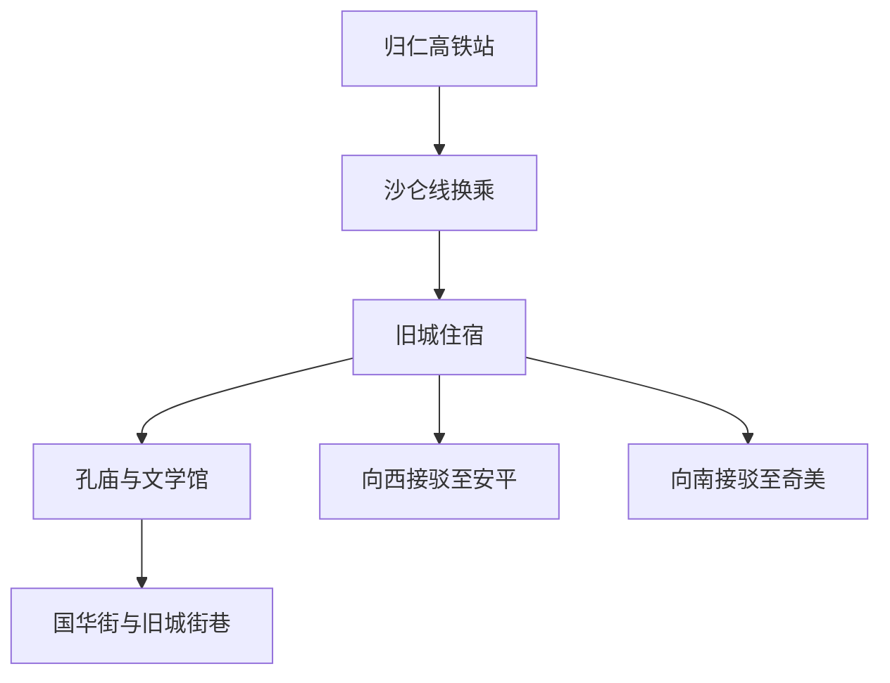
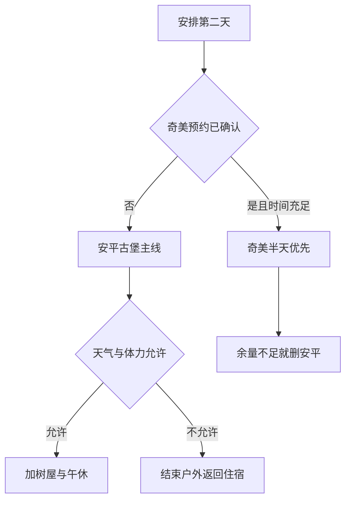

# 台南旅行指南

台南的城市记忆留在庙宇、街巷和餐桌上。孔庙与旧城里的历史建筑，勾勒出这座古城的文化底色；安平的古堡与港口遗迹，则讲述着海上贸易留下的故事。市场里的牛肉汤、米糕和各式小吃，是当地生活的一部分。老屋之间也有文学馆、咖啡馆和小店，古迹与日常相伴，让台南的历史有了可亲近的面貌。

## 城市速览

**首访精选。** 想读懂古城，优先孔庙与文学馆；想吃得从容，把国华街的小份午餐和一段坐下休息留进时间表；想理解台南与海的关系，再到安平古堡看遗构与后世改建。只有一天时留在中西区，比跨三个片区更完整。

| 项目 | 旅行信息 |
|---|---|
| 建议停留 | 旧城与安平 2 天；加奇美博物馆约 3 天，或用奇美替换第二天下午 |
| 季节与天气 | 较凉爽且少雨的日子适合街巷步行；夏季高温、阵雨及台风会改变户外安排 |
| 预算特点 | 小吃可按份控制预算；反复用出租车跨区与特展门票是主要增项 |
| 体力 | 旧城步行为中等；古建门槛、骑楼高差和安平曝晒容易累积疲劳 |
| 住宿方向 | 首访优先中西区或台铁台南站周边；高铁站周边偏向抵离便利 |
| 本页范围 | 中西区、安平与仁德奇美；七股、北门、关子岭尚未写成完整线路 |

## 城市格局与游览区域

旧城的价值在相邻街区，可以边走边停；安平与仁德则是两个不同方向，需要车辆或铁路接驳。一天加入两个方向会挤掉用餐与参观时间。

| 区域 | 主要内容 | 游览特点 | 与其他区域的关系 |
|---|---|---|---|
| 孔庙—文学馆 | 儒学建筑、文学展览、府中街 | 古建与室内展览互补，适合上午开始 | 同属中西区，可与国华街组合，仍需计入过街时间 |
| 赤崁—国华街—神农街 | 古迹、市场小吃、街屋 | 街巷与车流交织，选少量节点比全程打卡舒服 | 可分成上午和傍晚两个短段，中午进室内休息 |
| 安平 | 古堡、树屋、老街 | 海港历史与旧聚落，节假日较拥挤 | 位于旧城以西，留独立半天；不能当作国华街步行末端 |
| 仁德奇美博物馆 | 艺术、乐器、自然史与兵器收藏 | 大型室内场馆，需要明确参观主题 | 位于旧城南侧，邻近台铁保安站方向，与安平不是顺路步行组合 |
| 归仁高铁站 | 高铁、沙仑线换乘 | 主要是抵离节点 | 经二楼通廊到沙仑站再换台铁前往台南站，另计候车和进城时间 |

## 主要景点

A 是首访重点，B 是兴趣补充；建议用时为编辑估计，未含排队与跨区交通。预约风险衡量临时到访的不确定性，并非表示所有地点都强制预约。

| 景点 | 区域 | 类型 | 主要看点 | 建议用时 | 室内外 | 体力 | 预约风险 | 天气影响 | 优先级 |
|---|---|---|---|---|---|---|---|---|---|
| 台南孔子庙 | 中西区 | 古建、文化 | 院落秩序、红墙、下马碑与教育传统 | 1–1.5 小时 | 混合 | 低至中 | 低 | 中 | A |
| 台湾文学馆 | 中西区 | 博物馆 | 通过作家、文本及展览理解地方社会 | 1.5–2 小时 | 室内 | 低 | 中 | 低 | A |
| 赤崁楼 | 中西区 | 古迹 | 遗构、碑刻与不同时期建筑层次 | 1–1.5 小时 | 混合 | 中 | 中 | 中 | B |
| 安平古堡 | 安平 | 古迹、港口史 | 城墙遗迹及后世改建，认识旧港口空间 | 1–1.5 小时 | 混合 | 中 | 低 | 高 | A |
| 安平树屋与德记洋行 | 安平 | 历史建筑 | 商贸仓储建筑与榕树交织的空间 | 1–1.5 小时 | 混合 | 中 | 低 | 高 | B |
| 奇美博物馆 | 仁德 | 收藏博物馆 | 西洋艺术、乐器、动物及兵器主题 | 3–4 小时 | 室内为主 | 低至中 | 高 | 低 | B |
| 国华街—神农街选段 | 中西区 | 街区、餐饮 | 市场小吃与街屋，选择一段慢走 | 1.5–2 小时 | 室外 | 中 | 低 | 高 | 路线节点 |

**孔庙与文学馆：从建筑进入文字。** 孔庙不只适合拍红墙，可以把入口处的下马碑和院落次序作为观察起点；文学馆提供另一种认识地方的方式，两者主题互补且位置接近。文学馆常规为周二至周日 09:00–18:00；周一遇假日有调整，另有灾害等休馆条件。先核查日历再决定两天顺序。[孔庙官方介绍](https://www.twtainan.net/zh-tw/attractions/detail/800/)；[文学馆开放信息](https://www.nmtl.gov.tw/SiteMap.aspx)。

**安平古堡：分清遗迹与后来建筑。** 今日所见并非一座完整保存的十七世纪城堡。将城墙遗构与后世平台、展示空间分开看，能避免把所有建筑都理解为同一年代。树屋是附近的另一个参观单元，时间少时二选一即可。[古堡管理单位介绍](https://historic.tainan.gov.tw/index.php?belongid=45&id=58&index=7&lang=cht&option=module&task=pageinfo)。

**奇美：先选收藏主题，再决定特展。** 常设展与特展票制、导览预约不能混用。馆方常规时间为 09:30–17:30，周三与除夕休馆；2026 年部分指定周三仅向持当天特展艺享票者开放，不能推断普通票也能进馆。把已确认的门票或导览时段作为整天锚点；展览未订妥时留在旧城，不专程到门口碰运气。[奇美参观指南](https://www.chimeimuseum.tw/visit)；[导览服务](https://www.chimeimuseum.org/visit/60b8a81e414b4/654c9458b7577)。

赤崁楼涉及古迹修护及周边工程，旅游简介不能证明各楼层当天全部开放；购票前向现场确认可入内范围。不要为了补齐景点数量进入围挡区。[赤崁楼官方页面](https://www.twtainan.net/zh-tw/attractions/detail/674/)。

## 美食与餐饮

台南小吃适合分成几次小份用餐。牛肉汤常与早餐、午餐节奏相连；碗粿、担仔面和虱目鱼料理让一人也容易吃得完整。风味偏甜只是部分料理的特征，不能据此判断每一家或每一道菜。台南旅游网提供当地小吃背景与检索入口，具体店铺仍应当天确认营业。[官方小吃介绍](https://www.twtainan.net/zh-tw/shop/cuisines/)。

| 菜品或餐饮类型 | 常见区域 | 一个人用餐与常见份量 | 风味、过敏原与饮食限制 | 排队风险与替代方法 |
|---|---|---|---|---|
| 牛肉汤配饭 | 旧城、安平及居民街区 | 一碗汤加饭适合作正餐 | 牛肉、葱姜与汤底配方需问店家；需要全熟应明确说明 | 热门早餐店可能排队或售完，换同片区店，不横穿全城追店 |
| 碗粿、担仔面 | 国华街与中西区 | 小份适合两次进食 | 常见虾、猪肉、蛋、大豆或小麦调味，不默认素食 | 排队过长时改饭面店，保留至少一餐有座位 |
| 虱目鱼料理 | 居民餐饮区与市场周边 | 鱼粥、汤配饭便于独食 | 鱼类过敏；即使称无刺仍检查鱼刺 | 午间用餐；不以生食作为默认选择 |
| 豆花、冰品 | 旧城、安平 | 适合下午坐下休息 | 大豆、花生、乳品及配料交叉接触需确认 | 以座位、卫生与邻近为优先，不为单店牺牲休息 |

## 经典行程

两天都从市区住宿出发，不包含当天长途抵达，另留实际候车与接驳时间。

### 两日主线：旧城生活与安平港口

| 日程 | 上午 | 午餐与休息 | 下午与傍晚 | 锚点、删减与退出 |
|---|---|---|---|---|
| 第一天：古城与文字 | 09:00 左右从孔庙开始，随后看文学馆；若有已预约导览，以导览时间倒排 | 12:00–14:00 在中西区选小吃加室内长休，避免持续曝晒 | 14:30 后择赤崁楼或国华街；晚些只走神农街短段 | 先查文学馆休馆。晚到时删赤崁楼，疲累时从餐厅直接乘车回住宿，不补夜街 |
| 第二天：安平的城与港 | 09:00 左右接驳到安平，先古堡，体力允许再加树屋 | 12:00–14:00 安平午餐、坐下休息 | 老街短走后回中西区，留行李提取与离城余量 | 树屋为第一删减项；风雨增强即结束户外，从正式上客点乘车返回，不加海岸段 |

### 收藏兴趣替换：给奇美完整半天

将第二天下午的旧城自由活动替换为奇美时，上午安平只保留古堡，并提前安排跨区车辆；更从容的做法是另加第三天，上午进馆、午后返城。导览或特展预约在中午以前时，应直接去奇美，删去安平。台铁保安站到馆仍有地面步行，携行李或低体力者先确认短接驳。

## 住宿区域

| 区域 | 优点 | 缺点 | 适合人群 | 交通特点 |
|---|---|---|---|---|
| 中西区 | 古迹、餐饮与晚间短走集中 | 老屋可能无电梯、隔音有限 | 首访、两日慢游 | 步行加短程用车，确认车能到实际入口 |
| 台铁台南站周边 | 便于台铁抵离与沙仑线换乘 | 站前到目标街区仍有距离，工程可能影响出入口 | 晚到早走、铁路跨城 | 核对站名及当前行人动线 |
| 安平 | 可早进古堡，减少热门时段压力 | 去文学馆及奇美需跨区 | 偏爱安平、停留较长 | 先确认晚间公交与叫车 |
| 高铁站周边 | 适合特别早的高铁 | 不便旧城夜间活动 | 以次日离开为优先 | 高铁站与台铁台南站不同，切勿凭名称订房 |

## 市内交通

| 场景 | 旅行者需要知道的结构 | 需要重新核对的内容 |
|---|---|---|
| 高铁抵达 | 高铁台南站位于归仁，二楼通廊通往台铁沙仑站；再转往台南站 | 高铁到达、沙仑线班次、候车及末班，不只算列车行驶时间 |
| 台铁跨城 | 台南站适合衔接嘉义、高雄方向；具体列车停靠与座位条件不同 | 当天车次与施工公告，保安站是否适合本班列车 |
| 市区公交 | 适合部分片区连接，不能假定到站即有车 | [大台南公交动态](https://2384.tainan.gov.tw/)的站位、班次及付款说明 |
| 出租车 | 可用于安平、仁德及低体力跨区 | 明确目的地、上客点与计费，景区高峰预留等车 |
| 步行 | 在同一片区串少量点，骑楼与人行道高差不连续 | 施工、过街、雨天积水与古建台阶 |

高铁官方台南站页面确认沙仑换乘结构；买台南—高雄行程时，应比较住宿到台铁站与到高铁站的完整门到门时间。[高铁台南站转乘说明](https://www.thsrc.com.tw/ArticleContent/9c5ac6ca-ec89-48f8-aab0-41b738cb1814)。

## 不同旅行者须知

| 旅行维度 | 可行条件 | 主要取舍 | 需额外核对 |
|---|---|---|---|
| 独行 | 小吃与旧城短线容易拆分 | 不为单家店来回跨区 | 夜间回程、店休 |
| 亲子 | 孔庙短看加室内馆，安排午睡或长休 | 删连续古建打卡 | 童车入口、馆内饮食限制 |
| 长者与低体力 | 每半天一个片区，用车跨区 | 古堡登高与树屋栈道可删 | 座位、入口台阶、接驳 |
| 无障碍需求 | 先联系住宿、博物馆与车站协助 | 旧城骑楼不保证连续可达 | 电梯、无障碍厕所和实际开放路线 |
| 特殊饮食 | 逐店说明肉汤、虾、花生、蛋奶限制 | 菜名不能证明纯素或无过敏原 | 汤底、酱料及共用器具 |
| 高温与台风期 | 户外集中在早晚，留整段室内休息 | 强风暴雨时取消安平户外 | 气象、交通与场馆关闭公告 |

## 行前核对

| 核对事项 | 为什么需要重查 | 建议核对时间 | 官方入口 |
|---|---|---|---|
| 奇美票与导览 | 常设展、特展与指定周三条件不同 | 确定日期时及前一天 | [参观指南](https://www.chimeimuseum.tw/visit) |
| 文学馆与古迹开放 | 周一、假日、活动及修护会影响进入范围 | 前一天 | [文学馆](https://www.nmtl.gov.tw/SiteMap.aspx)；[文化局场馆时间](https://culture.tainan.gov.tw/table/index?Parser=4%2C7%2C363%2C50%2C%2C%2C%2C%2C%2C%2C3) |
| 抵离接驳 | 高铁站远离旧城，不能用同名站代替 | 购票时及当天 | [高铁](https://www.thsrc.com.tw/)；[台铁](https://www.railway.gov.tw/) |
| 天气与停班停课 | 台风可能同时影响铁路、公交与场馆 | 每日出发前 | [中央气象署](https://www.cwa.gov.tw/) |
| 旅行证件 | 大陆居民、港澳居民、外国护照持有人适用程序不同，出发地亦影响办理；不将外国护照免签条款套用于其他身份 | 买不可退票前及出发前 | [移民署](https://www.immigration.gov.tw/)；[领事事务局](https://www.boca.gov.tw/np-137-2.html)；大陆出发者另查[国家移民管理局](https://www.nia.gov.cn/) |

## 来源与更新记录

| 来源 | 类型 | 支持内容 | 核验日期 |
|---|---|---|---|
| [台南旅游网孔庙](https://www.twtainan.net/zh-tw/attractions/detail/800/) | 市政府旅游资料 | 孔庙文化区、下马碑、周边关系 | 2026-09-06 |
| [台南旅游网赤崁楼](https://www.twtainan.net/zh-tw/attractions/detail/674/) | 市政府旅游资料 | 古迹与碑刻；不作为各楼层全面开放保证 | 2026-09-06 |
| [安平古堡管理单位](https://historic.tainan.gov.tw/index.php?belongid=45&id=58&index=7&lang=cht&option=module&task=pageinfo) | 文化局 | 建筑年代层次与改建 | 2026-09-06 |
| [文化局场馆时间](https://culture.tainan.gov.tw/table/index?Parser=4%2C7%2C363%2C50%2C%2C%2C%2C%2C%2C%2C3) | 文化局 | 古迹收费与开放查询 | 2026-09-06 |
| [文学馆](https://www.nmtl.gov.tw/SiteMap.aspx) | 场馆 | 常规开馆与休馆例外 | 2026-09-06 |
| [奇美参观指南](https://www.chimeimuseum.tw/visit)；[导览服务](https://www.chimeimuseum.org/visit/60b8a81e414b4/654c9458b7577) | 场馆 | 开馆、主题、特定周三及导览预约 | 2026-09-06 |
| [台南旅游网小吃](https://www.twtainan.net/zh-tw/shop/cuisines/) | 市政府旅游资料 | 牛肉汤与地方小吃背景 | 2026-09-06 |
| [高铁台南站](https://www.thsrc.com.tw/ArticleContent/9c5ac6ca-ec89-48f8-aab0-41b738cb1814) | 交通运营方 | 归仁站点与沙仑换乘 | 2026-09-06 |
| [领事事务局签证入口](https://www.boca.gov.tw/np-137-2.html) | 主管机构 | 外国旅行者须按证件与适用资格查询 | 2026-09-06 |

2026-09-06：首次完成中西区、安平与奇美的代表性攻略。核验以官方网页及搜索返回的官方正文为依据；奇美参观指南直接打开发生技术错误，已用其官方搜索正文与馆方导览页交叉核对。未核定具体餐厅营业、古迹全部内部区域、连续无障碍路线、七股与北门海岸及关子岭完整行程。用时、优先级与行程为资料基础上的编辑判断，非亲历记录。
