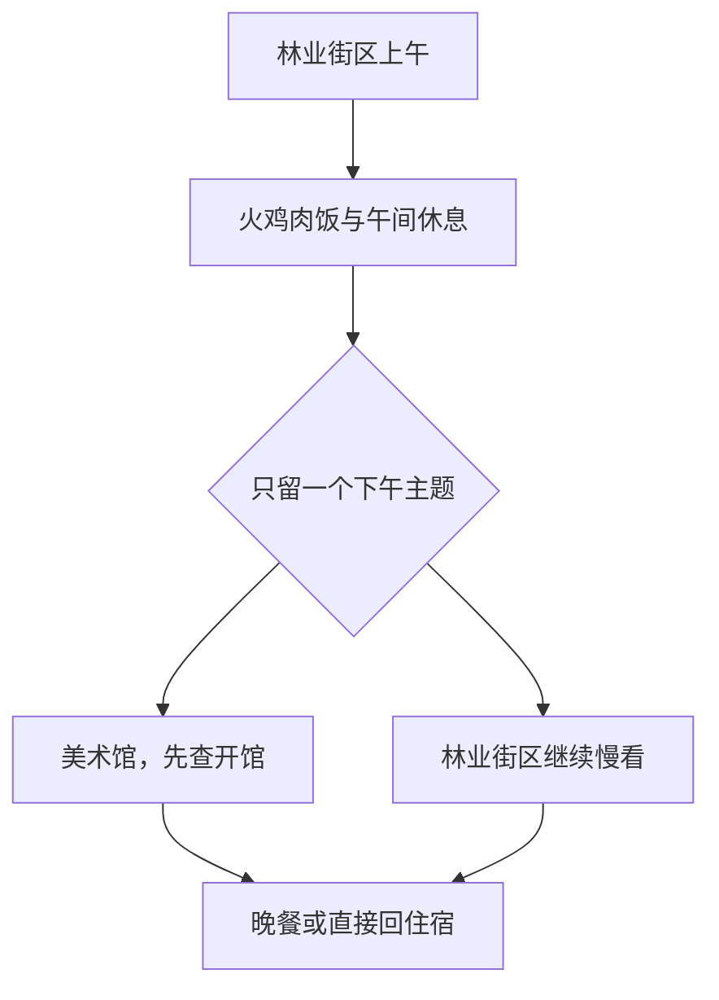

# 嘉义旅行指南

嘉义市的街区里，阿里山林业留下的铁路、车库和木造宿舍，与饭铺和商街紧密相邻。北门一带让人看见木材产业怎样塑造城市，旧公卖局建筑改成的美术馆则延续了嘉义重视绘画与工艺的文化。火鸡肉饭把地方饮食落在一碗日常午餐里，文化路的晚间摊店又带来另一番热闹。这里既有通向山林的历史，也有值得细看的平地城市生活。

## 城市速览

首访选林业街区与一座美术馆，再留出正餐，能同时接触产业历史、艺术和日常生活。阿里山森林游乐区位于嘉义县山地，故宫南院在太保市，两者都不是嘉义市中心景点。

| 项目 | 旅行信息 |
|---|---|
| 建议停留 | 市中心 1–2 天；上阿里山另作山地行程 |
| 首访重点 | 北门与车库园区、嘉义市立美术馆、火鸡肉饭 |
| 体力与天气 | 街区低至中强度；林业场域多户外，夏季午间应休息 |
| 预算特点 | 普通饭铺可控制餐费；热门住宿日、出租车及跨县游览增加预算 |

## 城市格局与游览区域

| 区域 | 主要内容 | 游览特点 | 与其他区域的关系 |
|---|---|---|---|
| 台铁站—美术馆 | 抵离、美术与历史建筑 | 适合抵达后或离城前半日 | 美术馆位于站区南侧，可与市中心正餐组合 |
| 北门林业街区 | 车库园区、北门车站、桧意森活村 | 工业遗产与木造房舍 | 市区北侧，可分段步行，中间搭车也合理 |
| 文化路与周边 | 小吃、商店与晚间生活 | 把餐饮当正餐，减少连续排队 | 适合林业半日后接入，疲累时直接回住宿 |
| 太保高铁站方向 | 高铁、故宫南院接驳 | 属市外交通与旅行 | 位于嘉义县，必须独立计算公路接驳 |

## 主要景点

A 为首访优先，B 为兴趣补充；用时为编辑估计，不含排队及交通。林业街区的子点不代表必须全部走完。

| 景点 | 区域 | 类型 | 主要看点 | 建议用时 | 室内外 | 体力 | 预约风险 | 天气影响 | 优先级 |
|---|---|---|---|---|---|---|---|---|---|
| 嘉义车库园区 | 林森西路 | 铁道遗产 | 机车、车辆与维修历史 | 1–1.5 小时 | 混合 | 低至中 | 中 | 中 | A |
| 北门车站 | 林业街区 | 木造车站 | 林铁车站建筑与城市林业联系 | 30–45 分钟 | 混合 | 低 | 中 | 中 | B |
| 桧意森活村 | 北门周边 | 历史宿舍群 | 木造房舍、院落及活化经营 | 1–1.5 小时 | 混合 | 中 | 低 | 中 | A |
| 嘉义市立美术馆 | 广宁街 | 美术馆 | 地方艺术与历史建筑新用途 | 1.5–2 小时 | 室内 | 低 | 中 | 低 | A |
| 森林之歌 | 林业街区 | 公共艺术 | 用空间与材料回应林业主题 | 20–30 分钟 | 室外 | 低 | 低 | 高 | B |
| 文化路选段 | 市中心 | 餐饮商街 | 晚间小吃与日常购物 | 1–1.5 小时 | 室外为主 | 中 | 低 | 高 | 路线节点 |

**车库园区与北门。** 先看维修与车辆，再看车站建筑，能理解森林铁路不仅承担旅客运输，也曾依靠城市工场运作。车库园区官方常规为 08:00–18:00，办公区不开放；预约导览需提前 14 天联系。普通参观与导览预约是两件事，火车运行和乘车票也需另查。[管理处车库资料](https://afrch.forest.gov.tw/0000049)；[北门车站](https://afrch.forest.gov.tw/0000082)。

**桧意森活村。** 将房屋尺度、院落和街道作为观察重点；商业店铺只是旧宿舍再利用的一部分。北门及车库可与此组合，但场域之间有道路，不能把地图邻近理解成完全封闭的步行园区。维修或灾后整理会改变开放范围，遵守现场围挡。

**市立美术馆。** 建筑和展览同样值得看，可从旧建筑如何与新空间连接入手，再选一组作品细读。馆方常规周二至周日 09:00–17:00，周一休馆；团体 15–30 人需提前 7 天预约，定时导览以当日开办及名额为准。[馆方参观信息](https://chiayiartmuseum.chiayi.gov.tw/english/VisitEn/InfoEn.html)。

## 美食与餐饮

火鸡肉饭是嘉义代表性的平价饭食，适合配蔬菜和汤吃成正餐，而不是仅买一碗拍照。各店肉片、肉丝、油葱及酱汁比例不同，可以就近选择两餐体验，不必一天追多家。地方菜点依据[观光署餐饮资料](https://media.taiwan.net.tw/zh-tw/portal/travel/details/tourismservicesite_a15010000h_000302)，不据店家宣传作排名。

| 菜品或餐饮类型 | 常见区域 | 一个人用餐与常见份量 | 风味、过敏原与饮食限制 | 排队风险与替代方法 |
|---|---|---|---|---|
| 火鸡肉饭配小菜 | 车站、市区饭铺 | 一碗加菜汤适合独食 | 禽肉、油葱与酱料，需低盐可询问少汁 | 热门店久候换同片区，不把排队列为必做 |
| 饭面热食 | 文化路及居民街区 | 正餐优先有座位店 | 肉汤及肉燥不默认素食 | 先吃正餐再选少量夜市小吃 |
| 甜汤与冰品 | 市区甜品店 | 下午休息时小份点用 | 花生、豆类、乳品及配料交叉接触 | 以座位和补水优先，不能用冰品替代整餐 |

## 经典行程

**一天：林业与城市饭食。** 上午从车库园区开始，再到北门与桧意森活村，三者可删去一个；12:00–14:00 在市区吃火鸡肉饭并休息。下午选择美术馆，或留在林业街区慢看，傍晚文化路吃饭后结束。以美术馆开馆及已确认的导览为锚点，周一换成街区短访而非在门口等开馆。

**两天：减少步行负担。** 第一天只做林业街区与文化路；第二天上午美术馆，午餐后离城。若要接故宫南院，将第二天整体改成太保半日至一日，不同时塞入阿里山。

森林之歌和夜市为优先删减项。腿脚疲累可从任一场馆叫车回住宿；普通雨天保留美术馆并缩短户外，台风或强降雨停运时不照搬替代线。

## 住宿区域

台铁站附近适合铁路抵离，文化路周边适合晚餐及购物但要问夜间噪声，北门附近适合林业主题慢游。高铁嘉义站位于太保市，订在那里应接受与市中心分离的交通成本。阿里山看日出需另订山地住宿或完整接驳，不能拿嘉义市酒店替代山上时间。

## 市内交通

市内以公车、出租车和短段步行为主。台铁嘉义站与高铁嘉义站相隔公路接驳，不是站内换乘。故宫南院官方交通页截至核查日列 BRT 7212 可串连台铁站、高铁站与南院；**106 故宫南院线已于 2026-09-01 停驶**，7212 也有部分班次调整，出发前查目标方向与站名。[当前官方交通公告](https://south.npm.gov.tw/Visit/Traffic/MassTransit.htm)。

## 不同旅行者须知

亲子在车库选少量车辆观察即可，不攀爬未开放车辆、不跨越轨道。轮椅使用者事先问美术馆与木造房舍的入口和转弯空间；能进入园区不等于每间老屋可入。对烟味敏感者缩短晚间摊区停留。不同证件及出发地的入境条件见[台湾总览](README.md)，市内攻略不替代资格确认。

## 行前核对

- 查美术馆与林铁场域临时开放，导览和乘车票分别确认。
- 核对住宿接近台铁还是高铁；若接太保南院，不使用已停驶的 106 路资料。
- 留午间室内休息；山地天气和铁路公告仅在上阿里山时另查，不能据市区晴天推断山况。

## 来源与更新记录

核查日期：2026-09-06。用时、取舍与住宿方向为编辑建议；场馆常规信息需与临时公告并读。

| 来源 | 支撑内容 |
|---|---|
| [林铁管理处：车库园区](https://afrch.forest.gov.tw/0000049) | 工场历史、常规开放、导览条件 |
| [林铁管理处：北门车站](https://afrch.forest.gov.tw/0000082) | 车站与周边林业场域关系 |
| [市立美术馆：参观信息](https://chiayiartmuseum.chiayi.gov.tw/english/VisitEn/InfoEn.html) | 开放、团体与导览规则；直接读取超时，搜索返回官方正文核对 |
| [观光署：地方餐饮资料](https://media.taiwan.net.tw/zh-tw/portal/travel/details/tourismservicesite_a15010000h_000302) | 火鸡肉饭地方背景 |
| [故宫南院：大众运输](https://south.npm.gov.tw/Visit/Traffic/MassTransit.htm) | 跨市接驳、2026 年 9 月变更 |

本页覆盖市中心林业、艺术与餐饮；嘉义公园、兰潭等外围线路待补，阿里山与太保另行阅读。
