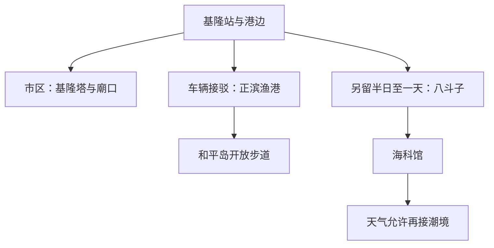

# 基隆旅行指南

基隆的街道围着海港展开，山坡上的住宅、码头和市区商店靠得很近。港口与渔业塑造了城市的工作节奏，也留下庙口小吃和市场饮食；正滨渔港的彩色屋舍之外，仍是船只与居民共用的日常空间。向东延伸，和平岛的海蚀岩岸和八斗子的海洋展馆呈现另一种海港文化，让自然地景、产业记忆和街市生活在这座多雨城市里相遇。

## 城市速览

**首访精选。** 一天可以从港边认识城市、去和平岛看岩岸、晚上回廟口吃饭；若更喜欢海洋知识或带孩子，海科馆可替换和平岛。留两天再把港城和八斗子分开，不必把所有海边景点挤进同一下午。

| 项目 | 旅行信息 |
|---|---|
| 建议停留 | 港城与一个海岸片区 1 天；加入海科馆 2 天 |
| 主要价值 | 港口城市、海蚀地形、海洋教育与地方小吃 |
| 天气 | 雨具与防滑鞋有用；强风、长浪、台风会影响海岸开放 |
| 预算 | 市区饭食与步行可控；海科馆不同馆区门票、活动与出租车为主要增项 |
| 体力 | 港边短线较低；岩岸、公园与山坡步道中等以上 |
| 范围 | 基隆市港区、正滨—和平岛、八斗子；九份属新北，基隆屿登岛另行规划 |

## 城市格局与游览区域

基隆站、海洋广场与廟口构成紧凑的市区游览范围；正滨和和平岛在港区东北侧，八斗子更往东。海科馆与潮境适合一组安排，但不能将它们和市区视作全程步行可串联的景点。

| 区域 | 主要内容 | 游览特点 | 与其他区域的关系 |
|---|---|---|---|
| 港口—廟口 | 海洋广场、廟口、市场 | 港城生活与餐饮，车流人流集中 | 从基隆站可步行分段串联 |
| 义二路—基隆塔 | 塔、山坡与港景 | 借电梯观察山港关系 | 可接市区半日，设施开闭决定能否上塔 |
| 正滨—和平岛 | 渔港、地质公园 | 生产港口与岩岸观察 | 需公交或出租车接市区，两点间仍有步行和道路 |
| 八斗子—潮境 | 海科馆、海岸公园 | 室内海洋知识与户外地景 | 单独留半日至一天；铁路到海科馆站后仍需步行 |

## 主要景点

A 为首访重点，B 为兴趣补充。用时为编辑估计；涉及特定馆区、活动或限制区域时，须另外确认名额和门票。

| 景点 | 区域 | 类型 | 主要看点 | 建议用时 | 室内外 | 体力 | 预约风险 | 天气影响 | 优先级 |
|---|---|---|---|---|---|---|---|---|---|
| 海洋广场与港岸 | 市区 | 港口公共空间 | 船舶、码头与山城关系 | 0.5–1 小时 | 室外 | 低 | 低 | 高 | A |
| 基隆塔 | 市区山坡 | 观景建筑 | 高处港景与城市山海关系 | 1–1.5 小时 | 混合 | 低至中 | 中 | 中 | B |
| 正滨渔港 | 中正区 | 渔港街区 | 彩色屋舍与作业港口 | 0.5–1 小时 | 室外 | 低至中 | 低 | 高 | B |
| 和平岛地质公园 | 和平岛 | 地质景观 | 海蚀地形与海岸观察 | 2–3 小时 | 室外为主 | 中 | 中 | 高 | A |
| 海洋科技博物馆 | 八斗子 | 博物馆 | 海洋科学、产业与互动展示 | 3–4 小时 | 室内为主 | 低至中 | 中 | 低 | A |
| 潮境公园 | 八斗子 | 海岸公共空间 | 海湾与海岸地形 | 0.5–1 小时 | 室外 | 低至中 | 低 | 高 | B |
| 廟口小吃街 | 仁爱区 | 饮食街区 | 奠济宫周边的地方小吃 | 1–1.5 小时 | 室外为主 | 低至中 | 低 | 中 | A |

**港边先看山、城与船的位置。** 海洋广场适合认识港口为什么紧贴市区；再到基隆塔便能从高处补足视野。市政府最新公告说明基隆塔自 **2026-08-23 起重新开放，每日 09:00–21:00，每月最后一个周一休馆**；信二防空洞至 17:00。部分官方景点页仍保留 4 月起整修的旧说明，采用较新重开公告，临行仍检查临时调整。[基隆市政府重开公告](https://www.klcg.gov.tw/tw/klcg1/3168-321330.html)。

**和平岛先选一般步道，限制区另订。** 公园的岩石形态适合慢看，水边和岩平台通行受天气、浪况与管理影响。阿拉宝湾属于季节性预约导览区域，普通入园票不代表可自行进入；本篇路线不依赖它，也不默认泳池开放。[和平岛官方介绍](https://travel.klcg.gov.tw/TourContent.aspx?n=8843&s=59)。

**海科馆先挑主题，别把馆区全买齐。** 主馆、其他馆区与节目不应视为一張通用票；先选孩子或同行人最关心的海洋主题，再决定是否加购。馆方常规主馆 09:00–17:00，周一与除夕休馆，暑假及法定假日有例外；各设施时间不同，以[官方开放表](https://www.nmmst.edu.tw/chhtml/content/215)和当日节目为准。普通雨天适合以主馆为中心，严重天气仍应检查交通和停馆。

**正滨的彩色屋属于街区生活。** 从公共道路看港湾，给行人和作业车辆留空间；阿根纳遗构只在合法开放范围外观，不进入未开放结构。潮境则以公园公共步道为限，不因看见其他人下到礁石就跟随。

## 美食与餐饮

廟口与奠济宫的关系，是基隆饮食文化的一条线索：信仰人流、居民与港口工作共同支撑街头餐食。市场午餐和傍晚小吃可分开体验，不必把所有名物集中在一顿。官方所说开放式街区全天可进入，不代表摊位全天营业。

| 菜品或餐饮类型 | 常见区域 | 一个人用餐与常见份量 | 风味、过敏原与饮食限制 | 排队风险与替代方法 |
|---|---|---|---|---|
| 鼎边趖 | 廟口一带 | 一碗适合简餐，可配小菜 | 米浆片与汤料，常见海鲜、肉类须核对 | 单店排队太久改同区饭面 |
| 天妇罗、鱼羹 | 廟口与市区 | 小份适合加菜 | 当地天妇罗常为鱼浆制品，含鱼且可能共用油锅 | 先问份量，避免重复点过多炸物 |
| 营养三明治、泡泡冰 | 廟口 | 点心或甜品 | 蛋奶、面粉、沙拉酱及配料 | 饭后选一种，找座位再休息 |
| 鱼饭、海鲜与市场餐食 | 港区、仁爱市场周边 | 独行选定价套餐，多人可合菜 | 鱼贝、甲壳类、汤底逐项问 | 核对市价和加工费；市场休摊时换街边餐厅 |

## 经典行程

### 两日主线：港城生活与海洋知识

| 日程 | 上午 | 午餐与休息 | 下午与傍晚 | 锚点、删减与退出 |
|---|---|---|---|---|
| 第一天：岩岸和港城 | 到和平岛，走一般开放步道；已订导览按到场时间安排 | 正滨或市区吃午餐，留 1 小时坐下休息 | 正滨短走后回市区；基隆塔与廟口按体力选择 | 导览必须已确认；风浪不合适删和平岛；累了首先删塔，从餐厅直接回住宿 |
| 第二天：八斗子 | 约 09:30 进海科馆，先挑两三个主题 | 馆区或附近正式餐厅用餐，室内休息 | 普通天气好时接潮境短段，随后返基隆站或住宿 | 以馆区门票或节目时段为锚点；首删潮境，不叠加未订节目；大雨时馆后直接返程 |

只有一天且由台北往返时，海科馆与和平岛择一，再保留港边和一餐小吃。遇场馆休馆可留市区市场、合法开放的文化空间；遇停班、封路或海岸关闭则暂停外出。具体交通按当天线路查询。

## 住宿区域

| 区域 | 适合需求 | 下单前确认 |
|---|---|---|
| 基隆站与港边 | 铁路抵离、市区饮食和两天游览 | 站口到酒店的步行与过街、夜间噪声 |
| 廟口周边 | 晚餐方便，想晚间留在市区 | 是否位于吵闹街段、房间通风和入口 |
| 八斗子或正滨方向 | 海洋活动为主，已经安排车辆 | 夜间餐饮、回程公共交通与行李寄存 |

## 市内交通

从台北可搭台铁到基隆站或使用运营中的客运，班次通过[台铁查询](https://www.railway.gov.tw/tra-tip-web/tip)按日期核对。基隆站与海科馆站是不同位置，海科馆站的列车走支线关系，不能在基隆站直接假定坐同一班车继续到馆。市区接正滨、和平岛、八斗子可选公交与局部出租车，出发前用[基隆旅游网](https://travel.klcg.gov.tw/?hl=zh-TW)对应景点的交通信息确定站牌。

港区短距离仍有大路、斜坡和人行高差。海岸行程的回程车辆应在天黑前落实；夜市结束后返回外地，先留末班和步行到站余量。

## 不同旅行者须知

- **亲子：** 海科馆可压缩为少量主题，互动项目按年龄和名额确认；和平岛只走开放区，持续看护水边。
- **长者与轮椅使用者：** 市区短段加馆舍较合适；基隆塔仍要确认电梯状态，岩岸步道不能整体视为无障碍。
- **独行：** 小吃以小份尝试，海鲜先看标价；晚间不为了看港景走入封闭码头或偏僻礁岸。
- **不同证件身份：** 按[台湾总览](README.md)区分大陆居民、港澳居民、外国护照与台湾居民的要求；邮轮抵港、航班转机不自动证明具备上岸或入境资格。

## 行前核对

- 核对基隆塔最新公告、海科馆所选馆区与节目时间。
- 阿拉宝湾和其他导览先确认预约；未取得名额按一般开放线游览。
- 查询风浪、台风、海岸封闭与公交状态，雨具兼顾防风。
- 海鲜先确认份量和总价，夜市准备小额现金。
- 往返台北者保存末班与到站路线；邮轮旅客遵守船方回船时间。

## 来源与更新记录

核查日期：**2026-09-06**。用时和删减顺序为编辑判断。

| 来源 | 支持内容 | 核查说明 |
|---|---|---|
| [基隆旅游网山海主题](https://travel.klcg.gov.tw/cp.aspx?n=8863) | 港区、正滨、和平岛与八斗子的主题关系 | 原创重新组合，未照搬其密集日程 |
| [基隆塔重开公告](https://www.klcg.gov.tw/tw/klcg1/3168-321330.html) | 8 月重开与现行时间 | 比仍写整修的景点页更新，明确采用本公告 |
| [和平岛官方页面](https://travel.klcg.gov.tw/TourContent.aspx?n=8843&s=59) | 海蚀地形、限制区导览 | 未取得某日导览名额或泳池实时状态 |
| [海科馆开放表](https://www.nmmst.edu.tw/chhtml/content/215) | 主馆及其他设施时间 | 直接读取成功，各设施规则分开使用 |
| [廟口官方介绍](https://travel.klcg.gov.tw/TourContent.aspx?n=8841&s=558&sms=12550) | 奠济宫、小吃与街区位置 | 街道开放与摊位营业分开理解 |
| [台铁](https://www.railway.gov.tw/tra-tip-web/tip) | 基隆与海科馆站查询 | 直接读取成功；不固化班次 |

**更新记录：** 2026-09-06 建立港城、和平岛和八斗子两日主线；基隆屿船班、登岛与更长山路待另篇核查。
