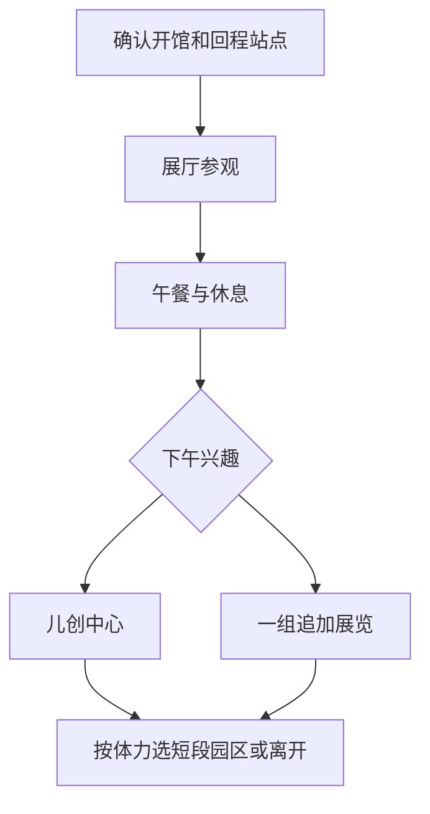

# 太保旅行指南

太保位于嘉南平原，稻田、聚落与宽阔的行政街区共同构成城市面貌。故宫南院在湖水与绿地之间展开，以亚洲艺术和文化交流为主题，让文物收藏走进这片农业地区；太保的稻作与有机米生产，则延续着土地和日常餐桌的联系。这里的文化建筑与田园聚落相互映照，城市经验来自展厅、公共空间和仍在运作的农业生活。

## 城市速览

太保首访以故宫南院为核心，先选展览再决定是否加园区。它适合有文物、建筑或亲子兴趣的半日至一日游；不必为了凑城市景点数量，把同一园区内的桥和广场拆成多个必到目的地。

| 项目 | 旅行信息 |
|---|---|
| 建议停留 | 南院半日至一天；多数旅行者可从嘉义市或高铁站接入 |
| 首访重点 | 一组展厅与馆内建筑；天气合适再看湖畔园区 |
| 季节与体力 | 室内较适合炎热季节，但从下车点到展厅仍需走路；园区曝晒明显 |
| 预算特点 | 门票、餐饮与接驳为主，特展或活动另查票制 |

## 城市格局与游览区域

| 区域 | 主要内容 | 游览特点 | 与其他区域的关系 |
|---|---|---|---|
| 故宫南院 | 文物展厅、儿创中心、湖畔园区 | 大型场馆独立安排，不需整园走完 | 不同公车停在馆侧、南门或北站，步行量有差别 |
| 高铁站周边 | 抵离与车辆接驳 | 高铁嘉义站实际位于太保 | 与南院需地面接驳，与嘉义市区也非步行相邻 |
| 县治及祥和一带 | 行政设施、旅宿与餐饮 | 日常生活服务，适合午餐和住宿 | 可作为南院前后补给，不包装成历史老街 |
| 农业聚落 | 稻作与居民生活 | 有机米是地方产业线索 | 田地为生产空间，体验只参加公开且确认可预约的活动 |

## 主要景点

A 为首访优先，B 为兴趣补充；儿创中心与园区为南院内部体验，不重复计作独立景区。用时为编辑估计。

| 景点 | 区域 | 类型 | 主要看点 | 建议用时 | 室内外 | 体力 | 预约风险 | 天气影响 | 优先级 |
|---|---|---|---|---|---|---|---|---|---|
| 故宫南院文物展厅 | 南院 | 博物馆 | 亚洲艺术、跨地域交流与当期展览 | 2–3 小时 | 室内 | 低至中 | 中 | 低 | A |
| 南院儿童创意中心 | 南院内部 | 亲子学习 | 以互动理解文化与艺术 | 45–90 分钟 | 室内 | 低 | 低 | 低 | B |
| 南院湖畔与景观桥选段 | 南院内部 | 园林、建筑 | 水面、桥梁与博物馆建筑关系 | 30–60 分钟 | 室外 | 中 | 低 | 高 | 路线节点 |

**文物展厅。** 先读当期展览主题，选择两三个展厅细看，避免为了“看完故宫”一路快走。南院与台北故宫北院的展品、票制及导览安排分别查询，不能预设特定名品一直在场。官网常规博物馆周一休馆，周二至周五 09:00–17:00，周末及国定假日至 18:00；园区开放不代表展厅同时开放。[馆方参观信息](https://south.npm.gov.tw/?exout=1)。

**儿创中心。** 适合让儿童用活动接触文化，馆方规则为免费、免预约、自由参观，欢迎 5–12 岁儿童及亲子、成人，10 岁以下须家长陪同。11 人以上学生团体若需导览，最迟提前 3 天登记，周末与国定假日不提供团体预约导览。此规则只适用于儿创中心，不能推到收费文物展厅或所有活动。[儿创中心须知](https://south.npm.gov.tw/GuidedTourReservationApply.aspx?appname=GuidedTourReservationApply)。

**湖畔园区。** 从一段桥边视角看建筑即可，日照强时将步行压缩到进出馆所需路段。园区大，地图上最近的门未必有回程公车，先定下车点和返程点再散步。

## 美食与餐饮

太保的稻作提供了理解平原生活的线索；农业官方资料列有太保市有机米产销班及米类产品。尝试地方米食或购买米品时，看清产地、包装和保存说明，不把整个行政市的餐厅都宣称使用同一种米。[农业官方生产资料](https://epv.afa.gov.tw/Home/FarmDetail/4746)。

| 菜品或餐饮类型 | 常见区域 | 一个人用餐与常见份量 | 风味、过敏原与饮食限制 | 排队风险与替代方法 |
|---|---|---|---|---|
| 米饭套餐与家常菜 | 祥和及居民商街 | 一份便于独食 | 肉汁、蛋、大豆调味需问清 | 热门午餐时段改其他有座位店 |
| 馆内餐饮 | 南院 | 减少出园移动，按实际菜单选择 | 素食、过敏原和儿童份量先询问 | 先查营业，有活动时错峰 |
| 地方米品 | 农会或正规销售点 | 适合买回而非即食 | 整米与加工品成分分别看标示 | 不安排未公开的农场随到体验 |

## 经典行程

**半日：以展览为主。** 先查开馆日和回程交通，上午抵达后用 2–3 小时看选定展厅，中间坐下休息；午餐后从确认的上车点离开。个人一般参观、文物导览、团体预约和儿童活动分别核对，已确认的预约才作为锚点。

**一日亲子或文物慢游。** 上午文物展厅，12:00–14:00 用餐与休息，下午儿创中心或补一组展览，傍晚前视体力走一小段湖畔。先删户外绕湖，再删追加展厅；儿童累了就结束参观，直接到约定乘车点。普通雨天保留室内，台风及交通停运时按公告取消。

跨城延伸可在另一个半日去[朴子](朴子市.md)看配天宫和刺绣文化，需要独立接驳；蒜头糖厂位于六脚乡，不能记作太保市内景点，五分车也不能当作随到随开的日常交通。

## 住宿区域

南院、县治周边适合次日继续参观或自驾者，订房时确认晚餐选择与到馆方式；高铁站周边偏重抵离便利；嘉义市区餐饮更集中，但需要跨市接驳。住宿名称带“嘉义”时务必看行政地址及实际位置。

## 市内交通

高铁嘉义站 2 号出口可接南院公车及馆方接驳，BRT 7212 停靠南院 1 馆接驳站，其他部分线路停南大门或园区外北站；北站到博物馆入口馆方估约步行 15 分钟，不能混为同一站。**106 故宫南院线于 2026-09-01 停驶**，7212 同期部分班次调整。[南院当前交通页](https://south.npm.gov.tw/Visit/Traffic/MassTransit.htm)。

进馆前保存返程站点与班次，预留候车、高铁检票和步行余量；不要把到园区的公交车程当作已到展厅。无障碍需求提前向馆方确认适合的下车点与园内接驳。

## 不同旅行者须知

亲子家庭将文物展览和儿创活动分开安排，入场年龄、陪同和预约按具体活动确认。长者选择靠近馆侧的接驳，避免在高温时从北门长走；轮椅及婴儿车借用情况先问馆方，不保证现场一定有余量。入境手续按旅行者证件、居住身份及出发地分别处理，见[台湾总览](README.md)。

## 行前核对

- 核对南院休馆、展厅换展、票种与导览；不要依据园区开放时间订参观。
- 核对最新交通，避开旧 106 路攻略；保存实际回程站点。
- 确认午餐与儿童活动，水、防晒及雨具放在易取处；强风雷雨取消湖畔段。

## 来源与更新记录

核查日期：2026-09-06。以下官方来源用于身份、展馆、交通与产业事实；行程时长和取舍为编辑估计。

| 来源 | 支撑内容 |
|---|---|
| [故宫南院官网](https://south.npm.gov.tw/?exout=1) | 常规开放、团体制度及展览入口 |
| [儿创中心参观须知](https://south.npm.gov.tw/GuidedTourReservationApply.aspx?appname=GuidedTourReservationApply) | 个人免预约、年龄陪同与团体导览条件 |
| [南院大众运输](https://south.npm.gov.tw/Visit/Traffic/MassTransit.htm) | 地址、站点差异、当前停驶与调整 |
| [高铁嘉义站信息](https://www.thsrc.com.tw/ArticleContent/60831846-f0e4-47f6-9b5b-46323ebdcef7) | 车站及转乘关系 |
| [农业有机资讯：太保市农会](https://epv.afa.gov.tw/Home/FarmDetail/4746) | 稻米生产与地方农业 |

本页覆盖南院与太保接驳、餐宿；农业体验需具体经营者开放证据后补充，不提供未核实农场预约。
