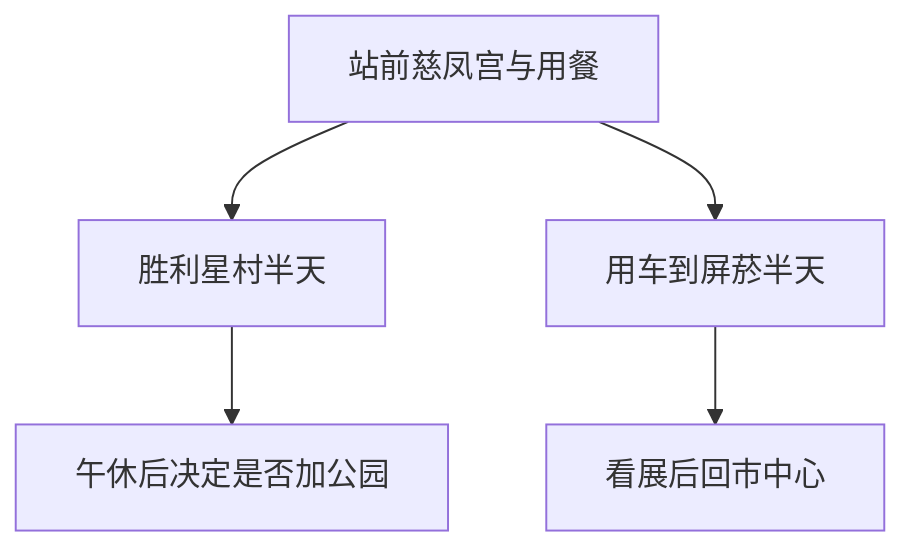

# 屏东旅行指南

屏东市的故事留在平原城镇的街巷里：慈凤宫和周围的小吃店维系着老市街的日常，胜利星村的低矮官舍则保存了另一段居民迁徙与眷村生活的记忆。旧烟叶厂转成文化基地，工业建筑开始容纳地方历史与展览。肉圆、碗粿和面摊之外，老屋里的咖啡馆与创作空间逐渐增多，让这座南方城市既有扎实的生活气，也有重新使用旧建筑的活力。

## 城市速览

**首访精选。** 胜利星村看旧宿舍如何成为公共街区，屏菸读产业与地方文化，慈凤宫及民族路周边看日常信仰和小吃。屏东市适合安排 1–2 天，不用把垦丁、东港或山地部落塞进市区一日游。

| 项目 | 旅行信息 |
|---|---|
| 建议停留 | 精选市区 1 天；屏菸完整看展加 1 天 |
| 范围 | 屏东市站前、胜利星村、屏菸；不含整个屏东县 |
| 季节与体力 | 暑热时早晚走街区，中午进室内；古建台阶与街口需留意 |
| 预算特点 | 小吃易控制份量，跨区用车及特展为增项 |
| 住宿方向 | 铁路站前便于抵离，市中心方便餐饮 |

## 城市格局与游览区域

慈凤宫与民族路餐饮靠近站前，胜利星村位于其北侧；屏菸在市区东南方向，宜安排车辆连接，不能把它当作老街散步的下一条巷子。

| 区域 | 城市特征 | 组合办法 |
|---|---|---|
| 站前、民族路 | 庙宇与日常小吃密集 | 抵达后早餐或午餐，短看慈凤宫 |
| 胜利星村 | 官舍、眷村记忆与店铺再利用 | 留半天慢走，馆舍和商店各有营业时间 |
| 屏菸文化基地 | 原烟叶厂空间与展览 | 独立半天，先选展览再安排抵达 |
| 屏东公园 | 中心城区绿地 | 作为休息补充，不把活动灯饰当全年展览 |

## 主要景点

A 为首访重点，B 为兴趣补充。用时为编辑估计，预约风险包含特展与活动不确定性。

| 景点 | 区域 | 类型 | 主要看点 | 建议用时 | 室内外 | 体力 | 预约风险 | 天气影响 | 优先级 |
|---|---|---|---|---|---|---|---|---|---|
| 胜利星村 | 市区北侧 | 历史街区 | 官舍群与再利用空间 | 2–3 小时 | 混合 | 中 | 中 | 高 | A |
| 屏菸1936文化基地 | 东南市区 | 工业遗产、展览 | 加工空间与地方文化 | 2–3 小时 | 室内为主 | 低至中 | 高 | 低 | A |
| 慈凤宫 | 站前 | 信仰 | 阿猴妈祖信仰与庙宇装饰 | 30–45 分钟 | 混合 | 低 | 低 | 中 | B |
| 屏东公园 | 市中心 | 公共绿地 | 城区树荫与休憩 | 30–60 分钟 | 室外 | 低 | 低 | 高 | B |

**胜利星村：看聚落，也看今天的用途。** 低层宿舍之间的街巷，比单独一个打卡门面更能表达眷村尺度。入驻商店的营业不等于整片街区开放情况，市集也只在公告日期举行，不以“周末一定有”安排行程。[县旅游品牌的市集与聚落介绍](https://www.amazing-pingtung.com/ptmkt)。

**屏菸：先理解工厂，再挑展览。** 旧烟叶加工设备及仓库空间提供认识产业的线索；特展、常设馆与活动可能分别收费或限时。核验时运营官网直接读取失败，仅由政府转知资料确认其工业遗产与展馆功能，因此本页不写死当前时间或票价。出发前必须打开[运营官网](https://www.cultural.pthg.gov.tw/pt1936/)或联系场馆确认可入内范围。[政府转知说明](https://www.hchcc.gov.tw/Tw/News/NewsDetail?filter=093437eb-1b2b-4130-9f8e-bf4218dfd22f&id=232300cc-4e04-4371-87d9-a31d73914414)。

**慈凤宫与公园：城市仍在使用的空间。** 庙里先看参拜动线，再观察装饰，不阻挡仪式；公园适合把行程放慢。节庆灯会、临时活动以当期公告为准。[慈凤宫](https://www.323pt.org.tw/)；[县旅游活动入口](https://www.amazing-pingtung.com/)。

## 美食与餐饮

屏东市的小吃更适合用一顿实际的饭来认识，而非把全县名产集中点一遍。肉圆、碗粿、面食在城市餐饮名录中均有线索；不同店做法与份量不同，不能一句“南蒸北炸”替代询问。[官方屏东市餐饮名录](https://www.amazing-pingtung.com/Pingtungfoodcate/%E5%B1%8F%E6%9D%B1%E5%B8%82)。

| 类型 | 场景 | 饮食限制与份量 | 取舍 |
|---|---|---|---|
| 肉圆、碗粿 | 站前、居民街区早餐或午餐 | 肉馅、酱料常含大豆；做法逐店问 | 一份配汤，不连续排多店 |
| 切仔面、馄饨与小菜 | 民族路及市区饭店 | 汤底可能含肉与海鲜，小菜可单点 | 独行最易组成完整正餐 |
| 豆花、冰品 | 午后有座位的店 | 大豆、花生、奶与配料交叉接触 | 把降温和坐下休息放在口碑前 |
| 老屋餐馆与咖啡 | 胜利星村 | 价格、最低消费及餐时各异 | 先查座位与营业，不把所有老屋当餐厅 |

## 经典行程

### 一日城市生活线

| 时段 | 安排 | 预约、休息与删减 |
|---|---|---|
| 上午 | 从站前慈凤宫开始，接驳胜利星村 | 若订了聚落导览，以确认时段为锚；店未开时先看街区 |
| 中午 | 胜利星村附近午餐，留 1–1.5 小时室内休息 | 不用连续小吃排队替代午休 |
| 下午 | 继续看已开放的老屋空间，或公园短停后返站 | 暑热、疲累时删公园，直接乘车回住宿或车站 |
| 傍晚 | 民族路附近晚餐 | 出城者先确认列车，把取行李和候车另留时间 |

### 第二天：给屏菸独立半天

确认展馆当天开放与所需票券后，上午直接接驳屏菸，围绕一至两个主题看展。中午回市中心吃饭休息，下午离城；若馆休或展览不合兴趣，不为了凑两天强行前往。仅有一天且更喜欢博物馆，可用屏菸替换胜利星村，保留午休；两处都完整参观会明显增加步行与跨区压力。

## 住宿区域

| 区域 | 优点 | 取舍 | 适合需求 |
|---|---|---|---|
| 屏东站周边 | 铁路、取行李和日常用餐方便 | 老街车流与噪声需考虑 | 首访、短住 |
| 胜利星村附近 | 方便清晨或傍晚看街区 | 离站与屏菸另需接驳 | 老屋与文化兴趣 |
| 市郊住宿 | 停车条件可能更宽裕 | 徒步夜宵和公交未必方便 | 已有车辆 |

## 市内交通

屏东站是台铁车站；从高雄方向来，按[台铁](https://www.railway.gov.tw/)当天车次选择，不能把高铁左营站当屏东市中心。站前和同一街区可分段步行；胜利星村与屏菸之间建议用公交或出租车，公交先查实际班次与站位。跨区叫车留候车余量，骑楼高差与机车出入口会影响推车通行。

## 不同旅行者须知

| 需求 | 实际安排 |
|---|---|
| 亲子 | 一个文化片区加长午休，不连续参观多处老屋；展馆互动项目另核预约 |
| 长者、低体力 | 用车跨区，炎热时删公园；老屋入内前确认台阶 |
| 无障碍 | 分别问场馆无障碍入口、厕所与电梯，不能从园区平面推断每栋都可达 |
| 独行 | 饭面与小份小吃便于用餐；晚间先确定回住宿方式 |
| 特殊饮食 | 肉圆、汤品的肉馅与汤底需确认；素食请说明蛋奶及葱蒜限制 |

## 行前核对

屏菸当前展览、票制与开放范围是订行程前的关键核查项；胜利星村市集与店铺另查活动日历。每日出门前看当地气象与停开放公告，极端天气取消户外，普通午后阵雨则可调整看展时段。

旅行证件不因目的地相同而通用：大陆居民、港澳居民与外国护照持有人须按自身身份及出发地查[移民署](https://www.immigration.gov.tw/)与[领事事务局](https://www.boca.gov.tw/np-137-2.html)；大陆出发者另查[国家移民管理局](https://www.nia.gov.cn/)。在资格确认之前不依赖不可退票的跨境组合。

## 来源与更新记录

| 来源 | 支持内容 | 核验日期 |
|---|---|---|
| [胜利星村与市集](https://www.amazing-pingtung.com/ptmkt) | 历史聚落、当代使用与市集条件 | 2026-09-06 |
| [政府转知屏菸资料](https://www.hchcc.gov.tw/Tw/News/NewsDetail?filter=093437eb-1b2b-4130-9f8e-bf4218dfd22f&id=232300cc-4e04-4371-87d9-a31d73914414) | 旧厂与展馆功能，非当前完整开放证明 | 2026-09-06 |
| [慈凤宫](https://www.323pt.org.tw/) | 宗教场所与当前公告入口 | 2026-09-06 |
| [县旅游网](https://www.amazing-pingtung.com/) | 公园活动查询 | 2026-09-06 |
| [屏东市餐饮](https://www.amazing-pingtung.com/Pingtungfoodcate/%E5%B1%8F%E6%9D%B1%E5%B8%82) | 小吃及餐饮场景线索 | 2026-09-06 |

2026-09-06：完成屏东市代表性文化与生活攻略。屏菸官网直接读取失败，未宣称其当前全部展馆开放；具体票价、营业、连续无障碍路线及各店当日情况未核定。行程与用时为编辑判断；垦丁、东港、琉球及山地乡不是本市区路线。
