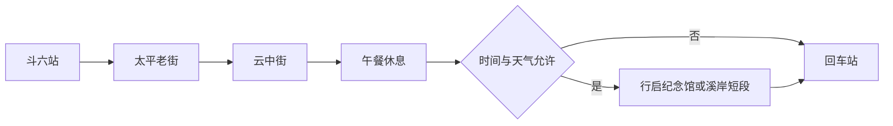

# 斗六旅行指南

斗六是云林平原上的县城，火车站前的商街延伸到太平老街，连续的楼房立面留下近代商业发展的痕迹。街屋下仍有药铺、餐饮和日常买卖，旧警察宿舍改成的云中街聚落则呈现木造房舍的另一种用途。圆仔冰、蛋饭和肉圆让地方饮食显得亲切实在；雲林溪旁的开放空间，把县城生活从店铺门口延伸到水岸。

## 城市速览

首访重点是太平老街与云中街的短程组合：一处看商贸街屋，一处看宿舍空间。愿意慢看建筑、吃一顿小吃的人，比期待大型景区的人更容易享受这里。

| 项目 | 旅行信息 |
|---|---|
| 建议停留 | 半日至一天；通常不必为市中心单独安排两天 |
| 主要体验 | 街屋立面、木造宿舍、小吃与雲林溪短段散步 |
| 季节与体力 | 凉爽日适合步行；夏季缩短午后街道暴晒，低至中强度 |
| 预算特点 | 小吃与步行较节省；远郊或跨乡镇接驳增加费用 |

## 城市格局与游览区域

| 区域 | 主要内容 | 游览特点 | 与其他区域的关系 |
|---|---|---|---|
| 斗六站—太平路 | 交通、商店与历史街屋 | 适合白天辨认立面和店铺生活 | 属市中心短程游览骨架 |
| 云中街—行启纪念馆 | 木造房舍与历史建筑 | 内部展览随经营及活动变化 | 可由太平路接入，不需为每栋建筑单独绕路 |
| 雲林溪 | 市区水岸 | 适合天气温和时短停 | 作为旧城游览的收尾，雨势大时删去 |
| 湖山方向 | 寺院与郊区 | 需独立车辆与时间 | 不与车站旧城硬串为半日步行 |

## 主要景点

A 为首访优先，B 为兴趣补充；用时为编辑估计，不含交通。各街区内部节点不重复当作独立大景区。

| 景点 | 区域 | 类型 | 主要看点 | 建议用时 | 室内外 | 体力 | 预约风险 | 天气影响 | 优先级 |
|---|---|---|---|---|---|---|---|---|---|
| 太平老街 | 太平路 | 历史商街 | 街屋山墙、装饰与仍营业的店铺 | 1–1.5 小时 | 室外为主 | 低至中 | 低 | 高 | A |
| 云中街生活聚落 | 市中心 | 历史建筑 | 旧宿舍、院落及活化经营 | 45–90 分钟 | 混合 | 低 | 中 | 中 | A |
| 斗六行启纪念馆 | 市中心 | 历史建筑 | 建筑外观及当期文化使用 | 30–45 分钟 | 混合 | 低 | 中 | 中 | B |
| 雲林溪市区选段 | 旧城边 | 水岸公共空间 | 水岸与街区关系 | 30–45 分钟 | 室外 | 低 | 低 | 高 | 路线节点 |

**太平老街。** 抬头比较不同店屋的山墙、柱饰和招牌位置，再留意一楼如何继续做生意。它是城市商街而非封闭步行景区，拍照要先站稳在人行空间。官网约 600 米的街长可说明尺度，不能用来保证沿线全程无障碍。[观光署介绍](https://www.taiwan.net.tw/m1.aspx?id=A12-00249&sNo=0001016)。

**云中街与行启纪念馆。** 适合把注意力从商街转到公共建筑与木造房舍。先看建筑，再依据实际开放的展览或店铺停留；没有活动时短访即可，不为等开门耗掉半天。观光署将两处列为斗六人文节点，但该介绍没有提供可保证当日有效的统一开放时间。[斗六小镇介绍](https://www.taiwan.net.tw/m1.aspx?keystring=&page=3&sNo=0042291&uid=82)。

## 美食与餐饮

斗六老街的饮食以日常小吃为主，蛋饭适合作简单正餐，圆仔冰则连接甜汤与冰品习惯。份量不大的菜点可分两次吃，仍应留一餐有座位的热食。[中区观光圈饮食介绍](https://central.taiwan.net.tw/pwa/zh-tw/attraction/934/)。

| 菜品或餐饮类型 | 常见区域 | 一个人用餐与常见份量 | 风味、过敏原与饮食限制 | 排队风险与替代方法 |
|---|---|---|---|---|
| 蛋饭 | 车站与旧城饭铺 | 一份加青菜或汤较完整 | 蛋、肉汁及大豆调味需确认 | 店休换普通饭铺，不依赖单店 |
| 肉圆、鱿鱼嘴羹 | 老街周边 | 小份适合分食或加餐 | 猪肉、软体海鲜、勾芡及酱料 | 午餐尖峰改有座位面店 |
| 圆仔冰 | 商街甜品店 | 一碗可作下午甜点 | 糯米配料及花生、大豆、乳品逐项确认 | 糯米有黏性，幼童及吞咽困难者谨慎 |

## 经典行程

**半日主线。** 上午到斗六站后先走太平路，看街屋与仍营业的商店；接云中街，午餐安排蛋饭或面食并休息 45–60 分钟，最后选择行启纪念馆外观或雲林溪短段，再回车站。以离城列车和已确认的场馆开放为锚点；如预约活动，以活动开始时间倒排行走，不假定所有场馆免预约。

**延长为一天。** 上午看老街，午间充分休息，下午再细看一个开放场馆与水岸。湖山等郊区另需车辆和独立半日，不因有一天就必加。晚到删水岸，疲累直接从云中街附近乘车回站；普通雨天缩到已确认开放的室内店铺和展馆，强降雨时结束户外。

## 住宿区域

斗六站附近最适合隔日搭台铁离城，太平路一带便于吃饭但应确认夜间噪声；郊区住宿只有在自驾或已经确定接驳时才方便。选择合法旅宿并核对地址，不能把高铁云林站周边住宿当成斗六步行圈。

## 市内交通

台铁斗六站适合市中心游览。高铁云林站在虎尾镇，到斗六仍需公路接驳；购票前查清目的站名称。旧城可短段步行，骑楼及路口不一定连续；去郊区优先预先安排车辆并核对回程。观光署页面列出的“直线距离”不能当作车程或可步行距离。

## 不同旅行者须知

亲子把建筑观察压缩成两三处，再用坐下吃饭或开放空间休息；店屋和木造房舍仍有使用者，先询问拍照许可。轮椅及推车要预留绕行骑楼台阶的余量，重要场馆先确认可进入的楼层。入境手续依身份及出发地分别核对，参见[台湾总览](README.md)。

## 行前核对

- 确认云中街店铺、行启纪念馆当天开放及活动预约；没有明确开放信息时只安排外观。
- 核对台铁班次，若由高铁云林站抵达，另留候车和接驳时间。
- 检查高温与强降雨预报，水岸段可随时删去；晚间不以关门店铺替代白天老街体验。

## 来源与更新记录

核查日期：2026-09-06。以下均为官方资料，建筑与地理信息已核对；小型场馆当日营业、临时展览未获得统一可用时刻，正文保留出发前核查要求。

| 来源 | 支撑内容 |
|---|---|
| [观光署：太平老街](https://www.taiwan.net.tw/m1.aspx?id=A12-00249&sNo=0001016) | 街道、建筑与车站关系 |
| [观光署：斗六市](https://www.taiwan.net.tw/m1.aspx?keystring=&page=3&sNo=0042291&uid=82) | 市内文化与郊区节点 |
| [中区观光圈：太平老街](https://central.taiwan.net.tw/pwa/zh-tw/attraction/934/) | 地方小吃类型 |
| [云林县政府：太平老街](https://content.yunlin.gov.tw/News_Content.aspx?n=987&s=106240) | 商街发展与历史街屋背景 |

本页覆盖斗六旧城短途游；湖山寺、石榴车站及产业体验尚未写成完整线路，古坑咖啡与虎尾属跨乡镇行程。
