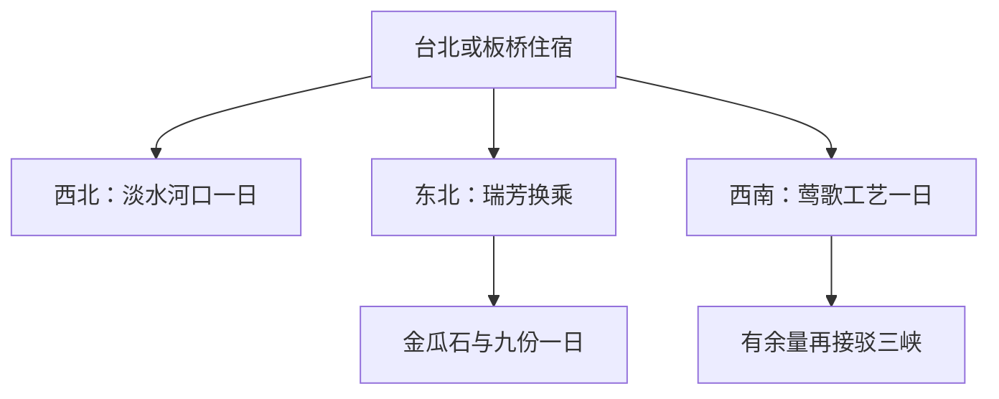

# 新北旅行指南

新北环绕台北盆地，从密集的都会街区延伸到河口、山城与海岸。淡水的古堡和洋楼留下港口贸易的历史，九份与金瓜石的坡地聚落记着矿业兴衰，莺歌则把陶瓷生产变成仍可接触的工艺生活。这片地域没有单一的城市面孔：板桥的商业日常、河岸的开阔空间和山间老街，共同组成了北台湾丰富而分散的地方风景。

## 城市速览

**首访精选。** 想看河口历史，选淡水；想认识矿业山城，选九份与金瓜石；喜欢器物和室内展览，选莺歌。三个方向分别占一天，只有一天就选一个。新北是范围很大的行政市，不适合按一座紧凑古城安排。

| 项目 | 旅行信息 |
|---|---|
| 建议停留 | 一个方向 1 天；三条主题线共 3 天，可与台北住宿组合 |
| 适合兴趣 | 港口史、坡地聚落、陶瓷工艺、地方小吃 |
| 天气 | 东北侧山城、河口和海岸受风雨影响明显；台风及强降雨期间按停运、封闭公告调整 |
| 预算 | 公共交通与普通餐食易控制；山城住宿、茶席和跨区包车支出较高 |
| 体力 | 淡水、莺歌可缩短步行；九份连续台阶和拥挤窄巷更费力 |
| 范围 | 本篇重点淡水、瑞芳、莺歌；三峡作为兴趣延伸，乌来、平溪、北海岸需另留整日 |

## 城市格局与游览区域

淡水在西北河口，瑞芳在东北山海之间，莺歌在西南。台北或板桥可作住宿基地，但它们之间的距离会把一次跨区变成明显的交通支出。三峡和莺歌相邻，仍需车辆接驳，不是同一条老街。

| 区域 | 主要内容 | 游览特点 | 与其他区域的关系 |
|---|---|---|---|
| 淡水 | 红毛城、河岸、老街 | 河口贸易与古迹群，户外和室内混合 | 捷运可达淡水，红毛城仍需步行或公交 |
| 瑞芳九份—金瓜石 | 山城街巷、黄金博物馆 | 坡地、矿业遗存，窄巷台阶多 | 经瑞芳转公交；九份与金瓜石之间也要接驳 |
| 莺歌 | 陶瓷博物馆、陶瓷老街 | 从材料与制作转到选购器物 | 台铁莺歌站后步行；可另接三峡 |
| 三峡 | 老街与清水祖师庙周边 | 街屋和宗教建筑兴趣延伸 | 与莺歌分开计算用时，只留半天时不叠加 |
| 板桥 | 商业、住宿与铁路换乘 | 都会服务集中，适合跨城抵离 | 是旅行基地之一，不能据此推断各景区都近 |

## 主要景点

A 为首访重点，B 为兴趣补充；各点用时为编辑估计，不含跨区交通。预约风险包含展览、体验与临时开放的不确定性。

| 景点 | 区域 | 类型 | 主要看点 | 建议用时 | 室内外 | 体力 | 预约风险 | 天气影响 | 优先级 |
|---|---|---|---|---|---|---|---|---|---|
| 红毛城园区 | 淡水 | 古迹 | 主堡、领事官邸与河口位置 | 1.5–2 小时 | 混合 | 中 | 中 | 中 | A |
| 淡水河岸与老街 | 淡水 | 街区 | 河港生活、商店与观音山对景 | 1.5–2 小时 | 室外 | 低至中 | 低 | 高 | A |
| 九份老街 | 瑞芳 | 山城 | 基山街、竖崎路与矿业聚落 | 2–3 小时 | 室外为主 | 中至高 | 低 | 高 | A |
| 黄金博物馆 | 金瓜石 | 博物馆 | 矿业、地质与山城生产历史 | 2–3 小时 | 混合 | 中 | 中 | 中至高 | A |
| 莺歌陶瓷博物馆 | 莺歌 | 博物馆 | 陶瓷制作与器物文化 | 2–3 小时 | 室内为主 | 低至中 | 中 | 低 | A |
| 莺歌陶瓷老街 | 莺歌 | 街区 | 店铺器物与工艺消费 | 1–1.5 小时 | 混合 | 低至中 | 低 | 中 | B |

**红毛城的看点是建筑之间的差别。** 主堡与旁边的领事官邸承担过不同功能，庭院视野又解释了河口位置的重要性。常规平日 09:30–17:00，周末和法定假日到 18:00，闭馆前半小时停止售票；每月首个周一等休馆规则须查馆方。旅游介绍页存在售票时段文字与表格不一致，本篇以管理单位信息为准，不把户外延长开放理解成室内也延长。[淡水古迹博物馆开放时间](https://www.tshs.ntpc.gov.tw/xmdoc/cont?xsmsid=0g245643771715011728)。

**九份和金瓜石提供两种认识矿山的方法。** 九份的价值是沿坡形成的聚落与商街，黄金博物馆更适合补足生产和地质背景。九份公共街巷可走不代表每家店全天营业；喝茶前核对人数、低消与是否有座。矿坑、体验及特别活动另有开放或报名安排，只按已确认项目进场。[九份官方介绍](https://newtaipei.travel/zh-tw/attractions/detail/109990)；[黄金博物馆](https://www.gep.ntpc.gov.tw/)。

**莺歌先看制作，再逛器物。** 陶博馆适合作为上午锚点，理解陶与瓷、生产与装饰的差别后再看商店，更容易选择真正感兴趣的物件。常规平日 09:30–17:00，假日到 18:00；**2026-09-07 为公告休馆日**。手作课程须独立核对年龄、名额和作品领取方式。[陶博馆开放日历](https://www.ceramics.ntpc.gov.tw/xmdoc/cont?sid=0L196422589861814951&xsmsid=0L196418676818644838)。

## 美食与餐饮

新北适合按所在地吃饭。淡水的河口小吃、九份的米食与芋圆、莺歌的街区饭馆，分别服务不同的地方生活和游客场景。把茶席或豆花安排成真正坐下休息的一餐间歇，比连续买小吃更能支撑山城步行。

| 菜品或餐饮类型 | 常见区域 | 一个人用餐与常见份量 | 风味、过敏原与饮食限制 | 排队风险与替代方法 |
|---|---|---|---|---|
| 阿给、鱼丸汤 | 淡水 | 一份加汤可作简餐 | 豆制品、鱼、肉馅和酱料须确认 | 避开只追单店，改同街有座位店 |
| 芋圆、草仔粿 | 九份 | 适合点心，不能代替完整正餐 | 配料可能有豆、花生；咸粿可能有肉或虾米 | 基山街拥挤时先吃正餐再回短段 |
| 茶席与糕点 | 九份、淡水 | 一人先问最低消费与泡茶服务 | 糕点可能含坚果、蛋奶；茶饮含咖啡因 | 临窗座位不可保证，可选普通座位 |
| 饭面与家常菜 | 莺歌、板桥 | 饭面适合独食，合菜适合多人 | 汤底与勾芡酱料逐项问 | 正餐选主街外有标价的营业店 |

## 经典行程

### 三个可独立选择的一日主题

以下从台北或新北住宿出发；实际候车与道路时间按当天查询。

| 日程 | 上午 | 午餐与休息 | 下午与傍晚 | 锚点、删减与退出 |
|---|---|---|---|---|
| 淡水：读河口历史 | 约 10:00 到红毛城，先室内建筑再院落 | 12:00–14:00 到河岸街区吃饭、坐下休息 | 老街与河岸短走，天气好再留看晚景 | 以馆方开馆日为锚点；累了删河岸延长段，乘公交回淡水站；风雨增强提前返程 |
| 瑞芳：矿业与山城 | 先到金瓜石，参观黄金博物馆；已约体验按预约倒排 | 原地午餐并休息，再确认往九份车辆 | 九份选一段商街加茶席，天黑前确认返程站牌 | 交通晚点时删体验或直接只游九份；疲累从就近正式站点返瑞芳，不加山步道 |
| 莺歌：器物与工艺 | 约 10:00 陶博馆，手作预约优先 | 12:30–14:00 午餐与室内休息 | 陶瓷老街选购；有车且仍有半天才延伸三峡 | 休馆日可改淡水或换日期；首删三峡，疲累直接返莺歌站 |

普通小雨可优先陶博馆；台风或强降雨造成停班、封闭时应留在安全住宿处，不把室内替代行程当成继续跨区出行的理由。

## 住宿区域

| 区域 | 适合需求 | 下单前确认 |
|---|---|---|
| 板桥铁路与捷运周边 | 接高铁、台铁和台北市区，行李集中放一处 | 酒店入口与实际车站出口距离、夜间街道 |
| 淡水捷运周边 | 以河口为主，想保留傍晚散步 | 住宿是否在需爬坡的后街，清晨离城所需时间 |
| 九份或金瓜石 | 希望体验游客散去后的山城，能接受坡道 | 车辆能否到门、行李搬运、阶梯、电梯和晚餐供应 |
| 台北市区 | 同时游台北与新北多个方向 | 每天从哪座车站出发，避免反复换住宿 |

## 市内交通

淡水主要依捷运再接公交；瑞芳可乘台铁后换公路车辆；莺歌可用台铁。使用[台铁时刻查询](https://www.railway.gov.tw/tra-tip-web/tip)选择正确站名和日期。九份没有铁路直达老街，周末道路拥堵、候车排队都应保留余量；新北官方[九份交通说明](https://www.ntpc.gov.tw/uploaddowndoc?dis=news&file=news%2F202407121708263.pdf&filedisplay=%E4%B9%9D%E4%BB%BD%E8%80%81%E8%A1%97%E4%BA%A4%E9%80%9A%E6%94%BB%E7%95%A5.pdf&flag=doc)可用于理解换乘方式，旧图上的具体班次仍要当天复核。

淡水、金瓜石、莺歌之间不建议在同日往返。租车对跨区有效，山城停车和塞车却可能抵消便利；同行人少时比较公共交通加局部出租车。实际步行入口由现场标识与可通行道路决定。

## 不同旅行者须知

- **亲子：** 陶博馆可集中室内活动；九份窄巷、台阶与人流不利童车，短段参观并安排坐席。
- **长者与低体力：** 淡水以车辆接红毛城和河岸，九份只留单一入口附近短段；同行者不要将连续石阶算作轻松散步。
- **轮椅使用者：** 先向场馆问无障碍入口及可参观范围；历史建筑内部、河岸连接段和山城店铺须逐处确认。
- **不同证件身份：** 大陆居民、港澳居民、外国护照与台湾居民的入境和出发地要求不同；按[台湾总览](README.md)的主管机关入口核对，转机或订房不等于取得资格。

## 行前核对

- 确认选定场馆开馆日；陶博馆和淡水古迹不要套用“每周一都休”的一般规则。
- 如参加矿坑、陶艺或导览，先确认名额、到场时间与取消规则。
- 检查山城与河口天气、道路及交通状态，保存返程站点和住宿中文地址。
- 山城住宿核对阶梯与行李接送；购陶瓷时确认包装、运输与破损责任。
- 入境与出境资格按证件身份和出发地核验，离台当天不安排远山行程。

## 来源与更新记录

核查日期：**2026-09-06**。用时与选线是编辑估计。

| 来源 | 支持内容 | 核查说明 |
|---|---|---|
| [红毛城官方介绍](https://newtaipei.travel/zh-cn/attractions/detail/109672) | 古堡、官邸与河口历史 | 票务时段有内部不一致，采用下行管理单位规则 |
| [淡水古迹博物馆开放时间](https://www.tshs.ntpc.gov.tw/xmdoc/cont?xsmsid=0g245643771715011728) | 开馆、停止售票及入口 | 官方检索返回核对；临时公告仍须行前检查 |
| [九份老街](https://newtaipei.travel/zh-tw/attractions/detail/109990) | 矿业背景、街巷与食物 | 营业表不作为各店承诺 |
| [淡水八里主题](https://newtaipei.travel/zh-tw/regional/sightseeing/18) | 阿给、鱼丸与河口食物 | 只取淡水内容，未把八里路线混入 |
| [莺歌老街](https://newtaipei.travel/zh-tw/attractions/detail/110661?fid=9898) | 陶瓷生产、商店与工艺体验 | 店铺及课程营业另行确认 |
| [黄金博物馆](https://www.gep.ntpc.gov.tw/) | 矿业展示与活动报名 | 当前官网公告核对；未确认体验场次不作保证 |
| [陶瓷博物馆开放日历](https://www.ceramics.ntpc.gov.tw/xmdoc/cont?sid=0L196422589861814951&xsmsid=0L196418676818644838) | 开馆与 2026 休馆日期 | 官方检索返回完整日历 |
| [台铁](https://www.railway.gov.tw/tra-tip-web/tip) | 瑞芳、莺歌铁路查询 | 直接读取成功；未发布固定班次 |

**更新记录：** 2026-09-06 建立淡水、瑞芳、莺歌三条完整首访线；三峡保留为延伸，乌来、平溪及北海岸尚需独立深度攻略。
