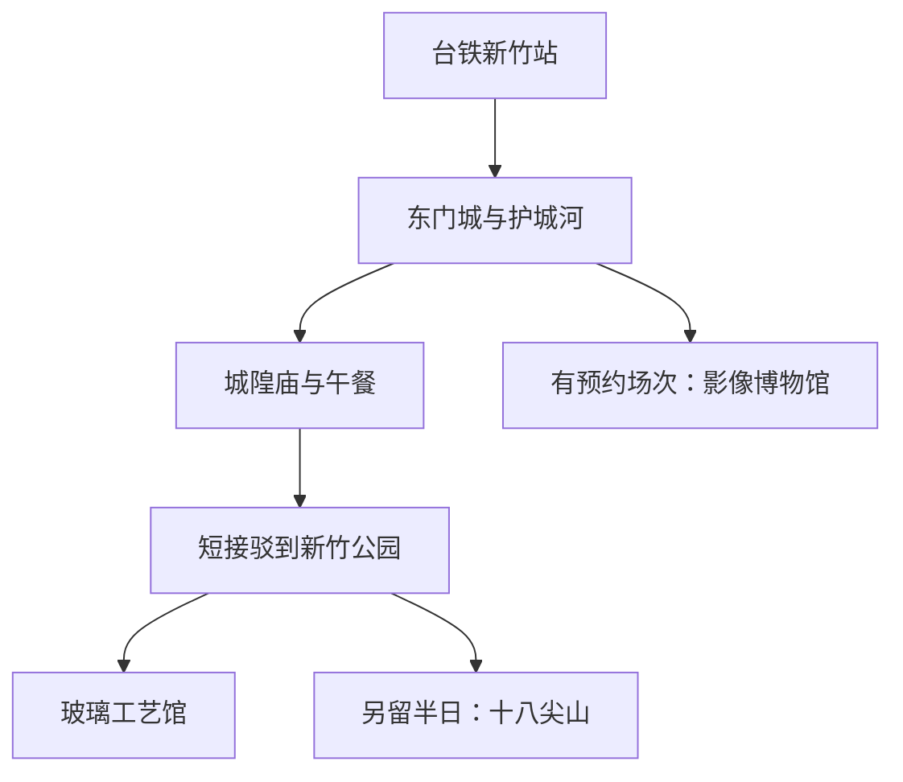

# 新竹旅行指南

新竹以科技产业闻名，旧城却保留着另一副清楚的面貌：东门城、护城河与城隍庙围出历史街区，庙边的小吃摊延续着米粉、贡丸和米食的地方口味。玻璃工艺馆让制造业的故事进入展厅，公园和十八尖山则融入居民的休闲生活。大学、科技企业与传统市场共处，使这座靠海的风城既有现代工作的节奏，也有容易亲近的老城日常。

## 城市速览

**首访精选。** 用旧城与城隍庙认识地方生活，再选玻璃工艺馆补足产业文化，一天已经完整。对山林感兴趣可把十八尖山作为次日上午；海岸、香山湿地与新竹县山城是不同方向，另作计划。

| 项目 | 旅行信息 |
|---|---|
| 建议停留 | 旧城加玻璃工艺馆 1 天；慢走或看电影可留 1 晚 |
| 主要价值 | 老城街区、宗教生活、玻璃工艺与地方小吃 |
| 季节条件 | 凉爽日适合步行；夏季馆舍安排在午后，风雨增强时缩短户外 |
| 预算 | 旧城步行和小吃可控，住宿与跨区出租车为主要支出 |
| 体力 | 城区中等，过街与骑楼高差较多；十八尖山需爬坡 |
| 范围 | 新竹市旧城、新竹公园、十八尖山；高铁新竹站位于新竹县竹北市 |

## 城市格局与游览区域

台铁新竹站北侧是旧城，东门城与护城河接向商业街，城隍庙在西侧。新竹公园及玻璃工艺馆在车站东南方向，十八尖山更往东南；跨铁路和主要道路时按合法通道走，不沿着地图直线穿越。

| 区域 | 主要内容 | 游览特点 | 与其他区域的关系 |
|---|---|---|---|
| 站前—东门城—护城河 | 城门、河岸、旧商业街 | 城市历史与公共空间相邻 | 可作抵达后的短步行 |
| 城隍庙周边 | 庙宇、小吃与居民商店 | 持续礼拜与餐饮活动交织 | 从东门城方向接入旧城，午餐方便 |
| 影像博物馆周边 | 历史影院、文化街区 | 适合已有兴趣和已确认场次的旅行者 | 与旧城主线关系近，可替换部分散步 |
| 新竹公园 | 玻璃工艺馆与公共绿地 | 室内工艺和户外休息可组合 | 需从旧城过铁路或搭短途车辆 |
| 十八尖山 | 林间道路与丘陵 | 以健走为主，非旧城平路延长线 | 独立半日，住宿不必迁移 |

## 主要景点

A 为首访重点，B 为兴趣补充。用时是编辑估计；影像馆观影另按片长与报到时间安排。

| 景点 | 区域 | 类型 | 主要看点 | 建议用时 | 室内外 | 体力 | 预约风险 | 天气影响 | 优先级 |
|---|---|---|---|---|---|---|---|---|---|
| 东门城与护城河短段 | 旧城 | 古迹、公共空间 | 旧城门与现代街道的交接 | 0.5–1 小时 | 室外 | 低至中 | 低 | 中 | A |
| 新竹都城隍庙 | 旧城 | 宗教建筑 | 门殿、雕饰与持续信仰生活 | 0.5–1 小时 | 混合 | 低 | 低 | 中 | A |
| 玻璃工艺博物馆 | 新竹公园 | 工艺博物馆 | 玻璃制作与艺术表现 | 1.5–2 小时 | 室内 | 低 | 中 | 低 | A |
| 新竹公园公共区域 | 车站东南 | 公园 | 老树、绿地与居民休闲 | 0.5–1 小时 | 室外 | 低至中 | 低 | 高 | B |
| 影像博物馆 | 旧城 | 电影文化 | 历史影院与策展放映 | 0.5–1 小时，观影另计 | 室内 | 低 | 高 | 低 | B |
| 十八尖山短程健走 | 东南丘陵 | 城市山林 | 林荫与起伏地形 | 1.5–2.5 小时 | 室外 | 中 | 低 | 高 | B |

**东门城让旧城有了方位。** 护城河改造后的休憩空间与历史城门相接，可以观察旧防御设施如何成为市民活动场所。走指定人行入口和过街设施，不横穿圆环车道。[护城河官方介绍](https://tourism.hccg.gov.tw/chtravel/app/travel/view?id=37&module=travel&serno=8c261846-b01c-4dc4-9ec4-a145d302f5c1)。

**城隍庙先看礼拜，再吃午饭。** 庙宇仍承担日常与岁时祭典功能，进入后给参拜者留通道，摄影遵守现场提示。地方小吃集中在周边，饮食与庙宇是两个相邻体验，不把礼拜空间当餐厅延伸。[寺方官网](https://www.weiling.org.tw/)；[市府城隍庙介绍](https://tourism.hccg.gov.tw/chtravel/app/travel/view?id=37&module=travel&serno=89b26b65-4418-45c0-aefe-db5f6f7d84bb)。

**玻璃工艺馆适合看制造如何变成艺术。** 从器形、透明度和着色等细节入手，比只拍展品更能理解材料。常规周二至周日 **09:00–17:00，16:30 最后入馆**；周一、春节与选举日休馆，换展还可能另休。课程和展示是否可看以当日公告为准。[文化局参观信息](https://culture.hccg.gov.tw/ch/home.jsp?id=164&parentpath=0%2C145%2C146)。

**影像馆只在有兴趣的场次时作为锚点。** 普通开馆不等于随到随看电影。馆方说明线上索票者最晚于开演前 10 分钟报到，过时可能转候补；片单与票价须另查当期公告。[影像館参观规则](https://culture.hccg.gov.tw/ch/home.jsp?id=170&parentpath=0%2C145%2C147)。十八尖山则选择明确开放的短程原路往返，不以整片山林的长度要求自己走完。

## 美食与餐饮

米粉和贡丸适合组成一顿简单午饭，庙口的米食与羹汤又能增加变化。所谓地方名物并非只有一家能吃到；先选有座位、明码标价且符合饮食限制的店，更利于把旧城游览走完整。

| 菜品或餐饮类型 | 常见区域 | 一个人用餐与常见份量 | 风味、过敏原与饮食限制 | 排队风险与替代方法 |
|---|---|---|---|---|
| 炒米粉 | 城隍庙与旧城 | 一盘配汤适合简餐 | 可能含肉燥、虾米、大豆或小麦调味，不默认无麸质 | 避开单店长队，换同片区 |
| 贡丸汤 | 旧城小吃店 | 一碗配主食 | 常见猪肉及配方添加物，汤底须确认 | 可与米粉同店点，不专程跨区 |
| 肉圆、羹汤 | 城隍庙周边 | 小份可选一项尝试 | 肉馅、鱼或海鲜、勾芡与酱料 | 拥挤时先到饭店坐下用餐 |
| 茶饮与甜点 | 旧城、新竹公园周边 | 午后休息 | 蛋奶、大豆、坚果按菜单确认 | 以座位与邻近为先，不把排队算休息 |

## 经典行程

### 一日主线：老城生活与玻璃工艺

| 时段 | 安排 | 锚点与调整 |
|---|---|---|
| 09:30–11:30 | 台铁站起步，东门城和护城河选段，再到城隍庙 | 寺庙活动人多时缩短停留，尊重礼拜路线 |
| 11:30–13:30 | 旧城午餐，留一段室内长休 | 先吃正餐，再决定是否加小吃 |
| 13:30–16:00 | 短接驳到新竹公园，参观玻璃工艺馆 | 以开馆和最后入馆为锚点，晚到先馆后公园 |
| 16:00 后 | 公园短走或返回台铁站取行李 | 首删公园延长段；疲累直接乘车返住宿或车站 |

影像馆若有已订下午场，将玻璃工艺馆移到上午，旧城缩成午餐前后短段；如果周一玻璃馆和影像馆均休馆，改日期最完整，无法改期则以旧城生活加开放公园为主，不宣称替代了工艺参观。多住一晚者次日早上可走十八尖山，午前下山吃饭后离城；遇风雨取消山路，不追加海岸。以上用时为编辑估计。

## 住宿区域

| 区域 | 适合需求 | 下单前确认 |
|---|---|---|
| 台铁新竹站与旧城 | 一日游、早晚铁路抵离与餐饮 | 老楼电梯、入口、马路和铁路噪声 |
| 新竹公园方向 | 以工艺馆与公园为主 | 与旧城之间实际步行、夜间餐饮 |
| 科技园区周边 | 商务、大学与东区活动 | 与旧城不在同一生活圈，休闲游需另计交通 |

## 市内交通

高铁新竹站位于**新竹县竹北市**，可经二楼通廊到台铁六家站，再乘列车到新竹市区；见[高铁新竹站转乘说明](https://www.thsrc.com.tw/ArticleContent/a7a04c89-900b-4798-95a3-c01c455622f4)。台铁新竹站才是本篇旧城线的主要入口，车票需分别核对。

旧城选短段步行，去新竹公园或十八尖山可用公交、合法出租车补接。公交线路与班次不按旧文宣直接套用，出行日重新查询。携大行李者先寄存，避免把跨站换乘和城门散步合成一次负重步行。

## 不同旅行者须知

- **亲子：** 工艺展陈需要看护，先查有无适龄活动；公园设施与动物园是不同对象，本篇不以“逛公园”暗含动物园门票。
- **长者与低体力：** 城门、寺庙、午餐保留，玻璃馆用车补接；十八尖山可直接舍弃。
- **轮椅与童车：** 查车站电梯和馆舍无障碍入口，旧城骑楼与城门周边高差需现场确认。
- **饮食限制：** 米粉是品类名称，不保证只用米或使用素汤；写清具体禁忌给店家确认。
- **证件身份：** 大陆居民、港澳居民、外国护照及台湾居民各按[台湾总览](README.md)核验入境与出发地要求。

## 行前核对

- 查玻璃工艺馆休馆、换展日期；电影另确认索票和报到时间。
- 分清高铁新竹站、台铁六家站与台铁新竹站，保留换乘余量。
- 旧城鞋履适应高差和雨后路面，山路查天气及开放状况。
- 礼拜与祭典期间尊重通道，餐饮检查配料和营业。
- 离城前安排取行李和到站时间，不把寺庙周边步行压到开车前。

## 来源与更新记录

核查日期：**2026-09-06**。用时及删减为编辑估计。

| 来源 | 支持内容 | 核查说明 |
|---|---|---|
| [新竹市概述](https://tourism.hccg.gov.tw/chtravel/app/artwebsite?id=21&module=artwebsite&serno=null) | 都会、历史与自然背景 | 一手概述，不据宣传语推断实时通行 |
| [护城河官方页面](https://tourism.hccg.gov.tw/chtravel/app/travel/view?id=37&module=travel&serno=8c261846-b01c-4dc4-9ec4-a145d302f5c1) | 旧城空间关系 | 官方检索返回核对 |
| [城隍庙](https://www.weiling.org.tw/) | 寺庙位置与宗教活动入口 | 不把游客参观替代祭典规则 |
| [玻璃馆参观信息](https://culture.hccg.gov.tw/ch/home.jsp?id=164&parentpath=0%2C145%2C146) | 开馆、最后入场和支付 | 官方检索返回完整规则；临时换展再查 |
| [影像馆参观信息](https://culture.hccg.gov.tw/ch/home.jsp?id=170&parentpath=0%2C145%2C147) | 索票报到与电影规则 | 未预设具体场次 |
| [十八尖山](https://tourism.hccg.gov.tw/chtravel/app/travel/view?id=37&module=travel&serno=d2b006d0-08b3-48ea-a921-051f36d1e795) | 丘陵、公园与入口 | 无实时逐段通行证明，仅建议开放短程 |
| [观光署旧城饮食文宣](https://webpac.tad.gov.tw/ebook/A10006830.pdf) | 米粉、贡丸与庙口食物背景 | 旧资料只支持稳定饮食品类，不用旧营业或价格 |
| [高铁新竹站](https://www.thsrc.com.tw/ArticleContent/a7a04c89-900b-4798-95a3-c01c455622f4) | 竹北位置、六家线转乘 | 当日官方查询核对，不固定班次 |

**更新记录：** 2026-09-06 建立旧城、工艺与短程山林攻略；香山湿地、长距离海岸骑行待独立核查，新竹县山城不归入市区内容。
