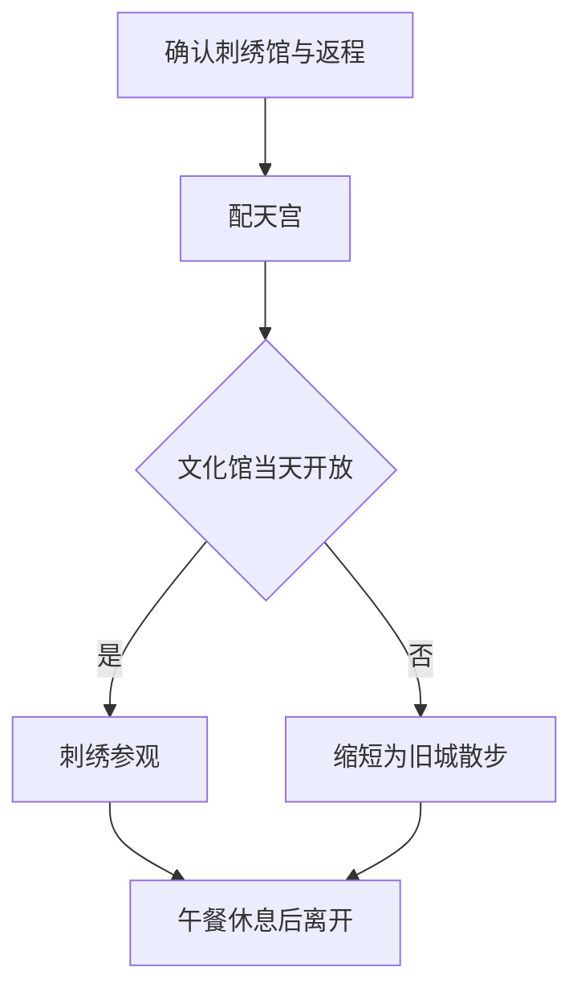

# 朴子旅行指南

朴子是嘉南平原上的庙市小城，配天宫与周边街巷构成地方信仰和日常买卖的中心。刺绣曾为神衣、婚嫁和节庆提供细致装饰，如今在文化馆和工艺传承中仍能找到这门手艺的踪迹。市场、饭铺与低层街屋延续着居民生活，寺庙装饰和针线作品则把普通街区连到更长的历史里。朴子的特色，正是信仰、手艺与市集彼此相连。

## 城市速览

首访以配天宫和刺绣文化馆为核心，市场午餐使两种文化线索回到日常生活。规模适合半天，不必安排成景点密集的大城行程。

| 项目 | 旅行信息 |
|---|---|
| 建议停留 | 半天；对工艺展览感兴趣可延长至一天 |
| 首访重点 | 庙宇装饰、刺绣工艺与市场餐饮 |
| 季节与体力 | 凉爽日适合短程步行；夏季上午活动，午后休息，低至中强度 |
| 预算特点 | 以餐饮和去回程接驳为主；从外市多次叫车成本增加 |

## 城市格局与游览区域

| 区域 | 主要内容 | 游览特点 | 与其他区域的关系 |
|---|---|---|---|
| 配天宫—开元路 | 妈祖信仰、商街与工艺线索 | 庙宇和生活街道结合，节庆时人流明显变化 | 与市场及刺绣文化馆组成短程主线 |
| 刺绣文化馆周边 | 刺绣收藏、木造房舍 | 先确认展览开放，再决定停留 | 不把馆外经过当作已完成工艺体验 |
| 市场街区 | 第一、第二市场周边饭铺 | 上午较适合接触采购生活 | 用作正餐与休息，摊位营业各异 |
| 太保方向 | 故宫南院、高铁接驳 | 属跨市延伸 | 单独乘车，不能连续步行串完 |

## 主要景点

A 为首访优先，B 为兴趣补充；用时为编辑估计，未含交通及节庆拥挤。

| 景点 | 区域 | 类型 | 主要看点 | 建议用时 | 室内外 | 体力 | 预约风险 | 天气影响 | 优先级 |
|---|---|---|---|---|---|---|---|---|---|
| 朴子配天宫 | 旧城 | 寺庙、传统工艺 | 妈祖信仰、建筑与装饰 | 45–75 分钟 | 混合 | 低 | 低 | 中 | A |
| 朴子刺绣文化馆 | 旧城 | 工艺文化馆 | 刺绣收藏与木造建筑再利用 | 45–90 分钟 | 室内为主 | 低 | 中 | 低 | A |
| 开元路及市场选段 | 旧城 | 生活街区 | 商铺、传统工艺线索与日常餐饮 | 45–60 分钟 | 室外为主 | 低至中 | 低 | 高 | 路线节点 |

**配天宫。** 看建筑装饰时留意不同材料与工艺，不只在主殿前拍照。宗教文化主管机关介绍了配天宫的信仰传统、交趾陶与彩绘；部分旧作在修整后异地保存，不能凭历史介绍保证每件作品今天都在原位置。现场以公开空间和现有解说为准，礼拜者优先通行。[宗教文化地图](https://taiwangods.moi.gov.tw/Religious_Culture/html/Cultural/3_0011.aspx?i=270)。

**刺绣文化馆。** 适合把庙宇里看到的装饰与针线工艺联系起来，看线材、纹样与用途，不把传统刺绣等同于普通纪念品。馆舍利用木造旧屋展示收藏，常设参观、课程和团体活动需要分别确认；本次未取得可靠的当前统一开放时刻，专程前往应先向馆方确认。官方旅游介绍可支持其与配天宫、市场组合，不能证明现场一定提供自行车或当天有手作课。[风景区管理处介绍](https://www.swcoast-nsa.gov.tw/ja/attraction/details/523)。

**市场街区。** 这是采购与吃饭的地方，不是为观光表演的街景。保持摊前通道，拍摄商家和顾客先征得同意；上午逛市场可与寺庙短访衔接，下午不预设全部摊位仍营业。

## 美食与餐饮

朴子的饮食体验适合围绕庙口与市场展开：先选有座位的米饭、面食或汤品，再少量尝试摊店熟食。祭祀与节庆会带动街区人流，但一般旅行日无需按节庆摊位预期安排用餐。[官方地方旅游资料](https://media.taiwan.net.tw/en-us/portal/travel/details/attraction_376500000a_000002)提供配天宫与节庆背景。

| 菜品或餐饮类型 | 常见区域 | 一个人用餐与常见份量 | 风味、过敏原与饮食限制 | 排队风险与替代方法 |
|---|---|---|---|---|
| 米饭、面食与汤品 | 市场及庙口饭铺 | 一份配青菜适合独食 | 汤底、肉燥及大豆酱料需问清 | 热门店拥挤换邻近正常营业店 |
| 市场熟食 | 第一、第二市场周边 | 小份购买，先问份量 | 海鲜、蛋与加工馅料不能凭外观判断 | 优先现做热食；买完及时吃，不久放 |
| 饮品与甜点 | 旧城商街 | 适合短休与补水 | 乳品、花生、豆类配料须确认 | 优先有座位，不把外带排队当休息 |

## 经典行程

**半日：寺庙与针线工艺。** 出发前确认刺绣文化馆当天开放和返程车次；上午先访配天宫，再沿商街到文化馆，午餐选市场周边饭铺，坐下休息后返回转运站或接驳点。若馆方安排的导览或手作需要预约，将实际确认的时段作为锚点；未确认时不把手作列为必有项目。

时间少时只留配天宫与午餐；文化馆休息则改为旧城短走，不进入关闭的馆舍。炎热或疲累时优先删商街延长段，从餐厅乘车离开。普通雨天只有在确认馆舍开放时才转室内，强风暴雨期间取消街区游览。

若组合故宫南院，建议另留一个半日，并在[太保攻略](太保市.md)确认展厅开放；先看南院还是朴子，由已确认的馆舍时段和接驳决定。

## 住宿区域

半日来访通常可住原有嘉义市或太保基地。需要清晨看市场时可找朴子市区合法旅宿，先问步行到早餐、晚餐的位置和停车条件；市内住宿选择与商业密度不像嘉义市中心，勿依名称判断是否在旧城。

## 市内交通

朴子旧城以短段步行结合公车或出租车进出。高铁嘉义站在太保市，高铁官方转乘页列有往朴子转运站的接驳信息；到转运站后还需确认到旧城的路段，不能把接驳车程直接当作到配天宫的总时间。[高铁嘉义站转乘](https://www.thsrc.com.tw/ArticleContent/60831846-f0e4-47f6-9b5b-46323ebdcef7)。

规划时先查返程班次，再决定市场或文化馆停留。出租车可以减少曝晒，但节庆时道路管制与需求增加，应预先约定可上车的位置；不凭直线距离承诺跨城步行或骑行。

## 不同旅行者须知

亲子以观察一种刺绣纹样或庙宇装饰为主题，课程适龄和家长陪同另问馆方。长者及轮椅使用者注意庙宇门槛、旧屋入口和骑楼高差，文化馆无障碍设施应提前问清。宗教仪式期间不占用通道，香烟敏感者缩短殿内停留。入境条件按证件、居住身份和出发地分别确认，见[台湾总览](README.md)。

## 行前核对

- 联系刺绣文化馆确认开馆、展览和活动；不能依据旅游旧文直接假定开放。
- 查去回程接驳及从转运站到旧城的方法，节庆日额外核对道路管制。
- 上午安排市场，午间找有座位处休息；高温或强雨时删去延长步行。

## 来源与更新记录

核查日期：2026-09-06。优先使用主管机关、旅游管理处及交通经营者资料；馆舍当前详细时刻仍需电话复查，未写成已确认事实。

| 来源 | 支撑内容 |
|---|---|
| [宗教文化地图：朴子配天宫](https://taiwangods.moi.gov.tw/Religious_Culture/html/Cultural/3_0011.aspx?i=270) | 信仰、工艺与旧作保存情况 |
| [雲嘉南滨海管理处：刺绣文化馆](https://www.swcoast-nsa.gov.tw/ja/attraction/details/523) | 刺绣收藏、木造馆舍及市场关系；以官方日文页面核对 |
| [观光署：配天宫资料](https://media.taiwan.net.tw/en-us/portal/travel/details/attraction_376500000a_000002) | 庙宇背景与节庆传统 |
| [高铁嘉义站信息](https://www.thsrc.com.tw/ArticleContent/60831846-f0e4-47f6-9b5b-46323ebdcef7) | 朴子方向转乘 |

本页覆盖旧城半日文化游；梅岭美术馆当期展览及其他外围地点尚未纳入完整线路。配天宫相关传说保留为信仰传统，不作为可证实历史事件叙述。
