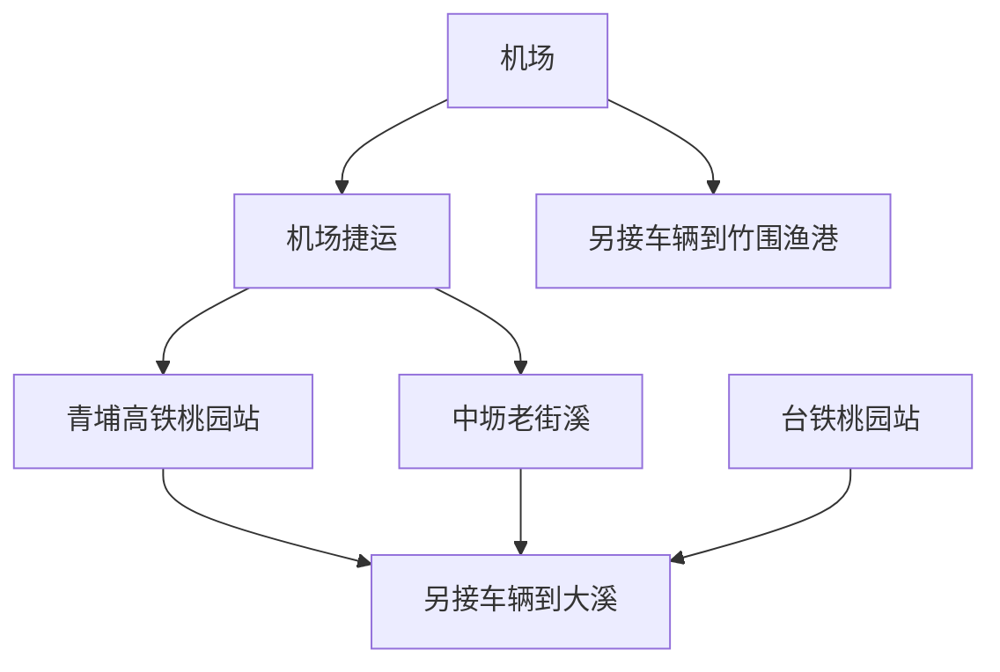

# 桃园旅行指南

桃园既是台湾北部的航空门户，也有由河港、工艺和移民生活组成的地方面貌。大溪的商号街屋保留着繁复的牌楼立面，木器制作和豆干生意延续了老城的产业记忆；向海一侧是渔港与平坦海岸，内陆则散布埤塘和聚落。中坜、桃园的繁忙商业街与这些旧地方并存，使桃园呈现出都会发展、传统手艺和日常饮食相互交织的气质。

## 城市速览

**首访精选。** 大溪老街加木艺场馆最能形成完整的地方体验；海鲜与海港兴趣者可另选竹围。仅在机场转机、尚未完成入境手续的旅客，不应把市域归属理解成可以轻松出机场游览。

| 项目 | 旅行信息 |
|---|---|
| 建议停留 | 大溪 1 天；再留半日至 1 天给中坜或竹围，两个方向择一 |
| 主要价值 | 街屋建筑、木工文化、豆制品小吃、滨海饮食 |
| 天气 | 夏季午间闷热，海岸风大；普通雨天可缩在大溪开放馆舍，极端天气按公告停行 |
| 预算 | 小吃和公共馆舍易控制；跨区车辆、住宿与海鲜合菜是主要增项 |
| 体力 | 大溪街区中等，有坡道、台阶与骑楼高差；渔港以短段步行为宜 |
| 范围 | 主写大溪，补中坜老街溪与竹围；拉拉山、复兴山区、石门水库另留独立行程 |

## 城市格局与游览区域

桃园市拥有多个中心。桃园区与中坜是两个铁路商业城区；青埔高铁站在另一处，机场和竹围靠西北，大溪靠东南。每个片区内部可以慢走，跨片区主要依赖车辆。

| 区域 | 主要内容 | 游览特点 | 与其他区域的关系 |
|---|---|---|---|
| 大溪旧城 | 和平路、中山路、木艺馆舍 | 商街与分散的小型展馆共同讲地方故事 | 从中坜、桃园或高铁站均仍需公路接驳 |
| 桃园区 | 台铁站周边商业、住宿 | 抵离与生活服务方便 | 台铁桃园站与高铁桃园站不是同一站 |
| 中坜—老街溪 | 商业街、河岸生活 | 饭店、小吃与居民街区 | 机场捷运 A22 老街溪站服务这一侧，仍需核对具体入口 |
| 青埔 | 高铁、机场捷运与现代商场 | 适合衔接航班和南北高铁 | A18 高铁桃园站为换乘点，不在大溪老街旁 |
| 大园竹围 | 渔港、鱼货与海鲜餐厅 | 以用餐和港边短走为主 | 离机场地理上较近，仍需确认车辆与航班手续余量 |

## 主要景点

A 为首访重点，B 为兴趣补充。用时是编辑估计，包含普通参观，不含跨区与候车。

| 景点 | 区域 | 类型 | 主要看点 | 建议用时 | 室内外 | 体力 | 预约风险 | 天气影响 | 优先级 |
|---|---|---|---|---|---|---|---|---|---|
| 大溪老街 | 大溪 | 历史街区 | 街屋牌楼、商号与豆干文化 | 2–3 小时 | 混合 | 中 | 低 | 中 | A |
| 大溪木艺生态博物馆馆舍群 | 大溪 | 博物馆 | 木艺与地方生活，选择开放馆舍 | 2–3 小时 | 混合 | 低至中 | 中 | 中 | A |
| 大溪桥与河岸眺望段 | 大溪 | 河景 | 老城与大汉溪地形关系 | 0.5–1 小时 | 室外 | 中 | 低 | 高 | B |
| 老街溪沿岸短段 | 中坜 | 城市散步 | 河川与居民商业街区 | 0.5–1 小时 | 室外 | 低至中 | 低 | 高 | B |
| 竹围渔港 | 大园 | 渔港 | 鱼货市场与海鲜用餐 | 1.5–2.5 小时 | 混合 | 低至中 | 低 | 高 | B |

**大溪的立面和屋内生活一起看。** 老街包括和平路、中山路、中央路等街段，繁饰门面背后是窄面宽、长进深的街屋。观察牌楼上的中西装饰、店号与木器店，比只在主街买伴手礼更能理解商业历史。[观光署大溪介绍](https://www.taiwan.net.tw/m1.aspx?id=2488&sNo=0001107)。

**木艺馆不是一栋大楼。** 它将地方街区、历史建筑和工艺展示连在一起，先在官方公布的开放馆舍中挑两三处，再留时间看木作细节。环境主管部门场所资料列常规周二至周日 09:30–17:00，周一休馆、遇法定假日调整；各馆舍和体验活动仍可能不同。此次馆方页面直接读取超时，因此不发布未经逐馆确认的开放名单；出发前使用[馆方入口](https://wem.tycg.gov.tw/SiteMap.aspx)或致电确认。[官方环境教育场所资料](https://neecs.moenv.gov.tw/Home/PlaceQryView?id=01e7d11d-76f3-4900-8495-397cc31c0068)。

**大溪桥适合解释河港位置。** 从旧城看向大汉溪，再决定是否下到桥边；往返高差会消耗体力。桥和周边步道按现场开放走，河水上涨时不走封闭低洼段。

**竹围以吃饭为主，留港口作背景。** 渔港仍有作业空间，参观在开放市场和公共岸边进行。先谈清重量、单价和加工费，再选烹饪方法；防波堤和船只作业区不是拍照通道。[桃园官方竹围页面](https://travel.tycg.gov.tw/zh-cn/travel/attraction/188)。

## 美食与餐饮

大溪的豆干与木器一样，都是地方产业的线索。适合把豆干、豆花等分成小份体验，再用饭面完成正餐；中坜可选择居民餐馆，竹围则更适合多人分食海鲜。菜名与价格写清楚，比按照片点一大桌更重要。

| 菜品或餐饮类型 | 常见区域 | 一个人用餐与常见份量 | 风味、过敏原与饮食限制 | 排队风险与替代方法 |
|---|---|---|---|---|
| 大溪豆干 | 大溪老街 | 小份现食，包装品留作伴手礼 | 大豆、小麦酱油，卤汁是否荤食须问 | 比较日期与份量，店满可换邻近同类店 |
| 豆花、花生糖 | 大溪 | 点心而非正餐 | 大豆、花生及配料交叉接触 | 午间选有座位店，先休息再购物 |
| 米食与饭面 | 大溪、中坜 | 单人较好控制预算 | 肉臊、虾米、蛋与汤底逐项核对 | 不集中追热门店，优先有菜单与座位 |
| 海鲜合菜 | 竹围渔港 | 多人分食；独行选定价小份 | 鱼贝、甲壳类及共同烹调 | 先确认总价与加工费，超预算换定价套餐 |

## 经典行程

### 大溪一日：商号、手艺与河港

| 时段 | 安排 | 执行条件 |
|---|---|---|
| 09:30–12:00 | 抵达大溪，先参观已确认开放的木艺馆舍，再走中山路或和平路一段 | 若有已订手作，以到场时间倒排；未订体验就看展，不临时挤课程 |
| 12:00–14:00 | 饭面正餐，豆花或茶饮坐下休息 | 给周末排队和避暑留余量，不以一路站着吃代替休息 |
| 14:00–16:00 | 看街屋、买少量伴手礼，体力允许再看桥与河岸 | 桥边为第一删减项；雨大或步道关闭留在开放街区 |
| 16:00 后 | 从原定站点或上客处离开 | 提前查回程；疲累时直接叫正规车辆，取消所有延伸 |

### 可选第二天：中坜生活或竹围海鲜

以公共交通为主可选中坜：上午老街溪短走，中午在市区用餐，下午休息后离城。若同行多人且已安排车辆，可换为竹围：近午到港、吃海鲜、公共岸边短走后返住宿。两者不必同日全收；需要赶飞机时，以航空公司要求的到机场时间反推，首先删除海岸停留。

## 住宿区域

| 区域 | 适合需求 | 下单前确认 |
|---|---|---|
| 大溪旧城 | 想专注建筑、木艺与老街 | 房屋楼梯、停车位置、晚上餐厅选择 |
| 中坜台铁站或老街溪方向 | 希望生活餐饮方便，继续搭铁路旅行 | 台铁与捷运站之间实际步行、施工及行李路线 |
| 青埔高铁站周边 | 接高铁或机场捷运 | 到站口距离、早晚班次、酒店接驳是否收费 |
| 机场周边 | 深夜到达或清晨起飞 | 酒店班车运行时段、预约与实际航厦；“机场附近”不等于步行可达 |

## 市内交通

机场捷运连接航厦、青埔和中坜方向，查[桃园捷运首末班查询](https://www.tymetro.com.tw/tymetro-new/tw/_pages/travel-guide/departure.html)时须选择实际出发站与日期；不是所有列车停站一致。台铁桃园站、高铁桃园站、桃园机场分别在不同位置。去大溪仍要公路接驳，不能把买到高铁票视作已经抵达老街。

大溪日游以确定去回班次再出发为宜；选择出租车时保留合法上车点与费用依据。竹围虽属机场所在的大园区，港区到航厦仍受道路、候车和行李影响。拉拉山与复兴山区需要单独核对道路和住宿，不能从本页的大溪行程直接顺延。

## 不同旅行者须知

- **亲子与长者：** 大溪两处馆舍配一段老街即可；有连续站立或坡道时，用河岸段换室内休息。
- **轮椅与童车：** 老街骑楼高差、木屋门槛、桥边坡道需逐点核对；先确认馆舍可进入的空间。
- **海鲜过敏或素食：** 竹围以海鲜为主，限制较多时在市区吃完再去港边；大溪豆干也需确认卤汁。
- **转机旅客：** 能否出机场取决于个人证件与入境资格；大陆居民、港澳居民、外国护照及台湾居民条件不同，详见[台湾总览](README.md)的核验入口。

## 行前核对

- 逐馆确认木艺馆舍与体验名额，节假日不要套用常规周一规则。
- 订房、叫车和买票分别核对航厦、高铁站或台铁站名称。
- 保存大溪返程班次、备用出租车方式与住宿地址。
- 海鲜确认计价；伴手礼检查保存期限及目的地携带限制。
- 查询台风、强降雨和道路通告，山区延伸须单独规划。

## 来源与更新记录

核查日期：**2026-09-06**。用时和路线为编辑估计。

| 来源 | 支持内容 | 核查说明 |
|---|---|---|
| [观光署大溪老街](https://www.taiwan.net.tw/m1.aspx?id=2488&sNo=0001107) | 街区范围与立面历史 | 官方检索返回核对 |
| [桃园官方大溪街景说明](https://travel.tycg.gov.tw/zh-tw/multimedia/live-camera/18) | 河港背景、木艺与豆干等食物 | 不使用实时影像作为本人到访依据 |
| [木艺馆官方入口](https://wem.tycg.gov.tw/SiteMap.aspx) | 馆方查询入口 | 搜索可见，直接读取超时；未把技术失败标为失效 |
| [环境教育认证系统](https://neecs.moenv.gov.tw/Home/PlaceQryView?id=01e7d11d-76f3-4900-8495-397cc31c0068) | 木艺馆特色与常规开馆 | 一手行政资料，逐馆临时状态需再确认 |
| [桃园竹围渔港](https://travel.tycg.gov.tw/zh-cn/travel/attraction/188) | 港口位置与主题入口 | 页面正文抽取有限，不据此保证各商家营业 |
| [桃园捷运](https://www.tymetro.com.tw/tymetro-new/tw/_pages/travel-guide/departure.html) | 车站关系与按日期查首末班 | 直接读取成功；不固化班次 |

**更新记录：** 2026-09-06 建立大溪主线和中坜、竹围可选半日安排；复兴山区、拉拉山及石门水库待独立深度展开。
