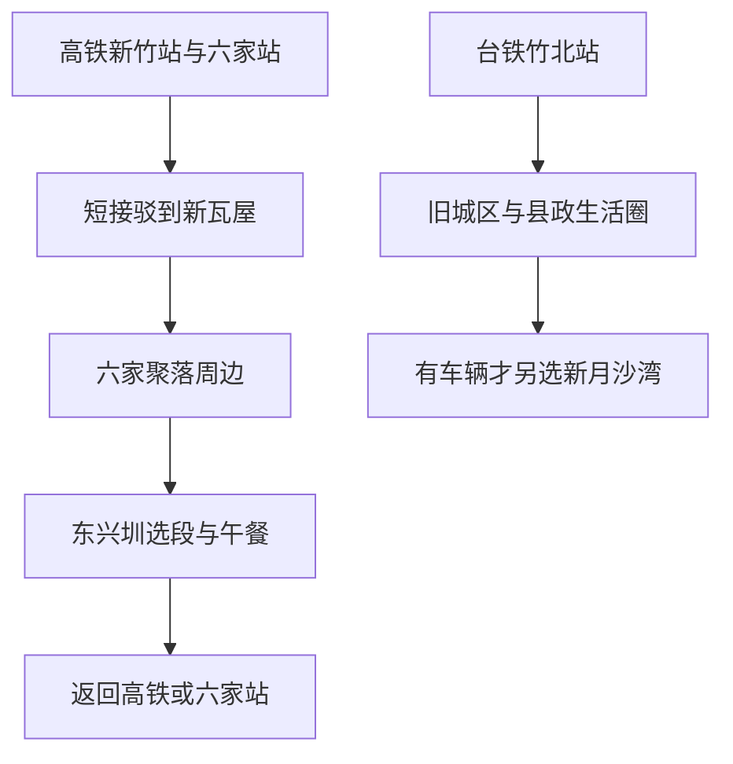

# 竹北旅行指南

竹北位于头前溪北岸，是新竹县的行政中心，也是一座在新社区之间保留客家聚落记忆的城市。新瓦屋的公厅、旧屋与田地，记录家族共同生活的方式；东兴圳从灌溉水道转为城市绿带，让农田时代的线索留在高楼之间。向西，平坦地势一直延伸到海边。传统聚落、新兴住宅和水圳公园并存，是竹北最有辨识度的城市面貌。

## 城市速览

**首访精选。** 新瓦屋加六家周边短走，是认识竹北最集中的半日；有兴趣再留一段东兴圳。竹北适合搭配新竹市或高铁途中停留，不必为凑满两天往返海岸。新月沙湾是独立的可选看海方向，不能安排游泳。

| 项目 | 旅行信息 |
|---|---|
| 建议停留 | 聚落和水圳半日至 1 天；不必为纯观光专门住两晚 |
| 主要价值 | 客家聚落保存、旧水圳与新城并存的生活地景 |
| 季节条件 | 较凉爽时适合步行；夏季午间避暑，海岸强风时缩在城区 |
| 预算 | 公共空间多，主要支出为吃饭、车辆与可能的活动费用 |
| 体力 | 短段低至中等，但新城道路较宽、聚落门槛与日晒需注意 |
| 范围 | 新竹县竹北市；城隍庙与玻璃工艺馆在新竹市，内湾、北埔另属县内其他乡镇 |

## 城市格局与游览区域

高铁新竹站与台铁六家站在竹北东南侧，周边有新社区与六家传统聚落；台铁竹北站服务另一侧旧城区。新月沙湾在西部海岸，离六家文化线较远，需要另安排车辆。

| 区域 | 主要内容 | 游览特点 | 与其他区域的关系 |
|---|---|---|---|
| 新瓦屋 | 忠孝堂、旧屋、禾埕与保留田地 | 聚落整体比逐屋打卡更重要，店铺和展览各自营业 | 与六家、东兴圳可组成同一半日方向 |
| 六家民俗公园周边 | 林家祠与聚落文化 | 家族信仰和历史建筑仍有自身使用规则 | 与新瓦屋不是同一个园区，地面过街另计 |
| 东兴圳 | 水道、公园与绿带 | 看城市如何保留农业水利记忆，选一段即可 | 与新城住宅交织，不需要全线走完 |
| 台铁竹北站及县政生活圈 | 传统城区与餐饮、住宿 | 生活服务与商务功能为主 | 与高铁站分开确认，不能同名换乘 |
| 新月沙湾 | 西部海岸公共空间 | 以岸上看海为主 | 单独接驳，风浪大直接删除 |

## 主要景点

A 为首访重点，B 为兴趣补充。用时为编辑估计，不含候车；历史建筑入内和活动名额需单独确认。

| 景点 | 区域 | 类型 | 主要看点 | 建议用时 | 室内外 | 体力 | 预约风险 | 天气影响 | 优先级 |
|---|---|---|---|---|---|---|---|---|---|
| 新瓦屋客家文化保存区 | 六家方向 | 聚落文化 | 忠孝堂、禾埕、旧屋与田地 | 1.5–2 小时 | 混合 | 低至中 | 中 | 中 | A |
| 六家民俗公园与林家祠周边 | 六家 | 历史聚落 | 公厅建筑与宗族信仰背景 | 0.5–1 小时 | 室外为主 | 低 | 中 | 中 | B |
| 东兴圳开放绿带选段 | 六家—新社区 | 水利、城市公园 | 水圳与现代住宅的并置 | 0.5–1 小时 | 室外 | 低至中 | 低 | 高 | A |
| 新月沙湾岸上区域 | 西部海岸 | 海岸地景 | 沙岸、海风与平原边缘 | 0.5–1 小时 | 室外 | 低至中 | 低 | 高 | B |

**新瓦屋从公厅和禾埕读起。** 公厅是家族聚会、祭祀的重要空间，前方的禾埕原与农务及共同生活相关。保存区还留下不同材料与年代的房屋、田地和水圳，值得观察旧聚落怎样在新城中继续使用。园区公共空间、商家、展览及活动时间分开确认，不假定全部馆舍随到随进。[文化局新瓦屋介绍](https://www.hchcc.gov.tw/Tw/ArtMuseum/Detail?filter=ebc0a96c-8c36-4a9c-a922-1cebed00f385&id=311848cc-0e44-4bb2-9c59-186ad9510d34)。

**六家看建筑，也尊重仍在使用的空间。** 林家祠的格局与共同祭祀相关，参观以公共可达范围为准，遇关闭就在外观和周边停留。[客委会林家祠资料](https://hch.hakka.gov.tw/theme/%E5%82%B3%E7%B5%B1%E5%BB%BA%E7%AF%89%E7%B6%B2/construction.asp?coid=1051&cotype=%E6%A1%83%E7%AB%B9%E8%8B%97)。竹北存在名称相近的问礼堂建筑，** 东平问礼堂**另有修复工程公告；查到的“预计 2026 年 5 月完工”不是已开放证明，本篇不安排入内，不与六家问礼堂混用位置和历史。

**东兴圳让水利史变得可见。** 选择临近新瓦屋或六家的一小段开放绿带，观察水道如何穿过住宅与公园。过去的光艺节是有日期的活动，不保证平日也有同一批灯光装置。[县府东兴圳公园说明](https://www.hsinchu.gov.tw/News_Content.aspx?n=153&s=232788)。

**新月沙湾只留岸上体验。** 县府曾将此处列为危险水域，明确劝阻游泳等水域活动。公园与冲洗设施存在，不代表海水适合下水；依当日告示和开放边界在岸上活动，强风、雷雨或长浪时取消。[县府水域安全说明](https://www.hsinchu.gov.tw/News_Content.aspx?n=153&s=244280)。

## 美食与餐饮

竹北的吃饭选择反映了客家聚落与现代居住城市两面。文化线可在营业中的店铺找米食、粄类或家常饭菜，但不必把每家餐厅都理解为传统客家风味。午间优先有座位的定价饭面，想吃客家合菜则留给多人共餐。

| 菜品或餐饮类型 | 常见区域 | 一个人用餐与常见份量 | 风味、过敏原与饮食限制 | 排队风险与替代方法 |
|---|---|---|---|---|
| 粄条与米食 | 市区与聚落周边餐馆 | 一碗主食方便独行 | 汤底、肉燥、虾米与酱油需问，不因米制就认定素食 | 原店休息时换定价饭面，不追远处同名店 |
| 客家家常合菜 | 竹北市区 | 适合多人分食 | 腌渍、肉类、豆制品和调味逐项确认 | 预约时告知人数，少人问小份 |
| 饭面与当代餐厅 | 县政生活圈、六家新社区 | 套餐较易控制 | 国际菜式不等于都适用相同过敏规则 | 假日订位，另备不需预约的简餐 |
| 茶饮和糕点 | 新瓦屋营业店铺、市区 | 适合作为休息停靠 | 茶饮、蛋奶与坚果配料分别问 | 活动市集不保证每日举办，常设店休息就回主街 |

## 经典行程

### 半日至一日：聚落与水圳

| 时段 | 安排 | 锚点与调整 |
|---|---|---|
| 09:30–11:30 | 从六家或住宿接驳新瓦屋，围绕公厅、禾埕和开放展览慢走 | 有已预约导览按报到时间安排；未确认导览就自主参观公共区 |
| 11:30–13:30 | 周边或市区午餐，留室内休息 | 不以市集一定营业为前提；先确认实际店家 |
| 13:30–15:00 | 六家民俗公园周边与东兴圳二选一，体力好再组合短段 | 午后热或雨大删绿带；建筑关闭只看公共外观 |
| 15:00 后 | 返回住宿或高铁站，留取行李与候车时间 | 疲累直接从午餐处返程，首删所有延伸 |

只留半天就保留新瓦屋与一餐，省去六家和东兴圳的重复步行。新月沙湾适合已有车辆、天气稳定且不用赶车的人另选傍晚，先落实回程，岸上停留后结束；它不是上述文化线的步行末端。普通小雨可缩在已确认营业的展览与餐厅，极端天气按官方通告暂停外出。

## 住宿区域

| 区域 | 适合需求 | 下单前确认 |
|---|---|---|
| 六家、高铁站方向 | 南北高铁抵离与新瓦屋文化线 | 站口到酒店的真实距离、接驳与夜间餐饮 |
| 县政生活圈 | 商务、较多餐饮选择 | 距高铁和台铁竹北站均可能还需车辆 |
| 台铁竹北站周边 | 继续搭西部干线、接旧城区生活 | 电梯、行李寄存与房间隔音 |

若主要目的是新竹市旧城，住新竹市通常更直接；竹北适合作为新瓦屋或高铁抵离的停留点。

## 市内交通

高铁新竹站在竹北，二楼通廊连接台铁六家站；台铁竹北站则在另一片区。去新竹市可由六家乘车到台铁新竹站，按[高铁转乘说明](https://www.thsrc.com.tw/ArticleContent/a7a04c89-900b-4798-95a3-c01c455622f4)及[台铁六家站](https://tip.railway.gov.tw/tra-tip-web/tip/tip00H/tipH41/viewStaInfo/1194)核对班次。

新瓦屋、六家与东兴圳可用步行加短接驳组合，宽马路和路口应算入时间。海岸依赖另行安排的交通，不能把出租车送达等同于返程也一定随叫随到。公共自行车只在已确认租还方式、道路环境和天气合适时使用，亲子不以骑车作为默认。

## 不同旅行者须知

- **亲子：** 聚落与绿带选短段，公厅周边注意礼仪；新月沙湾不安排游泳，水圳也不进入水道。
- **长者与轮椅使用者：** 新瓦屋门槛、旧屋可达性逐处确认；把车辆接驳和室内坐席安排在前，避免宽路长距离日晒。
- **独行或公共交通旅客：** 半日文化线已足够，海岸可省略；午餐选定价单人餐。
- **不同证件身份：** 大陆居民、港澳居民、外国护照与台湾居民按[台湾总览](README.md)分别核验资格，订高铁或酒店不能代替入境确认。

## 行前核对

- 核对新瓦屋活动、展览及店铺当日营业；有导览才按预约时间抵达。
- 不把东平问礼堂的预计竣工时间当成开馆时间。
- 车票确认六家、竹北、新竹三个站名，保存住宿中文地址。
- 海岸查最新开放与水域告示，预留返程车辆，按岸上活动准备。
- 天热时带饮水并安排午间坐席，绿带和聚落之间按实际道路通行。

## 来源与更新记录

核查日期：**2026-09-06**。用时及组合为编辑估计。

| 来源 | 支持内容 | 核查说明 |
|---|---|---|
| [文化局新瓦屋介绍](https://www.hchcc.gov.tw/Tw/ArtMuseum/Detail?filter=ebc0a96c-8c36-4a9c-a922-1cebed00f385&id=311848cc-0e44-4bb2-9c59-186ad9510d34) | 公厅、禾埕、建筑与水田 | 直接读取成功；不保证所有商家营业 |
| [客委会林家祠资料](https://hch.hakka.gov.tw/theme/%E5%82%B3%E7%B5%B1%E5%BB%BA%E7%AF%89%E7%B6%B2/construction.asp?coid=1051&cotype=%E6%A1%83%E7%AB%B9%E8%8B%97) | 宗族祭祀和建筑格局 | 稳定文化事实，非当日入内许可 |
| [东平问礼堂工程公告](https://www.hchcc.gov.tw/Tw/News/CultureNewsDetail?filter=2d19cb6c-e4bf-49af-937e-42beb45299dd&id=659bb568-5bac-4546-8641-ba1b7fb964ae) | 修复与建筑区分 | 仅查到预计完工，未取得重开证据，不排入内 |
| [东兴圳公园](https://www.hsinchu.gov.tw/News_Content.aspx?n=153&s=232788) | 农业水利和城市绿带 | 旧公告支持背景，不用作全段实时通行证明 |
| [新月沙湾官方资料](https://media.taiwan.net.tw/zh-tw/portal/travel/details/attraction_376440000a_000306) | 市域归属与海岸位置 | 数据更新 2026-07-28，核对为竹北市 |
| [县府水域安全说明](https://www.hsinchu.gov.tw/News_Content.aspx?n=153&s=244280) | 危险水域及游泳限制 | 未取得解除证据，行程只安排岸上活动 |
| [县府客家粄食说明](https://www.hsinchu.gov.tw/News_Content.aspx?n=153&s=265226) | 粄条作为区域客家饮食品类 | 活动地点在新埔，只支持饮食背景，不列为竹北活动 |
| [高铁新竹站](https://www.thsrc.com.tw/ArticleContent/a7a04c89-900b-4798-95a3-c01c455622f4) | 高铁、六家与竹北交通关系 | 当日官方查询核对，具体班次行前查 |

**更新记录：** 2026-09-06 建立新瓦屋、六家、水圳的半日至一日线及岸上看海选择；未将县内北埔、内湾或新竹市景点并入竹北。
