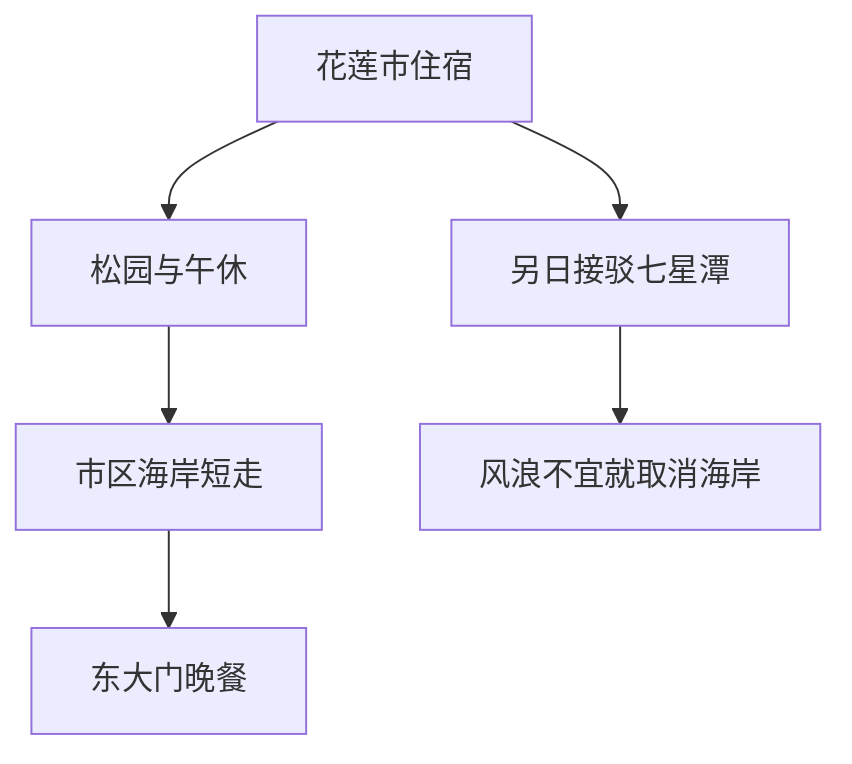

# 花莲旅行指南

花莲市面向太平洋，西侧山地构成城市清楚的背景。松园别馆的旧建筑俯看美仑溪口，市区海岸则把港口、公共绿地和居民散步的空间连接起来。东大门夜市汇集日常小吃与不同风味，原住民族文化也通过餐饮、工艺和活动进入城市生活。这里既有铁路与港口发展留下的街区，也有紧邻山海的开阔感，城市本身并不只是进入峡谷前的一站。

## 城市速览

**首访精选。** 松园别馆适合建筑与地方历史兴趣，市区海岸提供看海与散步，东大门方便用一餐接触多种风味。留 1 天认识城市；加新城乡七星潭可住 2 晚。太鲁阁在其他乡域，是否能走具体步道须单独核查，不能用花莲市正常营业推断峡谷全面开放。

| 项目 | 旅行信息 |
|---|---|
| 停留 | 市区 1 天；加七星潭的从容安排约 2 天 |
| 范围 | 花莲市区为主，七星潭明确列为新城乡延伸；不包含完整县域 |
| 天气 | 海边受风浪影响，炎热时早晚活动；地震及强降雨可能改变交通 |
| 预算 | 市区饭面与夜市可控，跨区车辆与海上活动增加开销 |
| 体力 | 松园有坡与台阶；海岸少遮阴，不能按地图距离低估曝晒 |

## 城市格局与游览区域

铁路站前与东大门、海岸不是同一个中心；美仑溪以北的松园又有上坡。七星潭在更北的新城乡，须另计往返车辆，不能顺手从夜市走过去。

| 区域 | 性格与体验 | 连接方法 |
|---|---|---|
| 花莲站前 | 抵离、住宿与日常餐饮 | 用车或公交到旧市区，候车另计 |
| 松园、美仑溪附近 | 历史建筑、高处视野 | 半天参观，坡路与馆内台阶需留意 |
| 东大门、市区海岸 | 晚餐与公共滨海空间 | 天气允许时短走后用餐 |
| 七星潭（新城乡） | 弧形海湾与砾石岸 | 单列半天，有回程安排再出发 |

## 主要景点

A 为首访重点，B 为补充；用时为编辑估计，未含接驳与等候。

| 景点 | 区域 | 类型 | 主要看点 | 建议用时 | 室内外 | 体力 | 预约风险 | 天气影响 | 优先级 |
|---|---|---|---|---|---|---|---|---|---|
| 松园别馆 | 花莲市美仑 | 历史建筑、艺文 | 松林、旧军事建筑与溪口视野 | 1–1.5 小时 | 混合 | 中 | 中 | 中 | A |
| 太平洋公园市区段 | 花莲市海岸 | 公共空间 | 海岸线与城市临海关系 | 45–60 分钟 | 室外 | 低至中 | 低 | 高 | A |
| 东大门夜市 | 花莲市旧市区 | 餐饮街区 | 分区摊位与多样小吃 | 1–1.5 小时 | 室外为主 | 中 | 低 | 高 | 路线节点 |
| 七星潭海岸 | 新城乡 | 海湾地景 | 弧形砾石海湾与远山 | 1–1.5 小时 | 室外 | 中 | 低 | 高 | B |

**松园：看军用建筑怎样转成文化空间。** 连续拱廊、建筑与松树的位置，比将每间房都看成传奇故事更值得细读。山坡、木栈道与台阶对低体力者有影响，先询问可达范围。[文化局介绍](https://www.hccc.gov.tw/zh-tw/LocalCulturalHall/Detail/20)。

**城市海岸与七星潭：选择一种看海方式。** 太平洋公园适合接晚餐前的短走；七星潭的砾石海湾需要专程往返，且属于新城乡。两处均按观景安排，不把岸边散步写成可以下水游泳；遇大浪远离浪线与临海护栏。[观光署七星潭及城市线路](https://spotlightaward.taiwan.net.tw/tourpage.php?id=128d4234-7181-4ffd-aab7-56b9d4e95ae6&tag=4)；[县府七星潭资料](https://tour-hualien.hl.gov.tw/jp/TourContent.aspx?n=341&s=5538)。

**东大门：用一顿饭认识差异。** 先看各摊菜品与份量，再选一份主食和一两样分食；不同摊位开店时间各异，夜市整体开放不代表每家营业。[县府夜市目录](https://tour-hualien.hl.gov.tw/TourList.aspx?_CSN=72&n=49&sms=12302)。

**太鲁阁限制单列。** 2026-09-06 核查官方步道列表，砂卡礑、白杨、燕子口、九曲洞等仍标封闭，绿水等有部分开放。旧旅游网页的多日推荐可能仍列这些地点，不能据此直接出发。本页不提供峡谷一日路线；选择具体开放点后还须核公路管制与当天灾害公告。[国家公园步道状态](https://www.taroko.gov.tw/ch/trailsAttractions/trail-list)。

## 美食与餐饮

花莲餐饮可以从扁食、包子等日常饭点进入，再接触原住民族风味餐或夜市烤物。原住民族不是单一菜系，菜单上的“原民”二字也不代表一种共同的做法；有兴趣时选择说明食材与族群背景的店家，点餐前询问。[观光署饮食与路线线索](https://spotlightaward.taiwan.net.tw/tourpage.php?id=128d4234-7181-4ffd-aab7-56b9d4e95ae6&tag=4)；[县府餐饮目录](https://tour-hualien.hl.gov.tw/TourList.aspx?_CSN=72&n=49&sms=12302)。

| 类型 | 场景 | 饮食限制 | 用餐取舍 |
|---|---|---|---|
| 扁食、包子与饭面 | 市区早午餐 | 小麦、猪肉及汤底需确认 | 独行选一份主食加蔬菜 |
| 夜市烤物、海鲜 | 东大门晚餐 | 鱼虾贝类与共用烤台需说明过敏 | 先问份量、价钱，不全靠边走边吃 |
| 原住民族风味餐 | 有完整菜单的餐馆 | 香料、肉类、酒与调味各异 | 部分套餐需预约，先问最少人数 |
| 甜品与饮料 | 午后休息 | 花生、乳品等按配料确认 | 优先有座位，不追加跨区排队 |

## 经典行程

### 两日安排：城市与一段海湾

以下从已经抵达市区住宿开始，不包含台北等地长途进城时间；道路和交通时间须当天另查。

| 日程 | 上午 | 午餐与休息 | 下午与傍晚 | 锚点、删减与退出 |
|---|---|---|---|---|
| 第一天 | 松园别馆，以已预约导览或确认开馆时段为锚 | 回市区用餐，留 1–1.5 小时休息 | 风浪允许时太平洋公园短走，东大门晚餐 | 晚到删海岸，直接用餐；累了从松园或餐厅叫车回住宿 |
| 第二天 | 先查风浪与往返交通，再往新城乡七星潭 | 返回市区吃午餐、取行李 | 留出车站候车余量，或在市区再休息 | 取消七星潭时不临时改太鲁阁；不舒服或风浪增加就沿正式出口返回上客点 |

只有一天保留松园、午休与夜市，海岸看天气选加。普通阵雨可先用餐再看馆；地震后、强风暴雨或交通异常时，先遵循关闭与疏散信息，不为完成路线追逐“雨备景点”。

## 住宿区域

| 区域 | 优点 | 取舍 | 适合需求 |
|---|---|---|---|
| 花莲站前 | 早晚列车、取行李方便 | 去夜市与海岸仍需连接 | 铁路跨城、短住 |
| 东大门、旧市区 | 晚餐与生活街区方便 | 夜间噪声、到站接驳需考虑 | 无车首访 |
| 美仑 | 靠近部分历史与海岸空间 | 用餐与交通随具体地址差别大 | 较长停留 |
| 七星潭 | 方便清晨看海 | 属新城乡，往返花莲市另需车辆 | 明确以海湾为主 |

## 市内交通

花莲站是主要铁路抵离点，新城站不能仅因接近太鲁阁而替代市区车站。用[台铁](https://www.railway.gov.tw/)核对车次及运行公告。市内以分段步行加公交、出租车连接，去七星潭先安排回程；不假定景区随时叫得到车。沿海骑行需确认当天开放与风力，不把自行车道存在理解为全线无障碍或随时安全可骑。

## 不同旅行者须知

| 需求 | 实际安排 |
|---|---|
| 亲子 | 海岸守住步道边界，不走近浪线；夜市先找坐下用餐的位置 |
| 长者、低体力 | 松园台阶可删，海岸只走短段，用车跨区 |
| 无障碍 | 古建筑、砾石岸和骑楼不保证连续可达，先问实际入口与厕所 |
| 独行 | 七星潭回程先落实；海岸与山区不在无人处夜行 |
| 特殊饮食 | 夜市烤台与油锅常共用，严重过敏选择能清楚说明配方的餐厅 |

## 行前核对

每日查铁路、天气和地震后道路公告；任何太鲁阁延伸须核对“具体步道”和“到达公路”两项，部分开放不代表可走到旧攻略的终点。海上赏鲸等项目未列入本线，另查运营、海况与身体条件。

证件办理取决于旅行者身份及出发地。大陆居民、港澳居民与外国护照持有人分别查[移民署](https://www.immigration.gov.tw/)与[领事事务局](https://www.boca.gov.tw/np-137-2.html)适用规定；大陆出发者另查[国家移民管理局](https://www.nia.gov.cn/)，不以某一护照免签条款推断其他身份可入境。

## 来源与更新记录

| 来源 | 支持内容 | 核验日期 |
|---|---|---|
| [文化局松园资料](https://www.hccc.gov.tw/zh-tw/LocalCulturalHall/Detail/20) | 建筑背景与高处位置 | 2026-09-06 |
| [观光署七星潭](https://spotlightaward.taiwan.net.tw/tourpage.php?id=128d4234-7181-4ffd-aab7-56b9d4e95ae6&tag=4) | 海湾、城市海岸及饮食线索 | 2026-09-06 |
| [县府七星潭](https://tour-hualien.hl.gov.tw/jp/TourContent.aspx?n=341&s=5538) | 新城乡归属与海湾景观 | 2026-09-06 |
| [东大门目录](https://tour-hualien.hl.gov.tw/TourList.aspx?_CSN=72&n=49&sms=12302) | 餐饮分区与摊位线索 | 2026-09-06 |
| [太鲁阁步道列表](https://www.taroko.gov.tw/ch/trailsAttractions/trail-list) | 具体步道封闭、部分开放区别 | 2026-09-06 |

2026-09-06：完成花莲市及七星潭限定延伸，使用官方正文与官方搜索结果核查。未核定实时公路放行、所有场馆修复范围、逐店营业及连续无障碍路线；不将旧官方推荐线路当作当前开放保证。时间与路线为编辑判断。
