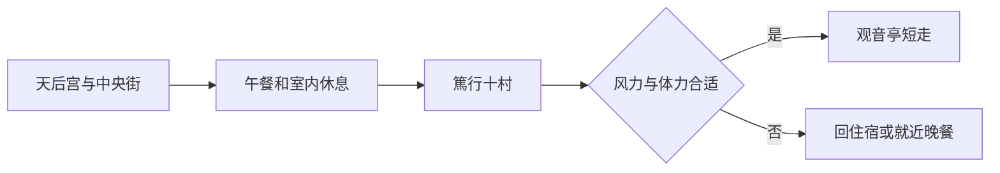

# 马公旅行指南

马公是一座围着港湾生长的澎湖城市。天后宫与中央街保留了妈宫旧聚落的信仰和商贸记忆，篤行十村的宿舍与音乐人物故事，则呈现军眷迁居之后的另一层生活。观音亭一带把庙宇、海岸和公共休憩空间放在一起；餐桌上的小管、海菜与金瓜米粉，让岛屿的海洋资源和农作同样可见。老街与港口彼此相邻，海也始终是城市日常的一部分。

## 城市速览

**首访精选。** 天后宫与中央街看港城的早期生活，篤行十村看眷村与音乐记忆，观音亭留给傍晚。马公旧城 1 天可认识主要线索；留 2 天便于看展和抵离。西屿、白沙、湖西与七美、望安等离岛不在这条市区路线内。

| 项目 | 旅行信息 |
|---|---|
| 建议停留 | 旧城 1–2 天，整个澎湖群岛应另留时间 |
| 范围 | 马公市中心、篤行十村与观音亭；不代表全部马公市辖岛屿或澎湖各乡 |
| 天气 | 夏季曝晒，东北季风与台风影响户外和航运；夜景也须看风力 |
| 预算特点 | 海鲜与接驳价格差异大，先确认份量、时价及车型 |
| 住宿方向 | 旧城附近便于徒步与用餐，偏远海景住宿需落实车辆 |

## 城市格局与游览区域

天后宫、中央街与篤行十村同在旧城一带，可分段步行；观音亭在旧城西北侧。机场在湖西乡，离岛船也并非全部从同一个码头出发，不能只凭“马公”两字推断上下船地点。

| 区域 | 性格与体验 | 组合办法 |
|---|---|---|
| 天后宫、中央街 | 庙宇、旧商街与小吃 | 上午步行一小圈，避开持续曝晒 |
| 篤行十村 | 历史宿舍、眷村与音乐文化 | 独立 1–2 小时，纪念空间按实际开放选择 |
| 观音亭 | 庙宇、滨海公共空间 | 傍晚看海，活动日另查人流和封控 |
| 港口及抵离节点 | 船舶、客运与城市生活 | 只走开放公共区域，不进入作业区 |

## 主要景点

A 为首访重点，B 为补充；用时为编辑估计，未含用餐排队和接驳。

| 景点 | 区域 | 类型 | 主要看点 | 建议用时 | 室内外 | 体力 | 预约风险 | 天气影响 | 优先级 |
|---|---|---|---|---|---|---|---|---|---|
| 澎湖天后宫 | 旧城 | 古迹、信仰 | 妈祖信仰、木石工艺与港城历史 | 45–60 分钟 | 混合 | 低至中 | 低 | 中 | A |
| 中央街选段 | 旧城 | 商贸街区 | 老街、店屋与庙口生活 | 45–60 分钟 | 室外 | 低 | 低 | 高 | 路线节点 |
| 篤行十村 | 旧城西南 | 历史聚落 | 宿舍、眷村生活与音乐记忆 | 1.5–2 小时 | 混合 | 中 | 中 | 高 | A |
| 观音亭及公共滨海段 | 旧城西北 | 信仰、海岸 | 庙宇与海湾公共空间 | 45–60 分钟 | 室外为主 | 低 | 中 | 高 | B |

**天后宫：港城信仰不是一件陈列品。** 观察殿宇、木石装饰与参拜次序，能把建筑与海上生活联系起来。庙仍有实际祭祀，进入前看现场告示，不阻挡香客，不将传说当成已经证明的史实。[风景区管理处介绍](https://www.penghu-nsa.gov.tw/TravelInformationSceneryDetailC001200.aspx?Cond=73eae1ff-0b2f-4bfd-b1b3-b37f0c611a31&Keyword=%E9%A0%86%E6%89%BF&Language=1028&SearchAdvanced=False&SortType=1)。

**篤行十村：先看宿舍群，再看音乐人物。** 聚落保存的价值不限于某一位歌手的纪念空间；巷道和房屋再利用同样表达居民生活的变化。潘安邦、张雨生相关空间是兴趣补充，内部开馆情况须另查。[文化局资料](https://www.phhcc.gov.tw/home.jsp?id=140)。县府曾发布步道及无障碍改善工程信息，但这不能证明每栋老屋都可无阶进入。[工程说明](https://www.penghu.gov.tw/tourism/home.jsp?act=view&dataserno=11411140006&id=61)。

**中央街与观音亭：把看海留在城市里。** 老街适合看店屋与庙口关系，观音亭适合短段公共海岸散步。花火等活动只在公告日期举行，普通到访不承诺烟火；强风时取消滨海停留。[文化园区周边景点](https://dxsv.phhcc.gov.tw/home.jsp?id=7)。

## 美食与餐饮

澎湖餐桌不只有大盘海鲜。小管、海菜与金瓜米粉可以组成更容易分配份量的一餐；炸粿与黑糖糕更适合作点心。市区能接触到群岛风味，但不能因此把每一道食材都认定来自马公本地当日捕捞。[风景区管理处饮食介绍](https://www.penghu-nsa.gov.tw/ChiHoOneLer/Food05/Eat.htm)。

| 类型 | 场景 | 份量与饮食限制 | 点餐办法 |
|---|---|---|---|
| 小管面线 | 市区午餐或晚餐 | 一份适合独食；头足类、面线含小麦 | 先问汤底与小管份量 |
| 金瓜米粉、海菜汤 | 两人以上分食 | 可能含虾米、海鲜或肉汤 | 不按菜名判断素食，询问小份 |
| 海鲜合菜 | 港城餐馆晚餐 | 鱼贝甲壳类过敏者需谨慎 | 时价、重量、烹饪费点前确认，不默认按盘计价 |
| 炸粿、黑糖糕、仙人掌冰 | 午后点心 | 虾、蛋、小麦、乳品等逐项问 | 当天少量购买，食品保存按店家标示 |

## 经典行程

### 一日港城：旧街、眷村与海湾

| 时段 | 安排 | 锚点、休息与退出 |
|---|---|---|
| 上午 | 天后宫及中央街，选少量街巷观察 | 有预约导览就以其时段为锚；祭祀期间服从现场动线 |
| 中午 | 市区午餐、室内休息 1–1.5 小时 | 预订合菜需提前确认人数与价格，不连续曝晒 |
| 下午 | 篤行十村，选一个开放的纪念或文化空间 | 内部未开就看公共巷道，不为补点反复折返 |
| 傍晚 | 风力合适时观音亭短走，再晚餐 | 第一个删减项是滨海段；风大或疲累从聚落正式出口回住宿 |

### 两日放慢：为抵离留余量

第一天只做天后宫、中央街与晚餐，第二天上午去篤行十村，中午休息后按航班或船班离开。喜欢夕照者把观音亭留在第一天傍晚，不把晚景与最后一班离岛船绑在一起。想增加西屿、白沙或离岛，应另加天数并重新安排交通，不在旧城一日线末尾临时拼接。

普通阵雨时可先吃饭、缩短街巷，参观仅限已确认开放的室内空间；遇停航或台风，不把更换另一个海岸当替代方案，先处理住宿和返程。

## 住宿区域

| 区域 | 优点 | 取舍 | 适合需求 |
|---|---|---|---|
| 中央街、旧城附近 | 餐饮、古迹方便步行 | 老屋电梯、隔音及车辆入口需问 | 首访、无车短住 |
| 观音亭周边 | 方便滨海短走 | 活动时噪声、人流和封控不同 | 喜欢海湾公共空间 |
| 马公市郊或湖西 | 较易找到不同住宿环境 | 不等于旧城，晚餐与接驳须落实 | 已安排车辆 |

## 市内交通

澎湖机场位于湖西乡，需乘地面车辆进马公市区；航班与航站信息以[澎湖机场](https://www.mkport.gov.tw/)及承运航空公司为准。旧城适合分段步行，行李和烈日下跨区可用出租车；租车先确认驾驶资格、保险与头盔等条件，不把租得到等于能合法驾驶。

涉及客船时，逐张票确认实际码头、报到截止与取消条件，马公港、南海游客中心等名称不可混用。船班受季节与海况影响，本页不列未经核实的固定班表，也不建议把跨海返程与后续国际航班紧接安排。

## 不同旅行者须知

| 需求 | 实际安排 |
|---|---|
| 亲子 | 旧街短段加午睡，港边只走允许开放区，海岸不靠近浪线 |
| 长者、低体力 | 天后宫与聚落分上下半天，用车代替烈日步行 |
| 无障碍 | 篤行十村有改善记录，仍须逐个空间确认台阶、坡道与厕所 |
| 独行 | 面线或饭面比整桌海鲜易控制份量；市郊住宿先落实晚间回程 |
| 海鲜过敏 | 明确鱼、虾蟹、贝与头足类范围，共用锅具也需询问 |

## 行前核对

出发前确认航班或客船、接驳、住宿取消条件；每日上午重新看海况与气象，活动夜另查观音亭周边交通。离岛旅行另核具体岛屿的船班及限制，市区天气正常不能证明海上航行不受影响。

证件须按大陆居民、港澳居民或外国护照持有人及其出发地分别确认：[移民署](https://www.immigration.gov.tw/)、[领事事务局](https://www.boca.gov.tw/np-137-2.html)提供相应入口，大陆出发者另查[国家移民管理局](https://www.nia.gov.cn/)。到澎湖的国内段机船票不能替代所需入境证件或许可。

## 来源与更新记录

| 来源 | 支持内容 | 核验日期 |
|---|---|---|
| [管理处天后宫](https://www.penghu-nsa.gov.tw/TravelInformationSceneryDetailC001200.aspx?Cond=73eae1ff-0b2f-4bfd-b1b3-b37f0c611a31&Keyword=%E9%A0%86%E6%89%BF&Language=1028&SearchAdvanced=False&SortType=1) | 古迹、妈祖信仰及旧城背景 | 2026-09-06 |
| [文化局篤行十村](https://www.phhcc.gov.tw/home.jsp?id=140) | 聚落保存与音乐纪念空间 | 2026-09-06 |
| [园区周边景点](https://dxsv.phhcc.gov.tw/home.jsp?id=7) | 观音亭、天后宫关系 | 2026-09-06 |
| [管理处饮食](https://www.penghu-nsa.gov.tw/ChiHoOneLer/Food05/Eat.htm) | 小管、海菜、金瓜米粉及点心线索 | 2026-09-06 |
| [澎湖机场](https://www.mkport.gov.tw/) | 航空抵离查询入口 | 2026-09-06 |

2026-09-06：完成马公旧城代表性攻略，官方网页正文与搜索结果用于核验。未核定实时船班、全部老屋内部开放、活动临时封控、餐馆时价及连续无障碍路线；用时与取舍为编辑判断。不把澎湖所有岛屿或马公市辖各岛屿计入本市中心路线。
