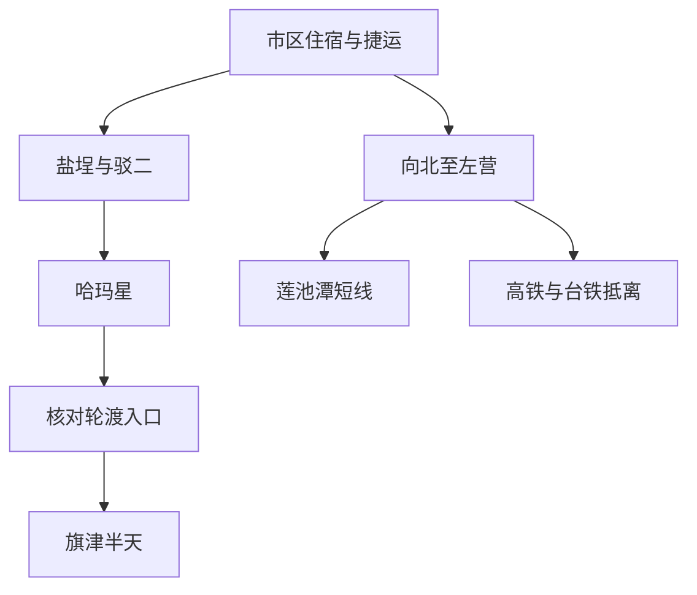
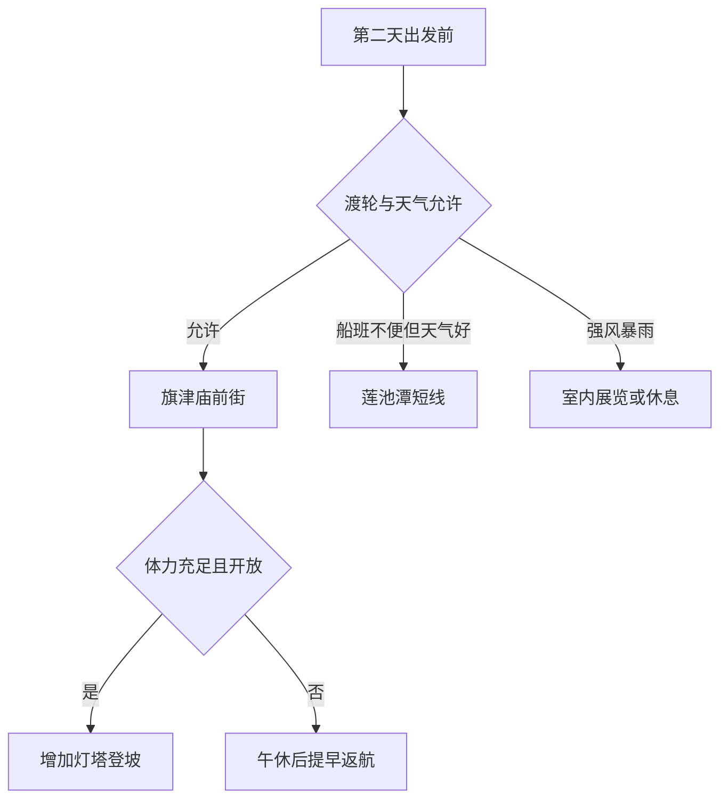

# 高雄旅行指南

高雄是一座向海展开的港口城市，码头、铁路与仓库留下了鲜明的工业印记。驳二的旧仓库成为展览与创作空间，哈玛星保留着铁路记忆，港湾里的渡轮仍连接着旗津与市区。盐埕的老店和街边餐饮延续着港城日常，左营莲池潭畔的庙宇则呈现出另一种生活风景。海港的开阔与老街的细密，共同构成了高雄的性格。

## 城市速览

**首访精选。** 只有一天，选盐埕—驳二—哈玛星，挑一个展览认真看；有第二天且天气稳定，再去旗津短程渡海与看港口；对寺庙和湖岸有兴趣，可用莲池潭替换旗津或另加半天。三者不必同日完成。

| 项目 | 旅行信息 |
|---|---|
| 建议停留 | 港区与旗津 2 天；加左营或内陆方向 3 天以上 |
| 城市尺度 | 捷运与轻轨覆盖多个首访片区，但车站到具体入口仍需步行 |
| 季节与天气 | 凉爽日子适合滨水慢走；夏季高温、台风、强风与雷雨影响渡轮和海岸 |
| 预算特点 | 轨道交通、街区和普通餐饮容易控制；特展、跨区车辆与海鲜点餐会增加支出 |
| 体力 | 港区短段低至中等，旗后山登高为中等，曝晒会放大负担 |
| 本页范围 | 盐埕、驳二、哈玛星、旗津与左营莲池潭；美浓、旗山、茂林和山地路线待补 |

## 城市格局与游览区域

港区适合用轻轨加步行连接，旗津需要渡轮，左营在北侧且与高铁抵离有关。这三个移动单元分开安排，能减少在市区反复转车。

| 区域 | 主要内容 | 游览特点 | 与其他区域的关系 |
|---|---|---|---|
| 盐埕—驳二 | 仓库展览、餐饮、公共艺术 | 展览与街区生活相邻，午间容易找室内停靠 | 可接哈玛星与轻轨港区，不必步行走遍所有仓库 |
| 哈玛星—鼓山渡轮方向 | 铁路旧空间、港口与码头 | 适合看港区如何连接城市 | 与驳二相邻；前往旗津先核实轮渡站实际入口 |
| 旗津 | 渡轮、庙前街、海岸与旗后山 | 半天可做短线，登高与海岸另计体力 | 水上交通受风浪与运营调整影响，不与紧迫离城票硬接 |
| 左营—莲池潭 | 湖岸、庙宇与塔阁景观 | 选择一侧短走，比绕湖一圈更适合首访 | 与左营高铁、新左营台铁站衔接仍需地面交通 |
| 美丽岛—高雄站 | 轨道换乘、住宿与餐饮 | 适合用作两日基地 | 捷运红橘线在美丽岛换乘，到港区再转橘线或轻轨 |

## 主要景点

A 为首访核心，B 为按兴趣补充。表中用时为编辑估计，未含跨区接驳、购票与候船；公共空间免费不代表内部所有展览免费。

| 景点 | 区域 | 类型 | 主要看点 | 建议用时 | 室内外 | 体力 | 预约风险 | 天气影响 | 优先级 |
|---|---|---|---|---|---|---|---|---|---|
| 驳二艺术特区 | 盐埕—鼓山 | 仓库再利用、展览 | 旧仓库尺度、公共艺术及当期展览 | 2–3 小时 | 混合 | 低至中 | 中 | 中 | A |
| 哈玛星铁路文化公共空间 | 鼓山 | 铁路史、街区 | 铁路与港口关系及开放公共空间 | 1–1.5 小时 | 室外为主 | 低至中 | 低 | 高 | B |
| 旗津庙前街与开放海岸短段 | 旗津 | 聚落、海岸 | 渡海抵达的港口视角、天后宫周边生活 | 2–3 小时 | 室外为主 | 中 | 低 | 高 | A |
| 高雄灯塔（旗后灯塔） | 旗津旗后山 | 灯塔、港口眺望 | 从高处辨认港口与外海方向 | 1–1.5 小时，含登坡 | 室外为主 | 中 | 中 | 高 | B |
| 莲池潭风景区选段 | 左营 | 湖岸、宗教建筑 | 湖岸庙宇、塔阁与水面关系 | 1.5–2.5 小时 | 室外为主 | 中 | 低 | 高 | B |
| 盐埕餐饮与港边短走 | 盐埕 | 街区、休息 | 用餐与选一段正式开放滨水空间 | 1–1.5 小时 | 混合 | 低 | 低 | 中 | 路线节点 |

**驳二：挑一场展览，留意仓库本身。** 这里的吸引力是港口建筑获得新的公共用途。选择一个与兴趣相符的展览，再在室外看仓库与轨道空间的关系，通常比购买多张票连续赶场更有收获。官方列出周一至周四 10:00–18:00、周五至周日及假日 10:00–20:00 的常规时间，除夕休馆；售票、单展与活动可能另有截止时间。[驳二票务与时间](https://en.pier2.org/ticket/)。

**旗津：先享受渡海，再决定登高。** 庙前街适合午餐和认识聚落，海岸只走开放短段就能感受港内外的不同。灯塔位于旗后山，不能按平地街区的体力估算；旅游网列示灯塔园区开放至晚间，但天气、现场管制与回程船班比看日落更优先。灯塔建筑内部与整个园区也不是同一开放范围。[高雄灯塔官方介绍](https://khh.travel/zh-cn/attractions/detail/119/)。

**莲池潭：按一侧游览，不预设所有塔阁都能登。** 这里适合从庙宇与湖面的空间关系认识左营。先挑一至两处外观和湖岸停留，具体塔阁是否开放及内部台阶现场确认；绕湖不是默认必做项目。[莲池潭官方介绍](https://khh.travel/zh-tw/attractions/detail/11/)。

哈玛星的公共空间与营运铁路、港务作业区须分开。只走标识开放道路，不跨围栏进入轨道、码头或施工区；沿水步道是否连通以现场为准。

## 美食与餐饮

港区游览可以把盐埕作为有座位的午餐基地，旗津则适合把海鲜与庙前街小吃放进半日安排。海鲜更适合共享，独行者选择明确标价的单人饭面与小份料理，容易控制分量。官方港市路线也将旗津庙前路作为小吃与海产餐饮集中区。[高雄旅游网港市路线](https://khh.travel/zh-cn/travel/tour/151/)。

| 菜品或餐饮类型 | 常见区域 | 一个人用餐与常见份量 | 风味、过敏原与饮食限制 | 排队风险与替代方法 |
|---|---|---|---|---|
| 鸭肉饭、米粉汤等饭面 | 盐埕与居民街区 | 小份主食加汤便于独食 | 肉汤、酱料及共锅情况逐店确认 | 选同街区有座位店，避免中午连续排两家 |
| 海鲜与合菜 | 旗津庙前街一带 | 多人共享较合适；单人先问小份 | 鱼、甲壳类、贝类过敏原，明确全熟需求 | 点餐前确认单价、计重单位、重量与料理费 |
| 小吃与甜品 | 盐埕、旗津、市区夜市 | 可分两次少量吃，安排一餐完整正餐 | 花生、乳品、蛋与小麦可能存在于配料 | 长队时改普通饭店；甜品休息以座位为先 |
| 素菜与普通简餐 | 市区商业及居民区 | 适合避开海鲜合菜的旅行者 | 说明是否接受蛋奶、葱蒜与肉汤 | 出岛前确定可接受店铺，不默认海鲜店都有素食 |

## 经典行程

以下为正文行程与时段建议，不是已计算的导航路线；两天均以市区住宿为起点。

### 两日主线：仓库与海港

| 日程 | 上午 | 午餐与休息 | 下午与傍晚 | 锚点、删减与退出 |
|---|---|---|---|---|
| 第一天：盐埕与驳二 | 10:00 前后进入已确认开放的展览；有预约票时按票面时段安排 | 12:00–14:00 盐埕午餐与室内长休 | 驳二室外选段，随后哈玛星；轻轨或捷运返程 | 单展票与最晚入场是锚点。晚到删哈玛星，疲累从最近开放车站退出 |
| 第二天：渡海到旗津 | 09:00 左右先查航班与轮渡入口，乘船后走庙前街；体力好且开放时再上旗后山 | 旗津午餐与至少一小时坐下休息 | 海岸短走后提早返市区，留候船余量 | 渡轮当日运营是前提。先删灯塔登坡，再删海岸；不把末班船作为目标 |

2026-09-06 核验时，高雄轮船官网标注**鼓山轮渡站建筑整建中**，并公布替代联系电话。该提示不等于整条航线停航，也不能据旧地图保证原入口可用；出发当天从官网确认实际候船位置、航班及停航公告。[高雄轮船官网](https://kcs.kcg.gov.tw/)。

### 替换半天：左营湖岸

不想乘船或天气不适合海岸时，可在天气允许的情况下选莲池潭一侧短走；强风暴雨时莲池潭也不是安全的室内替代，应改为已确认开放的室内展览。离城当天前往莲池潭须先处理行李，并按实际接驳倒推返站时间，不能把湖岸当作高铁站站前广场。

## 住宿区域

| 区域 | 优点 | 缺点 | 适合人群 | 交通特点 |
|---|---|---|---|---|
| 美丽岛—高雄站 | 换乘与餐饮选择多 | 临主路可能嘈杂 | 首访、多方向游览 | 红橘线连接港区与机场，核对电梯出口 |
| 盐埕—驳二 | 步行可进入港区主线 | 到左营和机场仍需转乘 | 展览、港区两日游 | 捷运橘线及轻轨可搭配使用 |
| 左营高铁周边 | 适合早班高铁与北侧路线 | 到驳二、旗津更远 | 晚到早走 | 高铁左营与台铁新左营相接，台铁左营站另在不同位置 |
| 旗津 | 可清早看聚落与海岸 | 返市区受船班影响 | 慢游且留出天气弹性 | 先确认晚间交通与次日离开方案 |

## 市内交通

| 场景 | 旅行者需要知道的结构 | 需要重新核对的内容 |
|---|---|---|
| 高铁与台铁 | 高铁左营、台铁新左营形成换乘枢纽；高雄站服务市区铁路抵离 | 列车停靠、实际站名、转乘余量与行李 |
| 机场 | 高雄国际机场可接捷运红线 | 航站楼、首末班、夜间备用交通 |
| 捷运 | 红橘线在美丽岛换乘，港区常用橘线盐埕埔与哈玛星方向 | 运营方当日线路图、出口与电梯；旧资料中的西子湾站名与当前哈玛星名称需对应 |
| 轻轨 | 港区有真爱码头、驳二大义、驳二蓬莱、哈玛星等站 | 行车方向、付款与换乘规则；平交道只走指定通道 |
| 旗津渡轮 | 鼓山—旗津与栈贰库—旗津属于不同航线，不能混用班次 | 实际候船点、票价、可用票证、风浪停航与最后回程 |
| 步行与短程用车 | 片区内部短走，跨港区或低体力移动可搭车 | 路段开放、遮阴、合法上客点与过街方式 |

捷运运营方页面提供各站与轻轨站序，适合临行核对。高雄轮船 2026 年页面已出现电子票证收费调整公告，预算时应读取当前票价，不沿用旧攻略的刷卡优惠。[捷运各站信息](https://www.krtc.com.tw/Guide/station_guide)；[轻轨运营图](https://www.krtc.com.tw/KLRT/guide_map)；[轮船票务入口](https://kcs.kcg.gov.tw/)。

## 不同旅行者须知

| 旅行维度 | 可行条件 | 主要取舍 | 需额外核对 |
|---|---|---|---|
| 独行 | 港区轨道交通加小份饭面 | 海鲜合菜容易超量 | 标价与回程交通 |
| 亲子 | 驳二选一场展览，旗津先走平地 | 连续登坡与曝晒可删 | 展览年龄规则、童车与登船条件 |
| 长者与低体力 | 用轻轨缩短步行，固定午休 | 不默认登灯塔或绕莲池潭 | 实际入口、座位与候船时长 |
| 无障碍需求 | 联系车站、展馆及轮船确认协助 | 站点有电梯不代表整段行程连续可达 | 登船坡度、施工绕行、厕所与替代出口 |
| 摄影 | 港区公共空间、湖岸与正式开放灯塔园区 | 不进入作业港区或轨道 | 三脚架、商业摄影及现场禁拍标识 |
| 高温、风雨 | 室外留早晚，中午室内休息 | 强风时取消渡海和登高 | 气象预警、航班与场馆公告 |

## 行前核对

| 核对事项 | 为什么需要重查 | 建议核对时间 | 官方入口 |
|---|---|---|---|
| 驳二展览与票务 | 单展、活动与园区时间不完全相同 | 订行程及前一天 | [驳二](https://en.pier2.org/ticket/) |
| 轮渡站与船班 | 鼓山站整建、票制调整及天气影响 | 前一天与出发当天 | [高雄轮船](https://kcs.kcg.gov.tw/) |
| 捷运与轻轨 | 站名、出口、行车与设备维修会变化 | 每次移动前 | [高雄捷运](https://www.krtc.com.tw/Guide/station_guide) |
| 灯塔与湖岸 | 各设施开放不同，强风雷雨不适合登高与临水 | 当天 | [高雄旅游网](https://khh.travel/zh-cn/attractions/detail/119/)；[中央气象署](https://www.cwa.gov.tw/) |
| 入境与旅行证件 | 大陆、港澳居民与外国护照持有人适用条件不同；从哪里出发亦影响办理 | 购买不可退票前及出发前 | [台湾总览](README.md)的身份分流与官方核查入口 |

## 来源与更新记录

| 来源 | 类型 | 支持内容 | 核验日期 |
|---|---|---|---|
| [驳二票务与开放时间](https://en.pier2.org/ticket/) | 园区运营方 | 常规开放、票务与除夕休馆 | 2026-09-06 |
| [高雄旅游网无障碍港市路线](https://khh.travel/zh-cn/travel/tour/151/) | 市政府旅游资料 | 港区节点关系与旗津餐饮场景；不外推为全程无障碍保证 | 2026-09-06 |
| [高雄灯塔](https://khh.travel/zh-cn/attractions/detail/119/) | 市政府旅游资料 | 灯塔位置、港口眺望与园区开放资料 | 2026-09-06 |
| [莲池潭风景区](https://khh.travel/zh-tw/attractions/detail/11/) | 市政府旅游资料 | 左营湖岸与庙宇空间 | 2026-09-06 |
| [高雄捷运各站](https://www.krtc.com.tw/Guide/station_guide)；[轻轨图](https://www.krtc.com.tw/KLRT/guide_map) | 交通运营方 | 捷运、轻轨车站与换乘查询 | 2026-09-06 |
| [高雄轮船](https://kcs.kcg.gov.tw/) | 交通运营方 | 航线、2026 票务调整与鼓山轮渡站整建提示 | 2026-09-06 |
| [高雄交通局轮船说明](https://www.tbkc.gov.tw/Service/PublicTransport/ship?id=eff9b637-d56f-4817-bc2f-e140465e1876) | 交通主管部门 | 鼓山、前镇及栈贰库航线区分、当前运营方入口 | 2026-09-06 |

2026-09-06：首次完成港区、旗津与莲池潭代表性攻略，核验官方网页及官方搜索正文。高雄轮船官网直接打开有技术读取错误，搜索已返回更新日期为 2026-09-01 的官方正文及整建提示；不据此承诺出行当天码头或航班状态。未核定单店营业、各塔阁内部通行、连续无障碍路线、美浓旗山与山地行程。城市 GeoNames ID 沿用项目库存；用时、优先级、饮食取舍与线路为资料基础上的编辑判断，非亲历记录。
