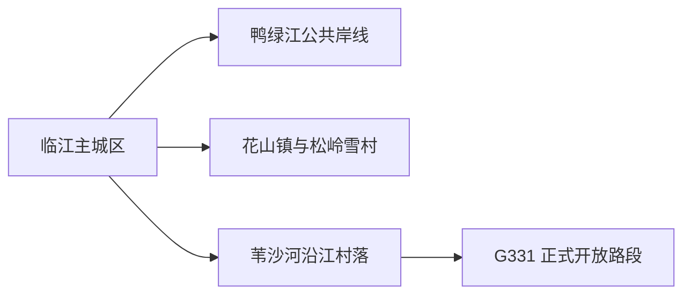
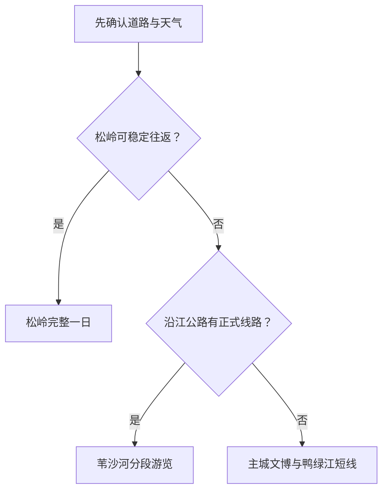

# 临江旅行指南

临江沿鸭绿江展开，适合把边境城市生活、鸭绿江公路风景、松岭雪村和东北山地季节景观组合成慢节奏旅行。第一次到访可住在主城区，用一天认识城市与江岸，再按路况和季节选择松岭或 G331 沿江方向。

## 城市速览

| 项目 | 信息 |
|---|---|
| 旅行主线 | 鸭绿江主城、边境历史、松岭雪村、花山—苇沙河沿江村落 |
| 建议停留 | 1 天主城；2 天加入松岭；3 天再选一段 G331 正式开放线路 |
| 住宿基地 | 主城区适合公共交通和补给；松岭及沿江村落住宿用于已确认的季节行程 |
| 步行强度 | 主城低至中等；雪村与山地中至高，冰雪期体力和防滑要求上升 |
| 主要天气 | 严寒、暴雪、结冰、浓雾、夏季强降雨与山地道路中断 |
| 预约核心 | 松岭住宿与接待、沿江活动、边境路段、场馆与返程车辆 |
| 亲子 | 主城江岸短线、正式文化场馆和接待明确的雪村活动 |
| 低体力 | 主城车辆串联；山地仅选择靠近落客点的短段 |
| 边界重点 | 边境设施、林区作业路、江面冰层和灾后施工路段按管理要求使用 |
| 无障碍 | 设施连续性需向官方确认，重点核对冰雪路面、坡道、卫生间与车辆落客 |

## 城市格局与游览区域

临江市是白山市代管的县级市，法定代码 `220681`。GeoNames `2036069` 是临江城市点，Wikidata `Q594843` 代表法定临江市，`P1566` 同时记录 `2036069` 与较广行政记录 `6587809`。城市点适合定位主城，市域和边境管理范围以法定区划与属地公告为准。

| 区域 | 旅行价值 | 怎么安排 |
|---|---|---|
| 临江主城区 | 到达、住宿、补给、城市历史与鸭绿江公共空间 | 抵达日或完整半日 |
| 花山—松岭 | 传统村落、摄影、森林与冬季雪景 | 路况和接待明确时留一整天 |
| 苇沙河—大栗子方向 | 鸭绿江村落、边境公路景观与地方饮食 | 采用正式线路或可靠包车，分段游览 |
| 老岭山地 | 森林、冬季与山地景观 | 只进入正式接待区域，按天气缩短 |

## 主要景点

### 主城与鸭绿江

| 景点 | 所在区域 | 类型 | 核心看点 | 建议用时 | 室内/室外 | 体力 | 预约难度 | 天气敏感度 | 适合旅程 |
|---|---|---|---|---|---|---|---|---|---|
| 临江城市公共文化场馆 | 主城区 | 地方史与公共文化 | 边境城市发展、鸭绿江流域与当期展陈 | 1–2 小时 | 室内 | 低 | 中 | 低 | A |
| 鸭绿江公共岸线短段 | 主城区 | 城市滨水空间 | 江河、对岸地景与边境城市尺度 | 1–2 小时 | 室外 | 低 | 低 | 高 | A |
| 四保临江战役相关公开纪念点 | 主城区 | 近现代史 | 东北解放战争历史与城市记忆 | 1–2 小时 | 混合 | 低至中 | 中 | 中 | B |

### 松岭与沿江方向

| 景点 | 所在区域 | 类型 | 核心看点 | 建议用时 | 室内/室外 | 体力 | 预约难度 | 天气敏感度 | 适合旅程 |
|---|---|---|---|---|---|---|---|---|---|
| 松岭雪村正式接待区 | 花山镇珍珠村 | 传统村落与冰雪 | 山村格局、冬季雪景、摄影与季节生活 | 4–8 小时 | 室外为主 | 中至高 | 高 | 极高 | A |
| 白马浪观景公共区 | 苇沙河方向 | 鸭绿江观景 | 沿江地形、村落与边境公路景观 | 1–2 小时 | 室外 | 中 | 中 | 极高 | B |
| 苇沙河村正式接待点 | 苇沙河镇 | 乡村与饮食 | 鸭绿江鱼宴传统和沿江村落生活 | 2–3 小时 | 混合 | 低至中 | 高 | 高 | B |
| 大栗子村公开乡村项目 | 大栗子方向 | 乡村与季节农业 | 草莓等季节农产与村落景观 | 2–3 小时 | 室外为主 | 中 | 高 | 高 | C |

沿江观景只使用公共道路、正式观景台和明确接待空间。口岸、边防设施、对岸军事或生产区域、江面自然冰层和林业作业路保持原有管理用途；摄影与无人机规则以边境管理公告为准。

## 美食与餐饮

| 类型 | 适合场景 | 份量 | 过敏与饮食提示 | 怎么选 |
|---|---|---|---|---|
| 鸭绿江全鱼宴 | 沿江村落或多人正餐 | 多为共享菜 | 鱼刺、水产过敏、酱油与共锅 | 先问鱼种、来源、重量和做法，独行选单品 |
| 东北炖菜与山野菜 | 主城正餐 | 通常偏大 | 肉类、豆制品、菌菇及高盐 | 两人以上分享；野生菌与野菜选正规来源 |
| 朝鲜族风味冷面与拌菜 | 主城简餐 | 一人份方便 | 小麦、荞麦、芝麻、花生与辣椒 | 过敏者逐项询问面汤和拌料 |
| 草莓等季节农产 | 大栗子等乡村方向 | 按盒或重量 | 清洗、冷链与采摘规则 | 只参加经营主体明确的采摘或销售项目 |

## 经典行程

### 一日经典路线

**路线**：主城公共文化场馆 → 午餐 → 鸭绿江公共岸线短段 → 城市纪念点

- **串联逻辑**：所有内容位于主城区，用地方史和江河空间建立对临江的整体认识。
- **预约锚点**：场馆开放、讲解和纪念点接待。
- **休息安排**：午餐长休，岸线只走靠近主城服务设施的一段。
- **时间不足时**：保留场馆与鸭绿江公共岸线。

### 两日城市路线

**第 1 天**：临江主城区 
**第 2 天**：松岭雪村正式接待区

- **串联逻辑**：主城与山村分日，避免在天气变化时跨多个远点。
- **预约锚点**：松岭道路、住宿、车辆、开放区和返程。
- **休息安排**：雪村使用已确认的游客接待点取暖、用餐和如厕。
- **时间不足时**：删除第二日，完整保留主城。

### 三日深度路线

**第 1 天**：临江主城区 
**第 2 天**：松岭雪村 
**第 3 天**：苇沙河—白马浪正式观景线

- **串联逻辑**：城市、山村和沿江公路分别成日，减少山路折返。
- **预约锚点**：第三日车辆、道路施工、边境管理和接待点。
- **休息安排**：苇沙河正规餐饮或游客服务点安排午休。
- **时间不足时**：优先删除第三日。

### 雨雪天气路线

**路线**：主城室内场馆 → 午餐 → 近距离纪念点或住宿休息

- **适用条件**：普通降雪且城市道路正常；暴雪、冻雨或道路预警时按官方提示调整。
- **串联逻辑**：压缩在主城，使用短程车辆连接。
- **预约锚点**：场馆、城市道路与公共交通公告。
- **休息安排**：以室内场馆和餐饮为固定休息点。
- **时间不足时**：只保留一处室内场馆。

### 亲子路线

**路线**：主城公共文化场馆 → 午餐 → 鸭绿江公共岸线短段

- **适用条件**：选择有护栏、照明和卫生间的公共区域。
- **串联逻辑**：室内学习和短距离户外观察交替，便于随时结束。
- **预约锚点**：亲子活动、推车和场馆规则。
- **休息安排**：午餐长休，岸线控制在一小时左右。
- **时间不足时**：保留室内场馆。

### 低体力路线

**路线**：车辆到达主城场馆 → 午餐长休 → 靠近落客点的鸭绿江观景段

- **适用条件**：道路无积雪结冰，落客和座椅条件已确认。
- **串联逻辑**：两处主城点位用车辆连接，减少坡道和久站。
- **预约锚点**：无障碍入口、轮椅、卫生间和落客点。
- **休息安排**：每处只看核心内容，下午随时返回住宿。
- **时间不足时**：只留场馆。

### 松岭季节路线

**路线**：临江出发 → 松岭接待点 → 村落公开步行段 → 取暖与用餐 → 原路返回

- **适用条件**：道路、天气、住宿或一日接待和返程均已确认。
- **串联逻辑**：围绕单一村落展开，不叠加沿江远点。
- **预约锚点**：车辆、防滑装备、摄影活动、用餐和返程。
- **休息安排**：每段户外活动之间进入有供暖的正式接待点。
- **时间不足时**：整段删除，改走主城线。

## 住宿区域

| 区域 | 优点 | 取舍 | 适合人群 | 核对项 |
|---|---|---|---|---|
| 临江主城区 | 餐饮、补给、叫车和临时改线方便 | 到松岭和沿江远点仍需车辆 | 首访、公共交通、多日旅行 | 夜间入住、供暖、停车、早餐 |
| 松岭正规接待住宿 | 便于看雪景、晨昏和村落生活 | 冬季道路、供暖、隔音和退改差异大 | 摄影、冰雪、已锁定车辆者 | 合法经营、供暖、热水、消防、返程 |
| 沿江乡村正规住宿 | 便于分段走 G331 | 服务密度低，边境与天气变化影响较大 | 自驾或包车慢游 | 证照、通信、餐食、停车、边境规则 |

## 市内交通

临江对外以铁路和公路为主，主城区可用公交、出租车和短段步行。松岭、苇沙河与 G331 沿线更依赖自驾、正规包车或当期旅游线路。路程判断优先使用施工、降雪和边境管理信息，而不是地图上的静态时间。

| 场景 | 怎么做 | 行前核对 |
|---|---|---|
| 铁路抵达 | 按票面完整站名抵达临江，再转主城住宿 | 车次、晚点、站前接驳 |
| 主城移动 | 公交或短程车辆连接场馆与江岸 | 首末班、积雪、施工 |
| 前往松岭 | 使用已确认车辆，冬季预留明显余量 | 路况、防滑链、封闭、返程 |
| G331 沿江线 | 每天只选一个方向，使用正式道路和观景点 | 半幅施工、边境管理、加油与通信 |

## 不同旅行者须知

| 旅行者 | 推荐做法 | 重点核对 |
|---|---|---|
| 独行 | 住主城，远线加入正规小团或可靠包车 | 司机资质、返程、通信与夜间到店 |
| 亲子 | 主城场馆加短江岸，雪村只参加年龄明确项目 | 防寒、护栏、儿童座椅、卫生间 |
| 长者与低体力 | 主城车辆串联，远线按落客与供暖条件决定 | 坡道、冰面、轮椅、座椅与医疗点 |
| 摄影 | 松岭与沿江分日，使用公共拍摄位 | 无人机、边境摄影、三脚架与低温电池 |
| 冬季旅行 | 预留机动日并选可退改住宿交通 | 暴雪、冻雨、道路封闭、供暖与救援 |

## 行前核对

- 临江市与吉林省文旅部门：松岭、沿江村落、活动和道路动态。
- 吉林省交通与交警：G331、白临高速施工影响、冰雪路况和临时管制。
- 中国铁路 12306：临江方向列车、完整站名和退改。
- 吉林省气象：暴雪、寒潮、大雾、强降雨和地质风险。
- 国家移民管理局及属地边境管理部门：边境通行、摄影和口岸规则。

## 来源与更新记录

| 来源 | 支持内容 | 核验日期 |
|---|---|---|
| [临江市人民政府](https://www.linjiang.gov.cn/) | 市情、交通、文旅与动态入口 | 2026-08-30 |
| [吉林省文旅厅：临江市旅游线路](https://whhlyt.jl.gov.cn/ztzl/jlslyxlhxj/gdxl/bss/ljs/202507/t20250709_9276745.html) | 松岭、沿江村落、G331 与施工风险 | 2026-08-30 |
| [吉林省政府：松岭雪村](https://www.jl.gov.cn/yaowen/202606/t20260603_3634889.html) | 松岭属地、四季景观与接待规模 | 2026-08-30 |
| [吉林省交通运输厅：松岭旅游公路](https://jtyst.jl.gov.cn/glj/ggl_7645/201910/t20191010_6108174.html) | 花山镇、松岭位置与公路联系 | 2026-08-30 |
| [Wikidata Q594843](https://www.wikidata.org/wiki/Q594843) | 法定临江市、代码与 GeoNames 双记录 | 2026-08-30 |
| [GeoNames 2036069](https://www.geonames.org/2036069/) | 固定临江城市点、别名与坐标 | 2026-08-30 |
| [中国铁路 12306](https://www.12306.cn/) | 列车、站名与购票动态 | 2026-08-30 |

| 日期 | 更新 |
|---|---|
| 2026-08-30 | 首次完成主城、松岭雪村、鸭绿江沿线、冰雪与边境旅行研究。 |
