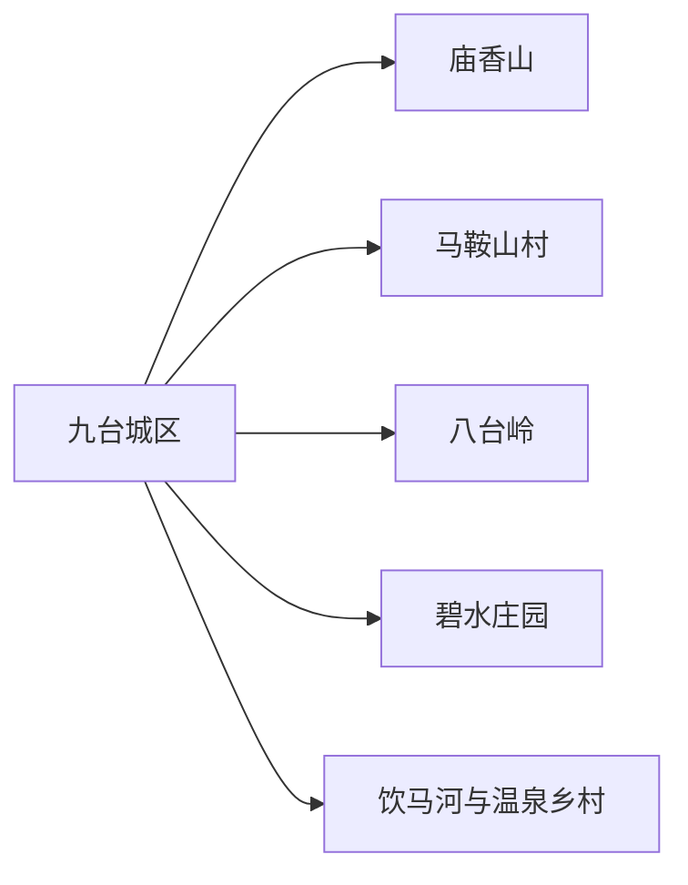
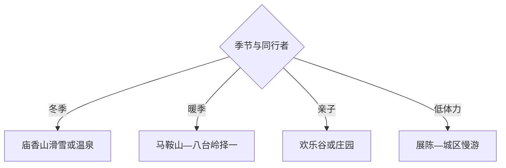

# 九台旅行指南

九台适合做长春东北方向的冰雪、温泉与乡村短途：庙香山承担冬季滑雪和四季山地体验，马鞍山村适合红色教育与乡村休闲，八台岭、碧水庄园和饮马河沿线用于暖季户外。一天可选一个主题，两天再组合城区与乡村。

## 城市速览

| 项目 | 信息 |
|---|---|
| 主线 | 九台城区—庙香山—马鞍山村—八台岭—饮马河乡村 |
| 停留 | 单主题1天；冰雪或乡村组合2天 |
| 住宿 | 九台城区交通餐饮稳定，庙香山周边适合滑雪温泉，乡村住宿需预约 |
| 交通 | 从长春乘铁路或公路进入，远点用公交、景区接驳、预约车或自驾 |
| 风险 | 冬季低温冰雪、滑雪项目规则、春融泥泞、林地防火和乡道 |
| 边界 | 雪道运营区、设备后台、林地封控段、农业生产区和村民私域按开放范围进入 |

## 城市格局与游览区域

固定 `Jiutai / GeoNames 2036401` 对应九台主城，本页以法定九台区 `Q1015907` 组织。景点分散在城区外，一天选庙香山或一条乡村线更稳妥；冬季把换装、租具和返程计入时间。

## 主要景点

| 景点 | 区域 | 类型 | 核心体验 | 用时 | 环境 | 体力 | 预约风险 | 天气影响 | 优先级 |
|---|---|---|---|---:|---|---|---|---|---|
| 庙香山温泉滑雪度假区 | 波泥河方向 | 冰雪与度假 | 滑雪、山地活动与温泉配套 | 半日至1天 | 室外为主 | 中高 | 极高 | 极高 | A |
| 马鞍山村 | 土们岭方向 | 乡村与红色文化 | 村史、红色教育与山野休闲 | 3–6小时 | 室内外 | 中 | 高 | 很高 | A |
| 八台岭生态旅游公开区 | 沐石河方向 | 山地生态 | 林地步道与季节山景 | 半日至1天 | 室外 | 高 | 高 | 极高 | B |
| 九台区博物馆或地方展陈 | 城区 | 地方文博 | 区史、农耕与民俗认知 | 1.5–3小时 | 室内 | 低 | 很高 | 低 | A |
| 碧水庄园当期开放区 | 波泥河方向 | 乡村度假 | 园林、亲子与休闲项目 | 3–6小时 | 室内外 | 低中 | 很高 | 很高 | B |
| 氿遇欢乐谷正规项目区 | 区内 | 亲子娱乐 | 季节游乐与家庭活动 | 3–6小时 | 室外为主 | 中 | 极高 | 极高 | B |
| 饮马河公开滨水空间 | 饮马河沿线 | 河谷乡村 | 河岸景观与乡村慢游 | 2–4小时 | 室外 | 低中 | 中 | 很高 | C |
| 波泥河花卉与苗木正规接待点 | 波泥河镇 | 农旅 | 花木产业、季节观赏与采买 | 2–4小时 | 室外 | 低中 | 高 | 很高 | C |

## 美食与餐饮

城区可选东北炖菜、锅包肉、黏豆包、酸菜白肉和烧烤，乡村点可尝山野菜与农家菜。冬季滑雪前选易消化餐食，饮酒与滑雪、驾车分开；山野菜按正规餐馆与可食用品种选择。

## 经典行程

### 一日经典线
**路线**：区级展陈—马鞍山村—城区晚餐。**逻辑**：先理解九台，再进入成熟乡村点。**预约锚点**：展馆与村内活动。**休息**：马鞍山接待点。**删除条件**：雨雪时只留室内。

### 两日四季线
**路线**：首日城区—马鞍山；次日庙香山。**逻辑**：乡村文化与大型度假区分日。**预约锚点**：滑雪、温泉、住宿与接驳。**休息**：城区或度假区。**删除条件**：雪况或设备调整时改八台岭公开线。

### 冰雪线
**路线**：庙香山租具—分级雪道—休息—温泉或返程。**逻辑**：以技能等级选择项目。**预约锚点**：雪况、雪票、教练、装备和保险。**休息**：雪具大厅。**删除条件**：大风、极寒或设备停运时取消。

### 乡村红色线
**路线**：马鞍山村史馆—红色教育点—乡村午餐—公开步道。**逻辑**：资料与村落空间结合。**预约锚点**：讲解与团体接待。**休息**：村内服务点。**删除条件**：活动停开时缩为半日。

### 亲子线
**路线**：氿遇欢乐谷或碧水庄园二选一—午休—城区。**逻辑**：围绕单个成熟经营项目安排。**预约锚点**：年龄、身高、票务与开放项目。**休息**：园区。**删除条件**：雷雨或低温时取消户外设施。

### 暖季山地线
**路线**：八台岭公开入口—选定步道—原路返程。**逻辑**：控制山地距离与折返点。**预约锚点**：开放、林火、轨迹和返程。**休息**：游客接待点。**删除条件**：雨后湿滑或封山时取消。

### 低体力线
**路线**：区级展陈—车辆游马鞍山核心区—城区餐饮。**逻辑**：以室内和落客点减少长走。**预约锚点**：无障碍与座椅。**休息**：展馆。**删除条件**：乡道结冰时留在城区。

## 住宿区域

九台城区适合铁路、公路与多方向换线；庙香山周边适合滑雪温泉；马鞍山等乡村住宿适合暖季慢游。预订时确认供暖、热水、雪具存放、停车、消防与恶劣天气退改。

## 市内交通

从长春到九台可比较铁路与公路总耗时。城区外景点方向不同，公共交通班次有限，景区接驳或预约车更易控制返程；冬季自驾准备适配轮胎和除冰用品，避免夜间走陌生乡道。

## 不同旅行者须知

滑雪者按能力选雪道和教练；亲子家庭选择单一园区；乡村旅行者提前预约用餐；低体力者留在城区和村庄核心。雪道维护区、索道设备区、未开放林道、苗木生产区和村民院落保留明确限制。

## 行前核对

- 核对庙香山雪况、雪道、温泉、租具、教练与接驳。
- 核对展馆、乡村点、八台岭及亲子项目开放，冬季道路和极端低温。
- 山地遵守林火和封控信息，农业点按经营区参观，返程时间在天黑前锁定。

## 来源与更新记录

| 来源 | 支持内容 | 核验日期 |
|---|---|---|
| [吉林省文旅厅：九台旅游线路](https://whhlyt.jl.gov.cn/ztzl/jlslyxlhxj/gdxl/zcs/jtq/202507/t20250704_9272990.html) | 庙香山、马鞍山与八台岭四季旅游 | 2026-09-01 |
| [吉林省政府：九台文旅发展](https://www.jl.gov.cn/yaowen/202407/t20240724_3266831.html) | 庙香山冰雪温泉、马鞍山与欢乐谷 | 2026-09-01 |
| [GeoNames 2036401](https://www.geonames.org/2036401/) | Jiutai 固定主城点 | 2026-09-01 |
| [Wikidata Q1015907](https://www.wikidata.org/wiki/Q1015907) | 九台区实体与跨库标识 | 2026-09-01 |

| 日期 | 更新 |
|---|---|
| 2026-09-01 | 首次完成九台旅行研究，按冰雪温泉、乡村红色与暖季山地组织。 |
