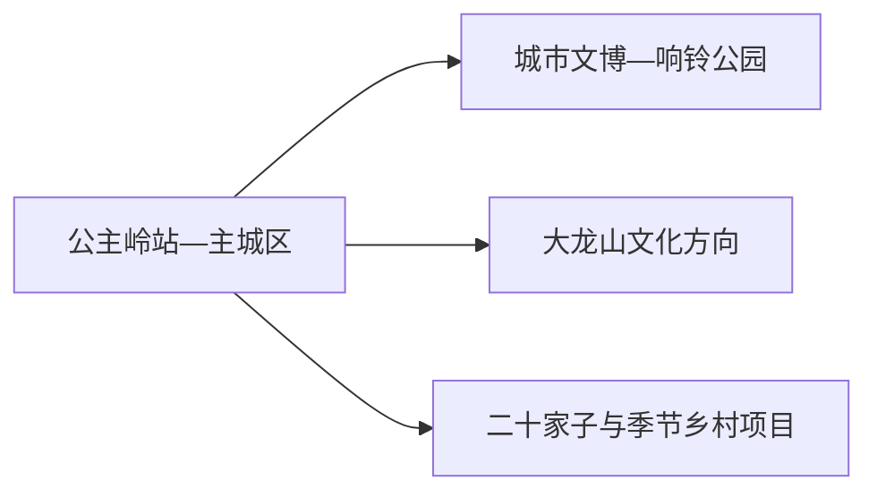
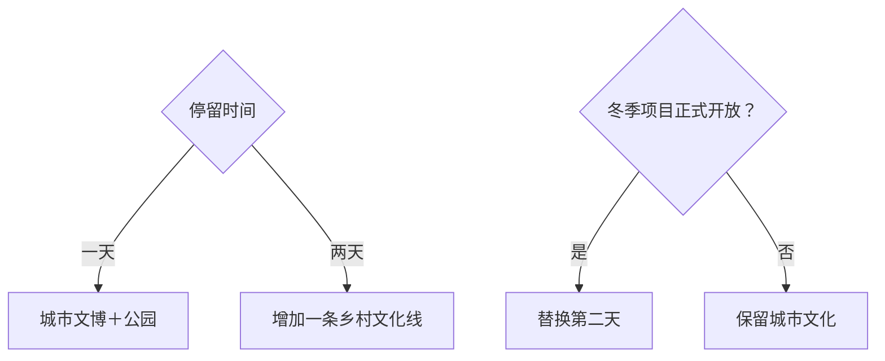

# 公主岭旅行指南

公主岭是一座以近代城市史、农业文化和松辽平原景观见长的县级市。首日从城市文博、响铃公园和于凤至故居等线索认识城市；第二天按季节选择大龙山文化园、二十家子满族镇或明确开放的乡村冰雪项目。

> 建议停留：1–2 天 
> 旅行关键词：农业文化、近代城市、于凤至、松辽平原、乡村季节体验 
> 主要体力：城区低至中等；远线以车辆衔接 
> 最近研究：2026-08-12

## 城市速览

| 项目 | 旅行信息 |
|---|---|
| 主要旅行价值 | 用地方文博、人物故居与农业县域理解长春都市圈西南侧的平原城市 |
| 建议停留 | 1 天城市核心；2 天增加一个正式开放的乡村或文化园方向 |
| 较舒适季节 | 春秋适合城市与乡村；冬季按冰雪运营和严寒条件选择 |
| 预算特点 | 城区平实，远线车辆和季节项目增加预算 |
| 步行强度 | 城区低，公园与乡村可按体力缩短 |
| 主要天气风险 | 严寒、积雪结冰、大风、雷雨、高温和农田道路 |
| 独行旅行 | 城区易安排，远线先确认返程 |
| 亲子旅行 | 农业、地方历史和公园适合轻量体验 |
| 长者与低体力旅行 | 场馆加公园短段，车辆连接第二点 |
| 无障碍信息 | 现代场馆可先询问；故居、乡村与冰雪场地的设施连续性需向官方确认 |

## 城市格局与游览区域

公主岭主城区承担铁路、住宿、餐饮与公共文化；大龙山、二十家子等乡镇方向适合第二日车辆往返。公主岭自 2020 年起由长春市代管，但仍是代码独立的县级市，旅行内容不并入长春主城。

| 区域 | 主要内容 | 游览特点 | 与其他区域的关系 |
|---|---|---|---|
| 主城区 | 城市文博、故居、公园、餐饮住宿 | 紧凑，适合一日 | 是远线交通基地 |
| 大龙山方向 | 文化园、乡村与季节活动 | 先确认开放和接待 | 适合半日至一日 |
| 二十家子等乡镇 | 民族文化、农业与冰雪项目 | 季节性和车辆依赖明显 | 第二天只选一条方向 |
| 长春联程 | 高铁／铁路与公路连接 | 行政代管不等于同城步行 | 分开计算住宿与返程 |

GeoNames `2037222` 与 Wikidata `Q1207108` 的 `P1566` 精确对应公主岭，法定代码 `220184`。页面按县级公主岭市组织；长春中心城区、四平及周边县市另作跨城安排。

## 主要景点

### 城市核心

| 景点 | 区域 | 类型 | 主要看点 | 建议用时 | 室内外 | 体力 | 预约风险 | 天气影响 | 优先级 |
|---|---|---|---|---:|---|---|---|---|---|
| 公主岭市博物馆／正式地方展馆 | 主城区 | 地方文博 | 城市沿革、农业与地方历史 | 1.5–2.5 小时 | 室内 | 低 | 高；具体馆舍与开放需核 | 低 | A |
| 于凤至故居 | 主城区 | 名人故居 | 近代人物、家庭与城市历史 | 1–1.5 小时 | 混合 | 低 | 高；开放和讲解需核 | 中 | B |
| 响铃公园 | 主城区 | 城市公园 | 城市休闲、绿地与地方记忆 | 1–2 小时 | 室外 | 低 | 低；活动需核 | 高 | B |

### 市域方向

| 景点 | 区域 | 类型 | 主要看点 | 建议用时 | 室内外 | 体力 | 预约风险 | 天气影响 | 优先级 |
|---|---|---|---|---:|---|---|---|---|---|
| 大龙山文化园等正式开放项目 | 大龙山方向 | 文化园、乡村 | 地方文化与季节活动 | 2–4 小时 | 混合 | 中 | 高；运营与接待需核 | 高 | B |
| 二十家子满族镇正式开放文化点 | 二十家子 | 民族文化、乡村 | 满族文化与村镇生活 | 2–4 小时 | 混合 | 中 | 高；接待与活动需核 | 高 | C |
| 当期正式运营冰雪项目 | 市域乡村 | 冰雪、季节活动 | 冰雪娱乐与乡村冬景 | 3–5 小时 | 室外 | 中高 | 高；运营、保险和天气需核 | 极高 | C |

农业示范区、农田和加工场所以生产为主，旅行采用官方活动、研学或公开接待入口。季节冰雪项目只在运营方明确开放、保险和救援条件完整时加入路线。

## 美食与餐饮

| 菜品或餐饮类型 | 常见区域 | 一个人用餐与常见份量 | 风味、过敏原与饮食限制 | 排队风险与替代方法 |
|---|---|---|---|---|
| 东北炖菜与铁锅菜 | 主城区 | 多人共享，一人问小锅 | 肉类、大豆、粉条与盐分 | 选套餐或小份家常菜 |
| 玉米、粘豆包等主食 | 市场、早餐店 | 可少量购买 | 糯米、豆馅和糖 | 选现制小份 |
| 锅包肉与熘炒菜 | 主城区 | 份量偏大 | 小麦、淀粉、糖、油 | 多人共享或换盖饭 |
| 酸菜、豆制品与家常菜 | 正规餐馆 | 适合共享 | 大豆、盐分、肉类 | 提前说明清淡需求 |

## 经典行程

### 一日经典路线

**路线**：城市地方展馆 → 午餐 → 于凤至故居 → 响铃公园

- **串联逻辑**：从城市历史和人物线索过渡到公共生活空间。
- **预约锚点**：展馆与故居开放。
- **休息安排**：午餐长休，公园只走平缓短段。
- **时间不足时**：保留地方展馆，故居与公园二选一。

### 两日城市路线

**第 1 天**：城市文博与公园。 
**第 2 天**：大龙山或二十家子方向二选一。

- **串联逻辑**：城市与乡村分日，第二天只走一个方向。
- **预约锚点**：第二天项目、车辆和返程。
- **休息安排**：住主城区，乡镇线安排正规午餐点。
- **时间不足时**：第二天缩为半日或取消。

### 三日深度路线

**第 1 天**：主城区。 
**第 2 天**：大龙山文化方向。 
**第 3 天**：正式开放的农业／冰雪季节项目。

- **串联逻辑**：常年文化在前，季节项目作为可替换第三日。
- **预约锚点**：后两日接待、交通、保险和天气。
- **休息安排**：每天回城区住宿。
- **时间不足时**：删除第三天。

### 雨雪天路线

**路线**：正式开放的地方展馆 → 午餐 → 主城区公共文化空间

- **适用条件**：普通降雨或降雪；暴雪、结冰和大风时减少外出。
- **串联逻辑**：以室内文化替代公园与乡村。
- **预约锚点**：场馆和公共交通。
- **休息安排**：馆内与餐饮区。
- **时间不足时**：只保留单一展馆。

### 亲子或低体力路线

**亲子路线**：地方展馆重点展览 → 午餐 → 响铃公园短线。 
**低体力路线**：车辆到地方展馆 → 午餐 → 于凤至故居开放核心。

- **减负方式**：亲子线减少讲解时长；低体力线减少户外和跨镇移动。
- **预约锚点**：儿童活动、电梯、座椅和下客点。
- **休息安排**：每个主点后坐休。
- **时间不足时**：均保留地方展馆。

### 远郊一日路线

**路线**：主城区 → 一个已确认开放的大龙山／二十家子项目 → 返回

- **适用条件**：接待、道路、天气和返程明确。
- **串联逻辑**：单方向完整体验，避免乡镇间横穿。
- **预约锚点**：联系人、车辆、收费、活动和保险。
- **休息安排**：正规接待点或回城区用餐。
- **时间不足时**：改为城区半日。

## 住宿区域

| 区域 | 优点 | 缺点 | 适合人群 | 交通特点 |
|---|---|---|---|---|
| 公主岭站—主城区 | 铁路、餐饮、叫车和文化点集中 | 到乡镇需车辆 | 首访、公共交通、短住 | 适合一至两日基地 |
| 城区外围 | 自驾出城与停车方便 | 夜间服务较少 | 自驾、远线 | 靠近计划出城方向 |
| 长春联程 | 航空和综合交通选择多 | 往返占用游览时间 | 早晚联程 | 分开核长春与公主岭接驳 |

## 市内交通

| 场景 | 建议与取舍 | 行前需要重查的内容 |
|---|---|---|
| 铁路抵达 | 按票面站名选择公主岭相关车站和接驳 | 车次、停站、公交和末班 |
| 城区移动 | 公交、出租或网约车连接场馆与公园 | 班次、停车、活动改道 |
| 乡镇远线 | 预约车辆或核城乡公交后出发 | 精确地址、道路、返程和信号 |
| 长春联程 | 铁路、公路分开比较时间 | 换乘、施工、末班和机场衔接 |

## 不同旅行者须知

| 旅行维度 | 可行条件 | 主要取舍 | 需额外核对 |
|---|---|---|---|
| 独行旅行 | 城区服务完整 | 乡镇先锁返程 | 夜间交通和最低成团 |
| 亲子旅行 | 农业、人物与公园主题易理解 | 冬季户外时间缩短 | 年龄、保暖、卫生间 |
| 长者或低体力旅行 | 单馆加车辆短线 | 冰雪、站内换乘和乡村路面减量 | 电梯、座椅、下客点 |
| 无障碍需求 | 现代场馆优先咨询 | 故居、乡村和冰雪连续性有限 | 设施连续性需向官方确认 |
| 摄影旅行 | 平原城市、乡村与冬景题材鲜明 | 人物、生产区和无人机规则优先 | 拍摄许可与商业用途 |
| 冰雪旅行 | 正式运营、天气稳定时选择 | 严寒、结冰和保险是核心条件 | 资质、救援、退改和装备 |
| 生产空间 | 使用公开研学或活动入口 | 农机、仓储和加工区服从安全管理 | 接待资质、防护和拍摄 |

## 行前核对

| 核对事项 | 为什么需要重查 | 建议核对时间 | 官方入口 |
|---|---|---|---|
| 城市场馆与故居 | 开放、预约和讲解会变化 | 排路线前及前一日 | [吉林省政府：公主岭文旅资料](https://www.jl.gov.cn/szfzt/jlssxsxnyxdh/gddt/202605/t20260521_3632331.html) |
| 乡村与冰雪项目 | 季节、接待和安全条件变化 | 出发前三日及当天 | [吉林省文化和旅游厅](https://whhlyt.jl.gov.cn/) |
| 铁路 | 车次和停站变化 | 购票前及当天 | [中国铁路12306](https://www.12306.cn/) |
| 天气与道路 | 严寒、积雪、大风和雷雨影响远线 | 出发前三日及当天 | [吉林省气象局](http://jl.cma.gov.cn/) |
| 行政与跨城关系 | 公主岭由长春代管但为独立县级市 | 规划联程时 | [吉林省政府行政调整资料](https://xxgk.jl.gov.cn/zcbm/fgw_97981/xxgkmlqy/202007/t20200717_7368942.html) |

## 来源与更新记录

### 主要来源

| 来源 | 类型 | 支持内容 | 核验日期 |
|---|---|---|---|
| [公主岭文旅活动与景点资料](https://www.jl.gov.cn/szfzt/jlssxsxnyxdh/gddt/202605/t20260521_3632331.html) | 吉林省人民政府 | 城市文博、故居、文化园与季节线路 | 2026-08-12 |
| [公主岭行政调整资料](https://xxgk.jl.gov.cn/zcbm/fgw_97981/xxgkmlqy/202007/t20200717_7368942.html) | 吉林省人民政府 | 由长春代管与代码关系 | 2026-08-12 |
| [公主岭规划资料](https://xxgk.jl.gov.cn/szf/gkml/202502/t20250205_9046752.html) | 吉林省人民政府 | 市域空间和发展方向 | 2026-08-12 |
| [公主岭农业与县级市资料](https://mzt.jl.gov.cn/mzyw_74261/dfxx/202512/t20251211_9370282.html) | 吉林省民政厅 | 县级市与农业背景 | 2026-08-12 |
| [Wikidata Q1207108](https://www.wikidata.org/wiki/Special:EntityData/Q1207108.json) | 开放结构化数据 | 公主岭与 GeoNames 精确交叉核验 | 2026-08-12 |
| [GeoNames 2037222](https://sws.geonames.org/2037222/about.rdf) | 开放地名数据 | 固定公主岭城市记录 | 2026-08-12 |
| [民政部行政区划代码查询](https://dmfw.mca.gov.cn/xzqh/getList?code=220184&trimCode=false&maxLevel=3) | 国家行政区划数据 | 法定代码 220184 | 2026-08-12 |

### 更新记录

| 日期 | 更新内容 |
|---|---|
| 2026-08-12 | 首次完成公主岭指南，核验城市文化、乡村季节选择、长春代管和县级市边界 |
