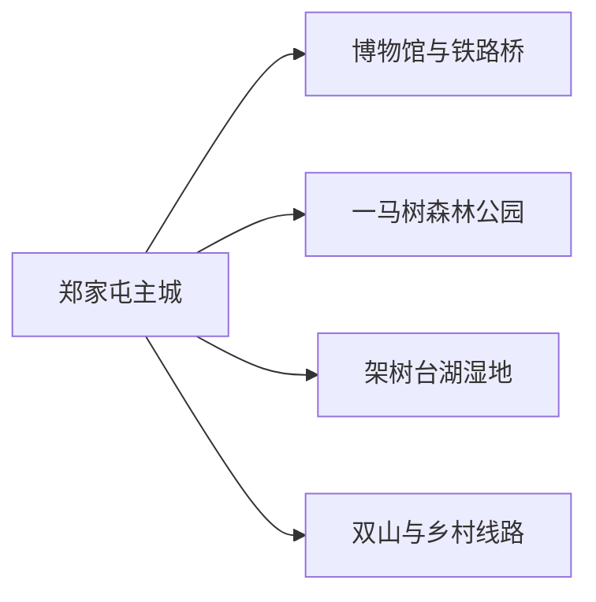
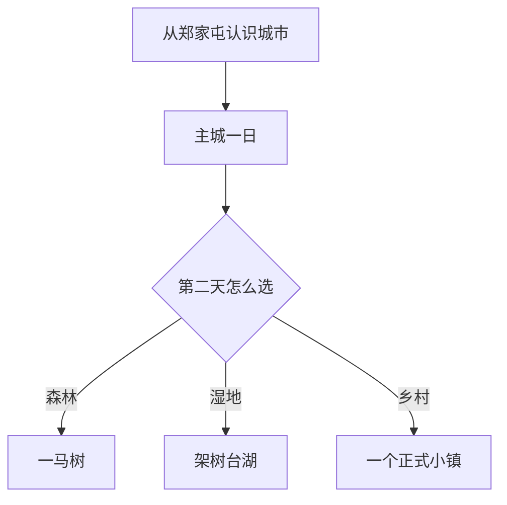

# 双辽旅行指南

双辽适合从郑家屯开始：博物馆、铁路桥和城市公园串起交通与边地商埠历史；第二天再去一马树森林公园，或按季节选择架树台湖湿地与一条乡村线路。城市位于吉林、辽宁、内蒙古交界附近，远线跨度大，先选一个方向、确认车辆与返程，比在地图上追多个点更可靠。

> 建议停留：1–3 天 
> 旅行关键词：郑家屯、一马树、湿地、铁路、科尔沁边缘、乡村 
> 主要体力：主城低；森林与湿地中等 
> 最近研究：2026-08-13

## 城市速览

| 项目 | 旅行信息 |
|---|---|
| 主要旅行价值 | 用郑家屯历史、一马树森林和西部湿地认识三省区交界的交通与生态城市 |
| 建议停留 | 1 天主城；2 天加入一马树；3 天增加湿地或乡村一线 |
| 较舒适季节 | 5–10 月适合森林与乡村；冬季以城市短线和公布活动为主 |
| 预算特点 | 主城较低；远线车辆、景区活动和乡村住宿增加预算 |
| 步行强度 | 主城低；森林和湿地中等，风沙天气体感更高 |
| 主要天气风险 | 大风、沙尘、高温、雷电、暴雨、道路结冰、草原与森林火险 |
| 独行旅行 | 主城容易安排，湿地与乡村优先正规车辆 |
| 亲子旅行 | 博物馆、森林公园和正式乡村项目较合适 |
| 长者与低体力旅行 | 郑家屯文博、城市公园和车辆可达森林短段更轻松 |
| 无障碍信息 | 城区新设施可咨询；历史建筑、森林和湿地设施连续性需向官方确认 |

## 城市格局与游览区域

双辽是四平市代管的县级市，法定代码 `220382`。固定 GeoNames `2033135` 对应郑家屯主城点，并连接同名薄地点实体；法定双辽市采用 Wikidata `Q1361171`，其 `P1566=2034813` 指向另一行政记录。页面以固定点承接人口窗口，以法定代码确定市域边界。

| 区域 | 主要内容 | 怎么安排 | 与其他区域的关系 |
|---|---|---|---|
| 郑家屯主城 | 博物馆、铁路遗存、公园与餐饮住宿 | 半日至一日 | 交通与历史基地 |
| 一马树方向 | 森林公园、林下休闲与正式活动 | 半日至一日 | 首选自然远线 |
| 架树台湖方向 | 湖泊、沼泽、草原与候鸟观察 | 一日 | 保护地规则和季节决定可行性 |
| 双山—王奔乡村方向 | 乐活、乐稻、乐野等当期项目 | 半日至一日 | 选择一个正式运营点，不追多村 |
| 农牧与湿地生产空间 | 稻田、牧场、种羊场、水体与农机作业 | 使用公共道路和正式接待点 | 按湿地保护、农忙和牧场防疫管理 |

## 主要景点

### 郑家屯与城市生活

| 景点 | 区域 | 类型 | 主要看点 | 建议用时 | 室内外 | 体力 | 预约风险 | 天气影响 | 优先级 |
|---|---|---|---|---:|---|---|---|---|---|
| 郑家屯博物馆 | 主城 | 博物馆与历史建筑 | 清代民居建筑、古代与近代双辽史 | 1.5–2.5 小时 | 室内 | 低 | 中 | 低 | A |
| 郑家屯铁路桥公共观察点 | 主城 | 铁路遗产 | 铁路交通与郑家屯商埠格局 | 1–2 小时 | 室外 | 低 | 低 | 中 | B |
| 双辽市烈士陵园 | 主城 | 纪念地 | 革命历史与城市记忆 | 1–2 小时 | 室外为主 | 低至中 | 中 | 中 | B |
| 七星湖公园 | 主城 | 城市公园 | 湖景、休息和日常生活 | 1–2 小时 | 室外 | 低 | 低 | 中 | C |
| 辽河体育公园 | 主城 | 公共运动空间 | 城市运动与季节活动 | 1–2 小时 | 室外 | 低至中 | 低 | 高 | C |

### 森林、湿地与乡村

| 景点 | 区域 | 类型 | 主要看点 | 建议用时 | 室内外 | 体力 | 预约风险 | 天气影响 | 优先级 |
|---|---|---|---|---:|---|---|---|---|---|
| 一马树森林公园 | 红旗方向 | 4A 森林景区 | 针叶林、森林休闲和正式动物展示 | 半日至一日 | 室外为主 | 中 | 高 | 高 | A |
| 架树台湖国家湿地公园正式开放区 | 种羊场方向 | 湿地与草原 | 湖泊、沼泽、草原和候鸟栖息地 | 半日至一日 | 室外 | 中 | 很高 | 很高 | A |
| 双山百禄乐活小镇当期项目 | 双山镇 | 乡村休闲 | 餐饮、亲子与乡村活动 | 2–5 小时 | 混合 | 中 | 高 | 高 | B |
| 秀水乐稻小镇当期项目 | 双山镇 | 稻作乡村 | 稻田景观与季节农业活动 | 2–4 小时 | 室外 | 中 | 很高 | 很高 | B |
| 王奔宝山乐野小镇当期项目 | 王奔镇 | 农耕文化 | 村史、农耕与季节接待 | 2–4 小时 | 混合 | 中 | 很高 | 高 | C |

湿地公园提供的是保护地内正式游览，不代表可进入所有湖泊、沼泽和种羊场生产空间；观鸟沿公布点位，保持距离。铁路桥以公共观察为主，轨道、桥面作业和线路防护区按铁路安全管理。

## 美食与餐饮

| 菜品或餐饮类型 | 常见区域 | 一个人用餐与常见份量 | 风味、过敏原与饮食限制 | 排队风险与替代方法 |
|---|---|---|---|---|
| 东北家常菜与炖菜 | 郑家屯主城 | 合餐为主，一人问小份 | 常含猪肉、大豆酱油、葱蒜和淀粉 | 选择居民商圈同类餐馆 |
| 牛羊肉与蒙餐风味 | 西部乡镇、主城 | 烤肉和汤菜可按份点 | 牛羊肉、奶制品、孜然和较高盐分 | 先问重量、奶制品和最低份量 |
| 玉米、杂粮与黏食 | 早餐店、乡村餐饮 | 小份适合尝试 | 糯米、黏玉米、豆沙或糖常见 | 购买即食小份并注意保存 |
| 河湖鱼菜 | 正规餐馆 | 多为整鱼或共享盘 | 鱼类过敏、细刺和称重价格 | 点菜前确认鱼种、重量与来源 |
| 乡村烧烤与农家菜 | 正式乡村项目 | 多人共享 | 肉类、花生、芝麻、辣椒和酱油 | 活动日排队时提前订餐 |

## 经典行程

### 一日经典路线

**路线**：郑家屯博物馆 → 午餐 → 铁路桥公共观察点 → 烈士陵园或七星湖公园

- **串联逻辑**：用博物馆建立历史，再以铁路与城市公共空间观察郑家屯格局。
- **预约锚点**：博物馆与纪念地开放。
- **休息安排**：主城午餐，下午公园短休。
- **时间不足时**：保留博物馆和铁路桥外观。

### 两日城市路线

**第 1 天**：郑家屯历史线。 
**第 2 天**：一马树森林公园完整日。

- **串联逻辑**：一天人文、一天森林，车程和体力容易控制。
- **预约锚点**：森林公园开放、车辆和活动。
- **休息安排**：景区服务点午餐，连续住主城。
- **时间不足时**：第二天只走车辆可达短线。

### 三日深度路线

**第 1 天**：主城文博。 
**第 2 天**：一马树森林。 
**第 3 天**：架树台湖或一个乡村项目二选一。

- **串联逻辑**：第三天按鸟季、天气和接待状态在生态与乡村之间选择。
- **预约锚点**：湿地开放、观鸟规则、乡村活动、车辆与返程。
- **休息安排**：正式游客服务点或镇区午餐。
- **时间不足时**：先删第三天。

### 雨雪天路线

**路线**：郑家屯博物馆 → 室内午餐 → 当期公共文化展览

- **适用条件**：主城交通正常；暴雪或大风升级时缩短为住宿附近。
- **预约锚点**：场馆营业。
- **休息安排**：全程室内加短程车。
- **时间不足时**：只保留博物馆。

### 亲子或低体力路线

**亲子路线**：郑家屯博物馆 → 午餐 → 一马树适龄短线或正式乡村活动。 
**低体力路线**：车辆到博物馆 → 午休 → 七星湖公园平缓短段。

- **减负方式**：亲子线减少长距离林步道；低体力线留在主城和车辆可达点。
- **预约锚点**：儿童活动、卫生间、座椅和落客点。
- **休息安排**：主城餐饮与公园座椅。
- **时间不足时**：两类路线都保留博物馆。

### 远郊一日路线

**路线**：主城 → 架树台湖或一个乡村项目 → 正式服务点午餐 → 返回

- **适用条件**：道路、开放、天气、返程和保护地规则已确认。
- **预约锚点**：湿地、乡村接待、车辆和活动。
- **休息安排**：游客中心或镇区餐饮。
- **时间不足时**：整段改为主城—一马树短线。

## 住宿区域

| 区域 | 优点 | 缺点 | 适合人群 | 交通特点 |
|---|---|---|---|---|
| 郑家屯主城 | 餐饮、铁路与公共服务集中 | 距湿地和部分乡镇较远 | 首访、独行、多日远线 | 最稳妥的统一基地 |
| 一马树周边正式住宿 | 靠近森林活动 | 营业期和餐饮选择需核对 | 森林、亲子与慢节奏 | 先确认返程和接驳 |
| 双山等乡村正式住宿 | 靠近季节活动 | 活动外日期服务可能减少 | 自驾、农旅主题 | 核对营业、供暖与停车 |

## 市内交通

| 场景 | 建议与取舍 | 行前需要重查的内容 |
|---|---|---|
| 铁路抵达 | 双辽站抵达后用公交、出租或网约车进入主城 | 车次、站口、末班和夜间上客点 |
| 主城移动 | 博物馆、公园和餐饮可短程车加步行 | 开放日、线路和冬季路面 |
| 森林与湿地 | 自驾、正规包车或公布接驳更灵活 | 道路、停车、返程、火险和保护规则 |
| 跨省区联程 | 与辽宁、内蒙古相邻不等于市内交通 | 到发站、跨界班次、住宿和总车程 |

## 不同旅行者须知

| 旅行维度 | 可行条件 | 主要取舍 | 需额外核对 |
|---|---|---|---|
| 独行旅行 | 主城与成熟景区可自行安排 | 湿地和乡村返程选择少 | 车辆、通信和夜间上客点 |
| 亲子旅行 | 博物馆、森林和正式乡村项目 | 大风、日晒和长车程增加消耗 | 年龄、卫生间、装备与救援 |
| 长者或低体力旅行 | 主城和车辆可达森林短段 | 湿地土路与森林长步行 | 坡度、座椅、落客点和景交 |
| 无障碍需求 | 城区新设施可提前咨询 | 历史建筑、森林和湿地连续通行有限 | 设施连续性需向官方确认 |
| 摄影旅行 | 公园、森林和正规观鸟点适合 | 铁路、保护地和无人机受管理 | 航拍、商业拍摄和候鸟距离 |
| 乡村旅行 | 正式项目能接触农耕文化 | 田地、牧场和农机作业有生产边界 | 活动日、接待、保险与返程 |

## 行前核对

| 核对事项 | 为什么需要重查 | 建议核对时间 | 官方入口 |
|---|---|---|---|
| 博物馆与森林公园 | 闭馆、维护和季节活动变化 | 排入路线前及到访前一日 | [吉林省文化和旅游厅](https://whhlyt.jl.gov.cn/) |
| 湿地与观鸟 | 水位、候鸟和保护规则有季节性 | 出发前三日及当天 | [吉林省林业和草原局](https://jllc.jl.gov.cn/) |
| 铁路 | 车次和停站日期变化 | 出发前一周及当天 | [中国铁路 12306](https://www.12306.cn/) |
| 天气 | 大风、雷雨、暴雪和火险影响远线 | 出发前三日及当天 | [吉林省气象局](https://jl.cma.gov.cn/) |

## 来源与更新记录

### 主要来源

| 来源 | 类型 | 支持内容 | 核验日期 |
|---|---|---|---|
| [吉林省文旅厅：四平区域旅游线路](https://whhlyt.jl.gov.cn/ztzl/jlslyxlhxj/gdxl/sps/sps_424347/202507/t20250708_9275937.html) | 文旅主管部门 | 郑家屯博物馆、一马树、湿地和乡村线路 | 2026-08-13 |
| [吉林省政府：双辽农文旅](https://www.jl.gov.cn/szfzt/jlssxsxnyxdh/gddt/202404/t20240428_3150990.html) | 省政府 | 城市公园、三乐小镇和乡村活动 | 2026-08-13 |
| [吉林省政府：双辽文旅发展](https://www.jl.gov.cn/yaowen/202506/t20250630_3475237.html) | 省政府 | 一马树与乡村线路当期发展 | 2026-08-13 |
| [吉林省生态环境厅：一马树](https://sthjt.jl.gov.cn/ywdt/ssdt/stdt/202410/t20241008_3305387.html?mode=jlb) | 生态环境部门 | 森林与周边乡村生态背景 | 2026-08-13 |
| [GeoNames 2033135](https://www.geonames.org/2033135/) | 开放地名库 | 固定郑家屯城市点与坐标 | 2026-08-13 |
| [Wikidata Q1361171](https://www.wikidata.org/wiki/Q1361171) | 开放知识库 | 法定双辽市与另一行政记录 | 2026-08-13 |

### 更新记录

| 日期 | 更新内容 |
|---|---|
| 2026-08-13 | 首次建立双辽独立指南；按郑家屯、一马树、架树台湖和乡村项目组织，并明确铁路、湿地与农牧生产边界。 |
