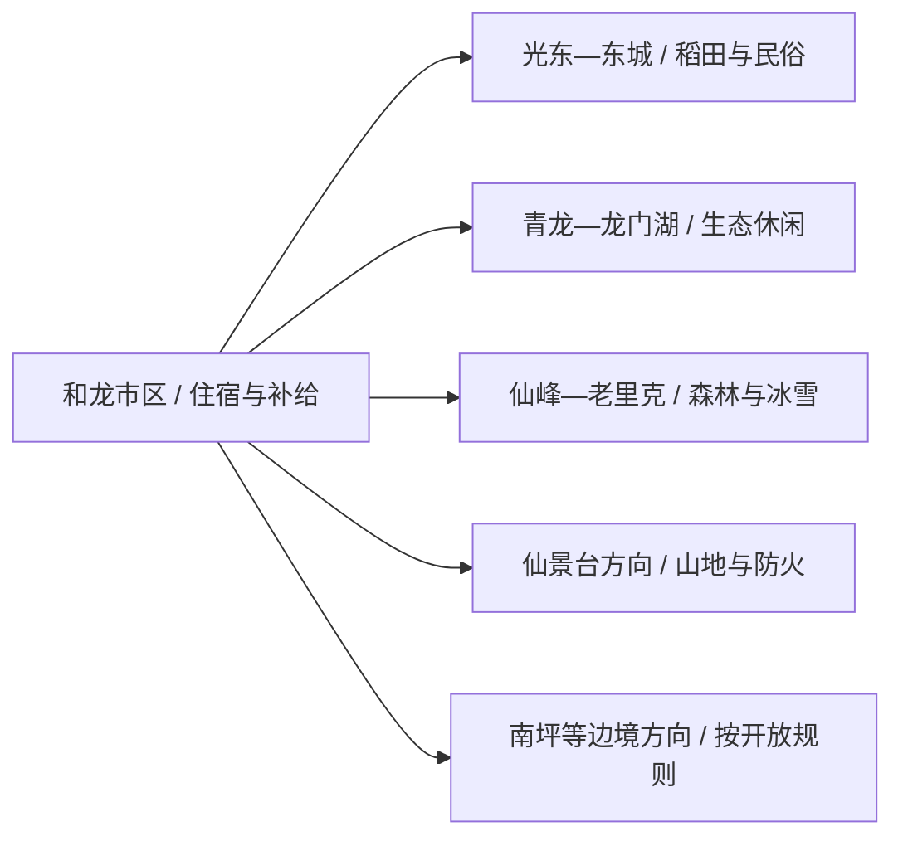
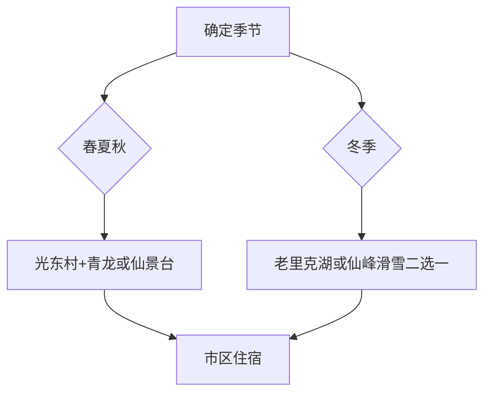

# 和龙旅行指南

和龙适合按季节选主题：春季看金达莱与乡村文化，夏秋走光东村、青龙渔业和仙景台，冬季再把老里克湖或仙峰冰雪项目单独成日。市区是补给点，森林、村落和边境方向都需要车辆衔接。

> 建议停留：市区与近郊 1–2 天；加入冬季林海雪原或仙景台为 3 天 
> 旅行关键词：朝鲜族文化、稻田乡村、长白山林海、冰雪、边境城市 
> 无障碍说明：市区公共设施可优先询问坡道和电梯；村落、林区、雪场与山地景区的设施连续性需向官方确认

## 城市速览

| 项目 | 旅行信息 |
|---|---|
| 主要旅行价值 | 朝鲜族乡村文化、长白山林区、冬季雪原与边境城市生活 |
| 建议停留 | 1–3 天；冬季每个大型冰雪项目独立成日 |
| 舒适季节 | 春季金达莱、夏秋乡村与山地、冬季冰雪各有不同主线 |
| 预算特点 | 市区住宿较稳；车辆、冰雪装备、景区交通和乡村体验是主要增量 |
| 步行强度 | 市区低至中；乡村中等；林区、雪地和仙景台中高至高 |
| 天气风险 | 暴雪、低温、道路结冰、强风、夏季雷雨和森林火险 |
| 独行旅行 | 市区可独行；远线先确认返程、信号和当日接待 |
| 亲子旅行 | 光东村史馆、稻田研学和成熟冰雪初级项目较友好 |
| 长者与低体力 | 乡村场馆与短步道优先，雪地和山地按现场条件取舍 |
| 行前重点 | 季节营业、车辆、防寒装备、森林防火、边境与无人机规则 |

## 城市格局与游览区域

和龙是延边朝鲜族自治州代管的法定县级市，代码 `222406`。市区承担住宿与交通，光东—东城、头道、龙城、八家子和西城等方向分布乡村、森林与冰雪项目；南部图们江沿线还涉及边境管理。

| 区域 | 适合安排 | 怎么选择 | 时间尺度 |
|---|---|---|---|
| 和龙市区 | 住宿、餐饮、公共文化与交通 | 作为每日出发基地，晚间回城休整 | 半日至 1 天 |
| 光东—东城 | 村史馆、稻田与朝鲜族乡村体验 | 按活动和接待开放安排半日 | 半日至 1 天 |
| 青龙—龙门湖 | 冷水鱼、垂钓或季节性冰钓等运营项目 | 只参加当期正式营业项目 | 半日至 1 天 |
| 仙峰—老里克 | 林海、滑雪与雪原体验 | 冬季先核道路、装备与景区接待 | 1 天 |
| 仙景台 | 山岳景观与森林生态 | 防火和天气条件满足时安排 | 1 天 |

GeoNames `2036933` 与 Wikidata `Q699125` 的 `P1566` 精确对应，法定代码为 `222406`。该固定记录虽以较低行政中心级别标注，页面仍以现行法定和龙市全域为旅行边界。

## 主要景点

### 乡村与城市近郊

| 景点 | 区域 | 类型 | 主要看点 | 建议用时 | 室内外 | 体力 | 预约风险 | 天气影响 | 优先级 |
|---|---|---|---|---:|---|---|---|---|---|
| 光东村正式接待区 | 东城镇 | 朝鲜族乡村、研学 | 村史、稻作、乡村生活与当期民俗体验 | 3–5 小时 | 混合 | 中 | 高 | 中高 | A |
| 青龙渔业景区 | 近郊 | 生态休闲、渔业 | 冷水鱼、生态园区与当期体验项目 | 3–5 小时 | 混合 | 中 | 高 | 高 | B |
| 金达莱民俗村或文化季活动区 | 西城镇方向 | 民俗、花季 | 金达莱花期、民俗活动和乡村景观 | 半日至 1 天 | 室外为主 | 中 | 很高 | 很高 | B |
| 和龙市博物馆 | 市区 | 地方博物馆 | 地方历史、民族文化与城市通识 | 1–3 小时 | 室内 | 低 | 高 | 低 | B |

### 森林与冰雪

| 景点 | 区域 | 类型 | 主要看点 | 建议用时 | 室内外 | 体力 | 预约风险 | 天气影响 | 优先级 |
|---|---|---|---|---:|---|---|---|---|---|
| 老里克湖正式景区 | 仙峰方向 | 林海雪原、湿地 | 雪原、雾凇和森林冬景 | 1 天 | 室外 | 高 | 很高 | 很高 | A |
| 仙峰滑雪场当期开放项目 | 仙峰方向 | 滑雪、冰雪 | 初级雪道与正式运营雪上项目 | 半日至 1 天 | 室外 | 高 | 很高 | 很高 | B |
| 千年红豆杉景区正式开放区 | 林区 | 森林生态 | 红豆杉、森林环境与合规民宿体验 | 半日至 1 天 | 混合 | 中高 | 高 | 很高 | B |
| 仙景台风景名胜区开放线 | 南部山地 | 山岳、森林 | 花岗岩地貌、林海与边境山地景观 | 1 天 | 室外 | 高 | 高 | 很高 | B |
| 龙门湖当期运营项目 | 近郊 | 湖泊、季节活动 | 垂钓、冰钓或湖区休闲 | 半日 | 室外 | 中 | 很高 | 很高 | C |

光东村的村史馆、稻田研学与民宿属于同一乡村体验单元；老里克湖的雪原、雾凇和雪地项目按一个景区安排。森林与冰雪项目每季变化明显，票价、雪期和设备开放以当季公告为准。

## 美食与餐饮

| 类型 | 怎么点 | 份量与过敏原 | 选择建议 |
|---|---|---|---|
| 冷面与温面 | 一人一碗 | 面条含小麦或荞麦，汤底与配菜可能含牛肉、蛋、芝麻 | 先问面种、汤底和辣酱，冬季可选温热版本 |
| 石锅拌饭、包饭 | 一人一份或两人分享配菜 | 可能含芝麻、大豆、蛋、辣椒与肉类 | 酱料分开放，按食量加饭 |
| 米肠、打糕与泡菜 | 作为小吃或配菜共享 | 米肠可能含动物血与肠衣；打糕可能接触豆粉、坚果 | 先点小份，询问原料和保存方式 |
| 冷水鱼与山野菜 | 2–4 人共享 | 鱼类过敏，野菜需确认品种与熟制 | 选择正规餐馆，不采食来源不明野生植物 |

## 经典行程

### 一日经典路线

**路线**：和龙市区 → 光东村正式接待区 → 午餐与休息 → 青龙渔业景区或和龙市博物馆

- **适用条件**：乡村接待和第二站均正常营业。
- **串联逻辑**：先看稻作与村史，再补充生态休闲或城市通识。
- **预约锚点**：光东村活动、用餐、青龙项目与返程车辆。
- **休息安排**：午餐放在正式接待点或市区，下午只保留一个站。
- **时间不足时**：保留光东村，第二站取消。

### 两日城市路线

**第 1 天**：市区 → 光东村 → 市区住宿 
**第 2 天**：仙景台或青龙—龙门湖方向二选一

- **适用条件**：山地防火、天气与景区开放已确认。
- **串联逻辑**：乡村文化和山地生态各占一天。
- **预约锚点**：第二日景区入口、车辆与返程。
- **休息安排**：两天都回市区恢复，山地日午间在游客服务点休息。
- **时间不足时**：删除第二天，完整保留乡村日。

### 三日深度路线

**第 1 天**：和龙市区与光东村 
**第 2 天**：青龙渔业或金达莱花季活动 
**第 3 天**：仙景台、老里克湖或仙峰滑雪按季节三选一

- **适用条件**：季节匹配，三处接待和道路均已确认。
- **串联逻辑**：城市—乡村—森林逐步加大户外强度。
- **预约锚点**：花季活动、雪场或森林景区票务与装备。
- **休息安排**：第二天下午提早回城，为第三日留体力。
- **时间不足时**：先删第二日的季节活动，优先保留完整森林日。

### 雨雪天路线

**路线**：和龙市博物馆 → 朝鲜族餐饮体验 → 当期室内文化活动

- **适用条件**：市区道路正常；暴雪和结冰时减少出行。
- **串联逻辑**：活动集中在市区，避免林区支路和长时间户外。
- **预约锚点**：场馆开放、活动名额与餐厅营业。
- **休息安排**：午后回住宿地取暖和休息。
- **时间不足时**：只保留场馆与一顿地方餐。

### 亲子与低体力路线

**亲子路线**：光东村史馆 → 稻田或研学当期项目 → 午休 
**低体力路线**：车辆到光东村正式入口 → 村史馆与短段村落 → 市区休息

- **减负方式**：雪地和山地另成一天，村落只走正式接待主线。
- **预约锚点**：研学年龄、步道、卫生间、轮椅和落客点。
- **休息安排**：正式接待点和市区住宿地。
- **时间不足时**：保留村史馆，取消户外延伸。

### 远郊路线

**路线**：和龙市区 → 老里克湖或仙景台二选一 → 原路返回或在合规住宿点留宿

- **适用条件**：道路、火险、天气、景区和住宿均已确认。
- **串联逻辑**：一个山地日只服务一个核心目的地。
- **预约锚点**：门票、雪地装备、接驳与最晚返程。
- **休息安排**：游客中心分段休息，回城后不再追加夜间活动。
- **时间不足时**：整段取消，改走市区—光东村。

## 住宿区域

| 区域 | 优点 | 取舍 | 适合人群 |
|---|---|---|---|
| 和龙市区 | 餐饮、交通和生活服务集中 | 到各景区均需车辆 | 首访、短住、公共交通旅行 |
| 光东村等合规乡村住宿 | 可延长乡村体验 | 房量、接待季节和夜间交通有限 | 家庭、研学、慢旅行 |
| 老里克湖或仙峰周边正式住宿 | 便于清晨雪景和冰雪活动 | 冬季价格、道路和供暖需重查 | 冰雪摄影、滑雪 |
| 延吉联程 | 交通选择更多 | 每天往返和龙会增加时间 | 只做和龙一日线者 |

## 市内交通

- 和龙站及公路客运承担主要到发，车次和停靠以 12306、客运部门当期信息为准。
- 市区到光东、仙景台、老里克湖和仙峰的公共交通条件不同，优先核景区专线、合规包车或自驾路线。
- 冬季把结冰、清雪、车辆轮胎与返程天黑时间纳入计划；林区不走地图推荐的未核实近路。
- 边境方向按道路、口岸和边境管理要求出行，普通旅游路线不以抵近边境线为目标。

## 不同旅行者须知

| 情况 | 怎么安排 | 重点核对 |
|---|---|---|
| 独行 | 住市区，远线使用正式接驳 | 返程、信号、司机与住宿确认 |
| 亲子 | 光东村研学和初级冰雪项目优先 | 年龄、装备、低温、课程和卫生间 |
| 长者与低体力 | 乡村场馆和车辆短线 | 雪地防滑、台阶、落客点和休息座椅 |
| 冰雪旅行 | 一天一个项目，携带分层保暖 | 雪期、风寒、装备、保险和道路 |
| 摄影与无人机 | 从公共开放区域取景 | 边境、林区、村民肖像、无人机和防火规定 |

安全与保护边界：森林景区服从防火命令和火源管理；边境、口岸、林业生产道路、自然保护地、未开放冰面和无救援雪地按明确边界活动。

## 行前核对

| 项目 | 何时核对 | 官方入口 |
|---|---|---|
| 景区与乡村接待 | 订房前、出发前一日 | [和龙市人民政府](https://www.helong.gov.cn/)及吉林省文旅信息 |
| 老里克湖、仙峰滑雪和冰雪装备 | 雪季开放后、出发前三日 | 景区与属地文旅官方渠道 |
| 铁路和市域接驳 | 购票时、前一日 | [中国铁路 12306](https://www.12306.cn/)及交通部门 |
| 暴雪、低温与森林火险 | 出发前三日起每日 | [吉林省气象局](http://jl.cma.gov.cn/)及林草、应急公告 |
| 无障碍条件 | 预约和订房时 | 景区、村落接待方、酒店与承运方 |

## 来源与更新记录

| 来源 | 支持内容 | 核验日期 |
|---|---|---|
| [和龙市人民政府：乐在和龙](https://www.helong.gov.cn/sq_2422/hlcy/lzhl/201912/t20191223_44794.html) | 市域边界、青龙、仙景台、老里克湖、光东与民俗资源 | 2026-08-13 |
| [吉林省文旅厅：和龙冰雪与乡村旅游](https://whhlyt.jl.gov.cn/dfwhxx/202504/t20250415_9172646.html) | 光东村、青龙、仙峰、红豆杉与老里克湖当期业态 | 2026-08-13 |
| [吉林省文旅厅：仙景台森林防火检查](https://whhlyt.jl.gov.cn/ztzl/aqscjd/202403/t20240325_8885855.html) | 仙景台开放属性与森林防火边界 | 2026-08-13 |
| [和龙市 2024 年国民经济和社会发展统计公报](https://www.helong.gov.cn/sj/tjgb/202507/t20250708_548336.html) | 市内博物馆、文化馆与公共图书馆配置 | 2026-08-13 |
| [民政部行政区划查询](https://dmfw.mca.gov.cn/xzqh/getList?code=22&trimCode=true&maxLevel=3) | `222406` 及延边州代管关系 | 2026-08-13 |
| [GeoNames 2036933](https://www.geonames.org/2036933/helong.html) | 固定城市点 | 2026-08-13 |
| [Wikidata Q699125](https://www.wikidata.org/wiki/Q699125) | 法定和龙市实体与 `P1566=2036933` | 2026-08-13 |

| 日期 | 更新 |
|---|---|
| 2026-08-13 | 首次完成和龙市指南；建立市区、光东乡村、森林冰雪与仙景台分区，补齐季节运营、边境、防火和标识粒度。 |
