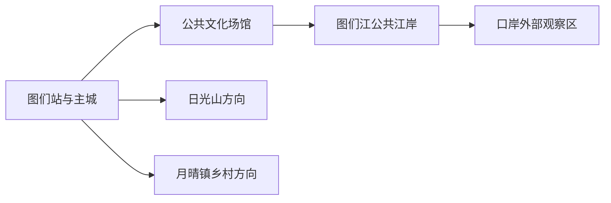
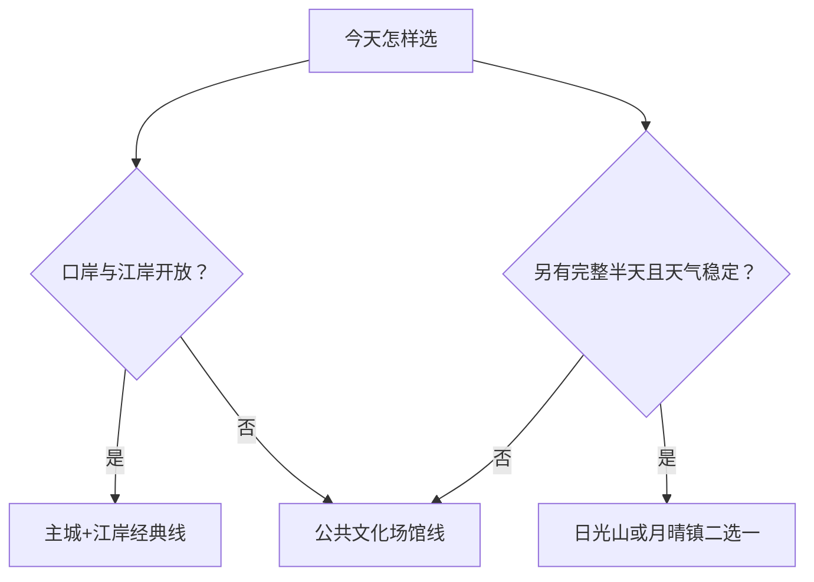

# 图们旅行指南

图们位于延边东部的图们江畔，适合用一至两天认识边境城市、朝鲜族生活与铁路口岸历史。主城尺度紧凑，图们江沿岸、口岸外部观察点和城市公共文化场馆可以组成一日线；日光山、月晴镇乡村与红色遗址方向则按天气和接待条件另选。

## 城市速览

| 项目 | 信息 |
|---|---|
| 旅行主线 | 图们江边境景观、口岸城市史、朝鲜族文化、铁路记忆与近郊山地 |
| 建议停留 | 1 天完成主城与江岸；2 天增加日光山或月晴镇方向 |
| 最佳节奏 | 上午室内场馆，午后江岸与口岸外部观察，傍晚回主城用餐 |
| 交通基地 | 图们站周边与主城住宿区 |
| 步行强度 | 主城低至中等；山地、乡村和长距离江岸为中等 |
| 主要天气 | 冬季严寒与积雪，夏季强降雨、雷电和江岸涨水，春秋森林火险 |
| 边境提示 | 只在正式开放的公共区域停留，拍摄、无人机和抵近边境设施按现场规定 |
| 亲子 | 优先公共文化场馆、江岸短段和有组织的民俗活动 |
| 低体力 | 每半天保留一处场馆和一段平坦江岸，山地改为车辆观景 |
| 无障碍 | 设施连续性需向官方确认，并逐段核对车站、入口、卫生间与坡道 |

## 城市格局与游览区域

图们市是延边朝鲜族自治州所辖县级市，法定代码 `222402`。固定 GeoNames `2034340` 为县级市驻地城市点，Wikidata `Q713323` 代表法定图们市且 `P1566=2034340`；点坐标用于交叉核对主城位置，市域边界以法定区划为准。

| 区域 | 适合体验 | 怎么安排 |
|---|---|---|
| 主城—图们站 | 到发、住宿、餐饮、公共文化 | 抵达日或雨雪日使用 |
| 图们江公共江岸 | 江景、边境城市空间、桥梁远观 | 与主城组合半日，按水位与管制选择开放步道 |
| 口岸方向 | 口岸城市史与外部观察 | 先确认开放观察点、证件和拍摄规则 |
| 日光山方向 | 山地视野、寺院与森林环境 | 天气稳定时安排半日，选择正式入口 |
| 月晴镇方向 | 朝鲜族村落、乡村活动与红色文化 | 以公开接待项目为锚点，落实返程车辆 |

## 主要景点

### 主城与江岸

| 景点 | 所在区域 | 类型 | 核心看点 | 建议用时 | 室内/室外 | 体力 | 预约难度 | 天气敏感度 | 适合旅程 |
|---|---|---|---|---|---|---|---|---|---|
| 图们市公共文化场馆 | 主城 | 地方史、公共文化 | 城市沿革、民族文化与当期展览 | 1–2 小时 | 室内 | 低 | 中 | 低 | B |
| 图们江公共江岸 | 主城南缘 | 滨水与边境景观 | 江河、桥梁、城市与对岸空间关系 | 1.5–3 小时 | 室外 | 低至中 | 低 | 很高 | A |
| 图们口岸外部公共观察区 | 口岸方向 | 口岸城市景观 | 公路、铁路口岸及边境交通史的外部观察 | 1–2 小时 | 室外 | 低 | 高 | 高 | A |
| 图们江广场及城市公共空间 | 主城 | 城市休闲 | 城市生活、节庆活动与江岸连接 | 1–2 小时 | 室外 | 低 | 低 | 高 | B |

### 近郊与乡村

| 景点 | 所在区域 | 类型 | 核心看点 | 建议用时 | 室内/室外 | 体力 | 预约难度 | 天气敏感度 | 适合旅程 |
|---|---|---|---|---|---|---|---|---|---|
| 日光山正式开放区 | 主城近郊 | 山地与宗教文化 | 山地视野、森林环境和经确认开放的寺院空间 | 3–5 小时 | 室外为主 | 中至高 | 中 | 很高 | B |
| 月晴镇公开接待村落 | 月晴镇 | 朝鲜族乡村文化 | 村落生活、民俗展示与预约活动 | 3–5 小时 | 混合 | 中 | 高 | 高 | B |
| 图们红色文化公开展示点 | 市域 | 革命历史 | 革命老区史、遗址保护与主题教育 | 2–4 小时 | 混合 | 中 | 高 | 高 | C |

口岸、铁路桥、边防设施和生产作业区承担现实功能。旅行时以政府或运营单位公布的开放区域为准；观景与拍摄在公共一侧完成，临时管制时改走主城文化线。

## 美食与餐饮

| 类型 | 适合场景 | 份量 | 过敏与饮食提示 | 选择方法 |
|---|---|---|---|---|
| 冷面、温面与汤饭 | 主城早餐、午餐 | 多为一人份 | 荞麦或小麦、牛肉汤、蛋、芝麻常见 | 先问汤底、面粉比例和辣度 |
| 米肠、打糕与朝鲜族小菜 | 民俗餐馆、市场 | 适合小份组合 | 糯米、猪血、花生、芝麻、发酵海鲜需确认 | 按人数少量点，再追加 |
| 烤肉与包饭 | 晚餐 | 更适合分享 | 大豆、小麦酱油、芝麻和共用烤盘 | 选择明码标价且能说明烤盘分区的店 |
| 江鱼与东北家常菜 | 正餐 | 整鱼与炖菜份量较大 | 淡水鱼刺、花生、大豆与共锅 | 询问小份、鱼种来源和当日价格 |

## 经典行程

### 一日经典路线

**路线**：图们站或住宿地 → 公共文化场馆 → 午餐 → 图们江公共江岸 → 口岸外部公共观察区 → 主城晚餐

- **串联逻辑**：先用室内展陈建立城市背景，再沿江理解边境与口岸空间。
- **预约锚点**：场馆开放、口岸观察区状态和江岸管制。
- **休息安排**：午餐作长休，江岸使用正式服务点。
- **时间不足时**：保留场馆与一段江岸，口岸方向改为次日。

### 两日城市路线

**第 1 天**：主城文化 → 图们江江岸 → 口岸方向 
**第 2 天**：日光山或月晴镇二选一 → 返回主城

- **串联逻辑**：首日认识城市，次日只选一条近郊主题，减少往返。
- **预约锚点**：近郊入口、村落接待、返程车辆和天气。
- **休息安排**：近郊在正式游客服务点休息，午后预留返城缓冲。
- **时间不足时**：第二天改为主城公共空间短线。

### 三日深度路线

**路线**：一日经典 → 日光山完整半日 → 月晴镇公开接待项目或红色文化线

- **串联逻辑**：边境城市、山地与乡村三种主题分日完成。
- **预约锚点**：三个动态锚点分别是口岸、山地入口和乡村接待单位。
- **休息安排**：每天午后保留一次室内或车辆长休。
- **时间不足时**：优先删除与季节不匹配的近郊线。

### 雨雪天气路线

**路线**：公共文化场馆 → 室内午餐 → 主城短距离公共空间 → 返回住宿

- **适用条件**：普通降雨或小雪且场馆、道路正常。
- **串联逻辑**：以室内项目为主，户外只保留可随时退出的短段。
- **预约锚点**：场馆临时闭馆、道路结冰和公交调整。
- **休息安排**：午餐与场馆座椅承担主要休息。
- **时间不足时**：只保留一座场馆。

### 亲子与低体力路线

**亲子路线**：公共文化场馆亲子友好展项 → 午餐 → 图们江平坦开放短段 
**低体力路线**：车辆到达场馆 → 长休 → 江岸最近落客点短停 → 返回

- **适用条件**：按年龄、体力和天气选择路线长度。
- **串联逻辑**：两条路线都围绕主城，减少山地与跨镇移动。
- **预约锚点**：婴儿车、轮椅、卫生间、座椅和车辆落客点。
- **休息安排**：每个项目后回到室内或车辆休息。
- **时间不足时**：只留场馆，江岸作为天气合适时的附加项。

### 近郊主题路线

**路线**：主城 → 日光山正式入口或月晴镇公开接待点二选一 → 午餐与休息 → 返回

- **适用条件**：入口、接待、道路、天气和返程均已落实。
- **串联逻辑**：一次只处理一个方向，使游览时间集中在主题本身。
- **预约锚点**：寺院或步道开放、村落活动、合规车辆和返程时间。
- **休息安排**：在正式接待点补水和用餐。
- **时间不足时**：整段改为主城一日线。

## 住宿区域

| 区域 | 优点 | 取舍 | 适合人群 | 核对项 |
|---|---|---|---|---|
| 图们站—主城 | 到发、餐饮与叫车方便 | 节庆期房量有限 | 首访、无车、短停 | 实际站口、夜间入住、供暖与早餐 |
| 江岸附近 | 方便清晨和傍晚散步 | 水位、风与夜间安静度变化 | 摄影、慢游 | 合法住宿、离开放步道距离 |
| 近郊接待住宿 | 减少乡村活动往返 | 选择少且依赖车辆 | 已确认活动的两日行程 | 营业、供暖、消防、返程与支付 |

## 市内交通

图们站是主要铁路门户，公路可连接延吉、珲春和州内县市。主城短距离可用公交、出租车或网约车；日光山、月晴镇和边境方向先落实当天车辆与返程。

| 场景 | 怎么做 | 出发前核对 |
|---|---|---|
| 铁路到达 | 按车票确认图们站，住宿优先选主城 | 车次、站口、夜间叫车 |
| 主城移动 | 步行结合公交或出租车 | 冬季路面、江岸入口、活动管制 |
| 延吉联程 | 按跨城交通安排，不以同属延边替代车程 | 客运、铁路、末班与住宿切换 |
| 近郊与边境方向 | 使用有资质车辆或官方接驳 | 证件、道路、检查、返程和通信 |

## 不同旅行者须知

| 旅行者 | 推荐做法 | 重点核对 |
|---|---|---|
| 独行 | 住主城、白天完成近郊、提前锁定返程 | 夜间叫车、通信、末班 |
| 亲子 | 场馆加江岸短段，民俗体验选公开活动 | 年龄、卫生间、饮食过敏、江岸护栏 |
| 长者与低体力 | 一馆一段江岸，车辆连接 | 坡道、电梯、座椅、轮椅装载 |
| 摄影 | 使用公共观景区，先问拍摄边界 | 边境、铁路、人物肖像、无人机 |
| 冬季旅行 | 缩短户外、预留供暖休息 | 低温、积雪、结冰、车辆启动与电池 |

## 行前核对

- 图们市政府和场馆公告：开放、活动、口岸观察区与临时管制。
- 吉林省气象部门：低温、暴雪、雷电、强降雨、森林火险和江岸风险。
- 铁路 12306：图们站车次与实际到发日。
- 近郊接待单位：入口、活动、餐饮、车辆、返程和无障碍条件。

## 来源与更新记录

| 来源 | 支持内容 | 核验日期 |
|---|---|---|
| [图们市人民政府](https://www.tumen.gov.cn/) | 城市公告、公共服务、场馆和动态核对入口 | 2026-08-13 |
| [图们市2026年发展与文旅方向](https://www.tumen.gov.cn/zw_2185/tmyw/202601/t20260123_566091.html) | 边境城市、民俗文化、生态与城市建设方向 | 2026-08-13 |
| [图们市红色、边境与民俗文旅资料](https://www.tumen.gov.cn/szf_2172/zyhy/202604/t20260403_571023.html) | 红色、边境、民俗三条旅行线索 | 2026-08-13 |
| [图们市城市与对外交通规划](https://www.tumen.gov.cn/tmszfxxgkw/gzbm/sgtjcyfj/xxgkml/202208/P020220830515362783734.pdf) | 主城、口岸与公路铁路空间关系 | 2026-08-13 |
| [Wikidata Q713323](https://www.wikidata.org/wiki/Q713323) | 法定图们市与 `P1566=2034340` | 2026-08-13 |
| [GeoNames 2034340](https://www.geonames.org/2034340/) | 固定城市点、坐标与要素分类 | 2026-08-13 |
| [中国铁路12306](https://www.12306.cn/) | 铁路车次与到发站动态入口 | 2026-08-13 |

| 日期 | 更新 |
|---|---|
| 2026-08-13 | 首次完成图们主城、图们江、口岸、山地和乡村旅行研究。 |
