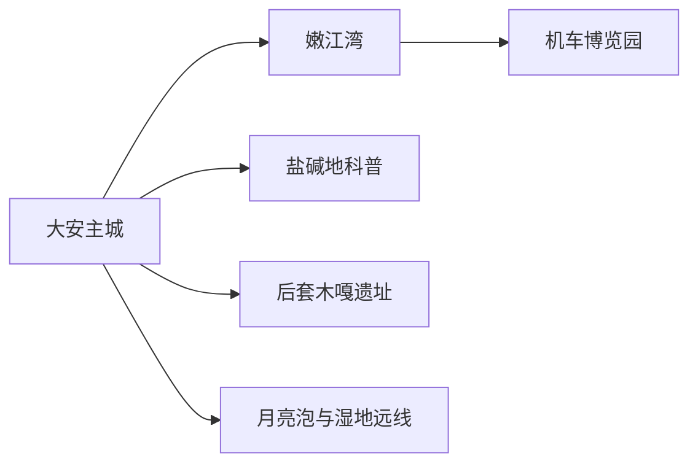
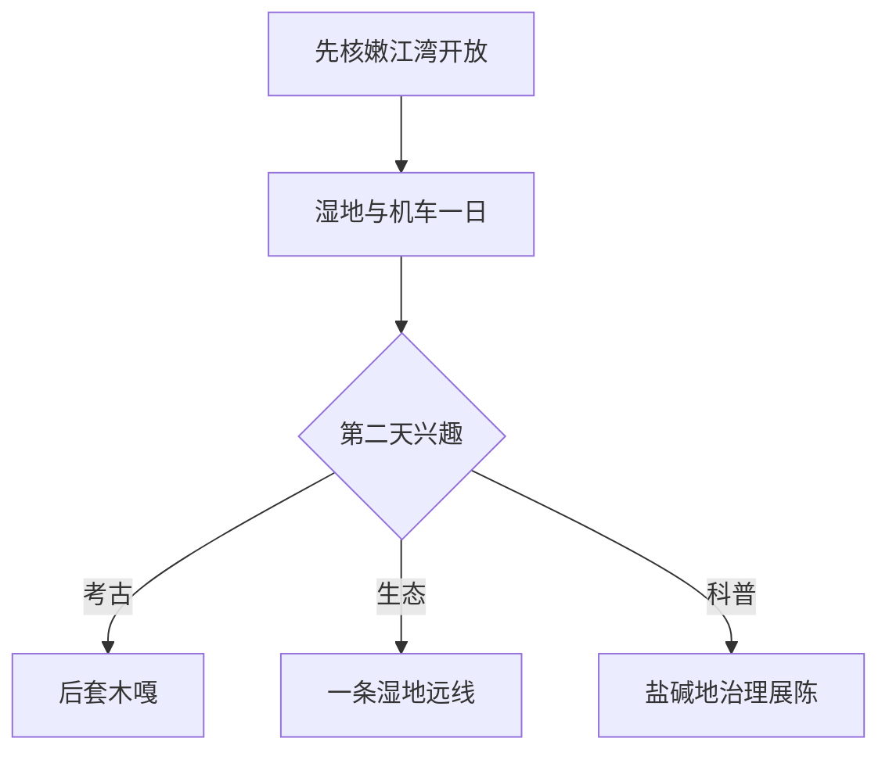

# 大安旅行指南

大安的核心体验集中在嫩江湾：湿地、公园、辽金文化活动与新开放的机车博览园可以组成完整一日；有更多时间，再从后套木嘎遗址、盐碱地治理科普或一条季节湿地乡村线中选择。水位、候鸟、冰雪和大型活动都会改变现场动线，先核景区公告，再按一个方向安排远线。

> 建议停留：1–3 天 
> 旅行关键词：嫩江湾、湿地、蒸汽机车、辽金文化、盐碱地、候鸟 
> 主要体力：低至中等；湿地远线中等 
> 最近研究：2026-08-13

## 城市速览

| 项目 | 旅行信息 |
|---|---|
| 主要旅行价值 | 在嫩江湾看吉林西部湿地与辽金文化，再用机车和盐碱地科普理解城市转型 |
| 建议停留 | 1 天嫩江湾与机车；2 天加入文博；3 天增加一条湿地或乡村远线 |
| 较舒适季节 | 春秋适合观鸟和步行；夏季活动多但注意高温雷雨；冬季看正式冰雪产品 |
| 预算特点 | 主城中等；活动票、远线车辆、住宿和冬季装备增加预算 |
| 步行强度 | 嫩江湾低至中等；湿地、遗址和冬季雪地中等 |
| 主要天气风险 | 大风、雷电、暴雨、洪水、水位变化、严寒、结冰与草原火险 |
| 独行旅行 | 嫩江湾和主城易安排，远线先锁定返程 |
| 亲子旅行 | 机车、盐碱地科普和正式冰雪活动较合适 |
| 长者与低体力旅行 | 嫩江湾车辆可达段、机车展和主城场馆更轻松 |
| 无障碍信息 | 新景区设施可咨询；湿地、遗址和冰雪设施连续性需向官方确认 |

## 城市格局与游览区域

大安是白城市代管的县级市，法定代码 `220882`。固定 GeoNames `2037930` 对应 `Dalai` 主城点，并与大赉旧称地点实体关联；法定大安市使用 Wikidata `Q1021732`，其 `P1566=2038032` 指向另一行政记录。页面以固定点承接人口窗口，以法定代码确定嫩江湾、月亮泡、后套木嘎等市域关系。

| 区域 | 主要内容 | 怎么安排 | 与其他区域的关系 |
|---|---|---|---|
| 嫩江湾—主城 | 5A 景区、湿地、公园、活动与餐饮住宿 | 一日 | 首访核心 |
| 机车博览园片区 | 蒸汽机车展示与工业交通主题 | 2–4 小时 | 可与嫩江湾同日 |
| 后套木嘎方向 | 新石器至青铜时代遗址与考古文化 | 半日至一日 | 先核开放与讲解 |
| 月亮泡—牛心套保方向 | 湖泊、湿地、渔业与候鸟 | 一日 | 水位、保护与接待决定可行性 |
| 盐碱地与新能源空间 | 治理展示、科研、农田和能源项目 | 选择正式科普或工业旅游项目 | 生产田、实验区和能源设施按安全管理 |

## 主要景点

### 嫩江湾与城市展陈

| 景点 | 区域 | 类型 | 主要看点 | 建议用时 | 室内外 | 体力 | 预约风险 | 天气影响 | 优先级 |
|---|---|---|---|---:|---|---|---|---|---|
| 嫩江湾旅游区完整景区 | 主城北部 | 5A 湿地景区 | 湿地、嫩江水岸、辽金文化与季节活动 | 半日至一日 | 室外为主 | 中 | 高 | 很高 | A |
| 嫩江湾国家湿地公园开放游线 | 嫩江湾内 | 湿地生态 | 水陆交错、植被与生态教育 | 2–4 小时 | 室外 | 中 | 高 | 很高 | 路线节点 |
| 大安机车博览园 | 嫩江湾片区 | 工业与交通展陈 | 蒸汽机车群、铁路工业记忆与研学 | 2–4 小时 | 混合 | 中 | 高 | 中 | A |
| 盐碱地治理成果博物馆 | 主城或园区 | 科普博物馆 | 吉林西部盐碱地治理与农业技术 | 1–2 小时 | 室内 | 低 | 很高 | 低 | B |
| 大安市公共文化场馆 | 主城 | 文博与文化 | 地方历史、辽金文化与当期展览 | 1–2 小时 | 室内 | 低 | 中 | 低 | B |

### 遗址、湿地与乡村

| 景点 | 区域 | 类型 | 主要看点 | 建议用时 | 室内外 | 体力 | 预约风险 | 天气影响 | 优先级 |
|---|---|---|---|---:|---|---|---|---|---|
| 后套木嘎遗址当期开放展示 | 安广方向 | 考古遗址 | 新石器至青铜时代文化与考古成果 | 半日 | 室外为主 | 中 | 很高 | 高 | B |
| 月亮泡正式游览或观察点 | 月亮泡方向 | 湖泊与湿地 | 湖泊、渔业与季节水景 | 半日至一日 | 室外 | 中 | 很高 | 很高 | C |
| 牛心套保湿地正式开放点 | 牛心套保方向 | 湿地与候鸟 | 吉林西部湿地、草原与观鸟 | 半日至一日 | 室外 | 中 | 很高 | 很高 | C |
| 凤翎渔村正式接待项目 | 嫩江沿线 | 乡村与渔业 | 渔村生活、餐饮与乡村休闲 | 2–5 小时 | 混合 | 中 | 高 | 高 | B |
| 冬季冰雪与龙舟当期活动 | 嫩江湾 | 季节活动 | 冰雪乐园、冰上赛事和冬季节庆 | 半日至一日 | 室外 | 中至高 | 很高 | 很高 | B |

嫩江湾作为完整父景区记录，湿地游线和季节活动用于说明内部选择。湿地核心区、水面、冰面、渔业生产和候鸟栖息地按保护、水利与运营管理活动；能源、光热、绿氨和盐碱地治理项目只有在运营方明确开放时进入旅行计划。

## 美食与餐饮

| 菜品或餐饮类型 | 常见区域 | 一个人用餐与常见份量 | 风味、过敏原与饮食限制 | 排队风险与替代方法 |
|---|---|---|---|---|
| 嫩江鱼菜 | 正规餐馆、渔村 | 多为整鱼或共享盘 | 鱼类过敏、细刺、称重价格和来源需确认 | 先问鱼种、重量与做法 |
| 东北炖菜 | 主城 | 合餐为主，一人问小份 | 常含猪肉、豆制品、酱油和粉条 | 错峰用餐或选家常菜馆 |
| 黏玉米、花生与杂粮 | 主城商超、乡村餐饮 | 小份和包装产品方便 | 花生过敏者注意交叉接触 | 查看生产日期和储存条件 |
| 烤肉与牛羊肉 | 主城、活动区 | 按串或盘点单 | 牛羊肉、孜然、辣椒和大豆调味 | 活动日提前用餐 |
| 冬季热饮与冻货 | 嫩江湾活动区 | 小份尝试 | 奶、糖、小麦和坚果常见 | 选择正规摊位并注意温控 |

## 经典行程

### 一日经典路线

**路线**：嫩江湾游客区 → 湿地开放游线 → 午餐 → 机车博览园 → 主城晚餐

- **串联逻辑**：同一片区完成生态与工业交通两条主线，减少跨城往返。
- **预约锚点**：嫩江湾、机车博览园和当期活动。
- **休息安排**：景区服务点午餐，机车展区中段休息。
- **时间不足时**：保留嫩江湾和机车博览园。

### 两日城市路线

**第 1 天**：嫩江湾—机车博览园。 
**第 2 天**：盐碱地治理成果展陈 → 主城午餐 → 公共文化场馆。

- **串联逻辑**：第一天看湿地与铁路，第二天理解农业治理和地方历史。
- **预约锚点**：两座科普场馆。
- **休息安排**：第二天全程主城室内为主。
- **时间不足时**：第二天只保留盐碱地科普。

### 三日深度路线

**第 1 天**：嫩江湾。 
**第 2 天**：机车、盐碱地与城市文博。 
**第 3 天**：后套木嘎或月亮泡—牛心套保方向二选一。

- **串联逻辑**：第三天按考古兴趣或生态季节选择，不把两个远线合并。
- **预约锚点**：遗址、湿地、车辆、讲解和返程。
- **休息安排**：镇区或正式服务点午餐。
- **时间不足时**：先删第三天。

### 雨雪天路线

**路线**：机车博览园室内展陈 → 午餐 → 盐碱地治理成果博物馆或公共文化场馆

- **适用条件**：主城道路正常；暴雪、冻雨或洪水预警升级时在住宿附近活动。
- **预约锚点**：场馆营业和道路信息。
- **休息安排**：室内场馆与短程车辆串联。
- **时间不足时**：只保留一座场馆。

### 亲子或低体力路线

**亲子路线**：机车博览园 → 午餐 → 嫩江湾适龄短线或正式科普活动。 
**低体力路线**：车辆到机车博览园 → 午休 → 嫩江湾车辆可达观景段。

- **减负方式**：亲子线按年龄选择冰雪和研学；低体力线减少湿地长步行。
- **预约锚点**：活动年龄、卫生间、座椅、落客点和景交。
- **休息安排**：景区游客中心和主城餐饮。
- **时间不足时**：两类路线都保留机车博览园。

### 远郊一日路线

**路线**：主城 → 后套木嘎或一处正式湿地观察点 → 镇区午餐 → 返回

- **适用条件**：开放、天气、水位、道路和返程已确认。
- **预约锚点**：讲解、保护规则、车辆和午餐。
- **休息安排**：正式服务点或镇区。
- **时间不足时**：整段改为嫩江湾—机车线。

## 住宿区域

| 区域 | 优点 | 缺点 | 适合人群 | 交通特点 |
|---|---|---|---|---|
| 大安主城 | 餐饮、铁路和公共服务集中 | 到部分湿地远线有车程 | 首访、独行、多日换方向 | 最稳妥的统一基地 |
| 嫩江湾周边 | 靠近核心景区和季节活动 | 活动日客流、价格和噪声波动 | 亲子、摄影、节庆旅行 | 适合早晚进景区 |
| 乡村正式住宿 | 靠近单一湿地或渔村活动 | 营业、餐饮和供暖选择有限 | 自驾、慢节奏 | 先确认资质、道路和退改 |

## 市内交通

| 场景 | 建议与取舍 | 行前需要重查的内容 |
|---|---|---|
| 铁路抵达 | 大安站、大安北站按车票完整站名区分，再转地面交通 | 车次、站口、目的地距离和上客点 |
| 主城—嫩江湾 | 公交、出租、网约车或自驾，活动日预留排队 | 景区接驳、停车和临时管制 |
| 湿地与遗址远线 | 自驾或正规包车更灵活 | 路况、水位、返程、通信和保护规则 |
| 冬季出行 | 选择运营方公布车辆和开放冰雪项目 | 冰面开放、救援、装备与道路结冰 |

## 不同旅行者须知

| 旅行维度 | 可行条件 | 主要取舍 | 需额外核对 |
|---|---|---|---|
| 独行旅行 | 核心景区和主城易安排 | 远线车辆成本与返程风险较高 | 叫车、通信和夜间上客点 |
| 亲子旅行 | 机车、科普和正式冰雪项目 | 水边、严寒和长车程增加看护负担 | 年龄、救援、卫生间和保暖 |
| 长者或低体力旅行 | 车辆串联场馆与嫩江湾短段 | 湿地土路、风和冰雪增加负担 | 景交、座椅、落客点和防滑 |
| 无障碍需求 | 新景区和场馆可提前咨询 | 湿地、遗址和冰雪连续通行有限 | 设施连续性需向官方确认 |
| 摄影旅行 | 湿地公共观景与机车展适合 | 候鸟、无人机、铁路和水利设施受管理 | 航拍、商业拍摄和观鸟距离 |
| 工业与农业兴趣 | 正式科普项目能解释转型 | 能源、科研、农田和实验区有生产边界 | 企业接待、保险、防护与摄影 |

## 行前核对

| 核对事项 | 为什么需要重查 | 建议核对时间 | 官方入口 |
|---|---|---|---|
| 嫩江湾与机车园 | 活动、展陈、闭园和票务会变化 | 排入路线前及到访前一日 | [大安市人民政府](https://www.daan.gov.cn/) |
| 湿地与水位 | 洪水、候鸟和保护规则影响动线 | 出发前三日及当天 | [吉林省林业和草原局](https://jllc.jl.gov.cn/) |
| 铁路 | 车次和站点按日期变化 | 出发前一周及当天 | [中国铁路 12306](https://www.12306.cn/) |
| 天气 | 大风、雷雨、严寒和结冰影响户外 | 出发前三日及当天 | [吉林省气象局](https://jl.cma.gov.cn/) |

## 来源与更新记录

### 主要来源

| 来源 | 类型 | 支持内容 | 核验日期 |
|---|---|---|---|
| [大安市 2025 年政府工作报告](https://www.daan.gov.cn/zwgk/gzbg/202601/t20260116_1029543.html) | 属地政府 | 嫩江湾 5A、机车博览园、盐碱地科普与 2026 文旅安排 | 2026-08-13 |
| [大安市“十四五”规划](https://www.daan.gov.cn/root267_45/zfbm6/fgj/xxgkml/202308/W020230822359176796161.pdf) | 属地政府规划 | 湿地、后套木嘎、月亮泡、机车与空间边界 | 2026-08-13 |
| [嫩江湾冰雪乐园开园资料](https://www.daan.gov.cn/daxw/ztbd/202401/t20240130_982109.html) | 属地政府 | 冬季活动及其季节属性 | 2026-08-13 |
| [吉林省文化和旅游厅公共文化入口](https://whhlyt.jl.gov.cn/) | 文旅主管部门 | 场馆、景区和活动核对入口 | 2026-08-13 |
| [GeoNames 2037930](https://www.geonames.org/2037930/) | 开放地名库 | 固定大赉主城点与坐标 | 2026-08-13 |
| [Wikidata Q1021732](https://www.wikidata.org/wiki/Q1021732) | 开放知识库 | 法定大安市与另一行政记录 | 2026-08-13 |

### 更新记录

| 日期 | 更新内容 |
|---|---|
| 2026-08-13 | 首次建立大安独立指南；按嫩江湾、机车、盐碱地科普、后套木嘎和湿地远线组织，并明确水域、候鸟及新能源生产边界。 |
