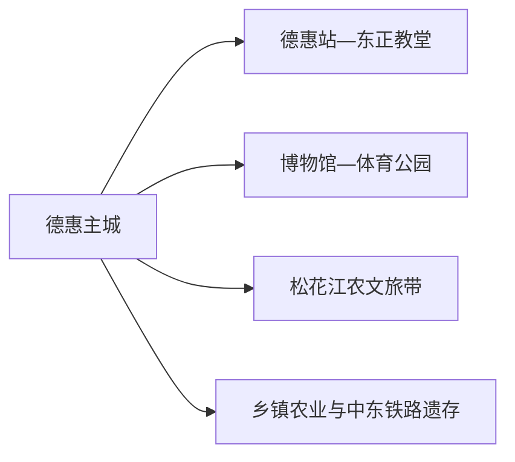
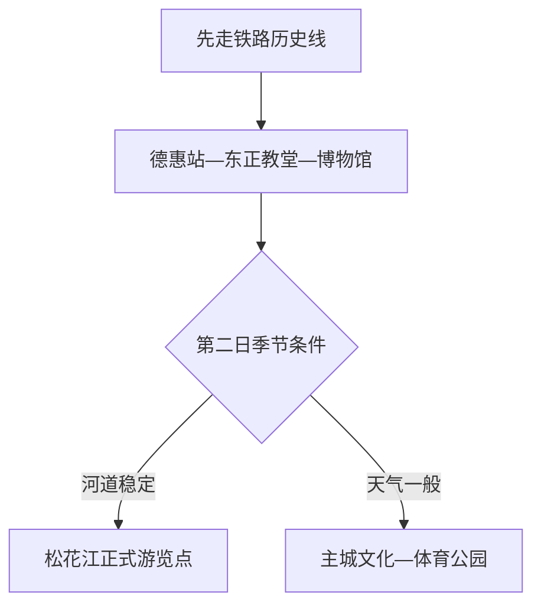

# 德惠旅行指南

德惠适合从中东铁路遗存和现代农业两条线认识：主城看德惠站、东正教堂、博物馆及历史建筑，远线则沿松花江或乡村公开项目理解平原农业。这里不是“景点密集型”城市，一天主城、一天季节远线，反而能保留真实的县域节奏。

> 建议停留：1–2 天 
> 旅行关键词：中东铁路、东正教堂、德惠博物馆、松花江、农业、东北饮食 
> 主要体力：低至中等 
> 最近研究：2026-08-13

## 城市速览

| 项目 | 旅行信息 |
|---|---|
| 主要旅行价值 | 从铁路建筑和城市博物馆理解近现代城镇形成，再以松花江与农业体验补充平原生态和生产生活 |
| 建议停留 | 1 天主城；2 天增加一条正式松花江或乡村线路 |
| 较舒适季节 | 春秋适合街区；夏季注意雷雨洪涝，冬季注意严寒与结冰 |
| 预算特点 | 主城低；远线车辆和乡村接待增加预算 |
| 步行强度 | 主城低至中等，历史建筑分散时需车辆 |
| 主要天气风险 | 严寒、暴雪、道路结冰、大风、雷雨、洪涝和河道水位 |
| 独行旅行 | 铁路主城方便；远线先锁定返程 |
| 亲子旅行 | 博物馆、体育公园和正式农业体验较适合 |
| 长者与低体力旅行 | 车辆连接铁路建筑、博物馆和城市公园 |
| 无障碍信息 | 现代公共场馆可咨询，历史建筑与乡村设施连续性需向官方确认 |

## 城市格局与游览区域

德惠市是长春市代管的县级市，法定代码 `220183`；GeoNames `2037712` 与 Wikidata `Q1022278` 精确对应。主城沿京哈铁路发展，松花江位于市域东侧，米沙子、菜园子等乡镇与农业片区有各自交通尺度。

| 区域 | 主要内容 | 怎么安排 | 与其他区域的关系 |
|---|---|---|---|
| 德惠站—老城 | 中东铁路附属建筑、东正教堂与城市生活 | 半日 | 可与博物馆同日 |
| 新城公共文化片区 | 博物馆、体育公园和现代服务 | 半日 | 住宿和休息基地 |
| 松花江方向 | 河流、湿地与正式农文旅项目 | 独立一日 | 水位、道路和接待决定可行性 |
| 窑门等铁路遗存 | 历史建筑和乡镇铁路节点 | 按公开点位半日 | 与主城建筑共同理解，不连续步行 |
| 农业和食品产业区 | 玉米、稻米、肉鸡及加工 | 选公开展陈和正规采购点 | 农田、厂区、仓储、铁路专用线按生产管理 |

## 主要景点

### 主城历史与公共文化

| 景点 | 区域 | 类型 | 主要看点 | 建议用时 | 室内外 | 体力 | 预约风险 | 天气影响 | 优先级 |
|---|---|---|---|---:|---|---|---|---|---|
| 德惠站—东正教堂历史片区 | 主城 | 铁路遗产与历史建筑 | 中东铁路节点、东正教堂外观和城市形成 | 2–3 小时 | 室外为主 | 中 | 高 | 高 | A |
| 德惠市博物馆及公共文化场馆 | 主城 | 博物馆 | 地方史、铁路、农业和当期展览 | 1–2 小时 | 室内 | 低 | 高 | 低 | A |
| 德惠市体育公园 | 主城 | 城市公园 | 城市休闲、健身与亲子停留 | 1–2 小时 | 室外 | 低 | 低 | 高 | B |
| 中东铁路窑门站区公开建筑 | 乡镇铁路方向 | 工业与铁路遗产 | 修缮后的附属建筑和铁路聚落空间 | 2–3 小时 | 混合 | 中 | 很高 | 高 | B |

### 松花江与农业

| 景点 | 区域 | 类型 | 主要看点 | 建议用时 | 室内外 | 体力 | 预约风险 | 天气影响 | 优先级 |
|---|---|---|---|---:|---|---|---|---|---|
| 松花江农文旅带正式游览点 | 市域东部 | 河流与乡村 | 松花江景观、村落和当期公开活动 | 半日至一日 | 室外 | 中 | 很高 | 很高 | B |
| 正式农业研学或采摘项目 | 乡镇 | 农业体验 | 玉米、水稻等生产知识与季节体验 | 半日 | 混合 | 中 | 很高 | 高 | C |
| 乡村历史文化公开点 | 市域乡镇 | 乡村与地方史 | 村落公共空间、地方非遗和节庆 | 半日 | 混合 | 中 | 很高 | 高 | C |

德惠站、东正教堂和中东铁路附属建筑属于同一铁路历史主线，但位置分散；按公开建筑分别到达。松花江滩地、堤防、排涝工程、农田、养殖和食品加工设施按水利及生产范围活动。

## 美食与餐饮

德惠的餐桌以东北家常菜、玉米、稻米、豆制品和禽肉为主。主城餐馆最适合独行和过敏原沟通，乡村餐饮只作为已确认活动的一部分。

| 菜品或餐饮类型 | 常见区域 | 一个人用餐与常见份量 | 风味、过敏原与饮食限制 | 排队风险与替代方法 |
|---|---|---|---|---|
| 东北炖菜 | 主城家常菜馆 | 多为合菜，先问半份 | 常含猪肉、鸡肉、大豆酱和葱蒜 | 独行选套餐或小份 |
| 玉米粥、玉米饼与鲜食玉米 | 早餐店、正规农产品店 | 一份适合一人 | 玉米制品可能与小麦、蛋、奶共线 | 选择配料明确产品 |
| 鸡肉菜肴 | 主城餐馆 | 一盘适合分享 | 骨头、辣椒和大豆调味常见 | 问清做法与份量 |
| 酸菜、豆腐与家常凉菜 | 主城生活区 | 小份容易组合 | 含大豆，酸菜菜肴可能含猪油或肉汤 | 素食者明确询问汤底 |
| 稻米和乡村宴 | 正式乡村活动 | 多为多人桌餐 | 菜品多、过敏原复杂 | 独行优先在主城用餐 |

## 经典行程

### 一日经典路线

**路线**：德惠站 → 东正教堂历史片区 → 主城午餐 → 德惠市博物馆 → 体育公园

- **串联逻辑**：用铁路遗产和博物馆解释城市形成，下午在现代公共空间收尾。
- **预约锚点**：博物馆和历史建筑公开范围。
- **休息安排**：主城午餐与公共文化场馆。
- **时间不足时**：保留德惠站—东正教堂外观和博物馆。

### 两日城市路线

**第 1 天**：主城铁路历史线。  
**第 2 天**：松花江正式游览点或窑门铁路遗存二选一。

- **串联逻辑**：第二天按河流生态与铁路历史兴趣选择一个远线。
- **预约锚点**：接待、车辆、场馆和返程。
- **休息安排**：第一天主城；第二天使用乡镇正式服务点。
- **时间不足时**：删第二天远线。

### 三日深度路线

**第 1 天**：主城。  
**第 2 天**：松花江方向。  
**第 3 天**：窑门铁路遗存或正式农业体验。

- **串联逻辑**：河流、铁路和农业各有不同接待条件，分日最清楚。
- **预约锚点**：远线接待、道路和活动。
- **休息安排**：连续住主城。
- **时间不足时**：先删第三天。

### 雨雪天路线

**路线**：德惠市博物馆 → 主城午餐 → 公共文化场馆

- **适用条件**：城区交通正常；暴雪、严寒或积水时减少外出。
- **预约锚点**：场馆公告和道路状态。
- **休息安排**：同一城区片区内活动。
- **时间不足时**：只保留博物馆。

### 亲子与低体力路线

**亲子路线**：博物馆 → 体育公园 → 适龄公共文化活动。  
**低体力路线**：车辆到东正教堂外观 → 主城午休 → 博物馆。

- **减负方式**：亲子路线用公园和展陈替代远线；低体力路线减少站区步行。
- **预约锚点**：儿童活动、电梯与座椅。
- **休息安排**：主城餐饮和场馆。
- **时间不足时**：两类路线都只保留博物馆与午餐。

### 远郊一日路线

**路线**：德惠主城 → 松花江正式游览点 → 乡镇午餐与休息 → 返回

- **适用条件**：水位、道路、接待与车辆均确认。
- **预约锚点**：活动、车辆、停车和返程。
- **休息安排**：正式游客服务点或乡镇生活区。
- **时间不足时**：整段改为主城铁路历史线。

## 住宿区域

| 区域 | 优点 | 缺点 | 适合人群 | 交通特点 |
|---|---|---|---|---|
| 德惠站—主城 | 铁路、餐饮和历史线方便 | 站区交通和噪声需看具体位置 | 首访、独行与短住者 | 去各方向最灵活 |
| 新城公共服务区 | 现代住宿、停车和公园方便 | 到老城需短接驳 | 自驾、家庭与低体力旅行者 | 车辆连接场馆 |
| 乡镇正式接待点 | 靠近远线活动 | 餐饮、供暖和返程选择有限 | 农业和摄影主题者 | 提前锁定接待与车辆 |

## 市内交通

| 场景 | 建议与取舍 | 行前需要重查的内容 |
|---|---|---|
| 铁路抵达 | 德惠站进入主城，德惠西站等站名和车次按票面确认 | 12306、到站、公交和晚点 |
| 主城移动 | 公交、出租和网约车连接历史与公共文化片区 | 运营时间、施工和冬季路况 |
| 松花江/乡镇 | 自驾或正规包车更灵活 | 堤防道路、返程、积水与通信 |
| 冬季出行 | 给候车、除雪和道路结冰留余量 | 极寒预警、停运和救援 |

## 不同旅行者须知

| 旅行维度 | 可行条件 | 主要取舍 | 需额外核对 |
|---|---|---|---|
| 独行旅行 | 主城铁路与餐饮方便 | 远线先锁定返程 | 夜间上客点和通信 |
| 亲子旅行 | 博物馆、公园和正规农业体验 | 河岸与厂区按公开范围选择 | 儿童活动和卫生间 |
| 长者或低体力旅行 | 车辆连接核心点 | 取消远线长步行 | 电梯、座椅和入口距离 |
| 无障碍需求 | 现代公共场馆可咨询 | 历史建筑和乡村连续通行资料有限 | 设施连续性需向官方确认 |
| 铁路遗产访问 | 公开建筑与城市道路可形成主线 | 运营铁路、专用线和封闭建筑按安全范围活动 | 列车、围栏和拍摄规则 |
| 松花江旅行 | 正式观景点和公开活动 | 堤防、排涝、滩地与作业水域按管理范围活动 | 水位、防汛和封闭 |

## 行前核对

| 核对事项 | 为什么需要重查 | 建议核对时间 | 官方入口 |
|---|---|---|---|
| 历史建筑与博物馆 | 修缮和展陈可能改变公开范围 | 到访前一日 | [德惠市人民政府](https://www.dehui.gov.cn/) |
| 松花江与乡村项目 | 接待、水位和道路变化快 | 排入路线前及当天 | [德惠市政府工作报告](https://www.dehui.gov.cn/zwgk/zfgzbg/202601/t20260105_3458086.html) |
| 铁路 | 车次和站点按日期调整 | 出发前一周及当天 | [中国铁路 12306](https://www.12306.cn/) |
| 天气 | 严寒、暴雪、暴雨和洪涝影响城乡道路 | 出发前三日及当天 | [吉林省气象局](https://jl.cma.gov.cn/) |

## 来源与更新记录

### 主要来源

| 来源 | 类型 | 支持内容 | 核验日期 |
|---|---|---|---|
| [民政部行政区划代码服务](https://dmfw.mca.gov.cn/xzqh/getList?code=220000&trimCode=false&maxLevel=3) | 政府开放接口 | 德惠代码 `220183` 与长春代管关系 | 2026-08-13 |
| [德惠市 2026 年政府工作报告](https://www.dehui.gov.cn/zwgk/zfgzbg/202601/t20260105_3458086.html) | 属地政府 | 东正教堂、博物馆、铁路建筑、松花江农文旅和公共空间 | 2026-08-13 |
| [吉林省地方志：游遍吉林·德惠](https://dfz.jl.gov.cn/ybjl/201806/t20180626_5217185.html) | 省级地方志机构 | 城市区位、铁路与东正教堂历史 | 2026-08-13 |
| [GeoNames 2037712](https://www.geonames.org/2037712/) | 开放地名库 | 城市记录与坐标 | 2026-08-13 |
| [Wikidata Q1022278](https://www.wikidata.org/wiki/Q1022278) | 开放知识库 | 法定城市实体与 GeoNames 精确映射 | 2026-08-13 |

### 更新记录

| 日期 | 更新内容 |
|---|---|
| 2026-08-13 | 首次建立德惠独立指南；以铁路历史和博物馆为核心，把松花江、乡村农业和铁路遗存作为条件化远线，并明确河道、铁路和生产空间边界。 |
