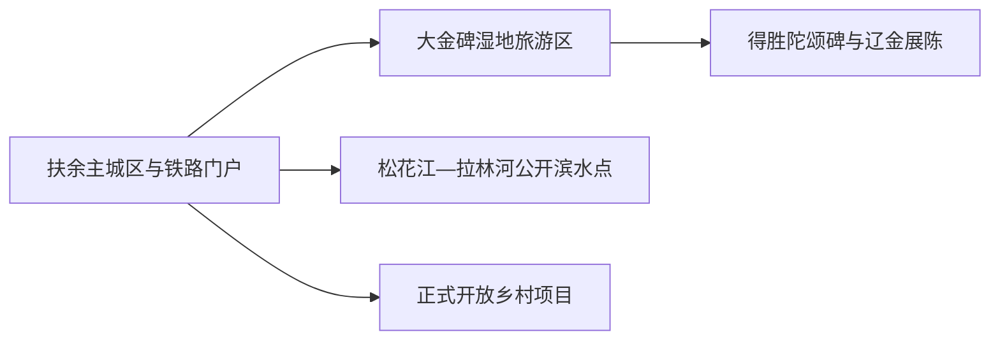
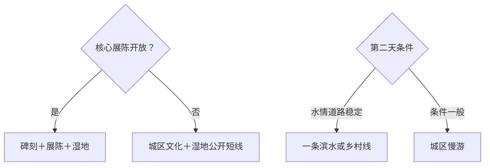

# 扶余旅行指南

扶余的旅行线索集中而克制：主城区适合作铁路到离和地方生活基地，大金得胜陀颂碑—大金碑湿地旅游区是一条完整的辽金历史与湿地线，松花江、拉林河沿岸和乡村项目则按公开入口择一。它更适合一至两天慢看，而不是把松原市域所有湖泊和湿地都塞进同一页。

> 建议停留：1–2 天；大金碑方向留半日至一日 
> 旅行关键词：大金得胜陀颂碑、辽金历史、湿地、松花江平原、非遗 
> 主要体力：城区低；湿地与乡村中等 
> 最近研究：2026-08-13

## 城市速览

| 项目 | 旅行信息 |
|---|---|
| 主要旅行价值 | 以女真文碑刻、辽金历史展陈和湿地环境理解扶余 |
| 建议停留 | 1 天完成主城与大金碑；2 天加入一个公开乡村或滨水方向 |
| 较舒适季节 | 春秋步行舒适；夏季防雷雨和蚊虫；冬季注意严寒与结冰 |
| 预算特点 | 城区平实，远线车辆和讲解是主要增量 |
| 步行强度 | 场馆低，湿地和乡村中等，可缩短为入口短线 |
| 主要天气风险 | 强对流、暴雨、河湖水位、大风、严寒和道路结冰 |
| 独行旅行 | 铁路到离方便，乡镇返程需先确认 |
| 亲子旅行 | 历史展陈、碑刻和湿地观察适合分段安排 |
| 长者与低体力旅行 | 车辆直达核心点，减少湿地长步行 |
| 无障碍信息 | 现代服务区可先询问；碑刻、湿地和乡村设施连续性需向官方确认 |

## 城市格局与游览区域

扶余是松原市代管的县级市，法定代码 `220781`。固定 GeoNames `2037335` 是扶余主城居民点；法定实体 Wikidata `Q185940` 当前以 `P1566=2037328` 连接另一条行政记录，因此本页用固定点定位主城、用法定代码和 QID 确定县级市边界。GeoNames `2037335` 另有薄点实体 `Q28809424`，不另建第二个城市页。

| 区域 | 主要内容 | 游览特点 | 与其他区域的关系 |
|---|---|---|---|
| 扶余主城区 | 铁路、住宿、餐饮与公共文化 | 适合抵达、补给和雨天 | 是各方向交通基地 |
| 得胜镇—大金碑方向 | 大金得胜陀颂碑、湿地与辽金历史展陈 | 核心目的地，可安排半日至一日 | 先核展馆和游客中心开放 |
| 松花江—拉林河沿岸 | 正式公共岸线、生态和乡村景观 | 水位、汛期和道路影响明显 | 每次选择一个公开入口 |
| 乡村与农业方向 | 非遗、农业和当期节庆 | 以活动或接待项目进入 | 与生产空间分开理解 |
| 松原联程 | 地级市公共服务与跨城交通 | 行政代管不等于同城步行 | 住宿和返程分开计算 |

扶余位于河流冲积平原，湿地、农田、堤防和水利设施彼此邻近。观鸟、摄影和乡村体验采用开放步道、游客服务区或正式活动；农机作业区、堤防抢险通道和保护湿地核心区域按管理要求通行。

## 主要景点

### 辽金历史核心

| 景点 | 区域 | 类型 | 主要看点 | 建议用时 | 室内外 | 体力 | 预约风险 | 天气影响 | 优先级 |
|---|---|---|---|---:|---|---|---|---|---|
| 大金得胜陀颂碑—辽金历史文物陈列单元 | 得胜镇 | 全国重点文保、历史展陈 | 女真文与汉文碑刻、金代历史和相关考古展陈；按一个完整单元计 | 2–4 小时 | 混合 | 低至中 | 高 | 中 | A |
| 大金碑国家湿地公园公开游览区 | 得胜镇 | 湿地、自然教育 | 湿地环境、季节鸟类和正式步道 | 2–4 小时 | 室外 | 中 | 高 | 很高 | A |

### 城区与市域补充

| 景点 | 区域 | 类型 | 主要看点 | 建议用时 | 室内外 | 体力 | 预约风险 | 天气影响 | 优先级 |
|---|---|---|---|---:|---|---|---|---|---|
| 扶余市正式公共文化场馆 | 主城区 | 地方文博、公共文化 | 城市沿革、地方文化与临展 | 1–2 小时 | 室内 | 低 | 中 | 低 | B |
| 主城区公园与生活街区 | 主城区 | 城市休闲 | 平原城市日常与短时休息 | 1–2 小时 | 室外 | 低 | 低 | 高 | B |
| 正式开放松花江／拉林河滨水点 | 市域 | 河流、生态 | 河岸景观和季节生态 | 2–4 小时 | 室外 | 中 | 高 | 很高 | C |
| 当期乡村非遗活动 | 市域乡村 | 非遗、节庆 | 扶余剪纸、烙花葫芦等活动展示 | 2–4 小时 | 混合 | 低至中 | 很高 | 高 | C |

大金碑湿地与得胜陀颂碑距离相近，适合作一条主题线；是否能同日进入陈列馆、碑刻保护区和湿地步道，仍由各入口开放时间决定。河岸远点仅在水情、道路和返程清楚时加入第二天。

## 美食与餐饮

| 菜品或餐饮类型 | 常见区域 | 一个人用餐与常见份量 | 风味、过敏原与饮食限制 | 排队风险与替代方法 |
|---|---|---|---|---|
| 东北家常菜与炖菜 | 主城区 | 多人共享，一人选小份 | 肉类、大豆、粉条和盐分 | 改点盖饭或单人套餐 |
| 玉米、黏豆包与杂粮 | 早餐店、市场 | 可按个购买 | 糯米、豆馅、糖 | 选现制少量 |
| 江鱼与河鲜 | 正规餐馆 | 整鱼适合共享 | 细刺、鱼虾过敏、时令来源 | 先问重量、计价和来源 |
| 酸菜与豆制品家常菜 | 城区 | 一至两人可点小份 | 大豆、肉汤和盐分 | 说明清淡与素食需求 |

## 经典行程

### 一日经典路线

**路线**：扶余主城区出发 → 大金得胜陀颂碑与辽金展陈 → 午餐 → 大金碑湿地公开步道 → 返回城区

- **串联逻辑**：历史遗址与周边湿地形成同一主题方向，减少跨市域移动。
- **预约锚点**：陈列馆、碑刻保护区和湿地入口开放。
- **休息安排**：中午在正规服务点长休，湿地只走体力允许的短段。
- **时间不足时**：保留碑刻与展陈，缩短湿地步道。

### 两日城市路线

**路线**：第 1 天大金碑历史湿地线。 
**第 2 天**：城区公共文化 → 午餐 → 一个公开滨水或乡村项目。

- **串联逻辑**：核心历史放首日，第二天按季节补充地方生活与生态。
- **预约锚点**：第二天活动、车辆和返程。
- **休息安排**：住主城区，远点午间安排固定坐休。
- **时间不足时**：第二天只留城区半日。

### 三日深度路线

**路线**：第 1 天主城区与公共文化。 
**第 2 天**：得胜镇历史湿地线。 
**第 3 天**：当期正式乡村节庆或单一河岸方向。

- **串联逻辑**：从城市、历史到季节乡村逐层展开，不跨河岸赶多个点。
- **预约锚点**：第三天接待、天气和返程。
- **休息安排**：每天回城区住宿。
- **时间不足时**：优先删除第三天。

### 雨雪天路线

**路线**：主城区公共文化场馆 → 午餐 → 辽金主题室内展陈或城区休息

- **适用条件**：普通降雨或降雪；结冰和暴雪时减少跨镇移动。
- **串联逻辑**：以室内展陈替代湿地和河岸。
- **预约锚点**：场馆开放与道路状态。
- **休息安排**：馆内和城区餐饮区。
- **时间不足时**：保留一个主题馆。

### 亲子或低体力路线

**亲子路线**：辽金展陈精选内容 → 午餐 → 湿地游客区短线。 
**低体力路线**：车辆直达碑刻／展馆落客点 → 核心展陈 → 午餐 → 返回城区。

- **减负方式**：亲子线把湿地观察控制在一小段；低体力线以车辆连接并取消长步道。
- **预约锚点**：儿童讲解、卫生间、座椅、轮椅和落客点。
- **休息安排**：每个主点后坐休。
- **时间不足时**：两线均保留室内展陈。

### 远郊一日路线

**路线**：主城区 → 一个已确认开放的河岸／乡村项目 → 正规午餐点 → 原路返回

- **适用条件**：水情、道路、接待和返程明确。
- **串联逻辑**：只选一个方向，保留平原公路和汛期余量。
- **预约锚点**：联系人、车辆、活动和返程。
- **休息安排**：正规接待点或回城区午餐。
- **时间不足时**：改为城区公园短线。

## 住宿区域

| 区域 | 优点 | 缺点 | 适合人群 | 交通特点 |
|---|---|---|---|---|
| 扶余站—主城区 | 铁路、餐饮、补给和叫车集中 | 到得胜镇仍需地面交通 | 首访、公共交通、短住 | 适合作统一基地 |
| 扶余北站方向 | 高铁到离便利 | 与城区和景点有接驳距离 | 晚到早走、铁路联程 | 核对站名与住宿接送 |
| 得胜镇正规接待点 | 便于历史湿地线 | 夜间餐饮和交通选择较少 | 专题慢游、自驾 | 订房前确认开放和返程 |

## 市内交通

| 场景 | 建议与取舍 | 行前需要重查的内容 |
|---|---|---|
| 铁路抵达 | 扶余站、扶余北站按票面站名和住宿位置选择 | 车次、停站、公交、叫车点和末班 |
| 城区移动 | 公交、出租或网约车适合短程 | 线路、支付、夜间服务 |
| 得胜镇方向 | 正规包车、自驾或明确班线更稳妥 | 精确入口、道路、停车和返程 |
| 河岸与乡村 | 车辆只到正式接待点 | 汛期、水位、道路和通信 |

## 不同旅行者须知

| 旅行维度 | 可行条件 | 主要取舍 | 需额外核对 |
|---|---|---|---|
| 独行旅行 | 铁路和城区服务易安排 | 乡镇返程选择较少 | 车辆、末班和联系人 |
| 亲子旅行 | 历史和湿地主题互补 | 户外时长按天气缩短 | 儿童讲解、蚊虫和水边看护 |
| 长者或低体力旅行 | 车辆加室内展陈 | 湿地长步道减量 | 落客点、座椅和卫生间 |
| 无障碍需求 | 新场馆和游客中心优先咨询 | 碑刻、乡村和湿地存在不连续路面 | 设施连续性需向官方确认 |
| 摄影旅行 | 碑刻、湿地和候鸟题材清晰 | 文保、鸟类和无人机规则优先 | 拍摄许可、禁飞和季节限制 |
| 生态与生产空间 | 开放步道和活动入口可行 | 农田、堤防与湿地保护管理优先 | 准入、水情和作业安排 |

## 行前核对

| 核对事项 | 为什么需要重查 | 建议核对时间 | 官方入口 |
|---|---|---|---|
| 大金碑景区与展陈 | 场馆、讲解、湿地步道和活动会调整 | 排路线前及前一日 | [吉林省政府：扶余文旅资料](https://www.jl.gov.cn/szfzt/gzlfz/gzdt/202510/t20251021_3505894.html) |
| 城市与乡村活动 | 节庆、非遗展和接待日期变化 | 出发前一周 | [扶余市人民政府](https://www.fuyu.gov.cn/) |
| 铁路 | 两站停靠与班次变化 | 购票前及当天 | [中国铁路12306](https://www.12306.cn/) |
| 天气与水情 | 雷雨、汛情、大风和结冰影响湿地河岸 | 出发前三日及当天 | [吉林省气象局](http://jl.cma.gov.cn/) |

## 来源与更新记录

### 主要来源

| 来源 | 类型 | 支持内容 | 核验日期 |
|---|---|---|---|
| [吉林省政府：扶余文旅市场与大金碑资料](https://www.jl.gov.cn/szfzt/gzlfz/gzdt/202510/t20251021_3505894.html) | 省级政府 | 大金得胜陀颂碑、湿地旅游区、非遗展与游客服务 | 2026-08-13 |
| [扶余市人民政府](https://www.fuyu.gov.cn/) | 属地政府 | 场馆、交通、活动和风险核对入口 | 2026-08-13 |
| [吉林省人民政府行政区划](https://www.jl.gov.cn/shengqing/xzqh/) | 省级政府 | 扶余县级市与松原代管关系 | 2026-08-13 |
| [Wikidata Q185940](https://www.wikidata.org/wiki/Special:EntityData/Q185940.json) | 开放结构化数据 | 法定实体与行政记录粒度 | 2026-08-13 |
| [GeoNames 2037335](https://sws.geonames.org/2037335/about.rdf) | 开放地名数据 | 固定扶余主城记录 | 2026-08-13 |
| [民政部行政区划代码查询](https://dmfw.mca.gov.cn/xzqh/getList?code=220781&trimCode=false&maxLevel=3) | 国家行政区划数据 | 法定代码 220781 | 2026-08-13 |

### 更新记录

| 日期 | 更新内容 |
|---|---|
| 2026-08-13 | 首次完成扶余指南，核验辽金历史、湿地、铁路双门户和县级市实体粒度 |
