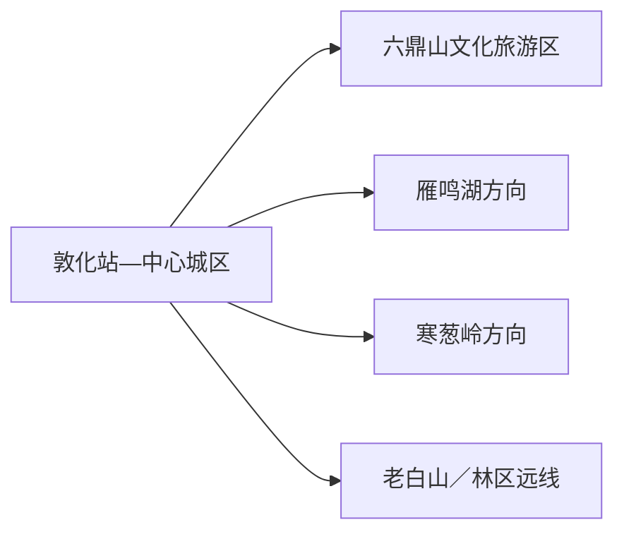
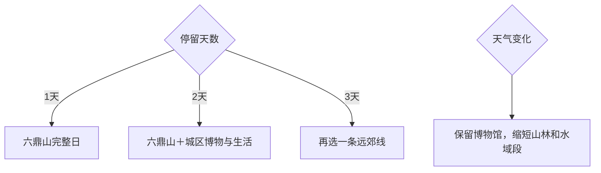

# 敦化旅行指南

敦化是延边西部的山林城市，最成熟的首访组合是六鼎山文化旅游区与敦化市历史博物馆；多留一天，再从雁鸣湖、寒葱岭或老白山中选一个远线。市域很大，湿地、自然保护地、林场和生产道路交错，路线以正式景区和已确认接待的入口为准。

> 建议停留：1–3 天 
> 旅行关键词：六鼎山、渤海文化、山林湿地、东北饮食 
> 主要体力：城区低；六鼎山中等；远郊中等至较高 
> 最近研究：2026-08-12

## 城市速览

| 项目 | 旅行信息 |
|---|---|
| 主要旅行价值 | 在六鼎山把渤海、宗教与山水放在同一框架中，再用远郊山林或湿地认识长白山腹地生态 |
| 建议停留 | 1天以六鼎山为主；2天加城区与博物馆；3天增加一条雁鸣湖、寒葱岭或老白山远线 |
| 较舒适季节 | 夏季适合避暑，秋季看山林色彩，冬季看冰雪；每季都需重查道路与项目运营 |
| 预算特点 | 城区中等，六鼎山票务与景交、远郊车辆和冬季装备是主要增量 |
| 步行强度 | 六鼎山内部尺度较大；远郊山地与雪地活动明显增加体力 |
| 主要天气风险 | 强降雨、山洪、林区火险、低温、积雪结冰与能见度下降 |
| 独行旅行 | 城区和六鼎山较易执行；远郊以正式接待、清晰返程和日间活动为条件 |
| 亲子旅行 | 六鼎山与历史博物馆主题明确；冰雪和山地项目按年龄、装备和体力选择 |
| 长者与低体力旅行 | 采用景交与短段步行，远郊只选有游客服务的低强度项目 |
| 无障碍信息 | 景区单点信息不足以证明全程连续，设施连续性需向官方确认 |

## 城市格局与游览区域

敦化站与城市生活核心位于牡丹江河谷，六鼎山在城区南侧，是最适合首访的成熟目的地。雁鸣湖、寒葱岭、老白山、秋梨沟等分别位于不同方向，往返常占整日；长白山景区、镜泊湖和延吉属于跨城续程。

| 区域 | 主要内容 | 游览特点 | 与其他区域的关系 |
|---|---|---|---|
| 中心城区 | 敦化站、渤海湖公共空间、餐饮与住宿 | 低强度，承担抵离和补给 | 与六鼎山可同日串联 |
| 六鼎山片区 | 六鼎山文化旅游区、敦化市历史博物馆 | 父景区内部尺度大，至少半天 | 是首访核心，不与远郊硬拼 |
| 雁鸣湖方向 | 湖泊、湿地与度假项目 | 水域与保护边界并存 | 完整一日往返，项目运营需核 |
| 寒葱岭方向 | 抗联文化、山林与季节景观 | 秋季和红色文化主题明显 | 独立半天至一天 |
| 老白山及林区 | 山地森林、冰雪与生态体验 | 距离、天气和道路门槛最高 | 单独一天，使用正式景区入口 |

GeoNames `2037534`、Wikidata `Q713307` 与法定代码 `222403` 对应县级敦化市；敦化由延边朝鲜族自治州管辖，但与州府延吉市是两个独立城市。六鼎山位于敦化市，长白山主景区则按其实际行政和景区管理范围另行规划。

## 主要景点

### 城区与六鼎山

| 景点 | 区域 | 类型 | 主要看点 | 建议用时 | 室内外 | 体力 | 预约风险 | 天气影响 | 优先级 |
|---|---|---|---|---:|---|---|---|---|---|
| 六鼎山文化旅游区 | 城区南郊 | 5A景区、文化与山水综合体 | 渤海文化、宗教建筑、清始祖文化与湖山空间 | 5–7小时 | 室内外结合 | 中 | 高；门票、景交、活动和分区需核 | 中至高 | A |
| 敦化市历史博物馆 | 六鼎山景区内 | 综合博物馆 | 敦化自然、社会与各民族交往史 | 1–1.5小时 | 室内 | 低 | 中；开放和与景区票制关系需核 | 低 | A |
| 渤海湖及城区公共空间 | 中心城区 | 城市公园、休息节点 | 城市日常、季节活动与夜间散步 | 1–2小时 | 室外 | 低 | 低；冰雪活动与水岸开放需核 | 高 | B |

六鼎山内的正觉寺、金鼎大佛、清祖祠、古墓群与博物馆按一个父景区组织路线，不拆成多个完成项。宗教空间、墓葬保护区与考古区域分别服从礼仪和文物管理。

### 远郊山林与湿地

| 景点 | 区域 | 类型 | 主要看点 | 建议用时 | 室内外 | 体力 | 预约风险 | 天气影响 | 优先级 |
|---|---|---|---|---:|---|---|---|---|---|
| 寒葱岭枫叶红色旅游观光区 | 寒葱岭方向 | 山林、红色文化 | 抗联历史与秋季林色 | 4–6小时 | 室外为主 | 中 | 高；季节、道路和接待需核 | 高 | B |
| 雁鸣湖方向正式旅游项目 | 雁鸣湖镇 | 湖泊、湿地、度假 | 湖区景观、湿地生态与季节活动 | 5–7小时 | 室外为主 | 中 | 高；具体运营点、游船与住宿需核 | 高 | C |
| 老白山原始生态风景区 | 黄泥河／林区方向 | 山地森林、冰雪 | 林海、山地与冬季冰雪体验 | 6–8小时 | 室外 | 中至高 | 高；道路、门票、装备和接待需核 | 高 | C |
| 秋梨沟国家湿地公园方向 | 秋梨沟 | 湿地、自然观察 | 河谷湿地与季节性鸟类环境 | 4–6小时 | 室外 | 中 | 高；开放区和观测线路需核 | 高 | C |

自然保护区、湿地核心区、林场生产道路和防火封控区各有不同管理规则。选择远线时，优先使用政府或运营方公布的开放景区、栈道和接待线路，观鸟和摄影留在规定距离内。

## 美食与餐饮

| 菜品或餐饮类型 | 常见区域 | 一个人用餐与常见份量 | 风味、过敏原与饮食限制 | 排队风险与替代方法 |
|---|---|---|---|---|
| 朝鲜族冷面 | 城区餐饮区 | 一碗适合一人 | 常含小麦／荞麦、牛肉、鸡蛋、芝麻，汤底可能偏甜酸 | 午餐错峰，过敏原逐项确认 |
| 石锅拌饭与酱汤 | 城区与六鼎山周边 | 一人容易点单 | 常含大豆、芝麻、鸡蛋、辣酱和肉类 | 选择可调整辣度的同类店 |
| 东北炖菜 | 城区家常菜馆 | 多人共享更合适 | 常含猪肉、菌菇、豆制品和较多盐 | 一人选小锅或半份 |
| 山野菜、菌菇与林区食材 | 正规餐厅 | 按季节供应 | 只食用可追溯、充分烹熟食材，留意菌菇过敏 | 不采食野生菌，选择正规采购渠道 |
| 烧烤 | 城区夜间餐饮区 | 多人共享，一人可少量点串 | 常含肉类、海鲜、花生、芝麻和辣椒 | 晚餐错峰并确认生熟分开 |

## 经典行程

### 一日经典路线

**路线**：六鼎山游客中心 → 景区正式游线 → 敦化市历史博物馆 → 返回城区用餐

- **串联逻辑**：全部时间留给成熟父景区，馆藏为山岳与历史建立背景。
- **预约锚点**：六鼎山门票、景交、博物馆开放与宗教活动。
- **休息安排**：游客中心、景区正式服务点和返城晚餐。
- **时间不足时**：缩短室外支线，保留博物馆与一个核心文化段。

### 两日城市路线

**第1天**：六鼎山完整游览。\
**第2天**：敦化市历史博物馆补看 → 城区公共空间 → 本地餐饮。

- **串联逻辑**：将景区大尺度与城区慢节奏拆开，第二天承担天气缓冲。
- **预约锚点**：博物馆开放、冬季活动和交通。
- **休息安排**：第二天在城区分段休息。
- **时间不足时**：第二天只保留博物馆或直接转场。

### 三日深度路线

**第1天**：六鼎山。\
**第2天**：城区与历史博物馆。\
**第3天**：寒葱岭、雁鸣湖或老白山三选一。

- **串联逻辑**：第三天只选一个方向，避免跨林区和湖区赶路。
- **预约锚点**：远线运营、道路、车辆、住宿和返程。
- **休息安排**：使用景区游客中心与正规乡镇餐饮。
- **时间不足时**：整段删除第三天。

### 雨天路线

**路线**：敦化市历史博物馆 → 城区午餐 → 六鼎山当日开放的室内文化空间

- **适用条件**：普通降雨可执行；暴雨、雷电、强风或道路预警时留在城区。
- **预约锚点**：博物馆与六鼎山分区开放。
- **休息安排**：场馆公共区和城区餐饮。
- **时间不足时**：只保留历史博物馆。

### 亲子或低体力路线

**亲子路线**：历史博物馆 → 六鼎山短段文化游线 → 城区晚餐。\
**低体力路线**：景交连接六鼎山主要节点 → 历史博物馆 → 返回城区。

- **减负方式**：亲子路线用场馆加短段户外；低体力路线减少连续坡道与站立。
- **预约锚点**：景交、儿童规则、无障碍入口和座椅。
- **休息安排**：游客中心与博物馆之间安排完整午休。
- **时间不足时**：两类都保留博物馆，删第二段户外。

### 远郊一日路线

**路线**：敦化城区 → 寒葱岭／雁鸣湖／老白山三选一 → 返回或在正规住宿点入住

- **适用条件**：天气、道路、景区开放和往返车辆均已确认时采用。
- **预约锚点**：门票、接驳、活动、住宿和返程。
- **休息安排**：正式游客中心、服务区和乡镇餐饮。
- **时间不足时**：整段改为城区—六鼎山，不缩短为赶路打卡。

## 住宿区域

| 区域 | 优点 | 缺点 | 适合人群 | 交通特点 |
|---|---|---|---|---|
| 敦化站—中心城区 | 抵离、餐饮和补给方便 | 到六鼎山及远郊需车辆 | 首访、公共交通、冬季旅行 | 适合作为多日固定基地 |
| 六鼎山入口方向 | 早入园方便，环境较安静 | 夜间餐饮和跨城交通选择较少 | 六鼎山深度、低节奏旅行 | 先确认景区入口与接送 |
| 雁鸣湖／林区正规住宿 | 减少远线当日往返 | 季节运营、供暖与交通不确定性较高 | 已锁定远郊项目者 | 预订前确认合法登记和返程 |

## 市内交通

| 场景 | 建议与取舍 | 行前需要重查的内容 |
|---|---|---|
| 铁路抵达 | 敦化站是主要铁路门户，适合接城区与六鼎山 | 车次、出站接驳和夜间叫车 |
| 城区—六鼎山 | 公交、出租或预约车辆均可作为骨干连接 | 首末班、景区入口和节假日交通 |
| 远郊方向 | 正规客运、景区接驳或预约车辆按单方向组织 | 道路、班次、返程和手机信号 |
| 自驾 | 适合远郊，但冬季和林区道路要求经验与装备 | 除雪、结冰、防火、停车和加油充电 |

## 不同旅行者须知

| 旅行维度 | 可行条件 | 主要取舍 | 需额外核对 |
|---|---|---|---|
| 独行旅行 | 城区与六鼎山正式游线可执行 | 远郊先锁返程和通信 | 末班、信号、闭园 |
| 亲子旅行 | 博物馆和短段景区游线 | 雪地、水边和宗教空间需持续看护 | 儿童规则、推车、卫生间 |
| 长者或低体力旅行 | 以景交和室内馆为主 | 山地、雪地与长距离换乘需减量 | 座椅、电梯、下客点 |
| 无障碍需求 | 逐点确认场馆与景区入口 | 山地父景区内连续动线资料有限 | 设施连续性需向官方确认 |
| 摄影旅行 | 山林、冰雪、建筑与城市夜景题材丰富 | 季节景观受天气影响 | 无人机、宗教摄影、保护区规则 |
| 预算有限 | 住城区并只选一条远线 | 包车和频繁换宿增加成本 | 票制、优惠与车费总额 |
| 冬季旅行 | 选择正式冰雪项目并准备保暖防滑 | 低温、结冰和日照短会降低效率 | 气温、道路、装备和退改 |
| 山林与湿地 | 使用开放栈道、步道和观景区 | 保护核心区与生产林道按管理边界活动 | 防火、洪水、野生动物和封控 |

## 行前核对

| 核对事项 | 为什么需要重查 | 建议核对时间 | 官方入口 |
|---|---|---|---|
| 六鼎山 | 门票、景交、活动、宗教空间与博物馆开放会变化 | 预约前及当天 | [吉林省文化和旅游厅·敦化旅游线路](https://whhlyt.jl.gov.cn/ztzl/jlslyxlhxj/gdxl/ybz/dhs/202506/t20250625_9264387.html) |
| 敦化市历史博物馆 | 开放时间、临展和景区入场关系需确认 | 到访前一日 | [吉林省文化和旅游厅·敦化市博物馆](https://whhlyt.jl.gov.cn/ggfw/whcg/bwg/201602/t20160222_3108014.html) |
| 远郊山林与湿地 | 季节运营、道路、防火和保护区管理决定可行性 | 订车住宿前及当天 | [敦化市人民政府](https://www.dunhua.gov.cn/) |
| 铁路与公路 | 班次、施工和冬季运行会变化 | 购票前及当天 | [中国铁路12306](https://www.12306.cn/) |
| 天气与火险 | 强降雨、低温、积雪和火险影响全部户外线 | 出发前三日及当天 | [吉林省气象局](http://jl.cma.gov.cn/) |

## 来源与更新记录

### 主要来源

| 来源 | 类型 | 支持内容 | 核验日期 |
|---|---|---|---|
| [吉林省文化和旅游厅：敦化市旅游线路](https://whhlyt.jl.gov.cn/ztzl/jlslyxlhxj/gdxl/ybz/dhs/202506/t20250625_9264387.html) | 省级文旅主管部门 | 六鼎山、历史博物馆及冬季组合关系 | 2026-08-12 |
| [吉林省文化和旅游厅：敦化市博物馆](https://whhlyt.jl.gov.cn/ggfw/whcg/bwg/201602/t20160222_3108014.html) | 场馆目录 | 博物馆位置、性质与联系入口 | 2026-08-12 |
| [吉林省文化和旅游厅：敦化文旅融合](https://whhlyt.jl.gov.cn/dfwhxx/202504/t20250424_9196161.html) | 省级文旅资料 | 历史博物馆、六鼎山、寒葱岭与中成村关系 | 2026-08-12 |
| [敦化市“十四五”规划](https://www.dunhua.gov.cn/dhszfxxgkw/cyqzf/xxgkml/202112/t20211201_366031.html) | 市政府规划 | 六鼎山、雁鸣湖、老白山、寒葱岭与自然保护体系 | 2026-08-12 |
| [Wikidata：Q713307](https://www.wikidata.org/wiki/Special:EntityData/Q713307.json) | 开放结构化数据 | 敦化市与GeoNames交叉核验 | 2026-08-12 |
| [GeoNames：2037534](https://sws.geonames.org/2037534/about.rdf) | 开放地名数据 | 敦化城市驻地点记录 | 2026-08-12 |
| [民政部行政区划代码查询](https://dmfw.mca.gov.cn/xzqh/getList?code=222403&trimCode=false&maxLevel=3) | 国家行政区划数据 | 法定代码222403 | 2026-08-12 |

### 更新记录

| 日期 | 更新内容 |
|---|---|
| 2026-08-12 | 首次完成敦化指南，建立六鼎山核心与三条远郊方向的选择框架 |
