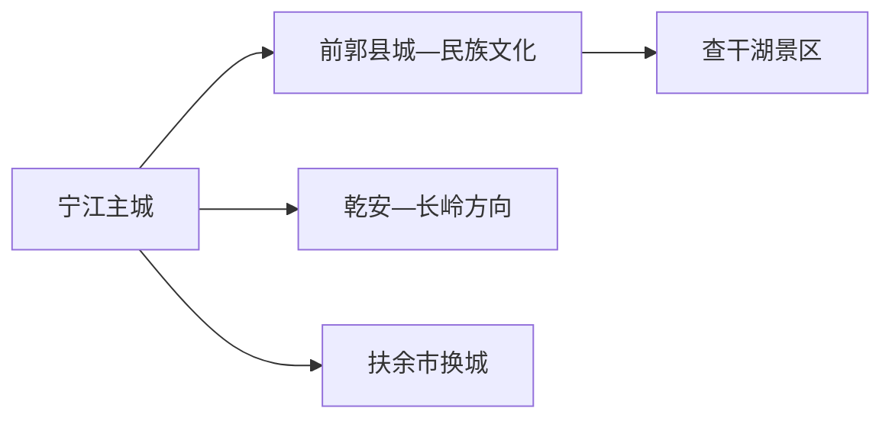
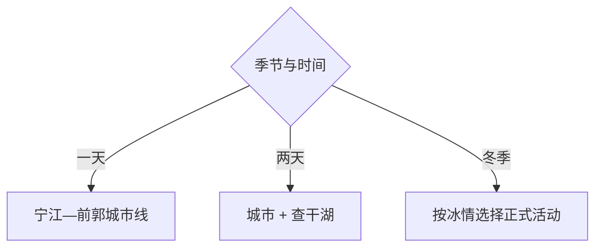

# 松原旅行指南

松原适合把宁江主城作为铁路、住宿和市级文博基地，再用完整一天前往前郭尔罗斯蒙古族自治县的查干湖。春夏可选择江河、湿地和草原文化，冬季则以确认运营的冰雪与渔猎文化活动为主；扶余市是独立县级市，相关行程另按换城安排。

> 建议停留：宁江主城 1 天；查干湖另留 1–2 天 
> 旅行关键词：松嫩平原、松花江、查干湖、前郭尔罗斯、渔猎文化、冰雪 
> 主要体力：主城低至中等；湖区中等，冬季低温显著增加负担 
> 最近研究：2026-08-13

## 城市速览

| 项目 | 旅行信息 |
|---|---|
| 主要旅行价值 | 在宁江建立松嫩平原城市框架，再到查干湖体验湖泊、蒙古族文化与季节渔猎主题 |
| 建议停留 | 1 天主城；2 天加入查干湖；冬季或摄影可在湖区多住 1 晚 |
| 较舒适季节 | 5–10 月适合滨水与湖区；稳定冰雪季适合正式冬季项目 |
| 预算特点 | 主城中低；查干湖车辆、住宿、船雪项目和节庆旺季是主要增量 |
| 步行强度 | 主城可分段步行，湖区点位分散并依赖接驳 |
| 主要天气风险 | 严寒、暴雪、大风、道路结冰、湖面冰情、雷雨、洪涝与草原火险 |
| 独行旅行 | 主城方便；湖区优先选择官方入口、正规住宿和明确返程 |
| 亲子旅行 | 市级文博、湖区科普与低强度冰雪活动可按年龄选择 |
| 长者与低体力旅行 | 主城场馆和车辆到湖区服务区更合适 |
| 无障碍信息 | 城市现代场馆可咨询，湖岸、冰雪和民俗场所的设施连续性需向官方确认 |

## 城市格局与游览区域

松原市是法定地级市，行政代码 `220700`，宁江区承担主城功能，前郭尔罗斯蒙古族自治县与宁江建成区相邻但行政独立。固定 GeoNames `2035399` 是 PPLA2 城市点；Wikidata `Q92364` 表达法定松原市，目前未配置 P1566，故本页明确以固定点锁定城市门户、以法定代码核定市域边界。

| 区域 | 主要内容 | 怎么安排 | 与其他区域的关系 |
|---|---|---|---|
| 宁江主城 | 市级文博、松花江滨水、铁路与住宿 | 半日至一天，默认基地 | 与前郭县城相邻但湖区仍有长距离 |
| 前郭县城 | 蒙古族文化、公共服务和湖区门户 | 可与主城组合半日 | 到查干湖继续公路接驳 |
| 查干湖 | 湖泊、湿地、渔猎文化与季节活动 | 完整一天或住一晚 | 景区开放区不等于整个湖面与湿地 |
| 乾安、长岭 | 泥林、草原与乡村远线 | 一次只选一个县域方向 | 与查干湖分别安排完整一天 |
| 扶余市 | 独立县级市 | 使用[扶余旅行指南](./扶余市.md) | 不计入宁江主城或查干湖路线 |

查干湖兼有渔业生产、水生态、湿地保护和旅游功能。常规游览使用正式景区、码头、道路和活动范围；渔场作业、水面捕捞、湿地生境、冰面生产区及水利设施按管理边界活动。

## 主要景点

### 宁江与前郭

| 景点 | 区域 | 类型 | 主要看点 | 建议用时 | 室内外 | 体力 | 预约风险 | 天气影响 | 优先级 |
|---|---|---|---|---:|---|---|---|---|---|
| 松原市博物馆等市级文博场馆 | 宁江 | 地方文博 | 松嫩平原、辽金历史、民族与城市发展 | 2–3 小时 | 室内 | 低 | 中 | 低 | A |
| 松花江城市公共岸线 | 宁江 | 滨水与城市生活 | 河流城市格局、公共空间和季节景观 | 1–2 小时 | 室外 | 低 | 低 | 高 | B |
| 前郭尔罗斯民族文化公开场馆 | 前郭县城 | 民族文化 | 蒙古族历史、非遗与地方生活 | 2–3 小时 | 室内 | 低 | 高 | 低 | A |
| 龙华寺等当期开放宗教文化场所 | 宁江方向 | 宗教建筑 | 建筑、礼仪与地方宗教生活 | 1–2 小时 | 混合 | 中 | 高 | 中 | B |

### 查干湖与远线

| 景点 | 区域 | 类型 | 主要看点 | 建议用时 | 室内外 | 体力 | 预约风险 | 天气影响 | 优先级 |
|---|---|---|---|---:|---|---|---|---|---|
| 查干湖景区正式开放区 | 前郭县 | 湖泊、湿地与渔猎文化 | 湖景、文化展示、正式船雪项目和季节活动 | 1 天 | 室外为主 | 中 | 很高 | 很高 | A |
| 查干湖渔猎文化博物馆等公开场馆 | 湖区 | 文化场馆 | 渔猎传统、冬捕历史与湖区生态 | 1–2 小时 | 室内 | 低 | 高 | 低 | A |
| 乾安泥林正式景区 | 乾安县 | 地貌 | 风蚀水蚀地貌与松嫩平原环境 | 1 天 | 室外 | 中高 | 高 | 很高 | B |
| 长岭等乡村草原正式接待点 | 长岭县方向 | 草原与乡村 | 农牧业景观、季节活动和地方生活 | 1 天 | 室外 | 中 | 很高 | 很高 | C |

冬捕节庆、开湖、冰雪活动和渔业作业并非全年产品。若活动日期与常规参观不一致，就把湖区博物馆、公开岸线和地方餐饮作为基础方案。

## 美食与餐饮

松原饮食以东北菜、蒙古族风味、鱼类和面食为主。湖区鱼宴适合多人分享；一人旅行可选鱼汤、小份炖鱼或主城套餐，点菜时先问重量与时价。

| 类型 | 常见区域 | 一人份量 | 饮食提示 | 选择方法 |
|---|---|---|---|---|
| 查干湖鱼类菜肴 | 湖区、前郭 | 整鱼常偏多人 | 鱼刺、时价、做法和养殖捕捞来源 | 点小鱼、鱼汤或拼桌套餐 |
| 蒙古族肉食与奶食 | 前郭县城、正规接待点 | 肉食多适合共享 | 牛羊肉、乳制品和交叉接触 | 先问小份与乳糖需求 |
| 东北炖菜与饺子 | 宁江主城 | 易找到单人份 | 小麦、猪肉、豆制品和较高盐分 | 选半份炖菜或饺子套餐 |
| 小米、杂粮与地方点心 | 主城与市场 | 小份购买 | 糖、糯米、坚果和储存 | 选标签清楚的小包装 |

## 经典行程

### 一日经典路线

**路线**：松原市级文博 → 主城午餐 → 前郭民族文化场馆 → 松花江公共岸线

- **串联逻辑**：从市域历史进入民族文化，再用滨水空间收束城市日。
- **预约锚点**：两座场馆开放和讲解。
- **休息安排**：午餐与场馆坐席。
- **时间不足时**：保留市级文博和前郭一馆。

### 两日城市路线

**第 1 天**：宁江—前郭城市线 
**第 2 天**：查干湖正式开放区完整日

- **串联逻辑**：第一天建立背景，第二天专注湖泊和渔猎文化。
- **预约锚点**：湖区票务、车辆、场馆、船雪项目和返程。
- **休息安排**：湖区游客中心和正规餐饮点。
- **时间不足时**：第二天只保留湖区场馆与一处公开岸线。

### 三日深度路线

**第 1 天**：主城 
**第 2 天**：查干湖 
**第 3 天**：乾安泥林或长岭正式乡村接待点二选一

- **串联逻辑**：第三天按地貌或农牧文化选择一个县域方向。
- **预约锚点**：景区开放、车辆、住宿与天气。
- **休息安排**：县城或游客中心完成补给。
- **时间不足时**：删除第三天，不跨县赶场。

### 雨雪天路线

**路线**：松原市级文博 → 坐席午餐 → 前郭室内文化场馆

- **适用条件**：城区交通正常；暴雪、冻雨或能见度预警时缩短到住宿附近。
- **预约锚点**：场馆和城市交通。
- **休息安排**：全程室内坐席。
- **时间不足时**：只保留一座场馆。

### 亲子与低体力路线

**亲子路线**：市级文博 → 午休 → 前郭民族文化场馆 
**低体力路线**：车辆到场馆 → 坐席午餐 → 松花江短程公共岸线

- **减负方式**：亲子减少冬季户外暴露；低体力路线保留车辆和短段步行。
- **预约锚点**：儿童活动、轮椅、坡道、卫生间与上下客。
- **休息安排**：场馆与餐厅。
- **时间不足时**：两条路线都只保留一馆。

### 湖区一日路线

**路线**：湖区住宿或主城出发 → 查干湖游客服务区 → 文化场馆 → 一个正式季节项目 → 返回

- **适用条件**：湖区道路、天气、冰情或水上运营明确。
- **预约锚点**：活动、船雪项目、车辆和返程。
- **休息安排**：游客中心与正规餐饮。
- **时间不足时**：保留文化场馆与公开岸线。

## 住宿区域

| 区域 | 优点 | 取舍 | 适合人群 | 交通特点 |
|---|---|---|---|---|
| 宁江主城 | 铁路、餐饮、医疗和城市交通集中 | 到查干湖需长距离接驳 | 首访与城市日 | 默认基地 |
| 前郭县城 | 民族文化与部分湖区交通方便 | 与宁江边界易混，仍需看具体地址 | 两日城市与湖区组合 | 核对实际上车点 |
| 查干湖正式接待区 | 便于清晨、日落和冬季活动 | 旺季价格、供暖和退改变化大 | 湖区摄影与活动 | 锁定车辆、餐饮和返程 |

## 市内交通

| 场景 | 建议与取舍 | 行前核对 |
|---|---|---|
| 铁路抵达 | 松原站等按票面进入宁江主城 | 车次、站口、公交和夜间接驳 |
| 宁江—前郭 | 公交、出租与短程车辆组合 | 行政边界不影响连续建成区，但站点与末班仍需确认 |
| 查干湖 | 正规客运、运营方接驳或合规包车 | 景区入口、道路、停车、船雪项目与返程 |
| 县域远线 | 一天只选一个方向 | 路况、加油、通信、天气和救援 |

## 不同旅行者须知

| 旅行者 | 怎么选 | 主要取舍 | 额外核对 |
|---|---|---|---|
| 独行 | 城市线加查干湖正规往返 | 湖区夜间与偏远点叫车少 | 车辆、住宿、返程和通信 |
| 亲子 | 文博、民族文化和低强度湖区活动 | 冬季低温、冰面与长车程 | 儿童票、防寒、救生和医务点 |
| 长者或低体力 | 两馆加车辆到湖区服务区 | 岸线风大、冰雪路面滑 | 轮椅、座椅、暖区和下客点 |
| 摄影 | 河流、湖泊、冰雪和民俗 | 生态、渔业和航拍边界 | 日出车辆、无人机、商业拍摄和冰情 |
| 预算有限 | 主城为基地、湖区只选一项 | 节庆旺季住宿和车辆提前锁定 | 套票、餐饮时价、接驳与退改 |

## 行前核对

| 事项 | 何时核对 | 官方入口 | 怎么处理 |
|---|---|---|---|
| 查干湖运营 | 订房和订车前、当天 | [吉林省政府松原冰雪资料](https://www.jl.gov.cn/szfzt/gzlfz/gzdt/202603/t20260310_3594213.html) | 按当季开放项目组合 |
| 湖区道路与交通 | 出发前三日及当天 | [吉林省交通运输厅](https://jtyst.jl.gov.cn/) | 预警时改城市线 |
| 铁路 | 购票时及当天 | [中国铁路 12306](https://www.12306.cn/) | 按票面站名和到发时间安排 |
| 天气 | 前三日及当天 | [吉林省气象局](http://jl.cma.gov.cn/) | 低温、大风、雷雨时降低户外强度 |

## 来源与更新记录

### 主要来源

| 来源 | 类型 | 支持内容 | 核验日期 |
|---|---|---|---|
| [吉林省政府：松原冰雪旅游](https://www.jl.gov.cn/szfzt/gzlfz/gzdt/202603/t20260310_3594213.html) | 省政府 | 查干湖冰雪和季节活动 | 2026-08-13 |
| [吉林省政府：冰雪季安排](https://www.jl.gov.cn/yaowen/202511/t20251119_3512477.html) | 省政府 | 冬季文旅、道路与活动背景 | 2026-08-13 |
| [文化和旅游部：吉林生态研学路线](https://zhuanti.mct.gov.cn/xcszbwg2022/jilin/detail/1974.html) | 国家文旅部门 | 查干湖生态与渔猎文化主题 | 2026-08-13 |
| [吉林省交通运输厅冬季保障](https://jtyst.jl.gov.cn/ygj/jtyw_5912/202512/t20251215_9371634.html) | 省级交通部门 | 冬季交通与冰雪线路保障 | 2026-08-13 |
| [GeoNames 2035399](https://www.geonames.org/2035399/) | 开放地理数据 | 固定 PPLA2 城市点 | 2026-08-13 |
| [Wikidata Q92364](https://www.wikidata.org/wiki/Q92364) | 开放结构化数据 | 法定松原市实体 | 2026-08-13 |

### 更新记录

| 日期 | 更新内容 |
|---|---|
| 2026-08-13 | 首次完成松原独立旅行研究，建立宁江—前郭城市线、查干湖季节线与县域远线选择，并补充湖泊生产生态和冬季交通边界 |
