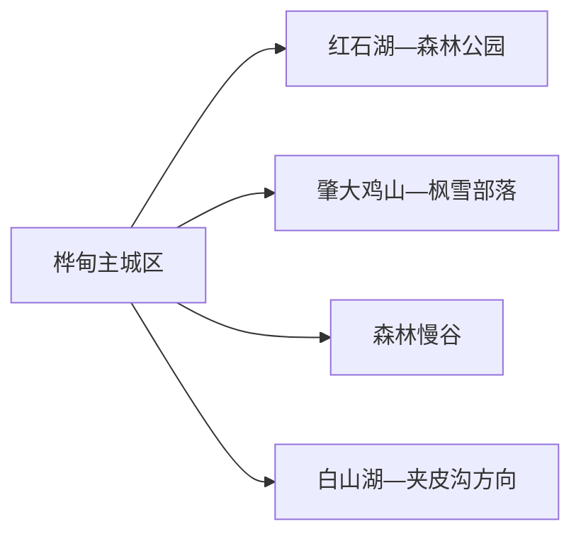
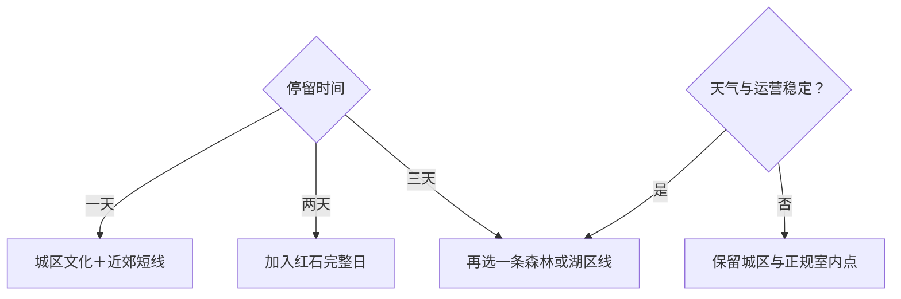

# 桦甸旅行指南

桦甸适合把“森林、水库与黄金工业史”分开理解：主城区承担住宿和补给，红石湖—红石国家森林公园是一条完整山水线，肇大鸡山与森林慢谷更适合按季节择一。第一次来可先用两天形成稳定骨架，再决定是否加入白山湖、夹皮沟或冬季冰钓等更远项目。

> 建议停留：2–3 天；每条林区或湖区远线各留完整一天 
> 旅行关键词：红石湖、森林公园、肇大鸡山、黄金文化、松花江上游、冰雪 
> 主要体力：城区低；森林和湖区中等至较高 
> 最近研究：2026-08-13

## 城市速览

| 项目 | 旅行信息 |
|---|---|
| 主要旅行价值 | 在松花江上游串联森林、水库湖景、黄金工业史和东北季节体验 |
| 建议停留 | 1 天了解城区；2 天加入红石方向；3 天再选肇大鸡山、森林慢谷或白山湖 |
| 较舒适季节 | 夏季适合森林与湖区，秋季看层林，冬季项目以正式运营和道路条件为准 |
| 预算特点 | 城区平实，远线车辆、景区交通、船行和季节项目是主要变量 |
| 步行强度 | 城区低，森林步道与雪地中高；湖区还受码头和岸线高差影响 |
| 主要天气风险 | 暴雨、山洪、雷电、大风、森林火险、严寒、积雪结冰和低能见度 |
| 独行旅行 | 城区容易安排；远线先锁定正规车辆、开放入口和返程 |
| 亲子旅行 | 黄金科普、森林短线和正式冰雪项目可按年龄选择 |
| 长者与低体力旅行 | 采用城区一馆加车辆观景，森林只走入口附近短段 |
| 无障碍信息 | 现代公共场馆可先咨询；林区、码头、雪地和乡村设施连续性需向官方确认 |

## 城市格局与游览区域

桦甸市是吉林市代管的县级市，法定代码 `220282`。GeoNames `2036776` 是桦甸主城驻地点，Wikidata `Q1020350` 的 `P1566` 与之精确对应；点坐标用于定位主城，完整行程仍按县级市域组织。吉林市中心城区、靖宇县与桦甸各有独立住宿和交通，湖库或森林跨界时按实际入口归属规划。

| 区域 | 主要内容 | 游览特点 | 与其他区域的关系 |
|---|---|---|---|
| 主城区 | 住宿、餐饮、城市公共文化和补给 | 适合作抵达日和雨天底盘 | 各远线都从这里重新出发 |
| 红石方向 | 红石湖、红石国家森林公园及正式服务点 | 湖库与森林组合，通常占一整天 | 与靖宇方向存在跨县边界，按入口核对 |
| 肇大鸡山方向 | 国家森林公园、枫雪部落及季节活动 | 山地、冰雪和节庆变化明显 | 可与森林慢谷二选一，不横穿赶场 |
| 森林慢谷方向 | 林地、老狼沟水库周边正式项目 | 适合慢游、冰钓或乡村季节体验 | 项目和道路状态决定能否成行 |
| 白山湖—夹皮沟方向 | 湖景、黄金文化和当期公开参观点 | 距离更远，工业与生产边界更重要 | 适合第三天单线往返 |

水库承担发电、防洪等功能，林场、矿区、坝体和专用道路也首先是生产或管理空间。旅行以景区、游客中心、正式码头和公告开放的研学入口为准；这样既能看到桦甸的资源型城市脉络，也能把风险和返程控制在清晰范围内。

## 主要景点

### 城区与文化线索

| 景点 | 区域 | 类型 | 主要看点 | 建议用时 | 室内外 | 体力 | 预约风险 | 天气影响 | 优先级 |
|---|---|---|---|---:|---|---|---|---|---|
| 桦甸黄金文化正式展馆／研学点 | 主城区或夹皮沟公开接待点 | 工业文化、科普 | 黄金采选历史、地方工业与城市形成；具体馆址按当期公告 | 1.5–3 小时 | 室内为主 | 低 | 高 | 低 | A |
| 城区公共文化场馆 | 主城区 | 地方文化 | 城市历史、临展和公共文化活动 | 1–2 小时 | 室内 | 低 | 中 | 低 | B |

### 森林与湖区

| 景点 | 区域 | 类型 | 主要看点 | 建议用时 | 室内外 | 体力 | 预约风险 | 天气影响 | 优先级 |
|---|---|---|---|---:|---|---|---|---|---|
| 红石湖—红石国家森林公园公开游览单元 | 红石方向 | 湖库、森林 | 松花江上游湖景、森林和当期开放步道；内部节点合计一次 | 6–9 小时 | 室外为主 | 中 | 高 | 很高 | A |
| 肇大鸡山国家森林公园公开游线 | 八道河子方向 | 森林、山地 | 森林景观、季节色彩和正式活动 | 5–8 小时 | 室外 | 中高 | 高 | 很高 | B |
| 枫雪部落正式运营项目 | 肇大鸡山片区 | 冰雪、节庆 | 雪地活动与冬季节庆 | 3–6 小时 | 室外 | 中高 | 很高 | 极高 | B |
| 森林慢谷 | 新开河方向 | 森林、乡村、季节体验 | 林谷景观及当期开放的冰钓、休闲项目 | 4–7 小时 | 混合 | 中 | 很高 | 很高 | B |
| 白山湖正式观景与游船单元 | 南部方向 | 湖库、观景 | 山水视野、正规码头或公开岸线 | 5–8 小时 | 室外 | 中 | 很高 | 很高 | C |
| 夹皮沟公开黄金文化项目 | 夹皮沟方向 | 工业史、研学 | 黄金工业史和正式接待内容 | 4–7 小时 | 混合 | 中 | 很高 | 高 | C |

选择时可把“红石湖—森林公园”看作首访完整日，把肇大鸡山、森林慢谷和白山湖视作三个替换方向。冰面活动以运营方划定区域、救援和保险条件为前提；黄金矿业体验采用公开展陈或预约研学，不进入作业面。

## 美食与餐饮

| 菜品或餐饮类型 | 常见区域 | 一个人用餐与常见份量 | 风味、过敏原与饮食限制 | 排队风险与替代方法 |
|---|---|---|---|---|
| 东北炖菜与铁锅菜 | 主城区 | 多人共享，一人先问小锅 | 肉类、豆制品、粉条和盐分常见 | 选小份炖菜或盖饭 |
| 江鱼与河鲜 | 正规餐馆 | 整鱼更适合共享 | 鱼刺、海鲜过敏和时令供应 | 确认重量、来源和计价后点单 |
| 黏豆包、玉米与杂粮主食 | 早餐店、市场 | 可按个购买 | 糯米、豆馅、糖 | 选择现制小份 |
| 山野菜与菌类菜 | 城区和景区正规餐饮 | 适合共享 | 品种、盐渍、油脂和误采风险 | 只选可说明来源的餐馆菜品 |

## 经典行程

### 一日经典路线

**路线**：城区公共文化场馆 → 午餐 → 黄金文化正式展馆／研学点 → 城区休息

- **串联逻辑**：用城市史和黄金工业史完成第一层认识，移动距离最可控。
- **预约锚点**：两个场馆的具体馆址、开放日和讲解。
- **休息安排**：午餐长休，下午只保留一个核心展览。
- **时间不足时**：留下黄金文化主点。

### 两日城市路线

**路线**：第 1 天城区文化与补给。 
**第 2 天**：红石湖—红石国家森林公园正式游线。

- **串联逻辑**：先了解城市，再把完整白天交给最具代表性的湖库森林组合。
- **预约锚点**：红石入口、景区交通、游船或活动、返程车辆。
- **休息安排**：第二天在游客服务点午休，傍晚回城区。
- **时间不足时**：第二天只选湖区观景或森林短线之一。

### 三日深度路线

**路线**：第 1 天主城区。 
**第 2 天**：红石方向。 
**第 3 天**：肇大鸡山、森林慢谷或白山湖三选一。

- **串联逻辑**：前两天固定城市与代表性山水，第三天按季节补充一种体验。
- **预约锚点**：第三日项目、道路、车辆和返程。
- **休息安排**：每天回城区或入住已核验的正规接待点。
- **时间不足时**：删除第三天。

### 雨雪天路线

**路线**：城区正式展馆 → 午餐 → 公共文化空间或住宿地休息

- **适用条件**：普通降雨或小雪；道路结冰、暴雪或强风时缩短移动。
- **串联逻辑**：以室内内容替代森林、冰面与湖区。
- **预约锚点**：场馆临时闭馆和市内交通。
- **休息安排**：馆内座椅和城区餐饮区。
- **时间不足时**：只保留一个展馆。

### 亲子或低体力路线

**亲子路线**：黄金科普精选展陈 → 午餐 → 城区公园短段。 
**低体力路线**：车辆到场馆落客点 → 核心展厅 → 午餐长休 → 返回住宿。

- **减负方式**：亲子线缩短讲解；低体力线取消跨乡镇和长步道。
- **预约锚点**：儿童活动、卫生间、电梯、轮椅和落客点。
- **休息安排**：每个主点后坐休。
- **时间不足时**：两线都只留室内核心。

### 远郊一日路线

**路线**：城区 → 一个已确认开放的肇大鸡山／森林慢谷／白山湖项目 → 原路返回

- **适用条件**：天气、道路、运营和返程均明确。
- **串联逻辑**：单方向完成山地或湖区体验，减少林区横穿。
- **预约锚点**：入口、车辆、项目、保险和末班。
- **休息安排**：使用正式游客服务点，驾驶者返程前完整坐休。
- **时间不足时**：改为城区半日。

## 住宿区域

| 区域 | 优点 | 缺点 | 适合人群 | 交通特点 |
|---|---|---|---|---|
| 桦甸主城区 | 餐饮、补给、医疗和叫车更稳定 | 每条远线都需往返 | 首访、公共交通、连续住两晚 | 适合作统一基地 |
| 红石方向正规住宿 | 便于湖区和森林早出发 | 淡旺季服务差异大 | 森林专题、自驾 | 订房时匹配实际入口 |
| 肇大鸡山／森林慢谷接待点 | 可延长冬季或乡村体验 | 运营、供暖和餐饮需逐项确认 | 已锁定项目者 | 依赖车辆与道路条件 |

## 市内交通

| 场景 | 建议与取舍 | 行前需要重查的内容 |
|---|---|---|
| 从吉林市等地抵达 | 比较公路客运、自驾与当期可售铁路服务 | 到发站、客运站、班次、施工和末班 |
| 城区移动 | 公交、出租或网约车连接住宿与场馆 | 线路、叫车范围和活动改道 |
| 红石与森林远线 | 自驾、正规包车或明确运营的旅游交通更灵活 | 精确入口、路况、停车、返程和通信 |
| 湖区与冬季项目 | 先确认运营，再安排车辆和装备 | 风浪、水位、冰层、救援、保险和退改 |

## 不同旅行者须知

| 旅行维度 | 可行条件 | 主要取舍 | 需额外核对 |
|---|---|---|---|
| 独行旅行 | 城区服务较集中 | 林区晚返容错低 | 正规车辆、信号和返程 |
| 亲子旅行 | 科普场馆和短森林线易组合 | 冰面、雪地和船行按年龄选择 | 儿童规则、保暖、救生设备 |
| 长者或低体力旅行 | 一馆加车辆观景 | 长步道、雪地与码头减量 | 落客点、座椅、卫生间 |
| 无障碍需求 | 现代场馆优先咨询 | 林区和湖岸连续性有限 | 设施连续性需向官方确认 |
| 摄影旅行 | 湖面、森林和冰雪题材丰富 | 天气和无人机规则变化快 | 拍摄许可、禁飞和商业用途 |
| 森林与生产空间 | 正式入口和公开研学可行 | 防火、矿业、水库和林业管理优先 | 准入、装备、保险和讲解 |

## 行前核对

| 核对事项 | 为什么需要重查 | 建议核对时间 | 官方入口 |
|---|---|---|---|
| 红石、肇大鸡山与季节项目 | 景区交通、游船、冰雪和活动随季节变化 | 排路线前及前一日 | [吉林省文旅厅桦甸线路](https://whhlyt.jl.gov.cn/ztzl/jlslyxlhxj/gdxl/jls/hds/202507/t20250704_9273173.html) |
| 冬季文旅与道路 | 冰雪项目、低温和道路条件共同影响体验 | 出发前三日及当天 | [吉林省政府桦甸冰雪文旅资料](https://www.jl.gov.cn/szfzt/gzlfz/gzdt/202601/t20260123_3547480.html) |
| 铁路与公路抵达 | 到发站和班次可能调整 | 购票前及当天 | [中国铁路12306](https://www.12306.cn/) |
| 天气与森林火险 | 山洪、雷电、火险、积雪和大风影响林区 | 出发前三日及当天 | [吉林省气象局](http://jl.cma.gov.cn/) |

## 来源与更新记录

### 主要来源

| 来源 | 类型 | 支持内容 | 核验日期 |
|---|---|---|---|
| [吉林省文旅厅：桦甸市旅游线路](https://whhlyt.jl.gov.cn/ztzl/jlslyxlhxj/gdxl/jls/hds/202507/t20250704_9273173.html) | 省级文旅部门 | 三湖、红石、白山湖与路线空间 | 2026-08-13 |
| [吉林省政府：桦甸冰雪文旅布局](https://www.jl.gov.cn/szfzt/gzlfz/gzdt/202601/t20260123_3547480.html) | 省级政府 | G334、肇大鸡山、森林慢谷与季节运营 | 2026-08-13 |
| [吉林省人民政府行政区划](https://www.jl.gov.cn/shengqing/xzqh/) | 省级政府 | 桦甸县级市与吉林市代管关系 | 2026-08-13 |
| [Wikidata Q1020350](https://www.wikidata.org/wiki/Special:EntityData/Q1020350.json) | 开放结构化数据 | 法定实体与 GeoNames 精确交叉核验 | 2026-08-13 |
| [GeoNames 2036776](https://sws.geonames.org/2036776/about.rdf) | 开放地名数据 | 固定桦甸城市记录 | 2026-08-13 |
| [民政部行政区划代码查询](https://dmfw.mca.gov.cn/xzqh/getList?code=220282&trimCode=false&maxLevel=3) | 国家行政区划数据 | 法定代码 220282 | 2026-08-13 |

### 更新记录

| 日期 | 更新内容 |
|---|---|
| 2026-08-13 | 首次完成桦甸指南，核验森林湖区、黄金文化、季节项目和县级市边界 |
