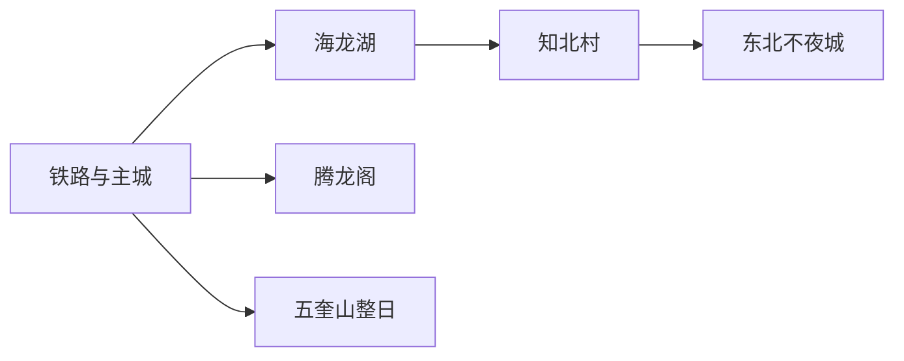
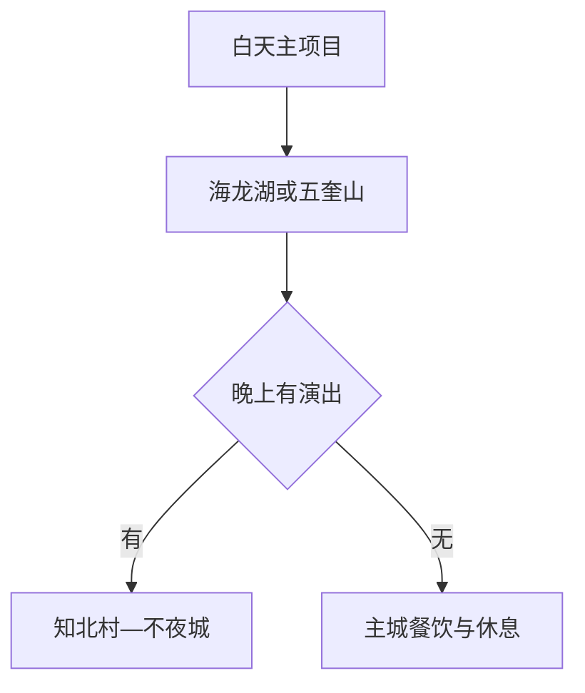

# 梅河口旅行指南

梅河口是一座适合“白天公园与乡村、夜间街区与演艺”组合的吉林东南县级市。海龙湖、知北村、东北不夜城与腾龙阁集中在城市及近郊，五奎山则适合单列半日至整日。主题项目的演出和营业随季节调整，先锁定当天主项目，再用城市公共空间补足行程。

> 建议停留：主城 2 天；五奎山或季节乡村另留 1 天
> 关键词：海龙湖、知北村、东北不夜城、腾龙阁、五奎山、东北饮食
> 体力：城市低至中等；大型园区与山地为中等
> 最近研究：2026-08-13

## 城市速览
| 项目 | 旅行信息 |
|---|---|
| 价值 | 城市公园、沉浸式乡村、夜游与地方历史可形成日夜互补 |
| 停留 | 2天覆盖主线，3天增加山地或冬季项目 |
| 交通 | 梅河口站及道路交通，景点间以公交或车辆连接 |
| 季节 | 冬季低温冰雪，夏季注意雷雨；活动期看公告 |
| 预算 | 公园公共段较省，演艺、园区和住宿波动大 |
| 步行 | 园区尺度大，分段休息 |
| 无障碍 | 城市公园较平缓，主题园区和山地逐项确认；设施连续性需向官方确认 |
| 亲子 | 海龙湖、知北村和正式冬季项目适合 |
| 边界 | 集安等通化市代管县级市另作跨城规划 |
| 核心 | 核营业、演出、铁路、天气与返程 |

## 城市格局与游览区域
法定代码 `220581`；GeoNames `2035801` 与 Wikidata `Q971498` 的 `P1566` 精确对应。梅河口由通化市代管，但拥有独立城区、铁路和旅行网络。

| 区域 | 重点 | 安排 | 条件 |
|---|---|---|---|
| 主城 | 铁路、餐饮、城市生活 | 住宿基地 | 夜间交通 |
| 海龙湖 | 公园、滨水、活动 | 半日 | 活动与水域规则 |
| 知北村—不夜城 | 乡村场景、演艺、夜游 | 下午至夜间 | 营业与演出 |
| 腾龙阁 | 国风文化与城市观景 | 2–4小时 | 开放与活动 |
| 五奎山 | 山地度假与季节活动 | 整日 | 天气、道路、项目 |

## 主要景点
| 名称 | 区域 | 类型 | 价值 | 时长 | 室内外 | 体力 | 无障碍 | 预约 | 优先级 |
|---|---|---|---|---:|---|---|---|---|---|
| 海龙湖景区 | 城市东南 | 公园、滨水 | 城市休闲与活动核心 | 3–5小时 | 室外 | 中 | 中至高 | 活动另核 | A |
| 知北村 | 主城近郊 | 乡村、沉浸体验 | 东北生活场景与季节活动 | 3–5小时 | 混合 | 中 | 中 | 建议 | A |
| 东北不夜城 | 主城 | 夜游、演艺 | 夜间消费与东北表演 | 2–4小时 | 室外 | 中 | 中 | 演艺另核 | A |
| 腾龙阁景区 | 主城 | 文化、观景 | 国风活动与城市视角 | 2–3小时 | 混合 | 中 | 中 | 建议 | B |
| 五奎山旅游度假区 | 远郊 | 山地、度假 | 春夏户外与冬季项目 | 5–8小时 | 室外 | 中至高 | 逐项确认 | 建议 | A |
| 辉发河景观带公开段 | 主城 | 滨水 | 抵达日与低体力短线 | 1–2小时 | 室外 | 低 | 中 | 通常无需 | B |
| 梅河口会议会址等开放纪念点 | 市域 | 历史、纪念 | 补充近现代地方史 | 1–2小时 | 室内 | 低 | 中 | 先核开放 | B |
| 小杨古城等文保点公开区域 | 市域 | 遗址 | 地方历史专题 | 1–3小时 | 室外 | 中 | 低 | 先核开放 | C |

## 美食与餐饮
| 类型 | 点法 | 注意 |
|---|---|---|
| 梅河大冷面 | 一人一碗 | 含小麦、鸡蛋、芝麻，汤底酸甜 |
| 锅包肉 | 半份或多人分享 | 含小麦、糖与油炸 |
| 煎饼与东北小吃 | 少量多样 | 可能含小麦、大豆、花生 |
| 东北炖菜 | 2人以上 | 高盐，粉条与酱料过敏原需问 |

## 经典行程

### 一日经典
**路线**：海龙湖 → 午休 → 知北村 → 东北不夜城。
- **串联逻辑**：同一城市东南—夜游轴，减少折返。
- **预约锚点**：三处营业和演出。
- **休息安排**：午后入园前长休。
- **时间不足时**：海龙湖与夜游各留一段。
### 两日
**第2天**：腾龙阁 → 主城午餐 → 地方纪念点或辉发河。
- **串联逻辑**：从主题项目转向城市文化。
- **预约锚点**：场馆、活动。
- **休息安排**：午间室内。
- **时间不足时**：只留腾龙阁。
### 三日
**第3天**：五奎山整日。
- **适用条件**：项目与道路开放。
- **串联逻辑**：山地独立成日。
- **预约锚点**：票务、接驳、装备。
- **休息安排**：服务区长休。
- **时间不足时**：改辉发河短线。
### 雨雪天
**路线**：住宿 → 室内场馆 → 午餐 → 营业中的室内体验。
- **适用条件**：城市交通正常。
- **串联逻辑**：避开冰面与山路。
- **预约锚点**：开馆与演出。
- **休息安排**：室内取暖。
- **时间不足时**：一馆一餐。
### 亲子
**路线**：海龙湖短线 → 午休 → 知北村单一区域。
- **适用条件**：项目适龄。
- **串联逻辑**：户外观察加场景体验。
- **预约锚点**：儿童票与活动。
- **休息安排**：午睡和保暖。
- **时间不足时**：只留海龙湖。
### 长者与低体力
**路线**：车辆到海龙湖平缓入口 → 午餐 → 腾龙阁短线。
- **适用条件**：落实上下车和电梯。
- **串联逻辑**：车辆连接单点。
- **预约锚点**：轮椅、卫生间。
- **休息安排**：每段后休息。
- **时间不足时**：海龙湖一段。

## 住宿区域
| 区域 | 优势 | 取舍 | 适合 | 交通 |
|---|---|---|---|---|
| 车站—主城 | 抵离与餐饮方便 | 去园区需车辆 | 首访 | 核夜间叫车 |
| 海龙湖周边 | 早晚公园方便 | 活动期拥堵 | 亲子、慢游 | 核入口与停车 |
| 知北村附近 | 夜游方便 | 营业外较安静 | 演艺、摄影 | 核闭园返程 |
| 五奎山住宿 | 山地项目方便 | 城市服务较远 | 度假、自驾 | 核餐饮与道路 |

## 市内交通
| 场景 | 推荐 | 核对 |
|---|---|---|
| 铁路抵达 | 从梅河口站接公交或车辆 | 车次、末班、上客区 |
| 城市园区 | 公交或短途车辆 | 活动管制、停车 |
| 五奎山 | 自驾或合规包车 | 道路、返程、天气 |
| 通化等跨城 | 铁路或公路，另订住宿 | 到发站与班次 |

## 不同旅行者须知
| 旅行者 | 怎么选 | 重点 |
|---|---|---|
| 独行 | 主城与夜游正规区域 | 闭园返程 |
| 亲子 | 海龙湖、知北村 | 项目适龄与保暖 |
| 长者 | 平缓公园、车辆接驳 | 座椅、电梯、冰雪路面 |
| 摄影 | 公共园区与演艺 | 肖像、三脚架、无人机 |
| 冬季 | 城市冰雪或运营雪场 | 低温、装备、结冰 |
| 预算有限 | 主城住宿、公共公园 | 演出票与交通总价 |

## 行前核对
| 项目 | 时点 | 入口 |
|---|---|---|
| 园区营业与演出 | 前一日 | [吉林省政府](https://www.jl.gov.cn/) |
| 天气道路 | 前三日及当天 | [吉林气象](https://jl.cma.gov.cn/) |
| 铁路 | 购票与前一日 | [12306](https://www.12306.cn/) |
| 行政边界 | 跨城规划时 | [民政部](https://dmfw.mca.gov.cn/xzqh/getList?code=220500&trimCode=false&maxLevel=3) |

## 来源与更新记录
### 主要来源
| 来源 | 支持内容 | 日期 |
|---|---|---|
| [2026文旅活动与路线](https://www.jl.gov.cn/szfzt/gzlfz/gzdt/202604/t20260430_3628046.html) | 五大景区、活动与1至3日路线 | 2026-08-13 |
| [景城融合资料](https://www.jl.gov.cn/szfzt/gzlfz/gzdt/202605/t20260525_3633212.html) | 城市空间与主要项目 | 2026-08-13 |
| [吉林省文旅报道](https://www.jl.gov.cn/yaowen/202506/t20250602_3460865.html) | 历史、非遗美食与景区 | 2026-08-13 |
| [GeoNames 2035801](https://www.geonames.org/2035801/) | 城市点 | 2026-08-13 |
| [Wikidata Q971498](https://www.wikidata.org/wiki/Q971498) | 实体与P1566 | 2026-08-13 |
| [行政区划220500](https://dmfw.mca.gov.cn/xzqh/getList?code=220500&trimCode=false&maxLevel=3) | 220581与代管关系 | 2026-08-13 |
### 更新记录
| 日期 | 更新 |
|---|---|
| 2026-08-13 | 首次完成梅河口旅行研究；按城市公园、主题村落、夜游和五奎山分线，补充季节运营与县级市边界 |
