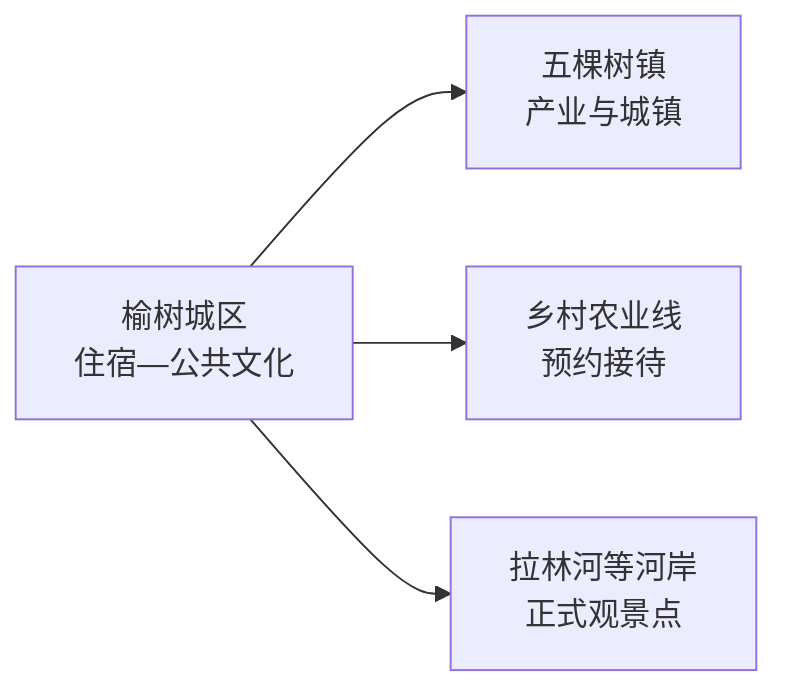
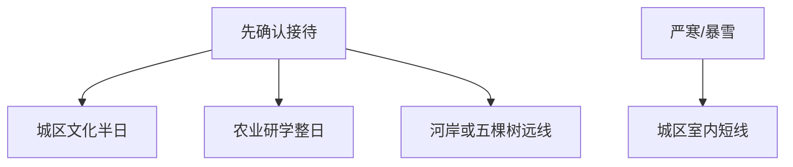

# 榆树旅行指南

榆树不是密集景点型城市，更适合把它当作黑土地农业、县域生活与拉林河—松花江平原的观察地。先用城区半天了解地方历史和日常生活，再从五棵树、乡村农业或河岸生态中选择一条已确认接待的线路。

> 建议停留：1–2 天  
> 关键词：黑土地、粮食、农业、五棵树、拉林河、县域生活  
> 主要体力：城区低；乡村远线中等  
> 最近研究：2026-08-13

## 城市速览

| 项目 | 信息 |
|---|---|
| 主要价值 | 观察东北农业县级市、粮食生产与平原城镇生活 |
| 建议停留 | 半天至1天城区；2天加入一条正式乡村或农业线 |
| 舒适季节 | 春末至秋季适合田野；冬季可看北方城市但严寒明显 |
| 预算 | 城区低；包车、乡村接待和冬季车辆成本增加 |
| 体力 | 平原步行不难，低温、大风和长车程更消耗体力 |
| 风险 | 严寒、暴雪、道路结冰、夏季雷暴与农业机械 |
| 独行 | 城区可自行；乡村先约车辆和接待 |
| 亲子 | 农业科普适合，但只进正式接待项目 |
| 低体力 | 城区短线和车辆观景为主 |
| 无障碍 | 公共文化设施可询问；乡村点设施连续性需向官方确认 |

## 城市格局与游览区域

GeoNames `2033242` 与 Wikidata `Q1022251` 精确对应法定县级榆树市，行政代码 `220182`。榆树由长春市代管，但距长春主城较远，有独立城区、铁路公路和广阔乡镇。旅行路线以公开场馆、公共空间和明确接待的农业乡村项目为主。

| 区域 | 内容 | 怎么选 | 边界 |
|---|---|---|---|
| 榆树城区 | 公共文化、生活街区、餐饮和交通 | 首次到访基地 | 适合慢走而非追点 |
| 五棵树镇 | 区域城镇、粮食与产业线索 | 有明确接待内容时加入 | 厂区和物流区属于生产空间 |
| 乡村农业区 | 黑土地、粮食、果蔬和村落 | 预约农场、合作社或研学 | 田块、粮库、烘干塔和机械作业有明确限制 |
| 拉林河及水系 | 平原河流与季节生态 | 只走公共堤岸或正式观景点 | 防洪堤、水利设施、冰面保留安全限制 |

## 主要景点

榆树的稳定开放景点资料较少，下表以可核验的公共文化和正式接待类型为主；出发前应逐项确认具体名称、地址与开放状态。

| 景点 | 片区 | 类型 | 看点 | 用时 | 环境 | 体力 | 预约 | 天气 | 优先级 |
|---|---|---|---|---|---|---|---|---|---|
| 榆树市博物馆或地方史展陈 | 城区 | 公共文化 | 地方历史、农业与城市发展 | 1–2小时 | 室内 | 低 | 高 | 低 | A |
| 榆树城区公共文化空间 | 城区 | 城市生活 | 图书馆、文化馆或当期展览 | 1–2小时 | 室内 | 低 | 中 | 低 | B |
| 城区公园与生活街区 | 城区 | 城市休闲 | 平原县级市日常、绿地和餐饮 | 1–2小时 | 室外 | 低 | 低 | 高 | B |
| 正式农业研学项目 | 乡村 | 农业科普 | 黑土地、粮食种植与现代农业 | 3–5小时 | 混合 | 中 | 高 | 很高 | B |
| 五棵树镇当期开放接待点 | 五棵树 | 城镇与产业 | 区域城镇、农业加工或历史线索 | 3–5小时 | 混合 | 中 | 高 | 高 | C |
| 拉林河公共观景点 | 北部或乡镇 | 河流生态 | 平原河流、湿地与季节景观 | 2–4小时 | 室外 | 中 | 高 | 很高 | C |

## 美食与餐饮

| 类型 | 场景 | 份量 | 注意 | 选择 |
|---|---|---|---|---|
| 东北家常菜 | 正餐 | 多人共享 | 猪肉、豆制品、酱油和较高盐分 | 2人从两菜一汤起步 |
| 粘豆包、玉米等粮食食品 | 早餐小吃 | 少量组合 | 糯米、豆类、玉米和糖 | 按消化能力选择 |
| 铁锅炖 | 多人晚餐 | 份量大 | 肉类、鱼类、酱料和高温锅具 | 先问最小锅与配菜 |
| 酸菜类 | 冬季家常 | 共享 | 盐分和猪肉搭配常见 | 与清淡菜搭配 |

## 经典行程

### 一日经典
- **路线**：地方史展陈 → 城区午餐 → 公共文化空间 → 生活街区。
- **串联逻辑**：从历史与农业背景进入当代城市生活。
- **预约锚点**：先确认地方史场馆开放。
- **休息安排**：午餐后留长休。
- **时间不足时**：保留一馆一餐。

### 两日组合
- **路线**：第1天城区；第2天预约农业研学或乡村接待项目。
- **串联逻辑**：城市与生产景观分日。
- **预约锚点**：车辆与接待单位同时确认。
- **休息安排**：在正式接待点完成午餐。
- **时间不足时**：改为城区公园慢游。

### 三日慢游
- **路线**：前两日按上；第3天五棵树镇或拉林河公开观景点二选一。
- **适用条件**：有明确开放内容和返程车辆。
- **预约锚点**：属地接待、道路和天气。
- **休息安排**：乡镇公共服务区休息。
- **时间不足时**：取消第三天远线。

### 雨雪天
- **路线**：公共文化场馆 → 午餐 → 城区室内活动。
- **适用条件**：道路和场馆正常。
- **预约锚点**：核暴雪停运与闭馆。
- **休息安排**：减少户外换乘。
- **时间不足时**：单馆慢游。

### 亲子与低体力
- **路线**：地方史短讲解 → 午餐 → 平缓公园或预约农业科普。
- **减负方式**：低体力留城区；亲子农业线只进受控区域。
- **预约锚点**：讲解、卫生间、落客点。
- **休息安排**：室内与车辆休息相结合。
- **时间不足时**：城区半日。

### 乡村远线
- **路线**：一个正式接待农场、合作社或乡村项目整日。
- **适用条件**：农时、天气、接待和车辆明确。
- **预约锚点**：至少提前一天联系。
- **休息安排**：接待点用餐补水。
- **时间不足时**：取消田间活动，仅做室内科普。

## 住宿区域

| 区域 | 优点 | 取舍 | 适合 | 建议 |
|---|---|---|---|---|
| 榆树城区 | 餐饮、医疗、交通稳定 | 去乡镇需车 | 所有首次到访者 | 选供暖制冷、前台稳定的位置 |
| 乡村经营住宿 | 靠近项目 | 数量少、季节性强 | 自驾与研学 | 核资质、供餐、取暖和退改 |

## 市内交通

榆树与长春主城是跨城尺度。城区短途可叫车，乡镇和农业线路以公路为主；冬季应给冰雪路面留出时间。

| 场景 | 做法 | 核对 |
|---|---|---|
| 长春联程 | 铁路或公路换城 | 班次、站点和末班 |
| 城区 | 步行、公交、出租车 | 低温和夜间叫车 |
| 乡镇 | 自驾或正规包车 | 路况、油量、信号和返程 |

## 不同旅行者须知

| 人群 | 推荐 | 留意 | 核对 |
|---|---|---|---|
| 独行 | 城区慢游 | 乡村返程 | 车辆与联系人 |
| 亲子 | 正式农业科普 | 机械、渠沟、动物和农药 | 接待范围与保险 |
| 长者低体力 | 城区短线 | 严寒和路滑 | 供暖、落客、座椅 |
| 冬季旅行 | 室内为主 | 暴雪、结冰、冻伤 | 气象、道路、车辆状态 |

## 行前核对

| 事项 | 原因 | 时间 | 入口 |
|---|---|---|---|
| 公共场馆 | 稳定开放资料有限 | 前一日 | [榆树市人民政府](https://www.yushu.gov.cn/) |
| 乡村接待 | 农时与运营变化 | 排路线前 | [榆树市文广旅局入口](https://www.yushu.gov.cn/) |
| 长途交通 | 班次变化 | 购票前 | [12306](https://www.12306.cn/) |
| 冰雪与强对流 | 影响公路远线 | 前三日 | [吉林省气象局](http://jl.cma.gov.cn/) |

## 来源与更新记录

### 主要来源

| 来源 | 类型 | 支持内容 | 日期 |
|---|---|---|---|
| [榆树市人民政府](https://www.yushu.gov.cn/) | 市政府 | 行政机构、乡镇与当期公共服务入口 | 2026-08-13 |
| [榆树市红星乡概况](https://www.yushu.gov.cn/xxgk/jgsz/zxjdkfq/hxx/dwgk49/) | 属地政府 | 拉林河、乡村区位与产业背景 | 2026-08-13 |
| [民政部行政区划查询](https://dmfw.mca.gov.cn/xzqh/getList?code=220182&trimCode=false&maxLevel=3) | 国家数据 | 法定代码220182 | 2026-08-13 |
| [GeoNames 2033242](https://www.geonames.org/2033242/) | 开放数据 | 固定城市点 | 2026-08-13 |
| [Wikidata Q1022251](https://www.wikidata.org/wiki/Q1022251) | 开放数据 | 法定榆树市精确映射 | 2026-08-13 |

### 更新记录

| 日期 | 更新内容 |
|---|---|
| 2026-08-13 | 首次完成榆树独立研究；采用“城区文化+预约农业或河岸远线”的保守结构，明确生产设施、冰面、水利与严寒边界。 |
