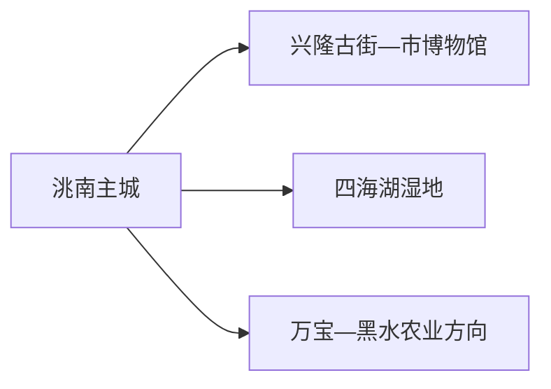
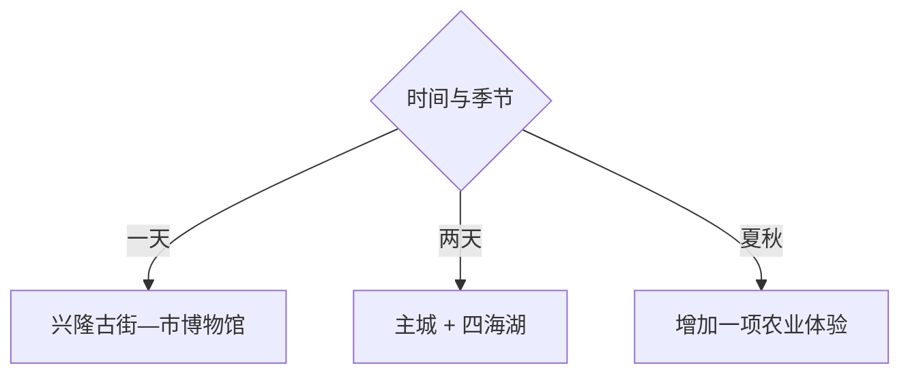

# 洮南旅行指南

洮南的优先顺序是先看兴隆古街和市博物馆，理解这座洮儿河畔商埠，再按季节选择四海湖湿地、冬捕或农业体验。主城用一天足够形成框架；湖区与乡村项目各自需要车辆、开放确认和返程安排。

> 建议停留：主城 1 天；四海湖或乡村季节线另留 1 天 
> 旅行关键词：兴隆古街、洮南市博物馆、百年商埠、四海湖、非遗、农产品 
> 主要体力：主城低至中等；湿地与冬季活动中等 
> 最近研究：2026-08-13

## 城市速览

| 项目 | 旅行信息 |
|---|---|
| 主要旅行价值 | 用兴隆古街、市博物馆和历史建筑认识百年府县与商贸城市，再到四海湖体验湿地与季节活动 |
| 建议停留 | 1 天主城；2 天增加四海湖；采摘、冬捕或乡村活动按季节替换 |
| 较舒适季节 | 春秋适合街区与湿地；夏季适合农业活动；冬季只选正式冰雪项目 |
| 预算特点 | 主城中低；湖区车辆、活动与季节住宿增加预算 |
| 步行强度 | 兴隆古街适合慢走，湖区点位依赖车辆 |
| 主要天气风险 | 大风、严寒、暴雪、道路结冰、雷雨、洪涝、湿地火险与冰面风险 |
| 独行旅行 | 主城方便；湖区优先正规接待与明确返程 |
| 亲子旅行 | 博物馆、非遗工坊和正式农业体验较合适 |
| 长者与低体力旅行 | 古街短段、博物馆和车辆到湖区服务点 |
| 无障碍信息 | 改造街区和现代场馆可咨询，老建筑与湿地的设施连续性需向官方确认 |

## 城市格局与游览区域

洮南市是白城市代管的县级市，法定代码 `220881`。GeoNames `2034497` 与 Wikidata `Q1004248` 精确对应洮南市。主城位于洮儿河流域，四海湖在安定镇方向，万宝、黑水等乡镇则以农业生产和季节活动为主。

| 区域 | 主要内容 | 怎么安排 | 与其他区域的关系 |
|---|---|---|---|
| 兴隆古街—主城 | 历史街区、市博物馆、非遗与城市生活 | 半日至一天 | 适合作为住宿和交通基地 |
| 四海湖 | 湿地、渔猎与季节活动 | 独立一天，按正式入口和活动安排 | 与向海保护区邻近但属地、入口不同 |
| 万宝—黑水等乡镇 | 粉条、西瓜与农业生产 | 只选明确接待或公布活动 | 田地、加工厂和仓储首先是生产空间 |
| 化工园与产业区 | 工业生产、物流和能源项目 | 通过公共道路绕行 | 不作为工业旅游或摄影点 |

四海湖及周边湿地同时承担生态、渔业和水域管理功能。观鸟、冬捕和水上体验使用明确开放区域与运营项目；芦苇荡、养殖作业、水利设施和普通冰面按保护与生产边界活动。

## 主要景点

### 主城历史文化

| 景点 | 区域 | 类型 | 主要看点 | 建议用时 | 室内外 | 体力 | 预约风险 | 天气影响 | 优先级 |
|---|---|---|---|---:|---|---|---|---|---|
| 兴隆古街历史文化街区 | 主城 | 历史街区 | 清末民初商埠、街巷更新、公共文化和城市生活 | 2–4 小时 | 室外为主 | 中 | 中 | 高 | A |
| 洮南市博物馆 | 兴隆古街 | 地方博物馆 | 百年商贸、城市档案、老物件与地方历史 | 1.5–2.5 小时 | 室内 | 低 | 高 | 低 | A |
| 天恩地局等公开历史建筑 | 兴隆古街 | 文保与革命史 | 历史建筑、中共辽吉省委相关记忆与修缮活化 | 1–2 小时 | 混合 | 中 | 高 | 中 | A |
| 非遗工坊—洮南书局公共文化组团 | 主城 | 非遗与阅读空间 | 剪纸、葫芦雕等展示与公共文化活动 | 1–2 小时 | 室内为主 | 低 | 高 | 低 | B |

### 湿地与季节远线

| 景点 | 区域 | 类型 | 主要看点 | 建议用时 | 室内外 | 体力 | 预约风险 | 天气影响 | 优先级 |
|---|---|---|---|---:|---|---|---|---|---|
| 四海湖景区正式开放区 | 安定镇 | 湿地、湖泊与渔猎文化 | 湖泊湿地、正式观景、冬捕和季节活动 | 1 天 | 室外 | 中 | 很高 | 很高 | A |
| 古树北街公园与历史建筑外部空间 | 主城 | 城市公园 | 老建筑之间的公共休息和城市更新 | 1 小时 | 室外 | 低 | 低 | 高 | B |
| 黑水西瓜当期采摘活动 | 黑水等乡镇 | 农业体验 | 地理标志农产品与季节生产 | 半日至 1 天 | 室外 | 中 | 很高 | 很高 | B |
| 万宝粉条非遗公开体验 | 万宝乡方向 | 非遗与农业加工 | 传统粉条制作与乡村产业 | 半日 | 混合 | 中 | 很高 | 中 | B |

兴隆古街内部的市博物馆、历史建筑、非遗工坊和书局是一个连续片区，按开放时段选择两至三项即可。农业体验以接待主体公布的日期、田块和工坊为准。

## 美食与餐饮

洮南可以围绕粉条、绿豆、西瓜、东北炖菜和面食选择。夏季水果与乡村餐饮有明显季节性；主城更容易找到明码标价和适合一人的份量。

| 类型 | 常见区域 | 一人份量 | 饮食提示 | 选择方法 |
|---|---|---|---|---|
| 万宝粉条与炖菜 | 主城、万宝方向 | 炖菜偏多人 | 粉条、肉类、豆制品和较高盐分 | 一人选粉条汤或小份炖菜 |
| 绿豆食品与杂粮 | 主城市场 | 小份购买 | 糖、油和坚果配料 | 选标签清楚的包装 |
| 黑水西瓜 | 夏季正规市场或活动 | 按人数购买 | 成熟期和来源随年份变化 | 选明码标价、有产地信息的摊位 |
| 东北饺子、面食与烧烤 | 主城 | 易控制份量 | 小麦、肉类、乳制品和交叉接触 | 按人头点餐，先问辣度和馅料 |

## 经典行程

### 一日经典路线

**路线**：洮南市博物馆 → 兴隆古街 → 城区午餐 → 天恩地局与非遗工坊 → 古树北街公园

- **串联逻辑**：全部位于主城历史片区，先看展再慢走街区。
- **预约锚点**：博物馆、历史建筑和工坊开放。
- **休息安排**：书局、午餐和公园座椅。
- **时间不足时**：保留市博物馆与古街核心段。

### 两日城市路线

**第 1 天**：主城历史文化线 
**第 2 天**：四海湖正式开放区

- **串联逻辑**：城市历史与湖泊生态各占一天。
- **预约锚点**：湖区入口、活动、车辆与返程。
- **休息安排**：湖区服务点和主城晚餐。
- **时间不足时**：第二天只保留公开观景与文化展示。

### 三日深度路线

**第 1 天**：主城 
**第 2 天**：四海湖 
**第 3 天**：黑水西瓜采摘或万宝粉条公开体验二选一

- **串联逻辑**：第三天按季节选择农业或非遗，不跨多个乡镇。
- **预约锚点**：活动日期、接待主体、车辆与购买规则。
- **休息安排**：乡镇正式接待点和主城。
- **时间不足时**：删除第三天。

### 雨雪天路线

**路线**：洮南市博物馆 → 坐席午餐 → 非遗工坊或书局

- **适用条件**：城区交通正常；暴雪、冻雨或积水时缩短到住宿附近。
- **预约锚点**：场馆和活动开放。
- **休息安排**：全程室内坐席。
- **时间不足时**：只保留市博物馆。

### 亲子与低体力路线

**亲子路线**：市博物馆 → 午休 → 非遗工坊 
**低体力路线**：车辆到市博物馆 → 坐席午餐 → 古街平缓短段

- **减负方式**：亲子控制活动时长；低体力路线减少老街长走和冬季户外。
- **预约锚点**：儿童活动、轮椅、坡道、卫生间和下客点。
- **休息安排**：博物馆、书局与餐厅。
- **时间不足时**：两条路线都只保留市博物馆。

### 湿地一日路线

**路线**：主城或湖区住宿 → 四海湖正式入口 → 文化与观景项目 → 午餐 → 当季一个活动 → 返回

- **适用条件**：道路、天气、水面或冰面运营均正常。
- **预约锚点**：活动、车辆、救生或冰上安全、返程。
- **休息安排**：游客服务区和正规餐饮。
- **时间不足时**：只保留观景与文化展示。

## 住宿区域

| 区域 | 优点 | 取舍 | 适合人群 | 交通特点 |
|---|---|---|---|---|
| 洮南主城 | 铁路、公路、餐饮和医疗集中 | 到四海湖有车程 | 首访与城市线 | 默认基地 |
| 兴隆古街周边 | 步行主城历史片区方便 | 节庆和夜间活动可能有噪声 | 一日文化游 | 看具体停车和电梯 |
| 四海湖正式接待区 | 便于清晨、冬捕和湖区活动 | 季节运营、供暖和退改变化大 | 湖区摄影与活动 | 锁定车辆与返程 |

## 市内交通

| 场景 | 建议与取舍 | 行前核对 |
|---|---|---|
| 铁路抵达 | 洮南站进入主城后再分流 | 12306 车次、站口、公交与夜间接驳 |
| 主城历史片区 | 步行、公交和短程出租组合 | 街区活动、施工、停车和末班 |
| 四海湖 | 正规客运、接驳或合规包车 | 入口、道路、活动、最晚返程 |
| 乡村体验 | 按接待主体给出的地点到达 | 日期、田块、工坊、车辆和购买规则 |

## 不同旅行者须知

| 旅行者 | 怎么选 | 主要取舍 | 额外核对 |
|---|---|---|---|
| 独行 | 主城加正规湖区往返 | 乡村和湖区临时交通较少 | 车辆、返程、住宿和通信 |
| 亲子 | 市博物馆、非遗和季节农业体验 | 冬季低温与湖区看护 | 儿童活动、防寒、救生和卫生间 |
| 长者或低体力 | 一馆一街、车辆点到点 | 老建筑门槛和冬季路面 | 轮椅、座椅、暖区和下客点 |
| 摄影 | 老街、湿地、冰雪和农业题材 | 居民、生态和生产边界 | 三脚架、无人机、商业拍摄和日出车辆 |
| 预算有限 | 主城公共文化为核心 | 湖区车辆和安全项目保留预算 | 套票、时价、接驳和退改 |

## 行前核对

| 事项 | 何时核对 | 官方入口 | 怎么处理 |
|---|---|---|---|
| 兴隆古街与场馆 | 出发前一周及前一日 | [吉林省政府洮南文旅资料](https://www.jl.gov.cn/yaowen/202510/t20251011_3503744.html) | 按实际开放的馆、工坊和活动选择 |
| 四海湖 | 订车前及当天 | [吉林省政府四海湖资料](https://www.jl.gov.cn/szfzt/tzcj/zdxm/dlyjqxm/202604/t20260428_3627221.html) | 以现行景区和运营方公告为准 |
| 铁路 | 购票时及当天 | [中国铁路 12306](https://www.12306.cn/) | 核对车次与末班接驳 |
| 天气 | 前三日及当天 | [吉林省气象局](http://jl.cma.gov.cn/) | 大风、暴雪和雷雨时调整湖区线 |

## 来源与更新记录

### 主要来源

| 来源 | 类型 | 支持内容 | 核验日期 |
|---|---|---|---|
| [吉林省政府：洮南百年府县](https://www.jl.gov.cn/yaowen/202510/t20251011_3503744.html) | 省政府 | 兴隆古街、市博物馆、天恩地局、非遗与书局 | 2026-08-13 |
| [吉林省政府：四海湖项目](https://www.jl.gov.cn/szfzt/tzcj/zdxm/dlyjqxm/202604/t20260428_3627221.html) | 省政府 | 四海湖位置、湿地与旅游方向 | 2026-08-13 |
| [吉林省政府：白城消夏活动](https://www.jl.gov.cn/szfzt/xwfb/xwfbh/2025/jlsdzyjglbf_199151/index.html) | 省政府 | 洮南西瓜采摘季和区域文旅活动 | 2026-08-13 |
| [吉林省市场监管厅：黑水西瓜](https://scjg.jl.gov.cn/ztzl/jlszscq/sbdlbz/dlbzbhcp/201611/t20161130_6085091.html) | 省级监管部门 | 地理标志范围和农业生产属性 | 2026-08-13 |
| [GeoNames 2034497](https://www.geonames.org/2034497/) | 开放地理数据 | 固定城市点 | 2026-08-13 |
| [Wikidata Q1004248](https://www.wikidata.org/wiki/Q1004248) | 开放结构化数据 | 法定洮南市与 GeoNames 精确映射 | 2026-08-13 |

### 更新记录

| 日期 | 更新内容 |
|---|---|
| 2026-08-13 | 首次完成洮南独立旅行研究，建立兴隆古街、四海湖与季节农业体验的选择框架，并补充湿地、冰面和生产空间边界 |
