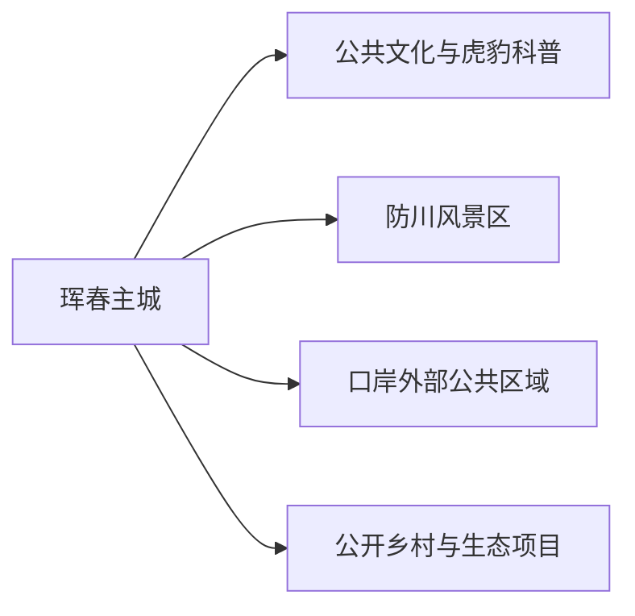
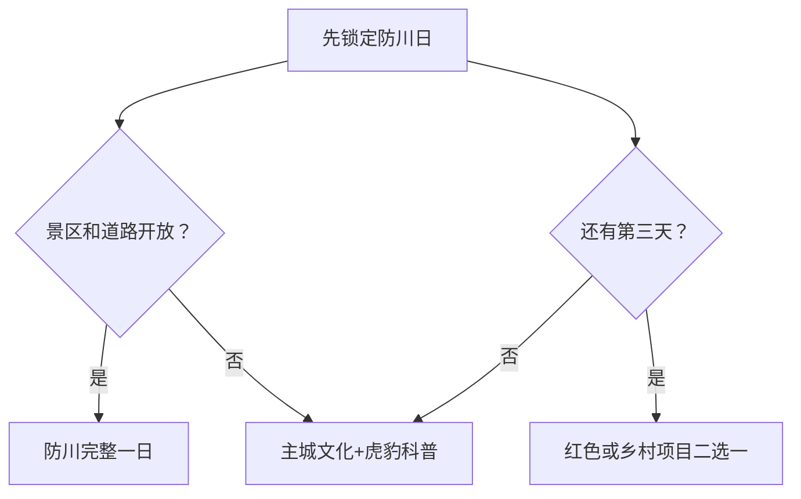

# 珲春旅行指南

珲春位于中俄朝三国交界区域，适合用两至三天体验口岸城市、朝鲜族生活、防川边境景观与东北虎豹国家公园周边生态教育。主城承担住宿、餐饮和交通；防川需要完整一日，口岸通关、保护地和冷链生产空间则分别遵循证件、生态保护与作业规则。

## 城市速览

| 项目 | 信息 |
|---|---|
| 旅行主线 | 防川边境景观、口岸城市、虎豹生态教育、朝鲜族文化与海鲜贸易 |
| 建议停留 | 1 天主城；2 天加入防川；3 天增加生态或乡村主题 |
| 住宿基地 | 珲春主城 |
| 步行强度 | 主城低至中，防川中等，山林方向中至高 |
| 主要天气 | 冬季严寒积雪，夏季强降雨与山洪，春秋森林火险，大风影响边境观景 |
| 预约核心 | 防川景区交通、生态科普场馆、口岸跨境手续 |
| 边境提示 | 国内观景和实际出入境是两件事，证件与口岸开放按当天公告 |
| 亲子 | 虎豹科普、城市场馆和防川正式游线较合适 |
| 低体力 | 以车辆观景、室内科普和游客中心短线为主 |
| 无障碍 | 设施连续性需向官方确认，并核对景区车、观景台与卫生间 |

## 城市格局与游览区域

珲春市是延边朝鲜族自治州所辖县级市，代码 `222404`。GeoNames `2036653` 与法定实体 Wikidata `Q128674` 的 `P1566` 精确对应。主城位于内陆交通节点，防川在东南边境，东北虎豹国家公园及林区分布在更广阔山地，口岸、保税物流和冷链园区具有现实生产功能。

| 区域 | 旅行价值 | 怎么安排 |
|---|---|---|
| 主城 | 住宿、餐饮、购物、公共文化与科普 | 抵达日、雨雪日和多日基地 |
| 防川方向 | 图们江下游、边境地理与观景设施 | 完整一天，使用正式景区交通 |
| 口岸方向 | 跨境交通和口岸城市观察 | 观景与通关分别核对；通关准备证件 |
| 虎豹国家公园周边 | 生态教育与自然保护 | 选择官方科普或明确接待项目 |
| 乡村方向 | 朝鲜族文化、农业与季节活动 | 一次选择一个公开接待点 |

## 主要景点

### 主城与科普

| 景点 | 所在区域 | 类型 | 核心看点 | 建议用时 | 室内/室外 | 体力 | 预约难度 | 天气敏感度 | 适合旅程 |
|---|---|---|---|---|---|---|---|---|---|
| 珲春市公共文化场馆 | 主城 | 地方史与民族文化 | 口岸城市沿革、民族文化与当期展览 | 1–2 小时 | 室内 | 低 | 中 | 低 | B |
| 东北虎豹科普馆 | 主城或正式科普区 | 生态科普 | 虎豹栖息地、监测保护与公众教育 | 1.5–2.5 小时 | 室内 | 低 | 中 | 低 | A |
| 珲春河公共滨水空间 | 主城 | 城市休闲 | 河流、城市生活与季节景观 | 1–2 小时 | 室外 | 低 | 低 | 高 | B |

### 防川与边境方向

| 景点 | 所在区域 | 类型 | 核心看点 | 建议用时 | 室内/室外 | 体力 | 预约难度 | 天气敏感度 | 适合旅程 |
|---|---|---|---|---|---|---|---|---|---|
| 防川风景区 | 敬信镇方向 | 边境地理与湿地景观 | 图们江下游、边境地理、观景设施与湿地环境 | 1 天含往返 | 室外为主 | 中 | 高 | 很高 | A |
| 圈河口岸外部公共观察区 | 防川途中 | 口岸景观 | 口岸交通、国门及边境城市功能的外部观察 | 1–2 小时 | 室外 | 低 | 高 | 高 | B |
| 大荒沟等公开红色文化项目 | 市域 | 红色历史与山地 | 抗联历史、遗址保护与森林环境 | 4–6 小时 | 混合 | 中至高 | 高 | 很高 | C |
| 正式开放乡村民俗项目 | 市域乡村 | 朝鲜族文化 | 饮食、歌舞、非遗与村落公共空间 | 3–5 小时 | 混合 | 中 | 高 | 中 | C |

东北虎豹国家公园以生态保护为首要目标。观察野生动物选择官方科普、监测成果展示或明确开放线路；林区、巡护道和动物活动区保持保护距离。口岸查验区、保税区、冷链仓储和海鲜加工区按作业与海关规则进入。

## 美食与餐饮

| 类型 | 适合场景 | 份量 | 过敏与饮食提示 | 选择方法 |
|---|---|---|---|---|
| 帝王蟹及进口海鲜 | 主城正餐 | 通常按重量、适合分享 | 甲壳类过敏、价格、加工费和活鲜损耗 | 下单前确认重量、单价、加工与退换规则 |
| 冷面、汤饭与包饭 | 早餐、午餐 | 一人份方便 | 荞麦、小麦、牛肉汤、芝麻与发酵配料 | 先问汤底与面粉比例 |
| 烤肉与朝鲜族小菜 | 晚餐 | 适合分享 | 大豆、小麦、芝麻、花生和共用烤盘 | 少量点单，选明码标价餐馆 |
| 东北炖菜与山野菜 | 正餐 | 份量较大 | 肉汤、菌菇、野菜来源和共锅 | 选择可说明食材来源的正规店 |

## 经典行程

### 一日经典路线

**路线**：珲春公共文化场馆 → 午餐 → 东北虎豹科普馆 → 珲春河公共滨水空间 → 海鲜晚餐

- **串联逻辑**：用城市史和生态科普建立珲春框架，傍晚回到主城生活场景。
- **预约锚点**：两处场馆开放、讲解与餐厅计价。
- **休息安排**：午餐与科普馆座椅作为长休。
- **时间不足时**：保留虎豹科普与一顿主城餐饮。

### 两日城市路线

**第 1 天**：主城文化与生态科普 
**第 2 天**：防川风景区完整一日 → 返回珲春

- **串联逻辑**：先理解城市和保护背景，再进入边境景观。
- **预约锚点**：防川门票、景区交通、口岸沿线管制和返程。
- **休息安排**：在正式游客服务区午休，返程预留缓冲。
- **时间不足时**：防川日只保留核心观景线。

### 三日深度路线

**路线**：主城 → 防川 → 红色文化或公开乡村项目二选一

- **串联逻辑**：城市、边境与乡村/红色主题各占一天。
- **预约锚点**：第三天接待单位、车辆、天气和活动内容。
- **休息安排**：远线日均在正式服务点安排午休。
- **时间不足时**：删除第三天，不压缩防川。

### 雨雪天气路线

**路线**：公共文化场馆 → 室内午餐 → 东北虎豹科普馆 → 返回住宿

- **适用条件**：城市道路正常且场馆开放。
- **串联逻辑**：两处室内场馆用车辆连接，保持主题完整。
- **预约锚点**：暴雪、寒潮、临时闭馆和公交调整。
- **休息安排**：午餐与场馆座椅。
- **时间不足时**：保留虎豹科普馆。

### 亲子与低体力路线

**亲子路线**：虎豹科普馆 → 午餐 → 公共文化场馆亲子展项 → 滨水短段 
**低体力路线**：车辆到达一座场馆 → 长休 → 主城短距离公共空间

- **适用条件**：按儿童年龄、低温和步行能力选择。
- **串联逻辑**：两条路线均留在主城，减少边境远线和山地负担。
- **预约锚点**：婴儿车、轮椅、卫生间、座椅和落客点。
- **休息安排**：每个主项目之间安排室内长休。
- **时间不足时**：只留虎豹科普馆。

### 防川完整日

**路线**：珲春主城 → 正式游客集散点 → 防川风景区核心开放线 → 午餐与休息 → 原路返回

- **适用条件**：景区、道路、天气、边境管理和返程已确认。
- **串联逻辑**：将边境地理集中在一条正式线路内完成。
- **预约锚点**：门票、景区车、证件、观景设施、停止入园与返程。
- **休息安排**：使用游客中心和景区服务点。
- **时间不足时**：缩短景区内部线路，仍保留返程缓冲。

## 住宿区域

| 区域 | 优点 | 取舍 | 适合人群 | 核对项 |
|---|---|---|---|---|
| 珲春主城 | 餐饮、住宿、叫车和跨城交通集中 | 防川需早出晚返 | 首访、无车、多日 | 早餐、停车、供暖、夜间入住 |
| 口岸交通走廊周边正规住宿 | 便于特定通关或商务 | 与城市景点不一定邻近 | 已有通关计划者 | 口岸、接驳、证件、营业 |
| 防川方向正规接待点 | 减少清晨车程 | 房量、餐饮和夜间服务有限 | 慢游、自驾 | 证照、供暖、消防、边境与退订 |

## 市内交通

珲春站承担铁路到发，公路连接延吉、图们和防川。主城使用公交、出租车和网约车；防川、乡村和生态方向优先选择景区接驳、合规包车或熟悉路况的自驾。

| 场景 | 怎么做 | 核对项 |
|---|---|---|
| 铁路到达 | 按车票确认珲春站并衔接主城 | 车次、站口、末班和叫车 |
| 延吉、图们联程 | 分别按跨城交通计算 | 车次、客运、住宿切换 |
| 防川 | 先锁景区，再订车辆 | 集散点、接驳、道路、返程 |
| 实际出入境 | 按口岸与边检公告办理 | 证件、签证或免签适用、开放时间、禁限物品 |

## 不同旅行者须知

| 旅行者 | 推荐做法 | 重点核对 |
|---|---|---|
| 独行 | 住主城，防川用正规交通 | 返程、通信、夜间叫车 |
| 亲子 | 科普馆加防川正式游线 | 年龄、护栏、卫生间、低温 |
| 长者与低体力 | 车辆观景与室内科普为主 | 景区车、台阶、座椅、轮椅 |
| 摄影 | 公共观景点拍摄，尊重边境和野生动物 | 无人机、长焦、边防设施、肖像 |
| 跨境旅行 | 将观光日与通关日分别规划 | 护照、政策、保险、通信与返程 |

## 行前核对

- 珲春市政府、文旅和景区：防川、场馆、节庆与交通动态。
- 边检、海关与口岸部门：通关资格、证件、开放时段和禁限物品。
- 吉林气象和应急部门：低温、暴雪、强降雨、山洪与森林火险。
- 东北虎豹国家公园：公开科普活动、保护边界和野生动物安全。

## 来源与更新记录

| 来源 | 支持内容 | 核验日期 |
|---|---|---|
| [珲春市人民政府](https://www.hunchun.gov.cn/) | 市情、旅行、住宿、交通和动态入口 | 2026-08-13 |
| [珲春市概况](https://www.hunchun.gov.cn/sq_1930/hcgk/201911/t20191127_1208.html) | 防川、虎豹国家公园、候鸟与口岸城市属性 | 2026-08-13 |
| [珲春口岸通关资料](https://www.hunchun.gov.cn/xw/hcyw/202510/t20251014_557413.html) | 口岸流程、客流和政策动态性 | 2026-08-13 |
| [珲春帝王蟹冷链资料](https://www.hunchun.gov.cn/xw/tpxw/202603/t20260303_568067.html) | 海鲜进口、查验和生产作业边界 | 2026-08-13 |
| [Wikidata Q128674](https://www.wikidata.org/wiki/Q128674) | 法定珲春市与 `P1566=2036653` | 2026-08-13 |
| [GeoNames 2036653](https://www.geonames.org/2036653/) | 固定城市点与坐标 | 2026-08-13 |
| [中国铁路12306](https://www.12306.cn/) | 铁路车次动态入口 | 2026-08-13 |

| 日期 | 更新 |
|---|---|
| 2026-08-13 | 首次完成珲春主城、防川、口岸、生态与乡村旅行研究。 |
