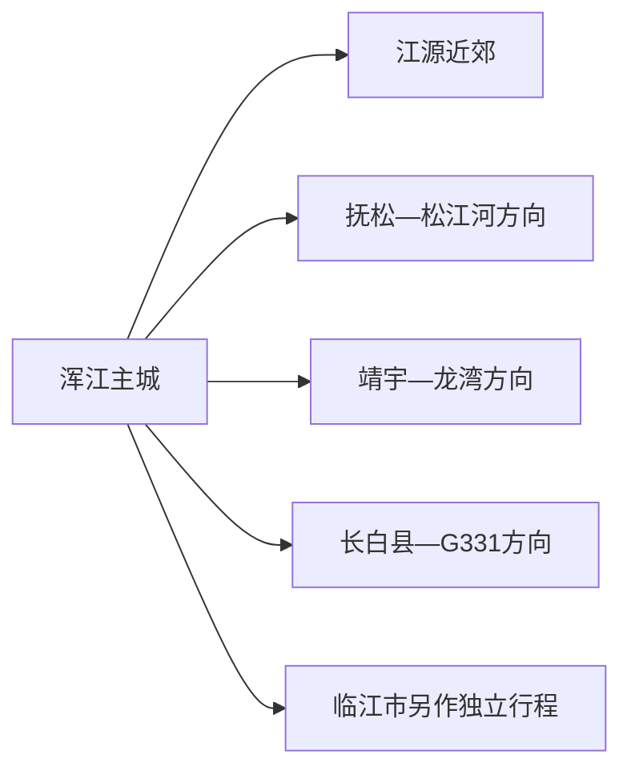
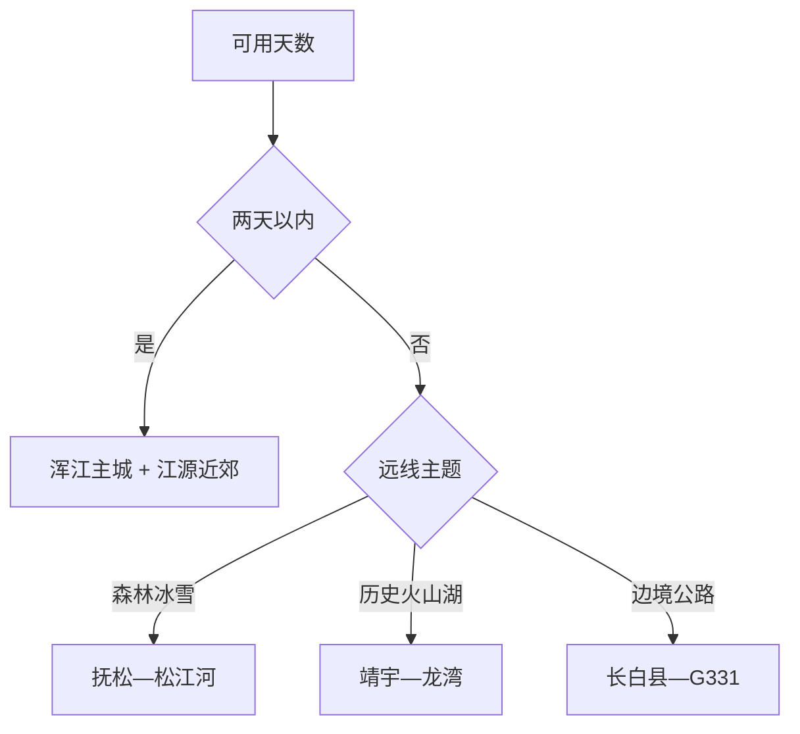

# 白山旅行指南

白山市位于长白山腹地，主城浑江区承担高铁到发、文博和城市生活，真正拉开旅行尺度的是松花江、鸭绿江、森林温泉、火山湖与冰雪度假。适合先用一天认识主城，再从抚松—松江河、靖宇—龙湾、长白县 G331 三个方向中择一深入；每条远线都比地图直线距离更需要天气和道路缓冲。

> 建议停留：主城 1–2 天；加入一条县域远线共 3–5 天 
> 旅行关键词：长白山腹地、浑江、G331、森林温泉、冰雪度假 
> 主要体力：主城低至中等；森林、雪场和边境远线为中高 
> 最近研究：2026-08-12

## 城市速览

| 项目 | 旅行信息 |
|---|---|
| 主要旅行价值 | 以浑江主城为门户，在白山市域选择森林温泉、松花江度假、火山湖或鸭绿江边境公路主题。 |
| 建议停留 | 1 天主城；2 天增加浑江近郊；3–5 天只选抚松、靖宇或长白县一个远线并考虑换宿。 |
| 较舒适季节 | 夏季避暑、秋季森林色彩、冬季冰雪各有重点；春季融雪和冬季极寒对道路影响较大。 |
| 预算特点 | 主城成本中等，滑雪、温泉、度假酒店、包车和跨县换宿构成主要增量。 |
| 步行强度 | 主城可分段；森林、火山湖和雪场按正式游线与观光车安排。 |
| 主要天气风险 | 暴雪、严寒、道路结冰、林区大风、夏季强降雨与山洪；边境公路还受施工和临时管制影响。 |
| 独行旅行 | 主城与成熟度假区较易安排，跨县远线把住宿、车辆和返程写进订单。 |
| 亲子旅行 | 城市冰雪活动、博物馆和成熟度假区适合分龄选择，雪具、水域与索道规则逐项确认。 |
| 长者与低体力旅行 | 以主城、温泉和观光车项目为主，森林长线和跨县连赶分日处理。 |
| 无障碍信息 | 高铁站、现代酒店和部分场馆设施较新，自然景区和积雪会中断连续动线；设施连续性需向官方确认。 |

### 城市身份与区域边界

本页采用地级市代码 **220600**。固定 **GeoNames 2038584** 与法定实体 **Wikidata Q92348** 的 `P1566` 精确对应。白山市辖浑江、江源二区及抚松、靖宇、长白三县，并代管[临江市](./临江市.md)；临江是独立县级市，具体旅行内容由独立页面承接。长白山保护开发区有独立管理与景区入口，购买“长白山”产品时按实际入口、住宿县区和管理方核对。

## 城市格局与游览区域

| 区域 | 主要内容 | 游览特点 | 与其他区域的关系 |
|---|---|---|---|
| 浑江主城 | 白山东站、城市文博、浑江滨水和季节冰雪活动 | 交通与住宿基地，适合抵达日 | 可连接江源近郊；其他县域宜换宿 |
| 江源区 | 松花石文化、森林和近郊休闲 | 车程较短，场馆和景点开放需核对 | 可与主城组成第二天 |
| 抚松—松江河 | 森林公园、温泉、滑雪与度假区 | 产品成熟但分散，住宿和接驳决定体验 | 长白山机场位于这一方向；北西坡入口按管理方另核 |
| 靖宇—龙湾 | 杨靖宇相关纪念、火山湖与森林 | 历史和地质主题结合 | 适合独立一日以上，冬季道路需缓冲 |
| 长白县—鸭绿江 | 千年崖城、朝鲜族文化、G331与边境景观 | 单程远，适合换宿 | 边境、无人机和涉水活动按属地规则 |

## 主要景点

| 景点 | 区域 | 类型 | 主要看点 | 建议用时 | 室内外 | 体力 | 预约风险 | 天气影响 | 优先级 |
|---|---|---|---|---:|---|---|---|---|---|
| 白山城市文博与公共文化场馆 | 浑江主城 | 博物馆与公共文化 | 地方历史、长白山文化与临展 | 1.5–3 小时 | 室内 | 低 | 中 | 低 | A |
| 浑江城市滨水与季节冰雪活动 | 浑江主城 | 城市公共空间 | 河谷城市景观、冬季活动与夜间生活 | 1–3 小时 | 室外 | 低至中 | 中 | 高 | B |
| 露水河国家森林公园等成熟森林项目 | 抚松县 | 森林景区 | 红松林、冰雪与自然教育 | 0.5–1 天 | 室外 | 中 | 高 | 高 | A |
| 松江河冰雪与度假区组合 | 抚松县 | 滑雪、温泉与度假 | 成熟雪场、温泉和酒店度假 | 1–3 天 | 混合 | 中高 | 高 | 高 | A |
| 仙人桥温泉方向 | 抚松县 | 温泉与康养 | 矿泉、森林与度假 | 0.5–1 天 | 混合 | 低 | 高 | 中 | B |
| 四海龙湾玛珥湖景区 | 靖宇县方向 | 火山湖与森林 | 玛珥湖、森林和季节活动 | 0.5–1 天 | 室外 | 中 | 高 | 高 | B |
| 杨靖宇相关纪念空间 | 靖宇县 | 红色纪念 | 人物历史与纪念展陈 | 2–3 小时 | 混合 | 低至中 | 中 | 中 | B |
| 千年崖城与长白县城开放空间 | 长白县 | 边境城市与文化景区 | 鸭绿江、朝鲜族文化和边城景观 | 0.5–1 天 | 混合 | 中 | 中 | 高 | C |

同一度假区内的雪场、温泉、酒店和乐园按一个完整产品计。规划项目和季节活动先确认已经开放，再纳入路线。

## 美食与餐饮

| 菜品或餐饮类型 | 常见区域 | 一个人用餐与常见份量 | 风味、过敏原与饮食限制 | 排队风险与替代方法 |
|---|---|---|---|---|
| 东北炖菜与锅类 | 浑江、县城 | 多人共享，单人找小锅或套餐 | 肉类、豆制品和高盐汤汁常见 | 先问份量，改点盖饭或面食 |
| 朝鲜族风味 | 长白县及市内正规餐馆 | 冷面、拌饭适合单人 | 荞麦、小麦、芝麻、花生和牛肉需询问 | 选择菜单清楚的餐馆 |
| 山野菜与菌菇 | 各县正规餐馆 | 按季节点小份 | 只食用正规供应、充分加工的品种 | 非产季改选普通蔬菜 |
| 人参、蓝莓等地方产品 | 正规市场与商店 | 小包装便于携带 | 保健宣传不替代医疗建议 | 查看配料、产地和标签 |
| 江鱼与冷水鱼 | 松花江、鸭绿江沿线 | 常按整鱼共享 | 鱼类过敏和按重量计价 | 先确认重量、价格与来源 |

## 经典行程

### 一日经典路线

**路线**：白山城市文博 → 午餐 → 浑江滨水短段 → 城市夜间活动

- **串联逻辑**：用主城低车程路线建立地区认识并适应天气。
- **预约锚点**：场馆开放和季节活动。
- **休息安排**：午间和傍晚各一次室内休息。
- **时间不足时**：保留文博与一段滨水。

### 两日城市路线

**第 1 天**：浑江主城文博与滨水  
**第 2 天**：江源近郊正式开放项目 → 返回主城

- **串联逻辑**：先城市后近郊，不用换宿。
- **预约锚点**：江源场馆或景区开放、车辆。
- **休息安排**：第二天午餐在城区或正规服务点。
- **时间不足时**：第二天改主城室内活动。

### 三日深度路线

**第 1 天**：浑江主城  
**第 2 天**：前往抚松—松江河并换宿  
**第 3 天**：森林、滑雪或温泉中选择一个完整主题

- **串联逻辑**：主城与度假区分开，减少跨县往返。
- **预约锚点**：住宿、景区票、雪具课程或温泉时段。
- **休息安排**：换宿日只安排低强度项目。
- **时间不足时**：第三天只保留一个度假产品。

### 雨雪天气路线

**路线**：城市文博 → 午餐 → 酒店或正规室内冰雪文化活动

- **适用条件**：降雪但城市交通正常；暴雪和道路预警时就近活动。
- **串联逻辑**：以主城室内和短交通降低冰雪暴露。
- **预约锚点**：场馆、活动和交通公告。
- **休息安排**：每段之间回到供暖空间。
- **时间不足时**：只保留城市文博。

### 亲子或低体力路线

**亲子路线**：城市文博 → 午餐 → 正规亲子冰雪或森林教育项目  
**低体力路线**：白山东站周边落客 → 城市文博 → 温泉或酒店休息

- **减负方式**：亲子选适龄、含护具项目；低体力路线用车辆和单馆替代长步道。
- **预约锚点**：年龄、保险、观光车与无障碍设施。
- **休息安排**：午后至少保留一段供暖休息。
- **时间不足时**：两类路线均保留一个室内项目。

### 远郊一日路线

**路线**：换宿地 → 露水河森林；或靖宇县城 → 四海龙湾；或长白县城 → G331 正式观景点

- **适用条件**：从相应县城或度假区出发，天气和道路稳定。
- **串联逻辑**：每条只覆盖一个县域主题，减少超长折返。
- **预约锚点**：景区、车辆、边境和返程。
- **休息安排**：使用游客中心与正规公路服务点。
- **时间不足时**：缩短景区游线，不跨入另一县域。

## 住宿区域

| 区域 | 优点 | 代价 | 适合人群 | 交通提示 |
|---|---|---|---|---|
| 浑江主城 | 高铁、餐饮、医疗和公共服务集中 | 到主要度假区车程长 | 抵达日、城市游、转场 | 核对距白山东站与上车点 |
| 松江河—抚松度假区 | 靠近雪场、温泉和森林 | 旺季价格与退改压力高 | 冰雪、度假、家庭 | 确认机场/车站接送和具体景区入口 |
| 靖宇或长白县城 | 便于对应县域远线 | 夜间交通与选择少于主城 | 自驾、G331、历史地质主题 | 按实际目的地换宿 |

## 市内交通

白山东站是主城主要铁路门户，沈白高铁开通后的车次以 12306 为准。长白山机场位于抚松方向，适合对应度假区；前往靖宇、长白县和森林景区依赖公路与预约车辆。冬季把道路关闭和航班延误缓冲写入换宿计划。

| 方式 | 适用场景 | 核对重点 |
|---|---|---|
| 高铁 | 抵达浑江主城 | 白山东站车次与市内接驳 |
| 航空 | 抚松与长白山度假区 | 航季、天气、接送和实际入口 |
| 客运与包车 | 跨县远线 | 班次、资质、冬季路况和返程 |
| 自驾 | G331 与多县换宿 | 冰雪胎、防滑、加油和边境道路 |

## 不同旅行者须知

- **独行者**：主城和成熟度假区优先，跨县换宿使用可追溯订单。
- **亲子家庭**：雪场、冰面、索道和森林项目按年龄与装备选择。
- **长者与低体力旅行者**：高铁主城、温泉和观光车项目更合适，长车程分日。
- **边境旅行**：长白县和 G331 沿正式道路、观景点活动，证件和无人机按属地规则。
- **森林与生产空间**：林场、矿泉、人参园、雪场作业区只通过正式接待项目进入。

## 行前核对

| 核对事项 | 建议时间 | 官方入口 |
|---|---|---|
| 冰雪季与夏季活动 | 订行程前 | [吉林省文旅厅白山信息](https://whhlyt.jl.gov.cn/dfwhxx/202602/t20260204_9414932.html) |
| 景区、温泉、雪场和度假区 | 预订前及前一日 | 各运营方正式渠道 |
| 铁路与航空 | 购票前及当天 | [12306](https://www.12306.cn/)、[民航局机场名录](https://www.caac.gov.cn/GYMH/MHGK/MYJC/) |
| 暴雪、严寒、山洪与森林火险 | 出发前三日及当天 | [吉林省气象局](https://jl.cma.gov.cn/)、属地应急公告 |

## 来源与更新记录

### 主要来源

| 来源 | 支持内容 | 核验日期 |
|---|---|---|
| [民政部行政区划代码查询](https://dmfw.mca.gov.cn/) | 白山市 220600 及区县结构 | 2026-08-12 |
| [Wikidata Q92348](https://www.wikidata.org/wiki/Q92348) | 法定实体与 GeoNames 精确映射 | 2026-08-12 |
| [GeoNames 2038584](https://www.geonames.org/2038584/baishan.html) | 固定白山城市点 | 2026-08-12 |
| [吉林省文旅厅：浑江冰雪文旅](https://whhlyt.jl.gov.cn/dfwhxx/202602/t20260204_9414932.html) | 白山东站、主城与冰雪线路 | 2026-08-12 |
| [吉林省文旅厅：白山之夏](https://whhlyt.jl.gov.cn/dfwhxx/202605/t20260527_9633697.html) | 夏季露营与县域活动 | 2026-08-12 |
| [吉林省文旅厅：白山旅游目的地](https://whhlyt.jl.gov.cn/dfwhxx/202408/t20240816_8946495.html) | 全市两江、县域与文旅布局 | 2026-08-12 |
| [吉林省政府：2025—2026 冰雪产品](https://www.jl.gov.cn/yaowen/202511/t20251124_3513943.html) | 雪场、温泉、森林和冰雪产品 | 2026-08-12 |
| [吉林省政府：2026 春节白山文旅](https://www.jl.gov.cn/szfzt/gzlfz/gzdt/202603/t20260310_3594720.html) | 当期成熟景区与活动 | 2026-08-12 |
| [中国铁路 12306](https://www.12306.cn/) | 高铁动态 | 2026-08-12 |

### 更新记录

| 日期 | 更新内容 |
|---|---|
| 2026-08-12 | 首次整理白山地级市边界、浑江门户、三条县域远线、冰雪森林温泉、交通和边境生产保护。 |
