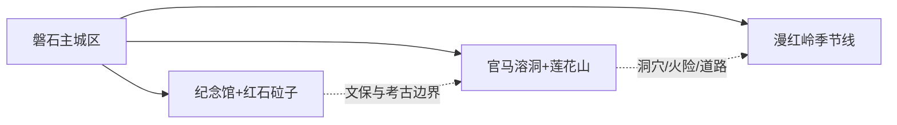
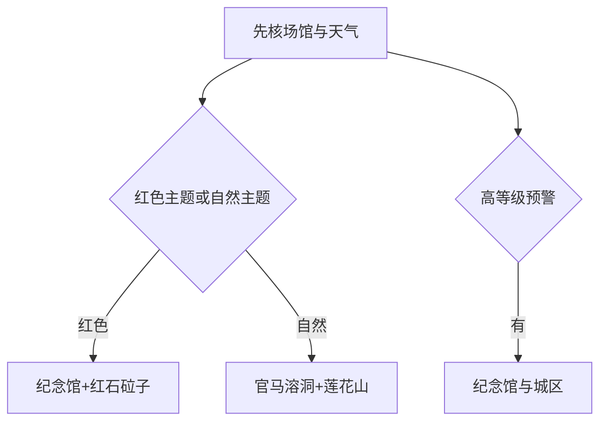

# 磐石旅行指南

磐石最鲜明的主题是东北抗联史和长白山余脉的山地自然。主城区适合作为住宿与补给基地，红石砬子遗址—磐石市抗日斗争纪念馆是一条完整红色线，烟筒山的莲花山—官马溶洞则是另一条喀斯特与森林线。把两条远线分日，比追着县域地图串点更稳妥。

> 建议停留：主城半日至 1 天；红石砬子和莲花山—官马溶洞各另留 1 天  
> 旅行关键词：东北抗联、红石砬子、官马溶洞、莲花山、山地乡村  
> 主要体力：主城低；遗址展示环线和山地洞穴为中高  
> 最近研究：2026-08-13

## 城市速览

| 项目 | 旅行信息 |
|---|---|
| 主要旅行价值 | 从纪念馆和红石砬子理解东北抗联创建史，再从莲花山—官马溶洞认识磐石山地与喀斯特 |
| 建议停留 | 1 天只做主城与红石砬子；2 天加入烟筒山线；3 天可再选漫红岭等季节乡村线 |
| 较舒适季节 | 5–10 月较适合山地；春融、汛期和冬季分别注意泥泞、山洪与冰雪 |
| 预算特点 | 主城住宿餐饮可控；远线车辆、讲解、门票和季节住宿增加成本 |
| 步行强度 | 纪念馆低；遗址环线、洞穴和森林步道为中高 |
| 主要天气风险 | 暴雨、山洪、雷电、浓雾、森林火险、寒潮、降雪和结冰 |
| 独行旅行 | 主城方便；遗址与山地先锁车辆、通信和返程 |
| 亲子旅行 | 纪念馆适合主题学习；洞穴、遗址步道和山地按年龄体力减量 |
| 长者与低体力旅行 | 以纪念馆和车辆接驳为主，遗址只走正式短环线 |
| 无障碍信息 | 新展馆可询问协助；遗址山沟、洞穴和森林的设施连续性需向官方确认 |

## 城市格局与游览区域

磐石市是吉林市代管的法定县级市，代码 `220284`。固定 GeoNames `2035511` 是主城居民点；Wikidata `Q1361953` 表达县级市，其 GeoNames 属性连接行政记录 `2035510`。固定点用于覆盖主城锚点，行政实体与法定代码用于界定烟筒山、红石砬子和取柴河等完整市域。

| 区域 | 主要内容 | 怎么安排 | 边界提示 |
|---|---|---|---|
| 磐石主城区 | 抗日斗争纪念馆、城市公共文化、住宿餐饮 | 首日和雨天底盘 | 场馆开放与纪念活动按公告 |
| 红石砬子—八家沟—西沟 | 抗日根据地遗址与展示环线 | 单列一日 | 文物保护与考古区按正式线路进入 |
| 烟筒山—官马—莲花山 | 官马溶洞、莲花山与乡村 | 单列一日 | 洞穴、森林、道路分别核验 |
| 取柴河—漫红岭 | 最美乡村公路、季节山林与具名接待点 | 秋季或活动期一日 | 公路可通行不等于林区全部开放 |
| 水库、林场与矿业片区 | 供水、林业、采矿和生产空间 | 只用正式景区与公共道路 | 大坝、矿区、作业林道和封控区禁止进入 |

红石砬子景区与抗日斗争纪念馆共同构成红色主题核心，但遗址群内部仍以开放展示环线为准。莲花山官马溶洞景区按一个运营单元理解，洞穴、森林和周边乡村不重复计数。

## 主要景点

### 红色历史与城区

| 景点 | 区域 | 类型 | 主要看点 | 建议用时 | 室内外 | 体力 | 预约风险 | 天气影响 | 优先级 |
|---|---|---|---|---:|---|---|---|---|---|
| 磐石市抗日斗争纪念馆 | 主城区 | 爱国主义教育、博物馆 | 东北抗联创建与磐石抗日斗争展陈 | 2–3 小时 | 室内 | 低 | 高 | 低 | A |
| 红石砬子抗日根据地遗址正式展示区 | 红石砬子方向 | 革命文物、考古遗址 | 八家沟、西沟等开放环线与遗迹展示 | 4–7 小时 | 室外 | 中高 | 很高 | 很高 | A |
| 靖宇广场及城区纪念空间 | 主城区 | 城市公共纪念 | 城市红色记忆和公共活动 | 1–2 小时 | 室外 | 低 | 低 | 高 | B |

### 山地、洞穴与乡村

| 景点 | 区域 | 类型 | 主要看点 | 建议用时 | 室内外 | 体力 | 预约风险 | 天气影响 | 优先级 |
|---|---|---|---|---:|---|---|---|---|---|
| 莲花山官马溶洞景区 | 烟筒山镇 | 3A 洞穴与森林 | 喀斯特洞穴、森林和正式游览设施 | 5–8 小时 | 混合 | 中高 | 高 | 高 | A |
| 仙人湖森林公园景区 | 市域山地 | 2A 森林与湖区 | 正式开放森林与湖区景观 | 3–6 小时 | 室外 | 中 | 高 | 很高 | B |
| 漫红岭正式开放线 | 取柴河镇 | 乡村公路、季节山林 | 红叶、乡村和具名接待点 | 4–7 小时 | 室外 | 中 | 很高 | 很高 | B |
| 官马新村具名接待点 | 烟筒山镇 | 乡村与农业 | 洞穴、森林之间的村庄生活与正式体验 | 2–4 小时 | 混合 | 低至中 | 很高 | 高 | C |

## 美食与餐饮

| 类型 | 适合区域 | 份量与选择 | 饮食提醒 | 怎么选 |
|---|---|---|---|---|
| 东北炖菜、锅包肉与饺子 | 主城区 | 2–4 人分享更方便 | 油盐、糖醋和猪肉较常见 | 单人选饺子、面食或小份菜 |
| 朝鲜族打糕与冷面 | 城区正规餐馆 | 小份可试 | 糯米黏性、芝麻花生和牛肉汤需询问 | 现做现食，吞咽困难者慎选 |
| 山珍与菌菇菜 | 镇区具名餐馆 | 多人桌餐 | 野生菌来源和熟度最重要 | 只选经营者可说明来源的熟制菜 |
| 鱼类与稻米产品 | 城区市场、正规餐馆 | 按份或按斤 | 鱼刺、过敏和加工费 | 选明码标价、熟制菜 |

## 经典行程

### 一日经典路线

**路线**：抗日斗争纪念馆 → 城区午餐 → 红石砬子正式展示区 → 返回城区。

- **串联逻辑**：先在室内建立历史框架，再进入遗址环境。
- **适用条件**：遗址开放、天气和车辆稳定。
- **预约锚点**：纪念馆、遗址展示区和讲解。
- **休息安排**：城区午休、遗址游客服务点。
- **时间不足时**：只保留纪念馆和遗址核心短线。

### 两日城市路线

**第 1 天**：纪念馆与红石砬子。  
**第 2 天**：莲花山官马溶洞景区。

- **串联逻辑**：两天分别完成红色历史与自然主题。
- **适用条件**：可连续使用车辆、远线开放稳定。
- **预约锚点**：遗址讲解、洞穴开放和景区交通。
- **休息安排**：每天在正式服务区完整午休。
- **时间不足时**：第二天只保留官马溶洞核心单元。

### 三日深度路线

**第 1 天**：主城与纪念馆。  
**第 2 天**：红石砬子。  
**第 3 天**：官马溶洞—莲花山或漫红岭二选一。

- **串联逻辑**：把展陈、遗址和自然景观分开，避免疲劳。
- **适用条件**：历史专题、自驾或摄影旅行者。
- **预约锚点**：第三天景区/接待点、道路和天气。
- **休息安排**：主城或镇区午休。
- **时间不足时**：删第三天。

### 雨天路线

**路线**：抗日斗争纪念馆 → 午餐 → 城区当期公共展览。

- **串联逻辑**：集中室内内容，避开山沟和洞外湿滑路段。
- **适用条件**：普通降雨且城区交通正常。
- **预约锚点**：场馆开放。
- **休息安排**：馆内和城区商业区。
- **时间不足时**：只留纪念馆。

### 亲子或低体力路线

**亲子方案**：纪念馆精选展 → 午餐 → 靖宇广场短段。  
**低体力方案**：车辆落客纪念馆 → 长休 → 城区公共空间。

- **串联逻辑**：以室内展陈为核心，户外随体力增减。
- **适用条件**：先核团队、讲解和纪念场所礼仪。
- **预约锚点**：场馆与无障碍协助。
- **休息安排**：每 60–90 分钟休息。
- **时间不足时**：删除广场段。

### 远郊一日路线

**官马线**：主城 → 官马溶洞 → 午休 → 莲花山当期开放短线 → 返回。  
**漫红线**：主城 → 取柴河具名接待点 → 漫红岭正式道路与观景点 → 返回。

- **串联逻辑**：两条线分别处理洞穴森林与季节乡村，一天只选一条。
- **适用条件**：道路、火险、天气和返程均稳定。
- **预约锚点**：景区入口、乡村接待和车辆。
- **休息安排**：烟筒山镇或具名服务点。
- **时间不足时**：只保留一个主景区。

## 住宿区域

| 区域 | 优点 | 取舍 | 适合人群 | 交通提示 |
|---|---|---|---|---|
| 磐石主城区 | 餐饮、交通和医疗集中 | 远线需早出 | 首访、独行、多日者 | 核对铁路/客运到酒店距离 |
| 烟筒山镇正规住宿 | 便于官马和莲花山 | 夜间服务少于主城 | 自然主题、自驾 | 先确认供暖、餐食和接送 |
| 具名乡村民宿 | 接近漫红岭等季节线 | 运营和退改受季节影响 | 摄影、慢旅行 | 只订地址、证照和联系人清楚的住宿 |

## 市内交通

| 场景 | 建议方式 | 怎么做 | 动态核对 |
|---|---|---|---|
| 跨城抵达 | 铁路、道路客运、自驾 | 以票面站名为准 | 车次、站址、末班 |
| 红石砬子 | 合规包车、自驾或团队交通 | 走正式游客入口 | 道路、停车、讲解、返程 |
| 烟筒山线 | 铁路/公路到镇后接驳或自驾 | 官马溶洞服务区不等于景区入口 | 班次、门区和内部交通 |
| 漫红岭 | 自驾或具名接待车辆 | 沿公开道路和正式观景点 | 火险、施工、日落和通信 |

## 不同旅行者须知

| 旅行者 | 优先选择 | 需要确认 | 备选方案 |
|---|---|---|---|
| 独行者 | 主城与纪念馆 | 远线返程和通信 | 城区公共文化 |
| 亲子家庭 | 纪念馆、短步道 | 遗址礼仪、洞穴照明和湿滑 | 主城半日 |
| 长者与低体力者 | 单一场馆和车辆接驳 | 台阶、坡度、座席 | 纪念馆精选展 |
| 徒步旅行者 | 正式景区环线 | 山洪、火险、落石、日落 | 缩短至服务区周边 |
| 自驾旅行者 | 一天一条远线 | 疲劳、结冰、加油和停车 | 主城休整 |

文物、自然和生产边界保持明确：红石砬子只走正式展示环线；森林防火封控时改用城区方案；水库大坝、矿山、林业作业路、考古发掘区和未开放洞穴不得进入。

## 行前核对

- 在[磐石市人民政府](https://www.panshi.gov.cn/)和[吉林省文化和旅游厅](https://whhlyt.jl.gov.cn/)查看开放与活动。
- 红石砬子核对展示区、讲解、团队和道路。
- 官马溶洞—莲花山核洞穴开放、内部交通、湿滑和火险。
- 漫红岭核花叶期、正式接待、道路和返程。
- 通过 12306 与客运运营方确认到发。
- 无障碍旅行逐段确认车站、场馆、景区车辆和住宿。

## 来源与更新记录

### 主要来源

| 来源 | 机构 | 支持内容 | 核验日期 |
|---|---|---|---|
| [红石砬子抗日根据地遗址](https://www.jl.gov.cn/yaowen/202607/t20260708_3647802.html) | 吉林省人民政府 | 遗址、纪念馆、保护展示和近期状态 | 2026-08-13 |
| [G334 红色文旅通道](https://www.jl.gov.cn/yaowen/202511/t20251104_3509149.html) | 吉林省人民政府 | 八家沟、西沟和展示环线 | 2026-08-13 |
| [吉林省红色旅游线路](https://whhlyt.jl.gov.cn/ztzl/jlslyxlhxj/gdxl/jls/hds/202507/t20250704_9273173.html) | 吉林省文化和旅游厅 | 纪念馆—遗址可执行路线 | 2026-08-13 |
| [吉林省 A 级景区名录](https://whhlyt.jl.gov.cn/ggfw/lyfw/jng/202405/t20240524_8912725.html) | 吉林省文化和旅游厅 | 莲花山官马溶洞、红石砬子和仙人湖等级 | 2026-08-13 |
| [磐石市发展资料](https://www.jl.gov.cn/yaowen/202409/t20240906_3294033.html) | 吉林省人民政府 | 红色线路、官马溶洞与城市夜间服务 | 2026-08-13 |
| [漫红岭旅游公路](https://jtyst.jl.gov.cn/zx_133250/jtyj/202301/t20230103_8654771.html) | 吉林省交通运输厅 | 漫红岭与烟筒山景点交通关系 | 2026-08-13 |
| [GeoNames 2035511](https://sws.geonames.org/2035511/about.rdf) | GeoNames | 固定主城居民点 | 2026-08-13 |
| [Wikidata Q1361953](https://www.wikidata.org/wiki/Q1361953) | Wikidata | 磐石市实体与行政记录关系 | 2026-08-13 |
| [民政部行政区划代码服务](https://dmfw.mca.gov.cn/xzqh/getList?code=220284&trimCode=false&maxLevel=3) | 民政部 | 法定代码和县级市层级 | 2026-08-13 |
| [吉林省气象局](http://jl.cma.gov.cn/) | 气象主管部门 | 天气与灾害预警 | 2026-08-13 |

### 更新记录

| 日期 | 更新内容 |
|---|---|
| 2026-08-13 | 建立研究版；确认固定居民点与县级市行政记录的粒度差异；按红石砬子、官马溶洞—莲花山和漫红岭分线，并写明文保、森林、水库和矿业边界。 |
