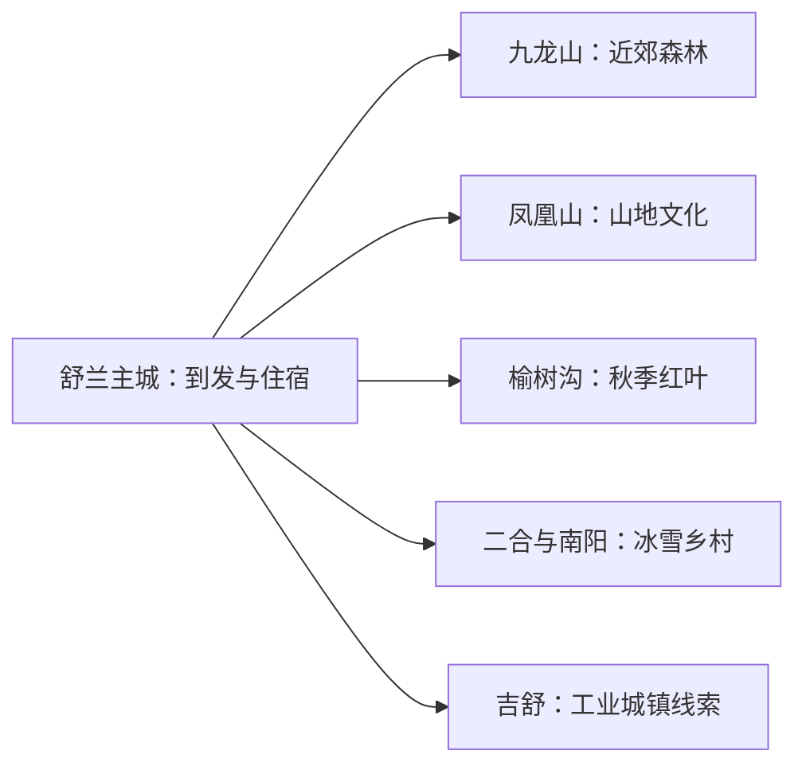
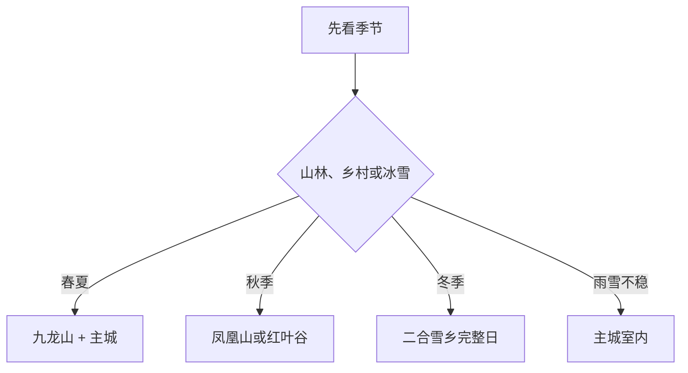

# 舒兰旅行指南

舒兰适合把主城、森林山地和乡村冰雪分开安排：主城承担铁路、住宿与公共文化，九龙山和凤凰山适合春夏秋户外，二合雪乡、南阳俄式风情小镇等按季节和运营选择。一天看主城与近郊，两天再加入一条山林或乡村线，节奏最稳。

> 建议停留：1–3 天 
> 旅行关键词：九龙山、凤凰山、红叶、二合雪乡、俄式乡村、松花江上游 
> 主要体力：中等；山地与雪地较高 
> 最近研究：2026-08-13

## 城市速览

| 项目 | 旅行信息 |
|---|---|
| 主要旅行价值 | 在县级市尺度中组合森林、冰雪、乡村和松花江流域生活 |
| 建议停留 | 1 天主城近郊；2–3 天增加山林或冰雪方向 |
| 较舒适季节 | 五月至十月适合山林；冬季适合正式冰雪项目 |
| 预算特点 | 主城中低；远线车辆、民宿和雪地项目增加成本 |
| 步行强度 | 主城低，山林与雪地中至高 |
| 主要天气风险 | 严寒、暴雪、道路结冰、山洪、雷暴与森林火险 |
| 独行旅行 | 主城方便；山村路线先锁定接待与返程 |
| 亲子旅行 | 九龙山轻量步道、乡村和正式采摘项目可选 |
| 长者与低体力旅行 | 主城与九龙山短段更合适 |
| 无障碍信息 | 现代场馆可咨询；山地、雪村和乡村设施连续性需向官方确认 |

## 城市格局与游览区域

舒兰市是吉林市代管的县级市，法定代码 `220283`。固定 GeoNames `2036418` 对应吉舒街道一带的居民点，Wikidata `Q1205127` 代表法定舒兰市且 `P1566` 连接另一条地点记录 `2034761`。舒兰主城承担到发与住宿，吉舒是矿业与铁路发展片区，九龙山靠近主城，凤凰山、榆树沟红叶方向和二合村均需公路接驳。

| 区域 | 主要内容 | 怎么安排 | 与其他区域的关系 |
|---|---|---|---|
| 舒兰主城 | 住宿、餐饮、铁路与公共文化 | 抵离日或半日 | 所有远线基地 |
| 九龙山 | 森林步道、观景与海慧寺周边 | 半日 | 可与主城同日 |
| 凤凰山 | 森林、山地和宗教文化 | 独立半日至一天 | 与红叶谷二选一 |
| 榆树沟红叶方向 | 秋色、山谷与水库周边 | 花色合适时一天 | 季节性强 |
| 二合、南阳等乡村 | 雪村、俄式乡村和民宿 | 冬季或活动期一天 | 先确认运营与道路 |

## 主要景点

### 主城与近郊

| 景点 | 区域 | 类型 | 主要看点 | 建议用时 | 室内外 | 体力 | 预约风险 | 天气影响 | 优先级 |
|---|---|---|---|---:|---|---|---|---|---|
| 九龙山森林公园正式开放区 | 主城近郊 | 森林公园 | 林海、步道、观景平台和花木 | 3–5 小时 | 室外 | 中 | 中 | 高 | A |
| 舒兰市公共文化场馆 | 主城 | 文博与公共文化 | 地方史、诗歌、农业和当期展览 | 1–2 小时 | 室内 | 低 | 很高 | 低 | B |
| 松花江舒兰段公共滨水场景 | 市域 | 河流与休闲 | 正式开放的亲水步道和季节活动 | 2–3 小时 | 室外 | 低至中 | 很高 | 很高 | B |

### 山林与乡村

| 景点 | 区域 | 类型 | 主要看点 | 建议用时 | 室内外 | 体力 | 预约风险 | 天气影响 | 优先级 |
|---|---|---|---|---:|---|---|---|---|---|
| 凤凰山旅游景区 | 溪河镇方向 | 山地与森林 | 山林、石景、庙宇与观景节点 | 4–6 小时 | 室外 | 中至高 | 高 | 很高 | A |
| 榆树沟红叶谷正式开放区域 | 平安镇方向 | 山谷与秋色 | 槭树秋色、山谷和水库周边景观 | 半日至一天 | 室外 | 中至高 | 很高 | 很高 | B |
| 二合雪乡正式运营区 | 上营镇二合村 | 冰雪与乡村 | 雪景、民宿和当期冰雪体验 | 一天 | 混合 | 中至高 | 很高 | 很高 | A |
| 南阳俄式风情小镇 | 乡村 | 乡村旅游 | 俄式民宿、餐饮与村落体验 | 半日至一天 | 混合 | 中 | 高 | 高 | B |
| 正式采摘与农耕项目 | 市域乡村 | 农业体验 | 果蔬采摘、科普和乡村餐饮 | 半日 | 混合 | 中 | 很高 | 高 | C |

森林景区内部步道、庙宇和观景点按各自父景区规划，不拆成多条必到项目。红叶、冰雪和采摘都由季节决定；林区作业道、水库工程、矿山、铁路专用线和普通农田遵循保护与生产管理。

## 美食与餐饮

| 菜品或餐饮类型 | 常见区域 | 一个人用餐与常见份量 | 风味、过敏原与饮食限制 | 排队风险与替代方法 |
|---|---|---|---|---|
| 东北炖菜与铁锅菜 | 主城、乡村 | 多为共享份量 | 猪禽、豆制品、小麦和酱油常见 | 一人先问小份或拼菜 |
| 大米、玉米与山野菜 | 全市 | 主食和小盘菜易组合 | 山野菜种类和腌制调味需确认 | 选择正规餐馆，不自行采食 |
| 鱼类与江河菜 | 主城、乡镇 | 整鱼适合多人 | 鱼类、甲壳类和酒类需确认 | 先问时价、重量和来源 |
| 俄式与乡村餐饮 | 南阳等接待点 | 套餐常适合共享 | 小麦、奶、蛋、肉和酒常见 | 预约时说明过敏和份量 |

## 经典行程

### 一日经典路线

**路线**：舒兰主城公共文化 → 午餐 → 九龙山森林公园开放步道 → 主城晚餐

- **串联逻辑**：主城与近郊距离相对可控，室内外互相补充。
- **预约锚点**：先确认公共文化场馆与九龙山开放。
- **休息安排**：午间在主城，公园内选正规服务点短休。
- **时间不足时**：保留九龙山短段和一个室内场馆。

### 两日城市路线

**第 1 天**：主城与九龙山 
**第 2 天**：凤凰山、红叶谷或南阳乡村三选一

- **串联逻辑**：近郊与远线分日，第二天按季节选择。
- **预约锚点**：第二天接待、道路和返程。
- **休息安排**：连续住主城，远线午休放在游客中心或乡镇。
- **时间不足时**：删第二天，主城慢游。

### 三日深度路线

**第 1 天**：主城与九龙山 
**第 2 天**：凤凰山或红叶谷 
**第 3 天**：南阳乡村、二合雪乡或采摘项目按季节选一

- **串联逻辑**：城市、山林和乡村分别成日。
- **预约锚点**：后两日都以运营与道路确认作为出发条件。
- **休息安排**：主城连续住宿，乡村只白天往返。
- **时间不足时**：先删第三天，再把第二天改为九龙山短线。

### 雨雪天路线

**路线**：公共文化场馆 → 午餐 → 主城室内活动 → 路况允许时短游公共空间

- **适用条件**：普通降雪可行；暴雪、结冰和低能见度时留在主城。
- **预约锚点**：场馆开放、公交和道路状态。
- **休息安排**：每段都以室内暖区衔接。
- **时间不足时**：保留一个确认开放的场馆。

### 亲子或低体力路线

**亲子路线**：公共文化活动 → 午餐 → 九龙山短步道或正式采摘 
**低体力路线**：车辆到公共文化场馆 → 长休 → 九龙山近入口观景

- **减负方式**：亲子线一次只选一个户外项目；低体力线减少山路、雪地和换乘。
- **预约锚点**：儿童规则、采摘接待、卫生间和入口距离。
- **休息安排**：午间在主城安排至少一小时。
- **时间不足时**：两类路线都保留室内场馆。

### 远郊一日路线

**路线**：舒兰主城 → 二合雪乡或凤凰山二选一 → 午餐与休息 → 返回

- **适用条件**：季节、道路、运营与返程车辆都已确认。
- **预约锚点**：门票、民宿、体验和道路公告。
- **休息安排**：只在正规接待点补给取暖。
- **时间不足时**：整段改期，选择九龙山近郊线。

## 住宿区域

| 区域 | 优点 | 缺点 | 适合人群 | 交通特点 |
|---|---|---|---|---|
| 舒兰主城 | 到发、餐饮和价格选择多 | 距离山村较远 | 首访、无车和多日旅行 | 便于铁路、公路与远线车辆衔接 |
| 二合或南阳正式民宿 | 靠近乡村和早晚景观 | 季节性、供应和道路波动大 | 冰雪、摄影与乡村主题 | 先确认资质、供暖和返程 |
| 山地景区周边 | 减少早晨往返 | 夜间餐饮和交通有限 | 自驾与山林深度旅行 | 只选正式运营住宿 |

## 市内交通

舒兰站承担主要铁路到发，主城可用公交、出租车或网约车。九龙山相对靠近主城，凤凰山、红叶谷、二合与南阳需公路接驳；冬季和汛期优先使用熟悉路况的合规车辆。

| 场景 | 建议与取舍 | 行前需要重查的内容 |
|---|---|---|
| 铁路抵达 | 先住主城再走远线 | 车次、站前交通和夜间到达 |
| 主城—九龙山 | 公交或短途车辆 | 开放入口和返程 |
| 山村与雪乡 | 预约车辆、自驾或当期专线 | 雪况、道路、集合点和退改 |
| 自驾 | 适合分散乡镇 | 冰雪胎、加油、通信和日落 |

## 不同旅行者须知

| 旅行维度 | 可行条件 | 主要取舍 | 需额外核对 |
|---|---|---|---|
| 独行旅行 | 住主城并落实远线接待 | 每天只走一个远点 | 夜间返程和通信 |
| 亲子旅行 | 近郊步道或正式乡村项目 | 雪地和山地控制时长 | 年龄规则、保暖和救援 |
| 长者或低体力旅行 | 车辆连接主城与近入口 | 红叶谷和雪乡改为短段 | 台阶、冰面、座椅和卫生间 |
| 无障碍需求 | 现代场馆可咨询 | 山地和雪村连续动线有限 | 设施连续性需向官方确认 |
| 摄影旅行 | 红叶、林海和雪村季相鲜明 | 尊重林区和村民生活 | 无人机、商业拍摄和花色雪况 |
| 特殊天气 | 主城室内可替换 | 山洪、暴雪和火险时调整远线 | 预警、闭园和道路管制 |

## 行前核对

| 核对事项 | 为什么需要重查 | 建议核对时间 | 官方入口 |
|---|---|---|---|
| 九龙山、凤凰山和红叶谷 | 步道、火险和季节景观变化 | 出发前一周及当天 | [舒兰市人民政府](https://www.shulan.gov.cn/) |
| 二合雪乡与乡村项目 | 雪况、民宿和体验按季节运营 | 订房前及当天 | [吉林省文化和旅游厅](https://whhlyt.jl.gov.cn/) |
| 铁路与道路 | 车次、结冰和施工会调整 | 出发前一周及当天 | [中国铁路12306](https://www.12306.cn/) |
| 天气与森林风险 | 严寒、暴雪、山洪和火险影响远线 | 出发前三日及当天 | [吉林省气象局](http://jl.cma.gov.cn/) |

## 来源与更新记录

### 主要来源

| 来源 | 类型 | 支持内容 | 核验日期 |
|---|---|---|---|
| [吉林省政府：舒兰市2025年旅游发展](https://www.jl.gov.cn/szfzt/gzlfz/gzdt/202601/t20260127_3550585.html) | 省政府 | 舒兰旅游格局、二合村、南阳乡村与项目方向 | 2026-08-13 |
| [2026吉林市五一文旅发布会](https://jl.cnjiwang.com/ywq/202604/4042699.html) | 省级新闻媒体 | 九龙山开放、松花江场景、南阳与采摘项目 | 2026-08-13 |
| [吉林省地方志：游遍吉林舒兰](https://dfz.jl.gov.cn/ybjl/201808/t20180810_5217191.html) | 省地方志 | 凤凰山、红叶谷、森林公园与地方文化 | 2026-08-13 |
| [舒兰市人民政府](https://www.shulan.gov.cn/) | 市政府 | 当期场馆、道路与活动核对入口 | 2026-08-13 |
| [吉林省文化和旅游厅](https://whhlyt.jl.gov.cn/) | 省文旅厅 | 景区和文旅活动核对 | 2026-08-13 |
| [GeoNames 2036418](https://www.geonames.org/2036418/jishu.html) | 开放地名数据 | 固定吉舒居民点 | 2026-08-13 |
| [Wikidata Q1205127](https://www.wikidata.org/wiki/Q1205127) | 开放结构化数据 | 法定舒兰市实体与P1566粒度 | 2026-08-13 |
| [中国铁路12306](https://www.12306.cn/) | 铁路运营方 | 当期车次与售票 | 2026-08-13 |

### 更新记录

| 日期 | 更新内容 |
|---|---|
| 2026-08-13 | 首次完成舒兰主城、山林、冰雪乡村、交通和保护生产边界研究 |
