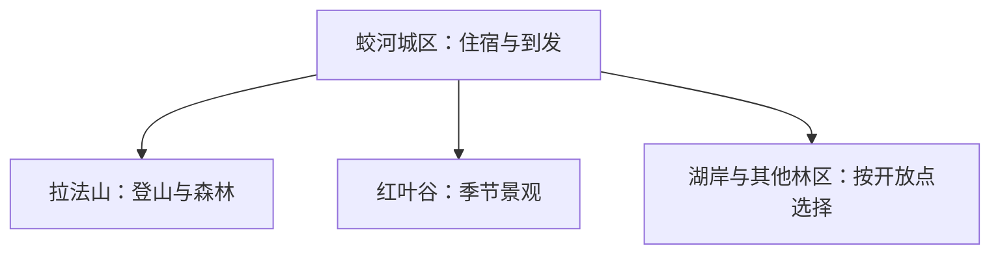
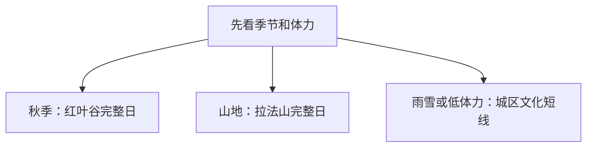

# 蛟河旅行指南

蛟河适合把秋色、森林山地和县级市生活分开安排。秋季优先给红叶谷或拉法山完整一天，其他季节可在拉法山、松花湖沿岸正式开放点与城区文化之间选择；先确认景区开放、返程和天气，再决定是否增加远点。

> 建议停留：2–3 天；只走一个山地景区可压缩为 1 天 
> 旅行关键词：红叶谷、拉法山、森林、松花湖、红色记忆 
> 主要体力：城区低至中等，山地中高至高 
> 无障碍提醒：设施连续性需向官方确认；山地入口、景交车、坡度和卫生间逐点核对

## 城市速览

| 项目 | 信息 |
|---|---|
| 主要旅行价值 | 用红叶、森林山地与地方历史认识长白山余脉北缘的县级市 |
| 建议停留 | 2 天完成城区加一个山地景区；3 天再选另一条森林或湖岸方向 |
| 较舒适季节 | 5–10 月；秋色窗口短，冬季按冰雪运营和道路条件安排 |
| 预算特点 | 城区消费较平稳；景区门票、景交、自驾或包车是主要增量 |
| 步行强度 | 城区低至中等；拉法山、红叶谷与林区步道为中高至高 |
| 独行旅行 | 城区与正式景区可独立安排，远线先锁定返程车辆和通信条件 |
| 亲子旅行 | 选择游客中心、短步道和自然教育内容，避开长距离爬升 |
| 长者与低体力旅行 | 每天只安排一个主景区，优先车辆可达入口和可提前退出的短线 |
| 主要天气风险 | 秋季早晚温差、山雾和降雨；冬季低温、积雪与道路结冰；林区火险 |
| 行前关键动作 | 先查景区开放、秋色或雪况、景交和返程，再订住宿与车票 |

## 城市格局与游览区域

蛟河市为吉林市代管的县级市，法定代码 **220281**。城区承担住宿、餐饮和铁路到发；拉法山与红叶谷分属不同山地游览方向，松花湖沿岸和白石山等林区又有各自道路与管理边界。吉林市主城是独立目的地，跨城联程按车票和住宿重新计算。

| 区域 | 适合内容 | 建议节奏 | 选择提示 |
|---|---|---|---|
| 蛟河城区 | 住宿、餐饮、地方文化与交通换乘 | 半日至 1 天 | 适合雨天与抵离日 |
| 拉法山方向 | 花岗岩山体、森林、云海与红色展陈 | 1 天 | 按开放入口、步道等级和末班接驳选线 |
| 红叶谷方向 | 秋色、谷地森林和摄影 | 1 天 | 花期与叶色不固定，先看当期公告与客流 |
| 松花湖沿岸及其他林区 | 湖岸、森林与乡镇体验 | 半日至 1 天 | 只使用正式开放点和明确接待线路 |

林场、采石场、铁路作业区和森林生产道路以生产与防火管理为先；观景路线沿正式入口和开放步道组织。

## 主要景点

| 景点 | 区域 | 类型 | 主要看点 | 建议用时 | 室内外 | 体力 | 预约风险 | 天气影响 | 优先级 |
|---|---|---|---|---:|---|---|---|---|---|
| 拉法山景区 | 拉法山方向 | 山地、森林 | 花岗岩峰体、森林步道、云海与季节日出项目 | 1 天 | 室外 | 高 | 高 | 很高 | A |
| 红叶谷景区 | 庆岭方向 | 森林、季节景观 | 谷地林相、秋色与摄影；叶色随气温和降雨变化 | 1 天 | 室外 | 中至高 | 高 | 很高 | A |
| 拉新战斗展览馆及开放纪念空间 | 拉法山方向 | 红色历史 | 拉新战斗历史与地方抗战记忆 | 1–2 小时 | 混合 | 低至中 | 中至高 | 中 | B |
| 蛟河城区公共文化场馆 | 城区 | 文博、地方史 | 以当期开放的博物馆、文化馆或专题展览认识地方历史 | 2–3 小时 | 室内 | 低 | 中 | 低 | B |
| 松花湖蛟河沿岸正式开放点 | 市域西部 | 湖泊、休闲 | 湖岸景观、季节活动与乡镇生活 | 半天 | 室外 | 低至中 | 高 | 很高 | C |
| 白石山等林区明确接待项目 | 市域林区 | 森林、研学 | 林业文化、森林环境与季节活动 | 半日至 1 天 | 混合 | 中 | 高 | 高 | C |

拉法山内部步道、观景点和展馆按一座景区安排；红叶谷内部观景段也不拆成多个“完成点”。

## 美食与餐饮

蛟河城区适合安排东北家常菜、锅包肉、炖菜、饺子和朝鲜族风味。庆岭活鱼等地方菜常按整鱼或重量计价，点单时先问品种、重量、时价和加工方式；一人旅行可选鱼片、饺子、面食或小份家常菜。坚果、芝麻、大豆、小麦、鱼类和共锅烹饪是常见过敏原线索。

## 经典行程

### 一日经典
- **路线**：蛟河城区出发 → 拉法山或红叶谷二选一 → 景区服务区午休 → 返回城区。
- **串联逻辑**：把交通、步行和景观集中在一个完整景区。
- **预约锚点**：景区开放、门票、景交和返程车辆。
- **休息安排**：游客中心与正式服务区各留一次长休息。
- **时间不足时**：采用运营方短线并提前返程。

### 两日组合
- **路线**：第 1 天城区文化与休整；第 2 天拉法山或红叶谷完整日。
- **串联逻辑**：抵达日先解决住宿和补给，次日集中处理山地。
- **预约锚点**：第二日景区规则与铁路返程。
- **休息安排**：第一天下午留空，第二日中段在服务区用餐。
- **时间不足时**：第一天只保留一处室内场馆。

### 三日深度
- **路线**：前两日按上；第 3 天选择另一座山地景区或一个正式湖岸、林区项目。
- **串联逻辑**：前两天先完成城区与首选山地，第三天再换到第二个独立方向，避免同日跨山谷赶路。
- **适用条件**：天气稳定且已落实第三日接驳。
- **预约锚点**：第三日入口、项目和最晚返程。
- **休息安排**：远线日回到乡镇或城区完成正餐。
- **时间不足时**：保留城区慢游，不跨方向赶点。

### 雨雪天路线
- **路线**：城区公共文化场馆 → 坐席午餐 → 城区商业与生活短段。
- **串联逻辑**：全程留在城区，用室内场馆和近距离餐饮减少湿滑道路上的移动。
- **适用条件**：城区道路和场馆正常开放。
- **预约锚点**：闭馆日与临时活动。
- **休息安排**：车辆接驳，午后留出室内休息。
- **时间不足时**：单馆慢游。

### 亲子与低体力路线
- **路线**：城区场馆或景区游客中心自然教育 → 午餐 → 平缓短步道。
- **串联逻辑**：先完成有讲解和休息设施的科普项目，再按体力选择一段可随时退出的短步道。
- **减负方式**：优先车辆可达入口、短线和可随时退出的项目。
- **预约锚点**：讲解、亲子活动、轮椅与卫生间。
- **休息安排**：每 60–90 分钟安排坐席休息。
- **时间不足时**：保留一个核心展览或游客中心周边。

### 季节远线
- **路线**：城区 → 当期正式开放的湖岸或林区项目 → 原路返回。
- **串联逻辑**：一天只处理一个季节性远点，以原路返回控制天气变化和接驳不确定性。
- **适用条件**：运营方明确接待，天气、道路与防火条件稳定。
- **预约锚点**：接待时段、车辆和返程。
- **休息安排**：只使用正式服务点补水用餐。
- **时间不足时**：取消远线，改为城区文化日。

## 住宿区域

| 区域 | 优点 | 取舍 | 适合人群 |
|---|---|---|---|
| 蛟河城区 | 餐饮、铁路和补给稳定 | 每个山地日仍需往返 | 首访、公共交通、雨天备选 |
| 拉法山或红叶谷门户附近 | 方便早进景区 | 营业季、退改和夜间服务差异大 | 摄影、早出和自驾 |
| 吉林市主城 | 跨城交通选择多 | 每日往返会压缩景区时间 | 只做一日联程者 |

## 市内交通

蛟河站及公路客运承担主要到发，具体车次以 [12306](https://www.12306.cn/) 和属地客运公告为准。城区到拉法山、红叶谷及林区末段优先使用景区公布的接驳、正规出租或合规包车；自驾先确认停车、山路、结冰与防火管制。

## 不同旅行者须知

- 山地旅行者先按步道等级、累计爬升和最晚下山时间选线。
- 摄影旅行者把秋色、云海和日出视为天气结果，准备城区替代方案。
- 亲子和低体力旅行者先问景交车、最近下客点、座椅和卫生间。
- 林区活动遵守防火、自然保护和生产管理；采石场、林业作业道及封闭岸线按现场边界通行。

## 行前核对

| 项目 | 何时确认 | 官方入口 |
|---|---|---|
| 拉法山、红叶谷开放与景交 | 订房前、前三日和当天 | [蛟河市人民政府](http://www.jiaohe.gov.cn/)；[吉林省林草局](https://jllc.jl.gov.cn/) |
| 铁路与县域接驳 | 购票时和出发前一日 | [12306](https://www.12306.cn/) |
| 山区天气、森林火险与道路 | 前三日滚动确认 | [吉林省气象局](http://jl.cma.gov.cn/)；属地应急、林草和交通公告 |
| 场馆开放与讲解 | 排入路线时 | 蛟河市政府及文旅部门公告 |

## 来源与更新记录

### 主要来源

| 来源 | 支持内容 | 核验日期 |
|---|---|---|
| [民政部行政区划代码查询：220281](https://dmfw.mca.gov.cn/xzqh/getCodeList?placeCode=220281) | 县级市代码与吉林市代管关系 | 2026-08-13 |
| [吉林省林草局：蛟河森林旅游](https://jllc.jl.gov.cn/xxfb/xydt/dfdt/202503/t20250328_3421391.html) | 拉法山、红叶谷、拉新战斗展览馆与季节运营 | 2026-08-13 |
| [蛟河市人民政府](http://www.jiaohe.gov.cn/) | 属地公告、交通、天气和文旅入口 | 2026-08-13 |
| [GeoNames 2036536](https://www.geonames.org/2036536/) | 固定城市点 | 2026-08-13 |
| [Wikidata Q1014635](https://www.wikidata.org/wiki/Q1014635) | 法定蛟河市、代码及 P1566 精确映射 | 2026-08-13 |

GeoNames **2036536** 是固定清单中的蛟河城市点；Wikidata **Q1014635** 的 P1566 精确连接该记录。旅行边界以法定代码 **220281** 的县级市为准。

### 更新记录

| 日期 | 更新内容 |
|---|---|
| 2026-08-13 | 首次完成蛟河旅行研究；建立城区、拉法山、红叶谷和林区边界，补充季节路线、交通、森林防火与实体映射 |
