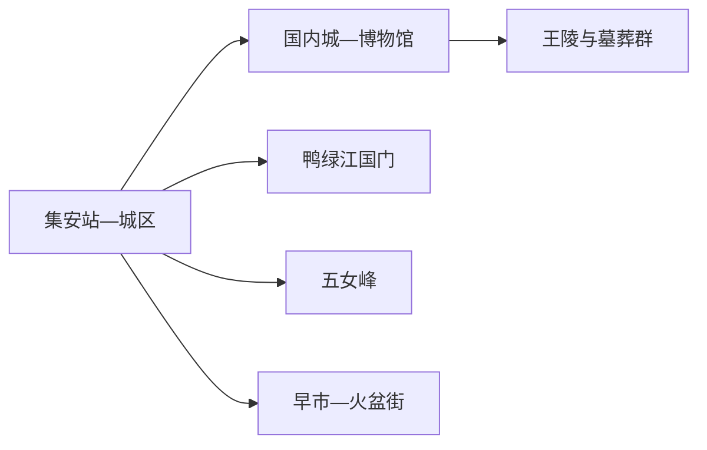
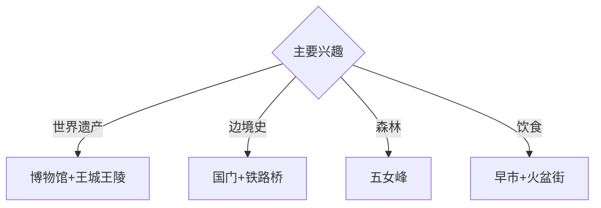

# 集安旅行指南

集安位于鸭绿江畔，世界文化遗产、边境江景、五女峰森林和高丽火盆构成清晰的多日结构。固定快照中的 **Ji’an / GeoNames 2036579** 对应吉林省集安市，与江西吉安和重庆同名点分开管理。

## 城市速览

| 项目 | 信息 |
|---|---|
| 主线 | 高句丽文物—鸭绿江国门—五女峰 |
| 停留 | 城区与遗产2天；五女峰另加1天 |
| 住宿 | 集安城区便于遗产点、早市和多方向接驳 |
| 交通 | 铁路、公路抵达；遗产组团和山地宜用景区车或约车 |
| 风险 | 边境管理、世界遗产保护、山洪林火、冬季冰雪 | 

## 城市格局与游览区域

国内城、博物馆和早市在城区，王陵与墓葬群分布于城郊多个管理点；国门景区沿鸭绿江向东，五女峰位于北部山地。遗产门票、讲解和景区交通按官方组合选择，避免把不同遗址误作一个连续步行区。

## 主要景点

| 景点 | 区域 | 类型 | 核心体验 | 用时 | 环境 | 体力 | 研究价值 | 拥挤 | 优先级 |
|---|---|---|---|---:|---|---|---|---|---|
| 集安博物馆 | 城区 | 博物馆 | 高句丽考古、地方史与遗产导读 | 2–3小时 | 室内 | 低 | 很高 | 团体时中 | A |
| 国内城城址公开区 | 城区 | 世界遗产 | 王都格局、城垣与现代城市叠合 | 2小时 | 室外 | 低中 | 很高 | 旺季中 | A |
| 好太王碑与太王陵 | 城郊 | 世界遗产 | 碑刻、王陵与历史文献 | 半天 | 混合 | 中 | 很高 | 旺季中高 | A |
| 长寿王陵与墓葬群公开点 | 城郊 | 世界遗产 | 石构王陵、壁画墓保护与考古 | 半天 | 混合 | 中 | 很高 | 旺季中 | A |
| 鸭绿江国门景区 | 城东 | 边境与近现代史 | 国门、铁路桥与第一渡记忆 | 半天 | 混合 | 中 | 高 | 节假日高 | A |
| 五女峰国家森林公园 | 北部山地 | 森林公园 | 峡谷、森林、秋色与抗联遗址 | 1天 | 室外 | 高 | 很高 | 秋季高 | A |
| 集安早市与火盆街 | 城区 | 市场与饮食 | 本地早餐、山货与高丽火盆 | 2–3小时 | 混合 | 低 | 中 | 用餐时高 | B |

## 美食与餐饮

高丽火盆、明火烤肉、鸭绿江鱼、人参料理和山野菜最有辨识度。江鱼选择正规餐馆和合法来源；野生菌、山菜与人参制品按体质和正规经营渠道选择。早市适合观察日常生活，购买易腐食品时考虑后续冷藏条件。

## 经典行程

### 一日遗产基础线
**路线**：集安博物馆—国内城—午餐—好太王碑与太王陵。**逻辑**：先读展陈，再进入王都和王陵。**预约锚点**：遗产景区套票、讲解和开放。**休息**：城区。**删除条件**：时间不足时保留博物馆与一个王陵组团。

### 王陵深读线
**路线**：博物馆—好太王碑—太王陵—长寿王陵—开放墓葬点。**逻辑**：按考古证据串联王陵制度。**预约锚点**：各点开放和景区交通。**休息**：游客中心。**删除条件**：壁画墓轮休时按现场开放项调整。

### 鸭绿江国门线
**路线**：城区江畔—国门景区—铁路桥公开观察点—返城。**逻辑**：把边境地理与近现代史放在同一方向。**预约锚点**：证件、景区开放和接驳。**休息**：国门游客中心。**删除条件**：边境临时管控或恶劣天气时改博物馆。

### 五女峰森林线
**路线**：城区—五女峰入口—开放峡谷与观景线—返城。**逻辑**：完整一天体验长白山南麓森林。**预约锚点**：门票、接驳和末班。**休息**：景区服务区。**删除条件**：山洪、雷雨、冰雪或林火预警时取消。

### 城市生活线
**路线**：集安早市—国内城公开段—午休—鸭绿江城市滨水段—火盆街。**逻辑**：用日常市场和王城叠合观察城市。**预约锚点**：早市时段。**休息**：城区咖啡馆或酒店。**删除条件**：高温时缩短滨水段。

### 亲子研学线
**路线**：集安博物馆—午餐—一处王陵—国门景区。**逻辑**：文物、建筑与边境地理递进。**预约锚点**：讲解和亲子票务。**休息**：馆内与游客中心。**删除条件**：儿童体力不足时取消第二个室外点。

### 雨天线
**路线**：集安博物馆—遗产室内展陈—午餐—正规文创与饮食体验。**逻辑**：以室内证据保留历史主线。**预约锚点**：馆舍开放。**休息**：城区。**删除条件**：道路积水或强对流时提前返宿。

## 住宿区域

集安城区适合首次到访、早市、餐饮和遗产接驳；五女峰或沿江乡村住宿适合明确的山地、骑行或乡村主题。边境和山地住宿按合法经营、夜间交通、消防与天气响应能力筛选。

## 市内交通

集安站和公路客运承担抵离，城区可步行配合公交、出租车和网约车。王陵、国门和五女峰方向提前预约车辆或使用景区交通；G331 自驾按边境道路、临时检查和天气提示通行。

## 不同旅行者须知

历史兴趣者至少留两天给世界遗产；摄影者按遗产开放和边境拍摄规则取景；亲子家庭优先博物馆、王陵和国门；行动不便者逐站确认石阶、接驳、无障碍卫生间和观景距离。

## 行前核对

- 核对遗产景区套票、讲解、墓葬轮休与交通组合。
- 核对国门证件要求、边境拍摄提示、五女峰开放和天气。
- 国境线、铁路桥作业区、口岸、军警设施、遗产保护区和森林管护区沿正式游线进入。

## 来源与更新记录

| 来源 | 支持内容 | 核验日期 |
|---|---|---|
| [吉林省文旅厅：集安市旅游线路](https://whhlyt.jl.gov.cn/ztzl/jlslyxlhxj/gdxl/ths/jas/202507/t20250709_9276640.html) | 遗产、五女峰、国门、早市、美食与交通 | 2026-09-01 |
| [吉林省政府：集安冬季文旅](https://www.jl.gov.cn/yaowen/202412/t20241222_3347818.html) | 世界遗产、冬季产品与地方饮食 | 2026-09-01 |
| [GeoNames 2036579](https://www.geonames.org/2036579/) | Ji’an 固定人口点与位置 | 2026-09-01 |

| 日期 | 更新 |
|---|---|
| 2026-09-01 | 首次完成集安旅行研究；建立世界遗产、国门、森林与城市生活路线。 |
