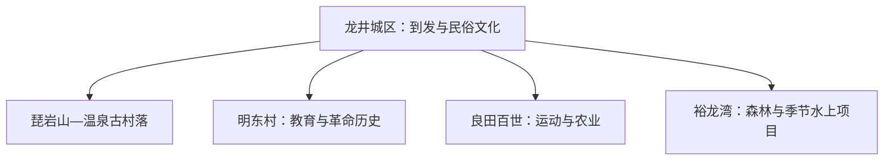
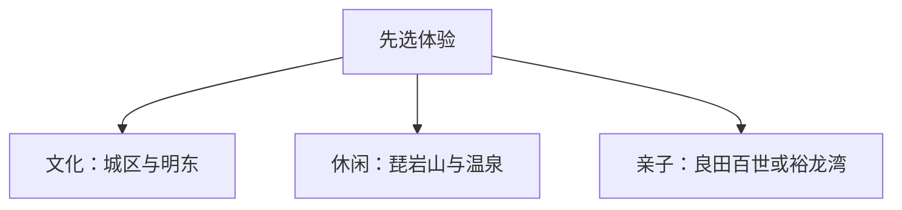

# 龙井旅行指南

龙井适合把朝鲜族文化、近郊休闲和乡村历史组合起来。琵岩山与温泉古村落可作为一个完整片区，明东村适合历史文化线，裕龙湾和良田百世则按季节与运营选择；以龙井城区为基地最省换宿成本。

> 建议停留：2–3 天 
> 旅行关键词：朝鲜族文化、琵岩山、明东村、海兰江、乡村休闲 
> 主要体力：城区低，山地与户外项目中等至较高 
> 无障碍提醒：设施连续性需向官方确认；温泉、吊桥、水上项目和乡村场馆分别核对

## 城市速览

| 项目 | 信息 |
|---|---|
| 主要旅行价值 | 朝鲜族教育与生活史、近郊山地、乡村休闲和海兰江景观 |
| 建议停留 | 2 天覆盖城区、琵岩山和明东；3 天增加户外或水上项目 |
| 较舒适季节 | 5–10 月适合户外，冬季按冰雪和温泉运营安排 |
| 预算特点 | 城区平稳，景区套票、温泉、车辆和体验项目增加支出 |
| 步行强度 | 城区低；琵岩山与户外项目中等至较高 |
| 独行旅行 | 城区与成熟景区便利，乡村远线先确认返程 |
| 亲子旅行 | 民俗博物馆、良田百世与季节户外项目选择较多 |
| 长者与低体力旅行 | 选择民俗场馆、温泉和车辆可近达乡村点 |
| 主要天气风险 | 低温、积雪、雷雨、山雾、河道水位与森林火险 |
| 行前关键动作 | 先查景区季节运营和返程，再组合文化与户外线 |

## 城市格局与游览区域

龙井是延边朝鲜族自治州辖县级市，法定代码 **222405**。城区承担铁路、住宿和朝鲜族公共文化；琵岩山紧邻城区，明东村、良田百世、裕龙湾分布在不同乡镇方向。

| 区域 | 主要内容 | 建议节奏 | 选择提示 |
|---|---|---|---|
| 龙井城区 | 到发、餐饮、民俗博物馆与海兰江 | 半日至 1 天 | 适合抵离日和雨天 |
| 琵岩山片区 | 山地游乐、森林与温泉古村落 | 半日至 1 天 | 两个项目适合同日组合 |
| 明东村方向 | 朝鲜族教育史、老宅与乡村 | 半天 | 先确认场馆开放与讲解 |
| 良田百世方向 | 农业、运动、露营与研学 | 半日至 1 天 | 项目按季节和活动核对 |
| 裕龙湾方向 | 森林、吊桥与季节水上项目 | 半日至 1 天 | 水上项目受气温和天气影响 |

## 主要景点

| 景点 | 区域 | 类型 | 主要看点 | 建议用时 | 室内外 | 体力 | 预约风险 | 天气影响 | 优先级 |
|---|---|---|---|---:|---|---|---|---|---|
| 琵岩山文化旅游风景区与温泉古村落 | 城区近郊 | 山地、温泉 | 森林花海、户外项目、温泉与民俗住宿 | 半日至 1 天 | 混合 | 中 | 高 | 高 | A |
| 龙井朝鲜族民俗博物馆及城区文化场馆 | 城区 | 民俗、博物馆 | 朝鲜族生活、地方历史与当期展览 | 2–3 小时 | 室内 | 低 | 中 | 低 | A |
| 明东民俗旅游区与宋梦奎老宅 | 智新镇 | 乡村、历史 | 朝鲜族教育史、革命记忆与传统建筑 | 半天 | 混合 | 低至中 | 中至高 | 中 | A |
| 良田百世运动假日景区 | 市域乡村 | 农业、运动 | 智慧农业、露营、运动与研学 | 半日至 1 天 | 室外为主 | 中 | 高 | 高 | B |
| 裕龙湾旅游风景区 | 老头沟镇 | 森林、亲子 | 森林景观、吊桥及季节游乐项目 | 半日至 1 天 | 室外 | 中 | 高 | 很高 | B |
| 海兰江城区公共岸线 | 城区 | 河流、城市休闲 | 河谷景观、城市散步与季节活动 | 1–2 小时 | 室外 | 低 | 低 | 高 | B |
| 日本侵略延边罪证馆等正式开放红色场馆 | 市域 | 历史、纪念馆 | 地方近现代史与爱国主义教育 | 1–2 小时 | 室内 | 低 | 中至高 | 低 | C |

琵岩山景区与山脚温泉古村落作为一个近郊片区安排；裕龙湾森林区和水上乐园按同一运营主体的季节项目选择。

## 美食与餐饮

城区可按冷面、石锅拌饭、米肠、打糕、酱汤、烤肉和泡菜选择。烤肉通常适合分享，一人可选冷面、饭类或汤饭。芝麻、大豆、花生、荞麦、小麦、海鲜和共用烤盘是常见过敏原线索。

## 经典行程

### 一日经典路线
**路线**：城区民俗博物馆 → 午餐 → 琵岩山与温泉古村落。
- **串联逻辑**：城区文化与近郊休闲距离较近，主题由认识地方转向体验。
- **预约锚点**：博物馆与温泉、景区项目。
- **休息安排**：城区午餐和温泉休息区。
- **时间不足时**：保留博物馆与琵岩山平缓区域。

### 两日城市路线
**第 1 天**：城区与琵岩山；**第 2 天**：明东村 → 海兰江城区岸线。
- **串联逻辑**：首日近郊，次日乡村历史后回城区收尾。
- **预约锚点**：明东场馆与讲解。
- **休息安排**：第二天午间在乡村正式接待点休息。
- **时间不足时**：第二天只留明东村。

### 三日深度路线
**第 1 天**：城区与琵岩山；**第 2 天**：明东村；**第 3 天**：良田百世或裕龙湾。
- **串联逻辑**：文化、乡村历史、户外亲子三类体验分日。
- **预约锚点**：第三天季节项目和车辆。
- **休息安排**：固定城区住宿。
- **时间不足时**：先删第三天。

### 雨雪天路线
**路线**：民俗博物馆 → 午餐 → 温泉古村落当期室内项目。
- **串联逻辑**：先在城区完成文博参观，再沿单一方向前往室内休闲项目，减少雨雪中的反复换乘。
- **适用条件**：道路正常；强降雪或预警天气减少跨乡镇移动。
- **预约锚点**：场馆、温泉和道路。
- **休息安排**：城区与温泉室内空间。
- **时间不足时**：只留博物馆。

### 亲子或低体力路线
**亲子路线**：民俗博物馆 → 良田百世；**低体力路线**：城区 → 温泉古村落。
- **串联逻辑**：亲子方案用科普接户外体验，低体力方案则把车辆可达的城区与温泉连成短线。
- **减负方式**：亲子按年龄选运动项目；低体力方案减少山路与高空设施。
- **预约锚点**：儿童规则、温泉和无障碍设施。
- **休息安排**：场馆、营地或温泉休息区。
- **时间不足时**：各保留一个主项目。

### 远郊一日路线
**路线**：龙井城区 → 裕龙湾森林景区或季节水上项目 → 返回。
- **串联逻辑**：远郊日只选一处正式运营项目，往返均以城区住宿为锚点。
- **适用条件**：气温、天气、项目开放和返程已确认。
- **预约锚点**：景区套票与车辆。
- **休息安排**：景区正式服务区。
- **时间不足时**：整段删除，改走琵岩山近郊线。

## 住宿区域

| 区域 | 优点 | 缺点 | 适合人群 | 交通特点 |
|---|---|---|---|---|
| 龙井城区 | 到发、餐饮和多方向交通方便 | 往返远线需要时间 | 首访、无车和多日旅行 | 适合固定基地 |
| 琵岩山近郊 | 靠近景区和温泉 | 与铁路到发点有距离 | 温泉与慢游 | 依赖车辆或接驳 |
| 乡村景区住宿 | 方便参加早晚活动 | 服务与交通季节性更强 | 自驾、亲子和露营主题 | 先确认返程与补给 |

## 市内交通

龙井站承担铁路到发，具体车次以12306为准；也可从延吉换乘公路交通。城区适合公交、出租车或网约车；明东、良田百世和裕龙湾方向优先使用官方直通车、自驾或合规包车。

## 不同旅行者须知

尊重朝鲜族社区生活与场馆拍摄规则。温泉和户外设施先核年龄、身高、健康与装备条件；河道、农田、边境管理空间和生产道路按管理边界活动。设施连续性需向官方确认。

## 行前核对

| 核对事项 | 为什么需要重查 | 建议时间 | 官方入口 |
|---|---|---|---|
| 景区、温泉与水上项目 | 季节、票制和设备维护会变化 | 订房前及前一日 | [吉林省文旅厅龙井线路](https://whhlyt.jl.gov.cn/ztzl/jlslyxlhxj/gdxl/ybz/ljs/202506/t20250625_9264390.html) |
| 乡村场馆与活动 | 开放、讲解和活动日期会变化 | 排入路线前 | [吉林省文化和旅游厅](https://whhlyt.jl.gov.cn/) |
| 铁路与直通车 | 班次和售票会调整 | 订票时及当天 | [中国铁路12306](https://www.12306.cn/) |
| 天气、火险与道路 | 山区天气和冬季道路具有时效性 | 出发前三日及当天 | [中国气象局](https://www.cma.gov.cn/) |

## 来源与更新记录

### 主要来源

| 来源 | 类型 | 支持内容 | 核验日期 |
|---|---|---|---|
| [吉林省文旅厅龙井市旅游线路](https://whhlyt.jl.gov.cn/ztzl/jlslyxlhxj/gdxl/ybz/ljs/202506/t20250625_9264390.html) | 省文旅厅 | 琵岩山、温泉、良田百世、裕龙湾、明东与交通线索 | 2026-08-13 |
| [龙井智新镇国土空间规划](https://www.longjing.gov.cn/hd/yjzj/202311/P020231122340228075102.pdf) | 市政府规划 | 琵岩山、明东及乡村文化空间 | 2026-08-13 |
| [GeoNames 2035966](https://www.geonames.org/2035966/longjing.html) | 开放地名数据 | 固定城市点 | 2026-08-13 |
| [Wikidata Q713327](https://www.wikidata.org/wiki/Q713327) | 开放知识库 | 法定龙井市实体与P1566交叉核对 | 2026-08-13 |

### 更新记录

| 日期 | 更新内容 |
|---|---|
| 2026-08-13 | 首次完成城市格局、景点选择、路线与动态核对 |
