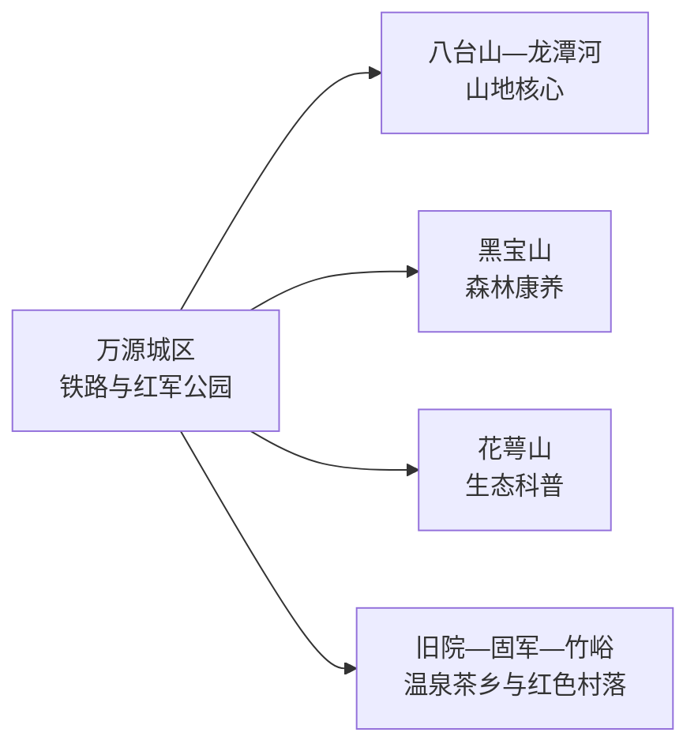
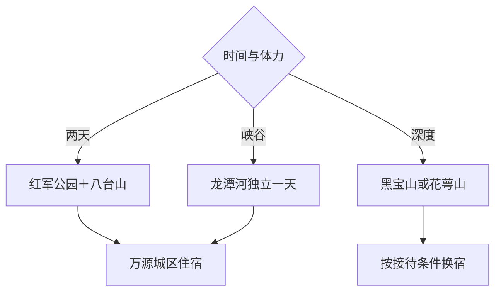

# 万源旅行指南

万源位于大巴山腹地，八台山—龙潭河、红军公园、黑宝山、花萼山和富硒茶乡形成多条彼此分散的山地线路。城区是铁路与住宿基点，每个核心山地方向通常占用完整一天；2 天适合“红城万源＋八台山”，深度旅行需要 3–5 天。

本页绑定法定万源市的 GeoNames 行政记录 **1791738**。该记录位于固定 `cities500` 快照外，只计入法定县级市覆盖。

## 城市速览

| 项目 | 信息 |
|---|---|
| 主线 | 红军文化—八台山—龙潭河—大巴山森林—富硒茶乡 |
| 停留 | 2 天看城区与八台山；3–5 天加入黑宝山、花萼山或乡村 |
| 住宿 | 万源城区方便铁路和换线；山地住宿以正式接待和季节运营为准 |
| 交通 | 铁路抵达后，各景区依赖公路、景交或预约车辆 |
| 季节 | 春秋适合山地；夏季避暑但汛期风险高；冬季留意冰雪和封路 |
| 预算 | 山地车辆、景区交通、换宿和向导是主要增量 |

## 城市格局与游览区域

八台山和龙潭河可按景区运营组合，但步道、入口和景交仍需核对；黑宝山、花萼山及各乡镇不适合当天横跨。重庆城口、陕西镇巴与达州主城均属于跨市或跨省联程。

## 主要景点

| 景点 | 区域 | 类型 | 核心体验 | 用时 | 环境 | 体力 | 预约风险 | 天气影响 | 优先级 |
|---|---|---|---|---:|---|---|---|---|---|
| 八台山景区 | 八台镇方向 | 山岳与地貌 | 大巴山峰岭、云海、步道与地质景观 | 1天 | 室外 | 高 | 很高 | 很高 | A |
| 龙潭河景区 | 旧院镇方向 | 峡谷与水景 | 峡谷、溪流、瀑布和山地步道 | 1天 | 室外 | 中高 | 很高 | 很高 | A |
| 红军公园 | 万源城区 | 红色纪念地 | 万源保卫战与川陕苏区历史 | 2–3小时 | 混合 | 低中 | 中 | 中 | A |
| 万源保卫战战史陈列馆 | 城区 | 纪念馆 | 红四方面军、战役史和地方革命记忆 | 1.5–2小时 | 室内 | 低 | 高 | 低 | A |
| 黑宝山旅游区 | 黑宝山方向 | 森林与康养 | 大巴山森林、避暑和生态体验 | 1天 | 室外 | 中 | 高 | 很高 | B |
| 花萼山自然保护地公开区 | 花萼山方向 | 自然保护与科普 | 生物多样性、山地植被和科普 | 1天 | 室外 | 高 | 很高 | 很高 | B |
| 万溪湖公开游览区 | 市域湖区 | 湖泊与康体 | 环湖景观和当期赛事休闲 | 半天 | 室外 | 低中 | 高 | 高 | C |
| 茶文化公园或正式茶园 | 城区及茶乡 | 茶文化 | 富硒茶、制茶知识和山地农业 | 2–3小时 | 混合 | 低 | 很高 | 中 | B |
| 旧院温泉正式运营区 | 旧院镇方向 | 温泉与康养 | 山地温泉和休息 | 半天 | 室内外 | 低 | 很高 | 中 | C |
| 竹峪东梨村 | 竹峪镇方向 | 传统村落与花季 | 古梨树、木屋、红色人物和乡村生活 | 半天 | 室外为主 | 中 | 花期高 | 高 | C |

## 美食与餐饮

万源适合品尝旧院黑鸡、富硒茶、腊肉、洋芋和川东北面食。黑鸡和腊肉适合共享，一人可选面食或小份家常菜；辣度、花椒、腌制盐分、坚果和麸质需求在点餐时说明。

## 经典行程

### 城区红色一日线
**路线**：红军公园—战史陈列馆—茶文化公园。**逻辑**：低交通成本建立城市历史。**预约锚点**：陈列馆开放。**休息**：城区。**删除条件**：到达较晚时保留公园和陈列馆。

### 八台山一日线
**路线**：城区—八台山—景区游线—返城或山脚住宿。**逻辑**：山地核心独立成日。**预约锚点**：门票、景交和车辆。**休息**：正式服务点。**删除条件**：雷雨、冰雪或地灾预警时取消。

### 龙潭河一日线
**路线**：城区或旧院—龙潭河—温泉可选—住宿。**逻辑**：峡谷与休息同向。**预约锚点**：景区和温泉运营。**休息**：旧院镇。**删除条件**：水位或步道关闭时只保留镇区休息。

### 黑宝山森林线
**路线**：城区—黑宝山正式开放游线—返程。**逻辑**：完整一天体验森林康养。**预约锚点**：道路、接待和车辆。**休息**：运营区。**删除条件**：火险或道路管制时改城区线。

### 雨天文化线
**路线**：战史陈列馆—城区公共文化—地方餐饮。**逻辑**：减少山地暴露。**预约锚点**：场馆开放。**休息**：城区。**删除条件**：暴雨地灾预警时按属地安排暂停出行。

### 亲子低体力线
**路线**：红军公园短线—陈列馆—茶文化体验。**逻辑**：核心内容集中且步行可调。**预约锚点**：茶园接待。**休息**：城区。**删除条件**：疲劳时保留陈列馆。

### 四日深度线
**路线**：城区红色、八台山、龙潭河、黑宝山或花萼山各一天。**逻辑**：每个山地方向独立。**预约锚点**：逐日道路和住宿。**休息**：城区与一处山地换宿。**删除条件**：按天气逐个删除外围日。

## 住宿区域

万源城区适合铁路抵离和多方向发车。八台山、旧院或黑宝山周边住宿可减少往返，选择时核对淡旺季营业、供暖、餐饮和退改；汛期优先保留灵活调整空间。

## 市内交通

通过 12306 核对万源站车次。景区之间公路距离长，按方向包车或自驾，并预留山区道路余量。自然保护地核心区、森林防火封控区、山洪沟谷、地灾点和矿业生产区执行明确限制。

## 不同旅行者须知

登山者优先八台山，峡谷爱好者选龙潭河；红色文化旅行者留一天给城区；亲子和低体力旅行者采用公园、陈列馆和茶文化。山地天气变化快，正式步道、景交和属地预警决定当日路线。

## 行前核对

- 通过万源市政府核对八台山、龙潭河、黑宝山、花萼山和场馆开放。
- 通过 12306 核对万源站，并落实山地车辆、末班返程和住宿。
- 每个山地日核对暴雨、地灾、雷电、冰雪、森林火险和步道状态。
- 温泉、茶园与乡村体验按正式接待、产季和价格预约。

## 来源与更新记录

| 来源 | 支持内容 | 核验日期 |
|---|---|---|
| [万源市国土空间总体规划](https://www.wanyuan.gov.cn/uploadfile/1/Attachment/a4d06c2074.pdf) | 八台山—龙潭河、黑宝山、红军公园、花萼山与旅游空间 | 2026-09-04 |
| [万源市政府工作报告](https://www.wanyuan.gov.cn/xxgk-show-108918.html) | 城区公园、文旅发展和道路背景 | 2026-09-04 |
| [万源市政府：东梨村](https://www.wanyuan.gov.cn/news-show-24153.html) | 古梨树、传统村落与红色文化 | 2026-09-04 |
| [GeoNames 1791738](https://www.geonames.org/1791738/) | 万源市行政记录与范围 | 2026-09-04 |

