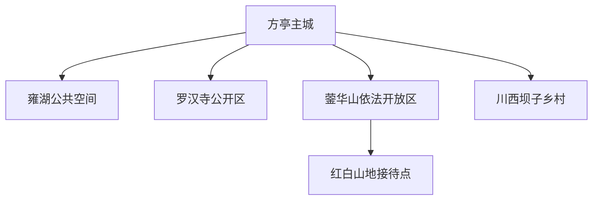
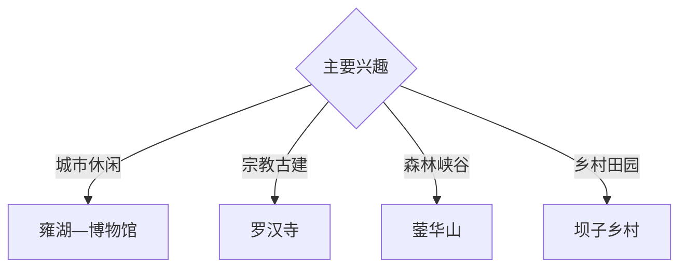

# 什邡旅行指南

什邡位于成都平原北缘、龙门山南段，以方亭主城、雍湖、罗汉寺、蓥华山风景名胜区和川西坝子乡村形成城市休闲与山地旅行组合。固定快照中的 **Fangting / GeoNames 1811533** 锚定方亭主城；蓥华山、红白和冰川方向适合单列全天山地行程。

## 城市速览

| 项目 | 信息 |
|---|---|
| 主线 | 方亭主城—雍湖—罗汉寺—蓥华山—川西坝子乡村 |
| 停留 | 主城1天；蓥华山方向另留1天 |
| 住宿 | 方亭适合综合接驳；山地选择正规接待点 |
| 交通 | 公路抵达，山区宜正规包车或自驾 |
| 季节 | 春秋舒适；雨季关注山洪，冬季关注结冰 |
| 预算 | 主城灵活，山地车辆、住宿和户外装备增加预算 |

## 城市格局与游览区域

方亭承担住宿、餐饮和城市服务；雍湖适合低体力休闲，蓥华山与红白方向进入龙门山地。宗教空间、地震遗址、未开放沟谷、森林保护范围、矿区和化工生产区按正式开放及管理边界进入。

## 主要景点

| 景点 | 区域 | 类型 | 核心体验 | 用时 | 环境 | 体力 | 研究价值 | 拥挤 | 优先级 |
|---|---|---|---|---:|---|---|---|---|---|
| 雍湖公园公开区 | 方亭 | 湖园与城市 | 湖岸慢行、城市休闲与公共艺术 | 2–3小时 | 室外 | 低 | 中高 | 晚间中 | A |
| 罗汉寺公开区 | 方亭 | 宗教与古建 | 寺院格局、地方历史与礼仪空间 | 1–2小时 | 混合 | 低 | 高 | 节庆中 | B |
| 什邡博物馆等公共文化空间 | 主城 | 文博 | 地方史、考古与灾后重建记忆 | 2小时 | 室内 | 低 | 高 | 中 | A |
| 蓥华山风景名胜区开放段 | 蓥华方向 | 山岳与森林 | 龙门山地、森林、峡谷与云景 | 1天 | 室外 | 高 | 很高 | 季节性 | A |
| 神瀑沟等正规山地游线 | 山区 | 峡谷与瀑布 | 溪谷、瀑布和森林步道 | 半天至1天 | 室外 | 中高 | 高 | 旺季中 | B |
| 红白镇正规接待区 | 红白 | 山乡与恢复 | 山地聚落、灾后恢复与乡村休闲 | 半天 | 混合 | 低中 | 高 | 周末中 | B |
| 川西坝子正规乡村点 | 平坝乡镇 | 农业与乡村 | 灌渠、田园和季节花木 | 半天 | 室外 | 低 | 中 | 花期中 | B |

## 美食与餐饮

什邡板鸭、红白豆腐、川西家常菜和山区腊味适合按主城与山地线路体验。山地日携带饮水与简餐；农产品体验按正规门店和接待点选择。

## 经典行程

### 方亭城市线
**路线**：博物馆—主城餐饮—雍湖—夜间公共空间。**逻辑**：用半天至一天理解城市基础。**预约锚点**：场馆开放。**休息**：雍湖服务点。**删除条件**：高温时把湖岸移至傍晚。

### 罗汉寺人文线
**路线**：方亭—罗汉寺公开区—周边城市街巷—返程。**逻辑**：以礼仪和古建理解地方人文。**预约锚点**：寺院开放。**休息**：主城。**删除条件**：法会限流时服从现场安排。

### 蓥华山一日线
**路线**：主城—正式入口—依法开放山径—返程。**逻辑**：独立一天承接龙门山尺度。**预约锚点**：道路、天气和防火。**休息**：游客服务点。**删除条件**：暴雨、山洪、落石、结冰或封控时取消。

### 神瀑沟峡谷线
**路线**：正规入口—峡谷步道—瀑布公开段—返程。**逻辑**：集中体验溪谷地貌。**预约锚点**：水文和步道公告。**休息**：景区服务区。**删除条件**：强降雨时改主城。

### 红白山乡线
**路线**：主城—红白镇公共区域—正规乡村接待点。**逻辑**：理解山乡恢复与日常生活。**预约锚点**：接待和车辆。**休息**：正规餐饮点。**删除条件**：道路管制时顺延。

### 亲子低体力线
**路线**：博物馆—午餐—雍湖平缓步道。**逻辑**：室内学习与轻量户外结合。**预约锚点**：亲子活动。**休息**：雍湖。**删除条件**：雨天保留室内部分。

### 两日组合线
**路线**：首日方亭、罗汉寺与雍湖；次日蓥华山或乡村。**逻辑**：城市与山地分日。**预约锚点**：次日天气。**休息**：方亭连续住宿。**删除条件**：一天时保留主城。

## 住宿区域

方亭主城适合公路接驳、餐饮和计划调整；红白及山地正规住宿适合慢游。订房核对消防、供暖、停车、夜间交通与极端天气退改。

## 市内交通

什邡主要通过公路连接成都、德阳等交通节点，实时班次出发前核对。蓥华山与红白方向使用正规车辆，山区按临时管制、落石和结冰提示通行。

## 不同旅行者须知

徒步者根据天气选择蓥华山开放段；亲子和长者优先博物馆与雍湖；宗教文化旅行者尊重寺院礼仪；地质观察者使用正规步道。森林保护区、未开放沟谷、地震危险建筑、矿区、化工生产区和应急通道保留明确限制。

## 行前核对

- 核对博物馆、罗汉寺、雍湖和山地景区开放。
- 核对蓥华山、神瀑沟、红白道路与森林防火。
- 核对公路班次、返程车辆和山地住宿。
- 核对暴雨、山洪、地质灾害、冬季结冰与高温预警。

## 来源与更新记录

| 来源 | 支持内容 | 核验日期 |
|---|---|---|
| [什邡市政府：什邡旅游](https://www.shifang.gov.cn/scenery.htm) | 蓥华山、雍湖、神瀑沟与城市旅游资源 | 2026-09-03 |
| [什邡市人民政府](https://www.shifang.gov.cn/) | 属地开放、交通和公共服务动态入口 | 2026-09-03 |
| [GeoNames 1811533](https://www.geonames.org/1811533/) | Fangting 固定人口点与什邡主城位置 | 2026-09-03 |

