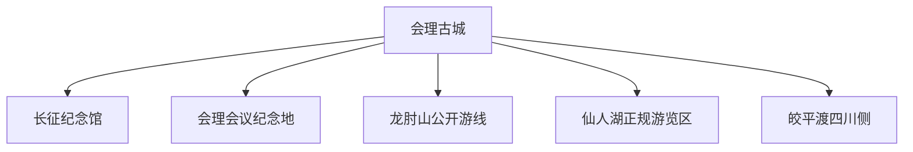
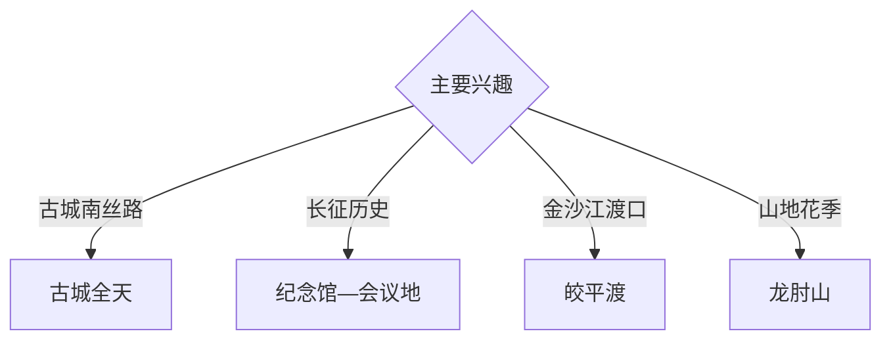

# 会理旅行指南

会理位于攀西安宁河谷南段，以会理古城、红军长征过会理纪念体系、皎平渡、龙肘山杜鹃、仙人湖和石榴农业形成南丝路、红色历史与山地民俗组合。固定快照中的 **Huili Chengguanzhen / GeoNames 1806854** 锚定古城主城；皎平渡位于金沙江川滇边界，需单列远程行程。

## 城市速览

| 项目 | 信息 |
|---|---|
| 主线 | 会理古城—长征纪念—会理会议—龙肘山—皎平渡 |
| 停留 | 古城2天；龙肘山或皎平渡各另留1天 |
| 住宿 | 古城周边适合步行；山地与渡口选择正规住宿 |
| 交通 | 西昌等门户转公路，远线山路需充足冗余 |
| 季节 | 春季杜鹃、夏秋石榴；雨季关注山洪和落石 |
| 预算 | 长途车辆、讲解、山地住宿与跨区域接驳增加预算 |

## 城市格局与游览区域

古城承担住宿、历史街巷和公共文化；会理会议纪念地位于城郊，龙肘山与仙人湖分属山地和度假方向；皎平渡跨金沙江连接四川会理与云南禄劝，导航和讲解均核对省界两侧属地。古建民居、金沙江航道、矿区、自然保护范围和农业生产区按正式开放边界进入。

## 主要景点

| 景点 | 区域 | 类型 | 核心体验 | 用时 | 环境 | 体力 | 研究价值 | 拥挤 | 优先级 |
|---|---|---|---|---:|---|---|---|---|---|
| 会理古城公开区 | 古城街道 | 古城与南丝路 | 钟鼓楼、街巷、院落和马帮文化 | 1天 | 混合 | 中 | 很高 | 节假日高 | A |
| 红军长征过会理纪念馆 | 古城 | 红色与文博 | 长征史料、会理地方历史与纪念展陈 | 2–3小时 | 室内 | 低 | 很高 | 节假日中 | A |
| 会理会议纪念地公开区 | 城郊 | 红色与原址 | 会议历史、长征路线与地形关系 | 半天 | 混合 | 低中 | 很高 | 中 | A |
| 皎平渡四川侧公开区 | 通安方向 | 渡口与红色 | 金沙江峡谷、渡江历史与省界地理 | 1天 | 室外 | 中 | 很高 | 节假日中 | A |
| 龙肘山万亩杜鹃花海开放区 | 山区 | 山岳与花季 | 高山杜鹃、山地生态和观景 | 1天 | 室外 | 高 | 高 | 花期高 | B |
| 会理古城仙人湖旅游度假区 | 主城周边 | 湖泊与度假 | 湖城景观、休闲与低强度游览 | 半天 | 室外 | 低 | 中高 | 周末中 | B |
| 正规石榴农业体验点 | 河谷乡镇 | 农业与乡村 | 石榴种植、采收与攀西农业 | 半天 | 混合 | 低 | 高 | 果期中 | B |

## 美食与餐饮

会理铜火锅、抓酥包子、鸡火丝、羊肉和石榴适合在古城及正规乡村接待点体验。端午药根宴等民俗饮食按个人体质审慎选择；农产品采摘遵循园区安排。

## 经典行程

### 古城经典线
**路线**：钟鼓楼—古城街巷—书院与公开院落—夜间古城。**逻辑**：用一天理解卫城格局和南丝路文化。**预约锚点**：古建与展馆开放。**休息**：古城。**删除条件**：高温时增加室内休息。

### 长征历史线
**路线**：长征纪念馆—会理会议纪念地—城郊公开点—返城。**逻辑**：以史料和原址理解事件。**预约锚点**：场馆开放与讲解。**休息**：古城。**删除条件**：纪念地维护时保留纪念馆。

### 皎平渡一日线
**路线**：古城—通安方向—四川侧正规入口—渡口公开区—返程。**逻辑**：独立一天承接长距离山路与省界地理。**预约锚点**：道路、开放与车辆。**休息**：正规服务点。**删除条件**：暴雨、落石、金沙江高水位或道路管制时取消。

### 龙肘山花季线
**路线**：主城—山地正式入口—杜鹃花海开放段—返程。**逻辑**：围绕花期组织高海拔徒步。**预约锚点**：花情、天气和防火。**休息**：游客服务点。**删除条件**：雷雨、大风或封控时顺延。

### 仙人湖轻松线
**路线**：古城—仙人湖正规游览区—湖岸休闲—返城。**逻辑**：以低体力补充湖城景观。**预约锚点**：度假区开放。**休息**：湖区服务点。**删除条件**：强对流或岸线维护时改古城。

### 石榴乡村线
**路线**：主城—正规石榴园—农业展示—乡村餐饮。**逻辑**：在果期理解攀西农业。**预约锚点**：采收季和接待。**休息**：正规农庄。**删除条件**：非果期改古城工艺与饮食。

### 三日组合线
**路线**：首日古城；次日长征历史；第三日皎平渡或龙肘山。**逻辑**：城市、历史和远线分日。**预约锚点**：第三日道路天气。**休息**：古城连续住宿。**删除条件**：两天时删第三日。

## 住宿区域

古城内外适合步行、餐饮和夜游，订房时核对车辆进入规则；城郊和山地选择有正式资质的住宿。确认消防、热水、停车、夜间交通和山路取消后的退改。

## 市内交通

会理常由西昌、攀枝花或周边公路节点转入，长途班次以出发日公告为准。皎平渡、龙肘山分属不同远线；山区按雨雾、落石、森林防火和临时交通管制行驶。

## 不同旅行者须知

古建旅行者给古城完整一天；历史旅行者组合纪念馆、会议地和皎平渡；亲子与长者选择古城平缓段及仙人湖；徒步者按花情天气选择龙肘山。古建私宅、金沙江航道、川滇省界管理区、矿山生产区、自然保护范围和非接待农田保留明确限制。

## 行前核对

- 核对古城、纪念馆、会议地和皎平渡开放。
- 核对皎平渡四川侧入口、省界交通与金沙江水位。
- 核对龙肘山花情、防火、山路和正规住宿。
- 核对长途班次、暴雨、山洪、落石与高温预警。

## 来源与更新记录

| 来源 | 支持内容 | 核验日期 |
|---|---|---|
| [会理市政务服务网：古城新市](https://lszhlx.sczwfw.gov.cn/art/2022/11/29/art_22560_199404.html) | 古城格局、长征遗址、石榴农业与城市发展 | 2026-09-03 |
| [凉山州政府：文旅资源名录](https://lsz.sczwfw.gov.cn/module/download/downfile.jsp?classid=0&filename=d1a9633308514f4ea3625e82537ce7bf.pdf) | 龙肘山、仙人湖与凉山文旅体系 | 2026-09-03 |
| [GeoNames 1806854](https://www.geonames.org/1806854/) | Huili Chengguanzhen 固定人口点与会理主城位置 | 2026-09-03 |

