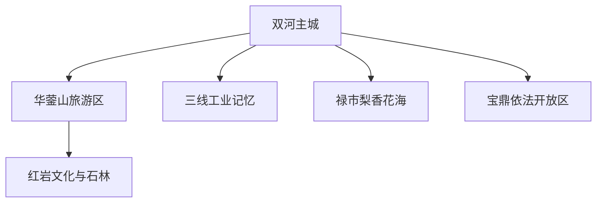
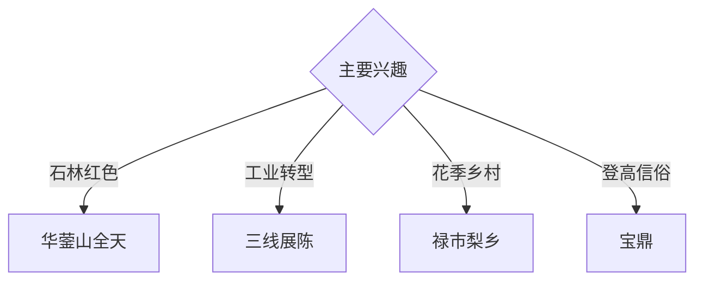

# 华蓥旅行指南

华蓥位于川东华蓥山中段西麓，以双河主城、华蓥山石林与红岩文化、三线工业记忆、宝鼎和禄市梨乡形成山岳、红色与资源型城市转型旅行体系。固定快照中的 **Shuanghejiedao / GeoNames 1806986** 锚定双河主城；山地景区、宝鼎和天池方向需分日安排。

## 城市速览

| 项目 | 信息 |
|---|---|
| 主线 | 双河主城—华蓥山旅游区—红岩文化—三线记忆—禄市梨乡 |
| 停留 | 主城与华蓥山2天；宝鼎或梨乡另留1天 |
| 住宿 | 双河适合铁路接驳；山地正规民宿适合避暑慢游 |
| 交通 | 铁路、公路抵达，山区使用景区交通或正规车辆 |
| 季节 | 春秋适合登山；夏季避暑，雨季关注山洪和落石 |
| 预算 | 景区票、山地车辆、讲解和民宿构成主要增量 |

## 城市格局与游览区域

双河承担铁路、住宿和城市服务；华蓥山旅游区是主要山地入口，禄市适合花季乡村，宝鼎另需山路时间。官方2026年名录标注黑龙峡暂未开放，可执行行程优先选择华蓥山旅游区、梨香花海、峨凤岭等开放点。森林保护范围、废弃矿井、在产矿区和工业生产线按正式边界进入。

## 主要景点

| 景点 | 区域 | 类型 | 核心体验 | 用时 | 环境 | 体力 | 研究价值 | 拥挤 | 优先级 |
|---|---|---|---|---:|---|---|---|---|---|
| 华蓥山旅游区 | 红岩乡 | 山岳与地貌 | 石林、森林、红岩文化与山地视野 | 1天 | 室外 | 高 | 很高 | 节假日高 | A |
| 华蓥山红色文化公开展陈 | 山区 | 红色与历史 | 游击历史、文学记忆与地方叙事 | 2–3小时 | 混合 | 中 | 很高 | 中 | A |
| 三线建设公开展陈 | 主城及正规场馆 | 工业史 | 煤矿、军工、资源型城市转型 | 半天 | 室内 | 低 | 很高 | 中 | A |
| 中国梨香花海乡村田园度假区 | 禄市 | 花季与乡村 | 梨花、田园与乡村休闲 | 半天 | 室外 | 低 | 中高 | 花期高 | B |
| 峨凤岭森林农庄正规游线 | 天池 | 森林与乡村 | 林地、山居与轻徒步 | 半天 | 室外 | 中 | 中高 | 周末中 | B |
| 宝鼎依法开放游览区 | 溪口方向 | 山岳与宗教文化 | 登高、地方信俗与川东山景 | 1天 | 室外 | 高 | 高 | 节庆中高 | B |
| 君兰天下等正规生态园区 | 华龙方向 | 生态与亲子 | 花木、科普和低强度休闲 | 半天 | 混合 | 低 | 中 | 周末中 | B |

## 美食与餐饮

华蓥山珍、豆花、腊味、川东家常菜和禄市蜜梨适合按山地与乡村线路体验。山地日准备饮水与简餐；采摘活动按园区接待和成熟期选择。

## 经典行程

### 华蓥山经典线
**路线**：主城—景区正式入口—石林公开游线—红色展陈—返程。**逻辑**：用完整一天组合地貌和历史。**预约锚点**：景区票与交通。**休息**：游客中心。**删除条件**：雷雨、山洪、落石或封控时顺延。

### 红岩文化线
**路线**：主城公共展陈—华蓥山红色文化点—正规讲解。**逻辑**：把文献叙事与山地环境连接。**预约锚点**：场馆和讲解。**休息**：景区服务点。**删除条件**：山地关闭时保留主城展陈。

### 三线工业线
**路线**：主城—三线建设公开场馆—城市转型公共空间。**逻辑**：从工业史理解资源型城市。**预约锚点**：场馆开放。**休息**：双河主城。**删除条件**：闭馆时改城市公共文化空间。

### 禄市梨乡线
**路线**：主城—梨香花海—正规采摘园—返程。**逻辑**：围绕花期或果期安排低体力乡村游。**预约锚点**：花情果期和接待。**休息**：禄市正规农庄。**删除条件**：非花果期改峨凤岭。

### 宝鼎一日线
**路线**：主城—正规山地入口—依法开放步道—返程。**逻辑**：独立一天承接山路与登高。**预约锚点**：道路、天气和活动。**休息**：沿线服务点。**删除条件**：恶劣天气或活动管制时取消。

### 亲子低体力线
**路线**：三线展陈—午餐—生态园区。**逻辑**：室内历史与自然科普结合。**预约锚点**：亲子活动。**休息**：主城。**删除条件**：雨天保留室内部分。

### 三日组合线
**路线**：首日主城与三线历史；次日华蓥山；第三日禄市或宝鼎。**逻辑**：工业、山岳和乡村分日。**预约锚点**：山地天气。**休息**：双河与山地正规住宿灵活组合。**删除条件**：两天时删第三日。

## 住宿区域

双河主城适合铁路接驳、餐饮和计划调整；华蓥山正规民宿适合避暑及早间游览。订房核对景区距离、停车、消防、供暖和极端天气退改。

## 市内交通

华蓥站等铁路节点与主城、景区距离不同，购票后核对接驳。华蓥山、禄市、天池和宝鼎分方向安排；山路按景区换乘、雨雾和临时管制通行。

## 不同旅行者须知

地貌旅行者给华蓥山完整一天；工业史旅行者优先三线展陈；亲子和长者选择禄市与生态园；徒步者按天气选择开放步道。黑龙峡以官方恢复开放公告为准，森林核心保护范围、废弃矿井、在产矿区和工业生产区保留明确限制。

## 行前核对

- 核对华蓥山旅游区、宝鼎和各乡村景区开放。
- 核对官方A级景区名录中的临时停开信息。
- 核对铁路、景区交通、返程和山地住宿。
- 核对暴雨、山洪、落石、森林防火和高温预警。

## 来源与更新记录

| 来源 | 支持内容 | 核验日期 |
|---|---|---|
| [华蓥市政府：A级景区基本情况](https://www.hys.gov.cn/hysrmzfw/lyjqjbqk/pc/content/content_1717671083680673792.html) | 景区等级、位置、开放时段和黑龙峡停开状态 | 2026-09-03 |
| [华蓥市政府：华蓥概况](https://www.hys.gov.cn/hysrmzfw/hygk/zzzq/content/content_1717682849588391936.html) | 红岩、宝鼎、三线工业与资源型城市背景 | 2026-09-03 |
| [GeoNames 1806986](https://www.geonames.org/1806986/) | Shuanghejiedao 固定人口点与华蓥主城位置 | 2026-09-03 |

