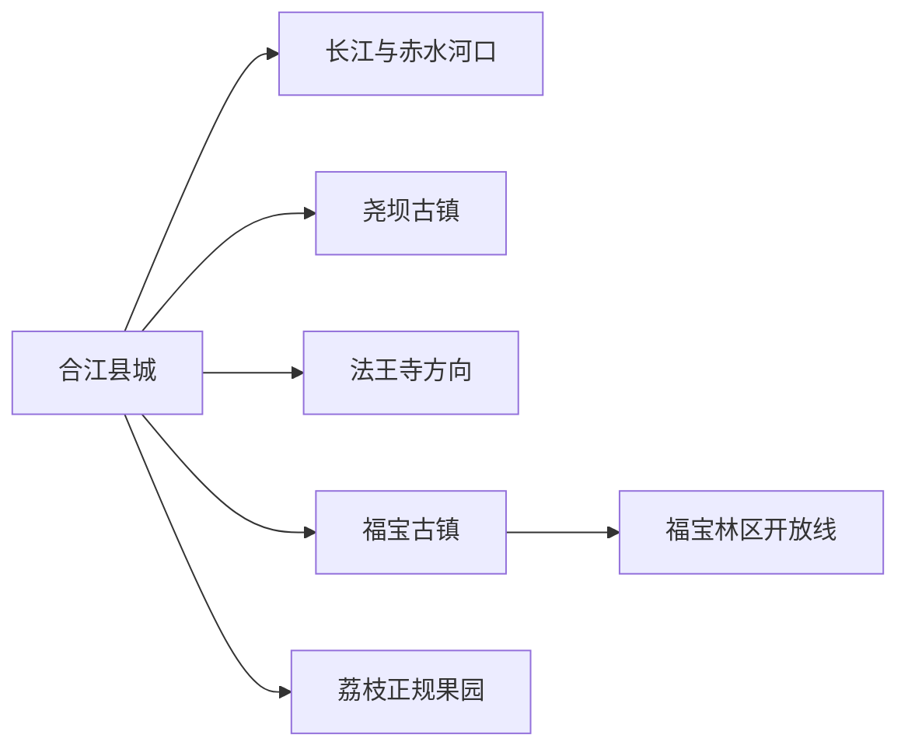
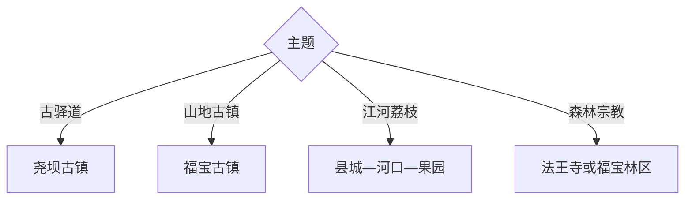

# 合江旅行指南

合江位于长江与赤水河交汇区域，县城荔枝文化、尧坝古镇、福宝古镇和法王寺山林分成四条方向。首访可用两天走县城—尧坝与福宝古镇，法王寺或林区方向在道路和开放确认后另加一天。

## 城市速览

| 项目 | 信息 |
|---|---|
| 主线 | 合江县城—尧坝古镇—福宝古镇—法王寺 |
| 停留 | 县城与尧坝1天；福宝或山地再加1–2天 |
| 住宿 | 县城适合交通餐饮，尧坝与福宝适合古镇慢游 |
| 交通 | 从泸州经公路进入，县内古镇与山地用客运、预约车或自驾 |
| 风险 | 长江赤水河水情、暴雨地灾、山路雾、古镇消防与荔枝季客流 |
| 边界 | 林区、河道、码头、古镇民宅、寺院仪式区和果园按开放范围进入 |

## 城市格局与游览区域

固定 `Hejiang / GeoNames 1808612` 对应合江县城，本页以法定合江县 `Q1199413` 组织。尧坝在西北公路方向，福宝和法王寺位于更远的山地，各自适合独立半日至一天。

## 主要景点

| 景点 | 区域 | 类型 | 核心体验 | 用时 | 环境 | 体力 | 预约风险 | 天气影响 | 优先级 |
|---|---|---|---|---:|---|---|---|---|---|
| 尧坝古镇 | 尧坝镇 | 历史古镇 | 川黔古驿道、会馆民居与影视文化 | 3–6小时 | 室内外 | 中 | 高 | 高 | A |
| 福宝古镇 | 福宝镇 | 山地古镇 | 依山街巷、吊脚建筑与盐茶商路 | 3–6小时 | 室内外 | 中高 | 很高 | 高 | A |
| 合江县博物馆或地方展陈 | 县城 | 地方文博 | 县史、长江交通与荔枝文化 | 1.5–3小时 | 室内 | 低 | 很高 | 低 | A |
| 长江—赤水河口公共岸线 | 县城 | 河流地理 | 两河交汇、港城空间与滨江生活 | 1–3小时 | 室外 | 低 | 中 | 极高 | B |
| 法王寺景区当期开放区 | 法王寺镇 | 山林与宗教 | 古寺、森林和川南山地 | 半日至1天 | 室内外 | 中高 | 极高 | 极高 | B |
| 福宝森林公开游线 | 福宝方向 | 山地生态 | 丹霞山地、常绿林和峡谷环境 | 1天 | 室外 | 高 | 极高 | 极高 | B |
| 笔架山公开游线 | 县城近郊 | 山地人文 | 近郊登高、城市与江河视野 | 2–4小时 | 室外 | 中高 | 很高 | 极高 | C |
| 合江荔枝正规果园或展销点 | 县城周边 | 农业文化 | 古荔枝品种、季节采摘与产地饮食 | 半日 | 室外 | 低中 | 极高 | 很高 | B |

## 美食与餐饮

合江可尝荔枝、豆花、烤鱼、豆腐鱼小吃、川南家常菜和赤水河流域风味。点鱼先确认品种、来源、重量和价格；荔枝按产季购买，正规采摘先问计价与可进入区域，山区日提前预约供餐。

## 经典行程

### 一日经典线
**路线**：县级展陈—长江赤水河口—尧坝古镇。**逻辑**：从县城地理进入古驿道历史。**预约锚点**：展馆与尧坝开放。**休息**：尧坝镇。**删除条件**：水情异常时删除滨江段。

### 两日双古镇线
**路线**：首日县城—尧坝；次日福宝古镇。**逻辑**：两个古镇分属不同方向，各自留足街巷时间。**预约锚点**：古镇场馆、车辆与住宿。**休息**：两镇游客服务区。**删除条件**：第二日时间不足时整段删除。

### 三日山林线
**路线**：前两日古镇；第三日法王寺或福宝森林公开线二选一。**逻辑**：高天气敏感山地单独成日。**预约锚点**：开放、天气、向导与返程。**休息**：正式服务点。**删除条件**：暴雨、山洪或地灾预警时取消。

### 雨天人文线
**路线**：县级展陈—尧坝可入内建筑—县城餐饮。**逻辑**：缩短河岸和山路。**预约锚点**：场馆与古建开放。**休息**：县城。**删除条件**：强降雨预警时留在城区。

### 亲子荔枝线
**路线**：地方展陈—正规荔枝果园或展销点—滨江公园短段。**逻辑**：用产地知识和季节体验降低山地强度。**预约锚点**：果期、儿童接待与计价。**休息**：县城。**删除条件**：非产季改尧坝短线。

### 福宝专题线
**路线**：福宝古镇—镇区午餐—林区公开短线。**逻辑**：古镇与山地门户在同一方向。**预约锚点**：林区开放、道路和车辆。**休息**：福宝镇。**删除条件**：林区条件不稳时只留古镇。

### 低体力线
**路线**：车辆到地方展陈—河口车辆观景—尧坝主街短段。**逻辑**：车辆连接三处并避开长爬坡。**预约锚点**：落客、座椅和无障碍。**休息**：尧坝。**删除条件**：古街湿滑时只留县城。

## 住宿区域

合江县城适合公路抵离、多方向换线和成熟餐饮；尧坝适合古镇夜色；福宝适合次日山地方向。乡镇住宿核对消防、停车、供暖制冷、早餐和恶劣天气退改。

## 市内交通

从泸州主城到合江需公路交通，尧坝、福宝和法王寺之间不宜一日折返。客运适合单点慢游，预约车或自驾更利于远线；雨季关注临江道路、山体落石和返程班次。

## 不同旅行者须知

古镇爱好者分日看尧坝和福宝；自然旅行者选择法王寺或林区一线；亲子家庭围绕县城和果园；低体力旅行者走河口与尧坝主街。林区、河道码头、古镇民宅、寺院仪式区和果园生产区保留明确限制。

## 行前核对

- 核对尧坝、福宝、县级展陈、法王寺、林区和荔枝接待开放。
- 核对水情、暴雨地灾、山路雾、客运班次和夜间返程。
- 林区沿正式步道进入，河岸按水务与码头管理范围活动。

## 来源与更新记录

| 来源 | 支持内容 | 核验日期 |
|---|---|---|
| [泸州城市指南中的合江边界与资源](./泸州市.md) | 合江、尧坝、福宝、河流与县域交通关系 | 2026-09-01 |
| [四川省文旅厅：A级景区名录入口](https://wlt.sc.gov.cn/scwlt/c100297/introduce.shtml) | 景区等级与主管部门核对入口 | 2026-09-01 |
| [GeoNames 1808612](https://www.geonames.org/1808612/) | Hejiang 固定城市点 | 2026-09-01 |
| [Wikidata Q1199413](https://www.wikidata.org/wiki/Q1199413) | 合江县实体与跨库标识 | 2026-09-01 |

| 日期 | 更新 |
|---|---|
| 2026-09-01 | 首次完成合江旅行研究，按县城河口、尧坝、福宝与山林组织。 |
