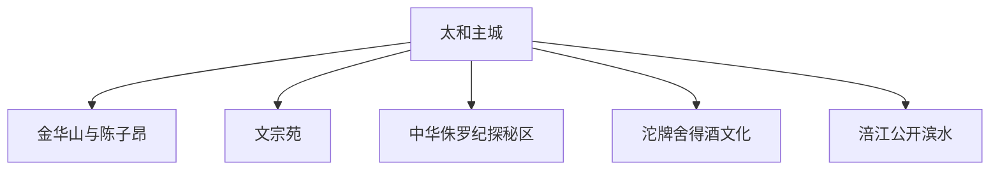
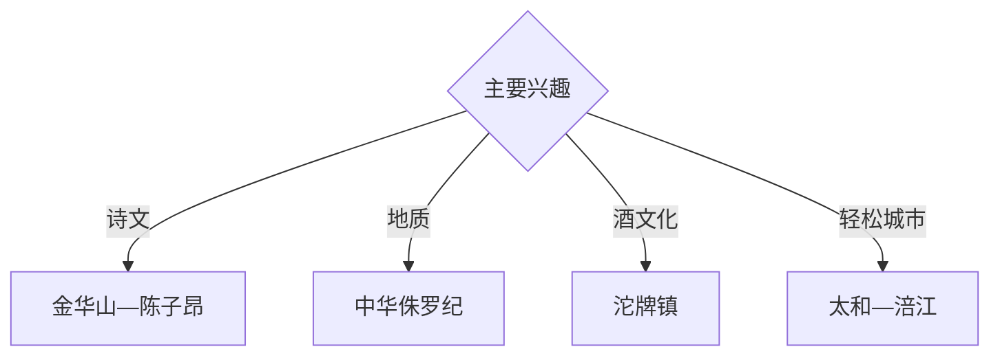

# 射洪旅行指南

射洪位于涪江中游，以太和主城、金华山陈子昂文化、文宗苑、中华侏罗纪探秘旅游区和沱牌舍得酒文化形成诗文、地质与工业旅游组合。固定快照中的 **Taihe / GeoNames 1793684** 锚定太和主城；金华、明星和沱牌分属不同方向。

## 城市速览

| 项目 | 信息 |
|---|---|
| 主线 | 太和主城—金华山—文宗苑—中华侏罗纪—沱牌酒文化 |
| 停留 | 主城与金华1天；地质或酒文化各另留1天 |
| 住宿 | 太和主城适合综合接驳；专题景区选择正规住宿 |
| 交通 | 铁路、公路抵达，远郊宜约车或自驾 |
| 季节 | 春秋舒适；夏季关注暴雨、涪江水位和高温 |
| 预算 | 主城灵活，远郊车辆、讲解和预约参访增加预算 |

## 城市格局与游览区域

主城承担住宿、铁路和城市服务；金华山承接陈子昂文化，明星镇方向侧重地质科普，沱牌镇侧重酒业与古镇。文物本体、化石保护点、酒厂生产线、涪江非开放岸段和矿山修复区按正式开放及接待范围进入。

## 主要景点

| 景点 | 区域 | 类型 | 核心体验 | 用时 | 环境 | 体力 | 研究价值 | 拥挤 | 优先级 |
|---|---|---|---|---:|---|---|---|---|---|
| 金华山公开游线 | 金华镇 | 山地与人文 | 陈子昂读书台、诗文传统与涪江视野 | 半天 | 混合 | 中 | 很高 | 节假日中 | A |
| 陈子昂相关展陈 | 金华方向 | 人物与文学 | 唐代诗人、生平史料与地方文脉 | 1–2小时 | 室内 | 低 | 很高 | 中 | A |
| 文宗苑旅游区 | 广兴方向 | 文化与乡村 | 诗文主题、乡村景观与休闲步道 | 半天 | 混合 | 低中 | 高 | 周末中 | B |
| 中华侏罗纪探秘旅游区 | 明星镇 | 地质与科普 | 硅化木、地质演化与研学展示 | 半天至1天 | 混合 | 中 | 很高 | 节假日中高 | A |
| 沱牌舍得文化旅游区公开区 | 沱牌镇 | 工业与酒文化 | 酿造历史、品牌展陈与古镇关系 | 半天 | 混合 | 低 | 高 | 预约制 | A |
| 太和主城公共文化空间 | 太和 | 城市与文博 | 地方史、城市生活与涪江文化 | 2–3小时 | 混合 | 低 | 中高 | 中 | B |
| 涪江公共滨水空间 | 主城 | 河流与休闲 | 江景、城市慢行与水文观察 | 1–2小时 | 室外 | 低 | 中 | 晚间中 | B |

## 美食与餐饮

射洪牛肉、米粉、豆豉、川中家常菜和正规酒类文化体验适合分区安排。品酒行程配合非酒精饮品与返程车辆；生产区参访遵循接待方的着装、拍摄和安全要求。

## 经典行程

### 金华诗文线
**路线**：主城—金华山—陈子昂公开展陈—返城。**逻辑**：以原址和史料理解诗文传统。**预约锚点**：景区与展陈开放。**休息**：金华镇。**删除条件**：雷雨时缩短山地段。

### 中华侏罗纪线
**路线**：主城—明星镇—地质科普游线—返程。**逻辑**：独立一天完成地质研学。**预约锚点**：景区和讲解。**休息**：游客中心。**删除条件**：地质点维护时改室内展陈。

### 沱牌酒文化线
**路线**：主城—沱牌镇—酒文化公开区—古镇公共空间。**逻辑**：从地方产业理解城市发展。**预约锚点**：企业接待。**休息**：游客区。**删除条件**：企业无接待时保留古镇公开区。

### 文宗苑乡村线
**路线**：主城—文宗苑—乡村公开步道—返城。**逻辑**：以低强度延伸诗文主题。**预约锚点**：景区开放。**休息**：正规接待点。**删除条件**：暴雨时改主城场馆。

### 主城滨江线
**路线**：公共文化空间—主城餐饮—涪江开放岸线。**逻辑**：用半天理解城市日常。**预约锚点**：场馆开放。**休息**：太和主城。**删除条件**：高水位时取消临江段。

### 亲子低体力线
**路线**：地质室内展陈—午餐—主城滨江短段。**逻辑**：科普与轻量户外结合。**预约锚点**：研学活动。**休息**：游客中心。**删除条件**：雨天保留室内项目。

### 三日组合线
**路线**：首日金华与主城；次日中华侏罗纪；第三日沱牌或文宗苑。**逻辑**：文学、地质和产业分日。**预约锚点**：第三日接待。**休息**：太和主城连续住宿。**删除条件**：两天时删第三日。

## 住宿区域

太和主城适合铁路、公路接驳和多方向出发；金华、明星、沱牌方向选择有正式资质的住宿。订房核对夜间交通、停车、消防、早餐与天气退改。

## 市内交通

铁路站点与主城住宿距离需在购票后核对。金华、明星、广兴和沱牌分方向安排车辆；沿江与乡村道路按汛期积水和临时管制通行。

## 不同旅行者须知

文学旅行者优先金华山；亲子家庭选择地质科普；产业研究者提前预约沱牌公开展陈；长者选择主城和文宗苑平缓段。化石保护点、酒厂生产线、矿山修复区、涪江行洪空间和非开放山径保留明确限制。

## 行前核对

- 核对金华山、文宗苑与中华侏罗纪开放。
- 核对沱牌酒文化接待、参访规则和返程车辆。
- 核对铁路、公路班次、住宿和远郊接驳。
- 核对暴雨、涪江水位、山洪、地质灾害与高温预警。

## 来源与更新记录

| 来源 | 支持内容 | 核验日期 |
|---|---|---|
| [射洪市政府：重点文旅项目](https://www.shehong.gov.cn/documents/15177/8648668/9364594754071962.pdf) | 中华侏罗纪、文宗苑与沱牌舍得文旅空间 | 2026-09-03 |
| [射洪市人民政府](https://www.shehong.gov.cn/) | 属地公共服务、开放和交通动态入口 | 2026-09-03 |
| [GeoNames 1793684](https://www.geonames.org/1793684/) | Taihe 固定人口点与射洪主城位置 | 2026-09-03 |

