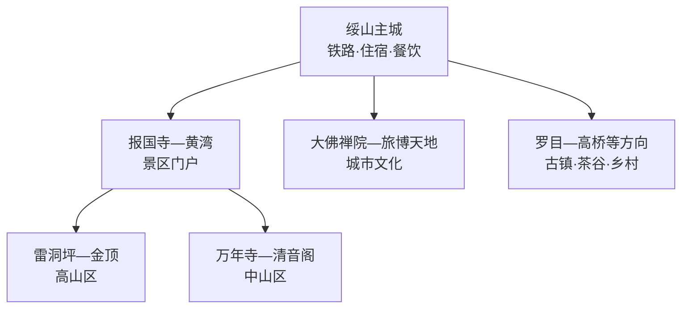
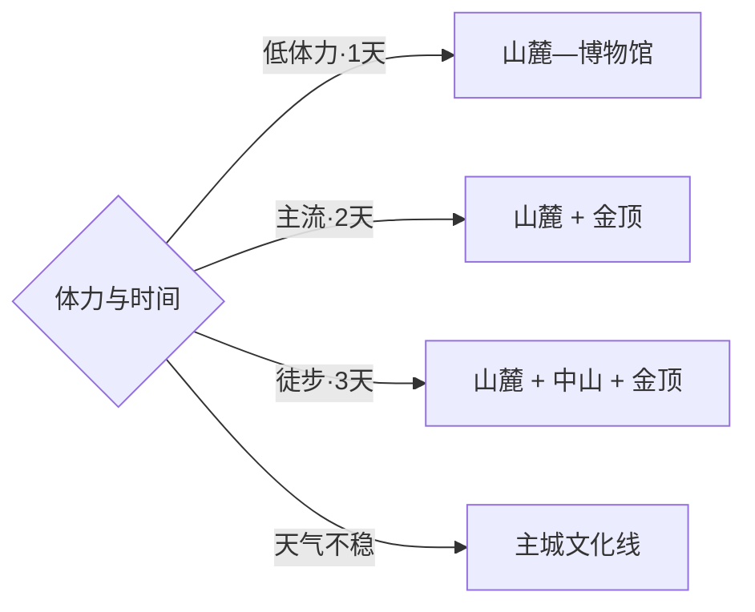

# 峨眉山旅行指南

峨眉山市的旅行尺度分为三层：绥山主城承担日常生活和住宿，报国寺—黄湾构成景区门户，雷洞坪—金顶及万年寺—清音阁等线路进入世界遗产核心山地。第一次来应先按体力、天气和想看的片区选一条登山方式，再决定是否加入主城、大佛禅院或罗目古镇。固定快照中的 **Suishan / GeoNames 1793892** 对应峨眉山市主城；乐山大佛位于乐山市中区，是另一座城市内的独立遗产组成部分。

> 建议停留：2–4 天\
> 旅行关键词：世界遗产、金顶、寺院、山城关系、峨眉武术与茶\
> 主要体力：中等至较高，可用观光车与索道降低负担\
> 最近研究：2026-09-03

## 城市速览

| 项目 | 旅行信息 |
|---|---|
| 主要旅行价值 | 在一座县级市内同时理解世界文化与自然遗产、佛教名山、山麓门户和城市生活 |
| 建议停留 | 2天完成山麓与金顶主线；3–4天加入中山徒步、主城或南部乡镇 |
| 较舒适季节 | 春秋适合多层次步行；夏季凉爽但多雨；冬季可见雪景并需应对结冰 |
| 预算特点 | 门票、观光车、索道和景区住宿是主要支出，纯徒步以时间和体力换取交通成本 |
| 步行强度 | 山麓低至中等；金顶线中等；中山长线较高且台阶连续 |
| 主要天气风险 | 大雾、暴雨、雷电、低温、积雪结冰、落石与森林火险 |
| 独行旅行 | 成熟景区内服务完善，早晚与长线徒步需落实补给、住宿和联络 |
| 亲子旅行 | 山麓、博物馆和短程观光车线较合适，索道与高海拔停留按年龄和体力调整 |
| 长者与低体力旅行 | 以观光车—索道—金顶短线或报国寺片区为主，给换乘排队留足时间 |
| 无障碍信息 | 山麓新建空间较好，高山台阶、索道换乘和寺院高差需逐点向景区确认 |

## 城市格局与游览区域

| 区域 | 主要内容 | 游览特点 | 与其他区域的关系 |
|---|---|---|---|
| 绥山主城 | 餐饮、生活街区、铁路枢纽 | 地势较缓，适合住宿补给 | 与景区门户之间需公交或车辆衔接 |
| 报国寺—黄湾 | 报国寺、伏虎寺、博物馆、游客中心 | 山麓人文集中，可安排半日至一日 | 是进山换乘与住宿的常用基地 |
| 雷洞坪—金顶 | 高山寺院、云海与地貌 | 气温低、天气快变，观光车和索道可减负 | 往返通常占据完整一天 |
| 万年寺—清音阁 | 寺院、溪谷、森林与步道 | 台阶与步行量可按入口组合 | 可与山麓相连，长线需要更多时间 |
| 大佛禅院—城市文化区 | 大佛禅院、旅博天地等 | 适合雨天或抵离日 | 与峨眉山景区属于不同运营和空间单元 |
| 南部与乡村方向 | 罗目、高桥、茶谷等公开点 | 公路接驳，业态和开放变化较多 | 适合第三天按兴趣择一 |

## 主要景点

| 景点 | 区域 | 类型 | 主要看点 | 建议用时 | 室内外 | 体力 | 预约风险 | 天气影响 | 优先级 |
|---|---|---|---|---:|---|---|---|---|---|
| 峨眉山风景名胜区金顶片区 | 高山区 | 世界遗产与山岳 | 金顶建筑群、高山地貌、云海与日出机会 | 1天 | 室外为主 | 中高 | 节假日高 | 很高 | A |
| 报国寺—伏虎寺公开游线 | 山麓 | 寺院与园林 | 朝山门户、寺院建筑与山麓环境 | 半天 | 混合 | 中 | 中 | 中 | A |
| 峨眉山博物馆 | 报国寺片区 | 博物馆 | 地质、生物、历史文化与世界遗产背景 | 1.5–2小时 | 室内 | 低 | 中 | 低 | A |
| 万年寺—清音阁公开游线 | 中山区 | 寺院与森林 | 古建筑、溪谷、森林和层次丰富的步道 | 半天–1天 | 混合 | 高 | 中 | 高 | A |
| 大佛禅院佛教文化旅游区 | 城区南部 | 宗教与园林 | 城市朝山文化、寺院空间与园林 | 2–3小时 | 混合 | 低中 | 活动期中 | 低中 | B |
| 大庙飞来殿公开区 | 城北方向 | 古建筑 | 元代建筑与地方宗教历史 | 1–2小时 | 混合 | 低 | 中 | 低 | B |
| 罗目古镇公开街区 | 罗目镇 | 古镇 | 山前聚落、街巷与传统生活 | 半天 | 混合 | 低中 | 低 | 中 | B |
| 嘉峨茶谷正规游览点 | 双福等方向 | 茶文化与乡村 | 茶园、制茶文化和山前农业 | 半天 | 混合 | 低中 | 季节中 | 中高 | C |

## 美食与餐饮

| 菜品或餐饮类型 | 常见区域 | 一个人用餐与常见份量 | 风味、过敏原与饮食限制 | 排队风险与替代方法 |
|---|---|---|---|---|
| 峨眉豆腐脑 | 主城、山麓 | 单碗适合独行，可配小吃 | 常见牛肉、酥肉、花生或辛香料，按需求问清配料 | 早餐和热门时段换同类本地店即可 |
| 跷脚牛肉及牛肉汤锅 | 主城、景区外围 | 适合分享，部分店可点小锅 | 牛肉、内脏、香菜与辛香料可分别选择 | 晚餐高峰提前到店，按锅型而非网红店选择 |
| 叶儿粑、凉糕与小吃 | 主城、古镇 | 单份友好，适合作为补给 | 糯米、糖、猪肉或豆沙按馅料确认 | 景区价格较高时回主城寻找替代 |
| 峨眉茶 | 山麓、正规茶馆与茶谷 | 一壶适合休息，可按克数购买 | 咖啡因敏感者控制饮用量 | 购买时关注产地、等级和明码标价 |
| 寺院素食与家常川菜 | 景区服务点、主城 | 素食是否含蛋奶需另问 | 川菜常含辣椒、花椒和复合调味 | 登山日按开放服务点补给，随身准备基础食品 |

## 经典行程

### 一日经典路线

**路线**：黄湾换乘 → 雷洞坪 → 索道或公开步道 → 金顶片区 → 原路返回

- **串联逻辑**：把有限时间集中给高山区，以观光交通降低连续爬升。
- **预约锚点**：景区门票、观光车、索道和最晚返程。
- **休息安排**：雷洞坪和金顶正式服务点，注意防风保暖。
- **时间不足时**：缩短金顶停留，按最晚观光车和索道倒推返程。

### 两日城市路线

**第 1 天**：报国寺—伏虎寺 → 峨眉山博物馆 → 山麓住宿。\
**第 2 天**：观光车 → 雷洞坪 → 金顶 → 返回。

- **串联逻辑**：先在山麓理解遗产背景，再用完整一天处理高山交通和天气。
- **预约锚点**：博物馆开放、景区票务、观光车与索道。
- **休息安排**：第一天下午留茶歇；第二天在正式服务点分段休息。
- **时间不足时**：第一天删伏虎寺，第二天保留金顶主线。

### 三日深度路线

**第 1 天**：报国寺—伏虎寺—博物馆。\
**第 2 天**：万年寺—清音阁公开游线。\
**第 3 天**：雷洞坪—金顶。

- **串联逻辑**：山麓文化、中山森林和高山景观分层游览，避免把长线压进同一天。
- **预约锚点**：中山入口、索道、住宿与天气。
- **休息安排**：山麓连住最稳妥；选择山中住宿时确认位置与行李方式。
- **时间不足时**：先删第二日中山长线，保留山麓和金顶。

### 雨天路线

**路线**：峨眉山博物馆 → 主城午餐 → 大佛禅院公开区 → 旅博天地或城市休闲空间

- **适用条件**：普通降雨可走城市文化线；暴雨、雷电和地灾预警时减少山地与跨区移动。
- **预约锚点**：博物馆、展馆和宗教活动安排。
- **休息安排**：主城商业区与场馆室内空间。
- **时间不足时**：保留博物馆，大佛禅院按开放时段取舍。

### 亲子或低体力路线

**亲子路线**：峨眉山博物馆 → 报国寺片区短线 → 主城休息。\
**低体力路线**：观光车 → 雷洞坪 → 索道 → 金顶短线 → 原路返回。

- **减负方式**：亲子线控制台阶和候车时间；低体力线把步行集中在金顶公开平台，并预留换乘休息。
- **预约锚点**：儿童票务、索道规则、无障碍接驳与天气。
- **休息安排**：游客中心、雷洞坪和金顶正式服务点。
- **时间不足时**：亲子线保留博物馆；低体力线按返程节点缩短金顶停留。

### 远郊一日路线

**路线**：主城出发 → 罗目古镇公开街区 → 嘉峨茶谷正规游览点或高桥方向公开项目 → 返回

- **适用条件**：适合已完成峨眉山主线、希望了解山前聚落与茶文化的旅行者。
- **预约锚点**：乡村项目营业、采茶季、车辆与返程。
- **休息安排**：古镇或正规茶旅接待点。
- **时间不足时**：远郊整段删除，改为主城与大佛禅院。

### 乐山联游路线

**路线**：峨眉山市住宿 → 峨眉山高山或山麓单一主线 → 次日乘城际交通前往乐山大佛

- **串联逻辑**：两处同属一项世界遗产，但分处两个县级行政单元和不同景区体系，分日安排更稳妥。
- **预约锚点**：峨眉山票务、乐山大佛游山/游江项目和城际交通。
- **休息安排**：两座城市之间择一住宿，避免当日多次换酒店。
- **时间不足时**：只保留已预约成功的一座景区，另一座留待下次。

## 住宿区域

| 区域 | 优点 | 缺点 | 适合人群 | 交通特点 |
|---|---|---|---|---|
| 绥山主城 | 餐饮、铁路和生活服务丰富 | 早晨进景区需接驳 | 看重性价比与城市生活的旅行者 | 适合衔接峨眉站和市内项目 |
| 报国寺—黄湾 | 靠近景区入口、游客中心和山麓景点 | 旺季价格与人流波动较大 | 首访、早班观光车和亲子旅行者 | 进山最方便，订房时确认具体入口 |
| 中山区正规住宿 | 便于分段徒步和早晚体验 | 行李、台阶、补给和退改更复杂 | 有徒步经验且行程稳定者 | 需按实际步道和索道位置选房 |
| 雷洞坪—高山区正规住宿 | 便于日出和早上金顶 | 低温、容量与价格影响明显 | 以高山景观为核心者 | 与观光车、索道运营高度相关 |

## 市内交通

| 场景 | 建议与取舍 | 行前需要重查的内容 |
|---|---|---|
| 从铁路车站抵达 | 先区分峨眉站、峨眉山站及所订住宿，再选公交或出租车 | 到达站、末班、施工和住宿接送 |
| 进入景区 | 黄湾等正式入口换乘景区观光交通 | 入口、分段票、停运与客流控制 |
| 山内移动 | 观光车、索道和步道按体力组合，始终按最晚返程倒排 | 索道检修、冰雪、落石与步道封闭 |
| 自驾 | 适合主城和外围，核心景区按交通管制停放换乘 | 停车、限行、节假日预约和山路状态 |

## 不同旅行者须知

| 旅行维度 | 可行条件 | 主要取舍 | 需额外核对 |
|---|---|---|---|
| 独行旅行 | 成熟景区服务点较密集 | 长线徒步和早晚时段需更强时间管理 | 住宿、补给、联络与末班交通 |
| 亲子旅行 | 博物馆、山麓和观光交通可组合 | 台阶、低温、排队和猴区互动风险 | 儿童票、索道、推车寄存与天气 |
| 长者或低体力旅行 | 观光车加索道可显著减步行 | 换乘、排队和高山低温仍有负担 | 电梯、接驳距离、血压与既往健康建议 |
| 无障碍需求 | 优先选游客中心、博物馆和金顶短线 | 历史寺院及山地连续通行受地形限制 | 无障碍入口、索道上下站与卫生间 |
| 摄影旅行 | 山麓建筑、森林、云海与日出题材丰富 | 天气与能见度不确定，器材增加爬升负担 | 三脚架、航拍、宗教场所和日出交通规则 |
| 预算有限 | 主城住宿和步行线更省 | 索道、观光车和高山住宿需做取舍 | 套票、分段票与优惠资格 |
| 晚出发或紧凑行程 | 山麓文化线可保留半日 | 金顶往返受最晚交通约束 | 最晚入园、索道和观光车时间 |
| 特殊天气或自然条件 | 按海拔分层准备衣物和防滑装备 | 雷电、冰雪、大雾与暴雨会直接改变开放 | 景区、气象、交通和地灾公告 |

世界遗产地、风景名胜区、寺院与林区均按购票入口、正式步道和现场指引游览；科研监测区、生态保护区、封闭林道、施工区、悬崖边缘与生产设施保留明确限制。野生动物保持距离，食物和随身物品按景区提示管理。

## 行前核对

| 核对事项 | 为什么需要重查 | 建议核对时间 | 官方入口 |
|---|---|---|---|
| 景区票务、入口和观光车 | 旺季预约、分段运营和客流控制会变化 | 确定日期后及到访前一日 | [峨眉山景区管理委员会](https://emsjq.leshan.gov.cn/) |
| 索道、步道与高山天气 | 检修、风雪、雷电和结冰会改变路线 | 出发前三日及当天 | [峨眉山市人民政府](https://www.emeishan.gov.cn/) |
| 博物馆与寺院活动 | 闭馆、法会和维护影响入内安排 | 排入路线前 | [峨眉山景区管理委员会](https://emsjq.leshan.gov.cn/) |
| 铁路与市内接驳 | 车站、班次和末班影响住宿选择 | 购票前及当天 | [中国铁路12306](https://www.12306.cn/) |
| 世界遗产保护边界 | 保护、修复和森林防火会调整公开游线 | 进入对应片区前 | [UNESCO世界遗产中心](https://whc.unesco.org/en/list/779/) |

## 来源与更新记录

### 主要来源

| 来源 | 类型 | 支持内容 | 核验日期 |
|---|---|---|---|
| [峨眉山市人民政府：峨眉概况](https://www.emeishan.gov.cn/emss/dqgk/b3f54a99fa16416a94d6c6cf8.html) | 政府 | 城市格局、A级景区、文物与自然生态 | 2026-09-03 |
| [峨眉山景区管理委员会](https://emsjq.leshan.gov.cn/) | 管理机构 | 景区管理、遗产保护与运营公告入口 | 2026-09-03 |
| [UNESCO：峨眉山—乐山大佛](https://whc.unesco.org/en/list/779/) | 国际组织 | 世界文化与自然遗产范围及突出价值 | 2026-09-03 |
| [GeoNames 1793892](https://www.geonames.org/1793892/) | 开放数据 | Suishan 固定人口点、坐标与行政代码 | 2026-09-03 |

### 更新记录

| 日期 | 更新内容 |
|---|---|
| 2026-09-03 | 首次完成资料研究、山城分层、七条路线与县级市映射 |
