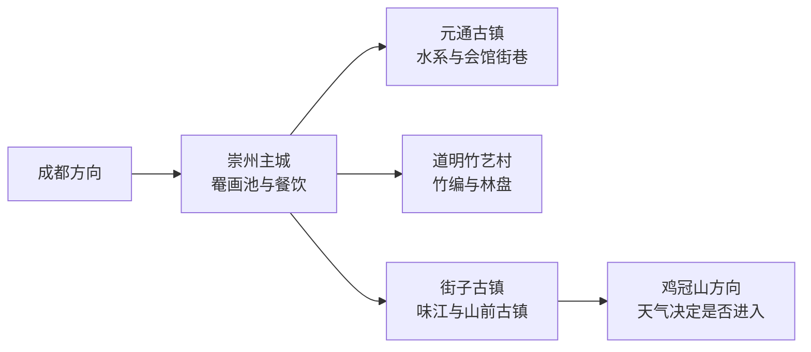
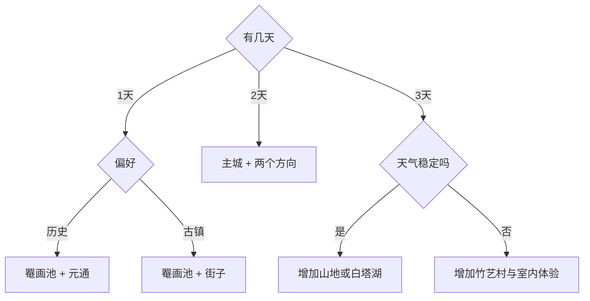

# 崇州旅行指南

崇州位于成都平原西缘，适合把旅行拆成三层：崇阳—崇庆主城看罨画池与蜀州历史，街子—元通方向看古镇、水系和川西林盘，再向西进入鸡冠山等龙门山前地带。第一次到访可先选“主城加一座古镇”，多留一天再加入竹艺村或山地。固定快照中的 **Guangsheng / GeoNames 6975019** 对应崇州市观胜镇；崇州市政府乡镇页面和法定代码 `510184` 共同支持该记录映射到现行县级市。

> 建议停留：2–3 天；只看主城与一座古镇可压缩为 1 天  
> 旅行关键词：罨画池、街子古镇、元通古镇、竹编、川西林盘  
> 主要体力：主城与古镇中等步行，山地路线较高  
> 最近研究：2026-09-03

## 城市速览

| 项目 | 旅行信息 |
|---|---|
| 主要旅行价值 | 用罨画池认识蜀州历史，以街子、元通观察水乡古镇，再从道明竹艺村和山前林盘理解川西乡村生活 |
| 建议停留 | 1 天选主城加一座古镇；2 天补齐两座古镇或竹艺村；3 天再选一条山地或湿地线 |
| 较舒适季节 | 春秋适合古镇与乡村步行；夏季适合早晚活动并预留避雨，高海拔山地体感更凉；冬季关注低温、雾和道路结冰 |
| 预算特点 | 主城公共空间和日常餐饮较易控制；古镇往返、山地车辆、体验课程与乡村住宿是主要增量 |
| 步行强度 | 罨画池与古镇石板路为中等；鸡冠山方向涉及较长乘车、坡道和自然路面 |
| 主要天气风险 | 成都平原多雨雾，龙门山前还需关注暴雨、山洪、滑坡、雷电、森林火险与冬季结冰 |
| 独行旅行 | 主城、街子和元通较方便；乡村与山地宜先锁定返程车辆和通信条件 |
| 亲子旅行 | 古镇与竹艺体验容易组合；婴儿车需留意石板路、台阶和雨后湿滑 |
| 长者与低体力旅行 | 选罨画池加一座古镇即可形成完整线路，古镇内按临水街巷分段休息 |
| 无障碍信息 | 主城场馆可先询问无台阶入口和电梯；古建、石板路与山地的连续通行条件需向运营方确认 |

## 城市格局与游览区域

崇州从东部平原向西部山地逐级抬升。主城承担住宿、公共交通和文博服务；街子、元通、道明分处不同公路方向，适合按半日或一日组合；鸡冠山—文井江方向进入龙门山地，应单独留出天气与返程余量。

| 区域 | 主要内容 | 游览特点 | 与其他区域的关系 |
|---|---|---|---|
| 崇州主城 | 罨画池博物馆、城市街区、餐饮 | 场馆与生活服务集中，适合抵达日和雨天 | 可与元通或道明组合，去街子仍需车辆 |
| 街子方向 | 街子古镇、味江河谷、山前村落 | 石板路与临水街巷较多，周末客流明显 | 可作为山地方向门户，但古镇与鸡冠山不宜压缩成短半日 |
| 元通方向 | 元通古镇、汇江水系、历史街巷 | 适合慢走、看院落和水运商贸格局 | 与主城较易串联，也可接观胜一带乡村 |
| 道明方向 | 竹艺村、川西林盘、乡村体验 | 体验项目与餐饮具有预约和季节性 | 适合与主城组成一日，不与山地长线硬拼 |
| 西部山地 | 鸡冠山、文井江及正式开放游线 | 交通与天气门槛最高，林区边界明确 | 单独安排整日并准备取消方案 |

## 主要景点

优先级用于安排时间：**A** 为首访核心，**B** 为按兴趣补充，**C** 为山地、季节性或需独立半天以上的方向。

| 景点 | 区域 | 类型 | 主要看点 | 建议用时 | 室内外 | 体力 | 预约风险 | 天气影响 | 优先级 |
|---|---|---|---|---:|---|---|---|---|---|
| 罨画池博物馆（含罨画池、陆游祠、州文庙参观体系） | 主城 | 园林、祠庙、文博 | 州署园林格局、陆游相关文化和古建院落；按同一场馆体系计一次 | 2–3 小时 | 混合 | 中 | 中 | 中 | A |
| 街子古镇 | 街子镇 | 古镇、水乡 | 味江、石板街、古建与山前市镇格局 | 3–5 小时 | 室外为主 | 中 | 低 | 高 | A |
| 元通古镇 | 元通镇 | 古镇、商贸史 | 三水汇流、会馆院落、临河街巷和旧商贸节点 | 2.5–4 小时 | 室外为主 | 中 | 低 | 高 | A |
| 道明竹艺村 | 道明镇 | 非遗、乡村 | 竹编传统、当代竹建筑与川西林盘；体验课程按运营方安排 | 2–4 小时 | 混合 | 低至中 | 中 | 中 | B |
| 桤木河湿地公园 | 主城东南方向 | 湿地、公共空间 | 平原河渠、绿道与季节植物 | 1.5–3 小时 | 室外 | 低至中 | 低 | 高 | B |
| 白塔湖及正式开放岸线 | 道明方向 | 湖泊、山前景观 | 湖面、林地与白塔远景；只使用公告开放的道路和岸线 | 2–4 小时 | 室外 | 中 | 中 | 很高 | C |
| 鸡冠山正式开放游线 | 西部山地 | 森林、山地 | 龙门山地形、森林与溪谷；以当天开放入口和防灾公告为准 | 1 天 | 室外 | 高 | 高 | 很高 | C |
| 观胜镇乡村与林盘 | 主城北部 | 乡村、聚落 | 平原农田、林盘和基层镇场景观；优先选择公开接待项目 | 2–3 小时 | 室外 | 低至中 | 中 | 高 | C |

山地自然保护、林业生产、水库和地质灾害治理区域有各自管理边界；行程只进入正式开放游线。竹编作坊、农田和民居也以经营者或居民明确接待为前提。

## 美食与餐饮

崇州饮食延续成都平原川味，也有主城小吃、古镇汤麻饼与乡村宴席等地方线索。点餐时先说清辣度、份量和过敏原；古镇热门店排队时，沿同一生活街区寻找菜单与明码标价清楚的同类店更灵活。

| 菜品或餐饮类型 | 常见区域 | 一个人用餐与常见份量 | 风味、过敏原与饮食限制 | 排队风险与替代方法 |
|---|---|---|---|---|
| 查渣面及川味面食 | 主城、古镇 | 一人一碗方便，可另加小份浇头 | 常含小麦、猪肉或牛肉、辣椒与花椒；汤底是否含荤油需询问 | 早餐和午餐高峰错峰，改选居民区同类面馆 |
| 街子汤麻饼等糕点 | 街子古镇 | 适合买小份试味并查看生产日期 | 常含小麦、芝麻、糖和油脂，坚果过敏者逐项确认 | 游客街主店拥挤时选有包装标签的正规门店 |
| 豆花、凉粉与小吃 | 主城、元通、街子 | 独行可组合两种小份 | 调味可能含花生、芝麻、辣椒和酱油 | 先看现做环境和价格，避免一次点过多 |
| 川菜与乡村菜 | 主城、道明及乡村餐饮点 | 多为共享菜，独行先问半份或小份 | 常用菜籽油、豆瓣、花椒，鱼禽菜注意骨刺与交叉接触 | 周末乡村餐饮先预约，满位时回主城用餐 |
| 茶馆与盖碗茶 | 主城、古镇 | 适合休息和调整路线 | 茶水含咖啡因，甜茶与配点另查糖和坚果 | 临水热门座位等候较久，可选背街安静茶馆 |

## 经典行程

### 一日经典路线

**路线**：罨画池博物馆 → 主城午餐 → 街子古镇；偏爱商贸古镇时把街子换成元通。

- **串联逻辑**：上午先建立蜀州历史背景，下午只选一座古镇，减少往返。
- **预约锚点**：罨画池开放与入馆要求；有竹编体验时另锁定时段。
- **休息安排**：主城午餐，古镇以茶馆或游客服务点分段休息。
- **时间不足时**：保留罨画池和所选古镇的核心街巷，删除湿地或乡村加点。

### 两日城市路线

**第 1 天**：罨画池博物馆 → 主城餐饮 → 元通古镇  
**第 2 天**：街子古镇 → 按体力选择味江沿线公共空间

- **串联逻辑**：把两座古镇拆开，分别保留慢走和用餐时间。
- **预约锚点**：罨画池；古镇活动或演出只在官方公布后加入。
- **休息安排**：两天都以古镇固定茶馆和主街外安静餐饮点作中段休息。
- **时间不足时**：第二天只走街子古镇，取消继续向山地方向移动。

### 三日深度路线

**第 1 天**：罨画池博物馆 → 主城生活街区  
**第 2 天**：元通古镇 → 道明竹艺村  
**第 3 天**：街子古镇 → 天气合适时选择一段正式开放的山前游线

- **串联逻辑**：历史、乡村手艺和山前三个主题分日，避免来回穿越市域。
- **预约锚点**：竹艺体验和第三天山地开放信息。
- **休息安排**：第二天在竹艺村公共接待空间休息，第三天以街子为补给点。
- **时间不足时**：先删第三天山地延伸，保留街子古镇。

### 雨天或强对流路线

**路线**：罨画池博物馆可开放室内部分 → 主城午餐与茶馆 → 官方确认开放的竹艺室内体验。

- **串联逻辑**：缩短户外暴露，并把跨镇移动控制在一条往返线上。
- **预约锚点**：场馆临时闭馆、体验课程与道路预警。
- **休息安排**：主城场馆和正规餐饮空间承担主要停留。
- **时间不足时**：只保留罨画池与主城餐饮；暴雨预警期间取消山地、临水和湿地段。

### 亲子或低体力路线

**亲子路线**：罨画池博物馆 → 午休 → 道明竹艺村预约体验。  
**低体力路线**：罨画池博物馆短线 → 主城午餐 → 元通古镇选一段平缓街巷。

- **串联逻辑**：亲子线用动手体验收尾，低体力线控制石板路长度并保留随时返回条件。
- **预约锚点**：儿童体验年龄、材料安全，以及场馆无台阶入口和休息座椅。
- **休息安排**：午餐后固定休息，古镇或村落每完成一段即回到可坐下的公共空间。
- **时间不足时**：亲子线删古镇加点，低体力线只保留罨画池。

### 远郊一日路线

**路线**：崇州主城出发 → 街子补给 → 鸡冠山方向正式开放入口与游线 → 原路返回或按公告安全驶离。

- **串联逻辑**：整日留给西部山地，返程余量优先于增加景点。
- **预约锚点**：景区开放、森林防火、地质灾害、道路通行和返程车辆。
- **休息安排**：在街子或官方游客中心完成补给，山中只使用开放休息点。
- **时间不足时**：整段取消山地，改为街子古镇完整半日。

### 古镇与竹艺主题路线

**路线**：元通古镇 → 主城午餐 → 道明竹艺村；住宿在主城时次日再去街子。

- **串联逻辑**：先看传统水运商贸空间，再用竹编体验理解川西乡村手艺。
- **预约锚点**：竹艺课程、展馆或工作室的接待时段。
- **休息安排**：元通茶馆、主城午餐和竹艺村公共空间三段休息。
- **时间不足时**：保留元通与竹艺村各一个核心段，街子留到下一天。

## 住宿区域

| 区域 | 优点 | 缺点 | 适合人群 | 交通特点 |
|---|---|---|---|---|
| 崇州主城 | 餐饮、住宿和叫车选择集中，方便分方向出发 | 与街子和山地仍有公路距离 | 首访、独行、公共交通旅行者 | 适合做两至三日基地，先确认车站与上车点 |
| 街子古镇 | 清晨和傍晚可体验较安静的古镇 | 周末噪声、停车和房间条件差异较大 | 古镇慢游、摄影、次日山前路线 | 去主城与山地都需地面交通 |
| 元通古镇周边 | 适合水乡街巷慢住 | 住宿和夜间服务选择少于主城 | 偏爱小镇节奏、自驾者 | 适合与主城或道明串联 |
| 道明及乡村住宿 | 接近竹艺与林盘体验 | 对预约、车辆和餐饮营业依赖较高 | 乡村体验、多人同行 | 入住前确认停车、晚餐和次日返程 |

## 市内交通

| 场景 | 建议与取舍 | 行前需要重查的内容 |
|---|---|---|
| 从成都抵达 | 铁路、城际客运或自驾均可；先按住宿位置选择崇州站、客运上下车点或直达车辆 | 车次、班次、实际到发站和末班时间 |
| 主城内移动 | 步行、公交和网约车可覆盖场馆与餐饮区 | 道路施工、场馆入口和雨天拥堵 |
| 主城—街子／元通／道明 | 公交适合时间充裕者，多人同行可选合规包车或自驾 | 线路走向、末班、节假日交通组织和返程上车点 |
| 西部山地 | 自驾或合规车辆更便于保留返程弹性 | 道路开放、落石山洪风险、森林防火和通信条件 |
| 骑行 | 平原绿道与乡村公路可按体力选择短段 | 绿道开放、机动车混行、雨后路面和车辆停放规则 |

## 不同旅行者须知

| 旅行维度 | 可行条件 | 主要取舍 | 需额外核对 |
|---|---|---|---|
| 独行旅行 | 主城住宿并每天只走一个远方向 | 乡村晚间与山地返程选择较少 | 末班车、叫车范围、通信和正规住宿登记 |
| 亲子旅行 | 罨画池、古镇短线和预约竹艺体验容易组合 | 石板路、临水空间和山地路面对看护要求较高 | 儿童体验年龄、护栏、推车通行与卫生间 |
| 长者或低体力旅行 | 主城加一座古镇即可形成完整体验 | 古建台阶、石板路和站立时间 | 无台阶入口、座椅、最近下客点和轮椅条件 |
| 无障碍需求 | 先从主城现代入口和游客服务中心获取支持 | 古镇与古建的连续通行较弱 | 坡道、电梯、无障碍卫生间和可通行街段 |
| 摄影旅行 | 古镇清晨、园林与公开林盘空间题材丰富 | 周末客流、雨雾和器材防潮影响节奏 | 三脚架、航拍、商业拍摄及文保场馆规则 |
| 预算有限 | 住主城，选公共空间与一座古镇 | 公交耗时换取交通成本下降 | 免费开放范围、优惠资格与末班车 |
| 晚出发或紧凑行程 | 只选罨画池或一座古镇 | 跨方向移动会压缩有效游览时间 | 最晚入馆、返程和夜间交通 |
| 特殊天气或自然条件 | 以主城和室内体验作替代 | 暴雨、雷电、火险或结冰会关闭山地线路 | 气象预警、地灾提示、景区公告和退改规则 |

## 行前核对

| 核对事项 | 为什么需要重查 | 建议核对时间 | 官方入口 |
|---|---|---|---|
| 罨画池开放与入馆 | 古建维护、活动和闭馆日会改变可参观范围 | 预约前及到访前一日 | [崇州市人民政府](https://www.chongzhou.gov.cn/) |
| 街子、元通与乡村活动 | 节庆、施工和客流管理具有时效性 | 出发前一周及当天 | [崇州市人民政府](https://www.chongzhou.gov.cn/) |
| 山地与林区状态 | 暴雨、地灾、火险和结冰直接影响路线 | 出发前三日及当天 | [四川省气象局](https://sc.cma.gov.cn/)；[四川省林业和草原局](https://lcj.sc.gov.cn/) |
| 城际与市内交通 | 班次、道路施工和末班时间会调整 | 出发前一周及当天 | [中国铁路 12306](https://www.12306.cn/)；[成都公交](https://www.cdgjbus.com/) |
| 竹艺体验与乡村住宿 | 接待时段、课程、餐饮和房态变化较快 | 排入路线前 | 崇州市政府或经营方官方渠道 |

## 来源与更新记录

### 主要来源

| 来源 | 类型 | 支持内容 | 核验日期 |
|---|---|---|---|
| [民政部行政区划查询](https://dmfw.mca.gov.cn/xzqh/getList?code=51&trimCode=true&maxLevel=3) | 国家行政区划 | 崇州市法定县级市身份与代码 `510184` | 2026-09-03 |
| [崇州市人民政府：观胜镇](https://www.chongzhou.gov.cn/chongzhou/c139438/zhen_gsz.shtml) | 县级市政府 | 观胜镇归属崇州市，支持 GeoNames 记录映射 | 2026-09-03 |
| [崇州市人民政府](https://www.chongzhou.gov.cn/) | 县级市政府 | 城市概况、公共服务、文旅与动态公告入口 | 2026-09-03 |
| [四川省文化和旅游厅](https://wlt.sc.gov.cn/) | 省级文旅部门 | 景区、文博与旅游公共信息核对入口 | 2026-09-03 |
| [四川省气象局](https://sc.cma.gov.cn/) | 气象部门 | 强降雨、雷电、高温与山地天气预警 | 2026-09-03 |
| [GeoNames 6975019](https://www.geonames.org/6975019/) | 固定开放数据 | Guangsheng／观胜镇名称、坐标与人口点类型 | 2026-09-03 |

### 更新记录

| 日期 | 更新内容 |
|---|---|
| 2026-09-03 | 首次完成资料研究；建立主城—古镇—竹艺—山地的分层路线，并明确林区、文保、农田与乡村接待边界 |
