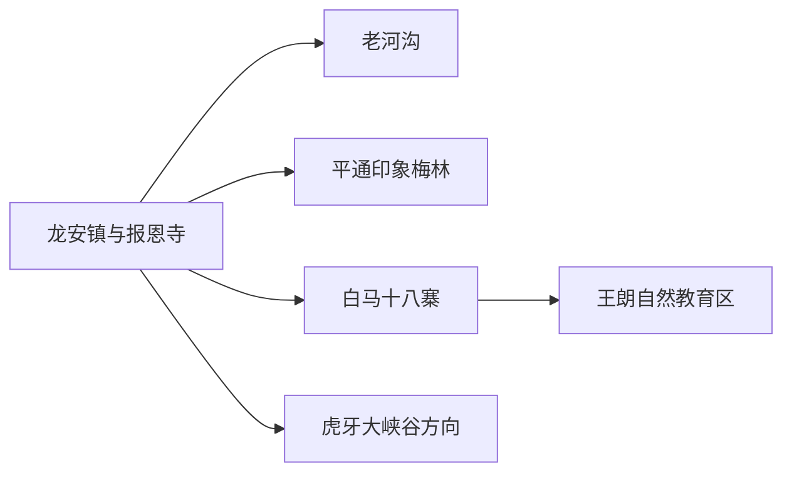
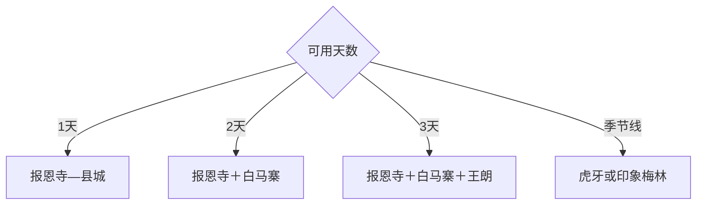

# 平武旅行指南

平武适合做岷山古建、自然教育与白马文化的慢旅行：县城报恩寺是人文核心，王朗、老河沟和虎牙属于预约与天气主导的自然线，白马十八寨适合民族文化与山居体验。山路距离长，三天比两天更从容。

## 城市速览

| 项目 | 信息 |
|---|---|
| 主线 | 龙安镇—报恩寺—老河沟—白马十八寨—王朗—虎牙 |
| 停留 | 县城1天；自然与白马线共3–4天 |
| 住宿 | 龙安镇适合换线，白马片区适合王朗与寨落，虎牙方向按开放住宿 |
| 交通 | 从绵阳、江油方向经公路进入；县内远线以景区接驳、预约车或自驾为主 |
| 风险 | 高海拔反应、落石塌方、强降雨、冬季冰雪、野生动物和通信盲区 |
| 边界 | 大熊猫国家公园、自然保护地、科研监测区、民族村寨私域和地灾封控段按许可进入 |

## 城市格局与游览区域

固定 `Pingwu County / GeoNames 12492669` 承接法定平武县 `Q1339230`。县城位于河谷交通节点；白马—王朗、虎牙和平通分属不同方向，不能以地图直线距离估算山路耗时。

## 主要景点

| 景点 | 区域 | 类型 | 核心体验 | 用时 | 环境 | 体力 | 预约风险 | 天气影响 | 优先级 |
|---|---|---|---|---:|---|---|---|---|---|
| 平武报恩寺 | 龙安镇 | 古建筑群 | 明代古建、壁画、雕塑与地方史 | 3–5小时 | 室内外 | 中 | 高 | 中 | A |
| 平武县博物馆或报恩寺配套展陈 | 龙安镇 | 地方文博 | 文物背景、民族与生态认知 | 1.5–3小时 | 室内 | 低 | 很高 | 低 | A |
| 王朗片区开放自然教育项目 | 白马方向 | 国家公园体验 | 森林生态、生物多样性与科普 | 1天 | 室外 | 中高 | 极高 | 极高 | A |
| 白马十八寨公开接待村寨 | 白马乡 | 民族文化 | 白马文化、村寨与非遗体验 | 半日至1天 | 室内外 | 中 | 很高 | 很高 | A |
| 老河沟自然教育开放项目 | 高村方向 | 生态保护 | 低密森林、自然观察与研学 | 半日至1天 | 室外 | 中高 | 极高 | 极高 | B |
| 虎牙大峡谷当期开放区 | 虎牙乡 | 峡谷山地 | 峡谷、瀑布、花海或冰雪景观 | 1天 | 室外 | 高 | 极高 | 极高 | B |
| 平通印象梅林 | 平通镇 | 乡村花景 | 梅花、山村与季节农旅 | 半日 | 室外 | 中 | 高 | 很高 | B |
| 清漪江沿线正规康养点 | 平通片区 | 河谷乡村 | 河谷景观、民宿与慢游 | 半日至1天 | 室外 | 低中 | 高 | 很高 | C |

## 美食与餐饮

龙安镇可选腊肉、荞面、洋芋、菌菇、蜂蜜和川北家常菜，白马片区按正规接待体验当地饮食。野生菌由正规餐馆充分加工，山地日提前确认供餐和饮水；民族餐饮可先了解份量与饮食禁忌。

## 经典行程

### 一日经典线
**路线**：报恩寺—配套展陈—龙安镇河谷。**逻辑**：在县城完成最稳定的人文核心。**预约锚点**：报恩寺、讲解与展馆。**休息**：龙安镇。**删除条件**：闭馆时只走县城公开空间。

### 三日人文自然线
**路线**：首日报恩寺；次日白马十八寨；三日王朗开放项目。**逻辑**：逐步进入高海拔并给自然日留完整时段。**预约锚点**：国家公园项目、寨落住宿和接驳。**休息**：白马片区。**删除条件**：道路或天气预警时取消王朗。

### 古建深读线
**路线**：报恩寺讲解—配套展陈—县城历史街区。**逻辑**：先读建筑本体，再补地方背景。**预约锚点**：专业讲解与殿堂开放。**休息**：寺外服务区。**删除条件**：部分殿堂修缮时按开放轴线缩减。

### 自然教育线
**路线**：王朗或老河沟二选一—预约课程—公开步道。**逻辑**：由机构带领完成低干扰观察。**预约锚点**：名额、年龄、装备与保险。**休息**：自然教育营地。**删除条件**：保护管理、地灾或天气调整时取消。

### 白马文化线
**路线**：白马公开寨落—非遗体验—村寨住宿或返程。**逻辑**：以社区接待和文化讲解为中心。**预约锚点**：接待村、活动与住宿。**休息**：村寨服务点。**删除条件**：社区活动暂停时改县城。

### 季节山谷线
**路线**：春季平通梅林或适宜季节虎牙公开区二选一。**逻辑**：跟随花期、冰雪与道路条件选择方向。**预约锚点**：物候、开放、车辆和返程。**休息**：乡镇。**删除条件**：花期偏差或封路时取消。

### 低体力线
**路线**：车辆到报恩寺—午休—县城展陈。**逻辑**：用两处稳定点避免长山路与高海拔。**预约锚点**：无障碍、座椅和落客。**休息**：龙安镇。**删除条件**：台阶条件不适合时只留展陈。

## 住宿区域

龙安镇适合首次到访、报恩寺与县内换线；白马片区适合寨落和王朗，但需确认海拔、供暖、热水与接驳；平通适合梅林和河谷慢游；虎牙方向只在道路、景区和正规住宿均确认后留宿。

## 市内交通

平武县域山高谷深，县城到各片区按山路实际车程安排。优先使用景区或自然教育机构接驳，包车明确司机资质、车型、雪链与返程。雨季关注地灾预警，冬季关注积雪结冰，天黑前抵达住宿点。

## 不同旅行者须知

古建爱好者优先报恩寺讲解；自然观察者参加预约项目并携带望远镜；亲子家庭按课程年龄选王朗或老河沟；低体力者留在县城。国家公园核心保护区、科研监测区、野生动物活动区、未开放林道和地灾封控路段保留明确限制。

## 行前核对

- 核对报恩寺、王朗、老河沟、白马寨和虎牙的开放、预约与接驳。
- 核对地灾、降雨、积雪、海拔、通信、车辆状态和应急物资。
- 自然观察保持距离并带走垃圾，民族村寨按社区规则拍摄与参与活动。

## 来源与更新记录

| 来源 | 支持内容 | 核验日期 |
|---|---|---|
| [四川省政府：平武县域文旅发布会](https://www.sc.gov.cn/10462/10705/10707/2025/5/28/a2c125bf90b3450fa164635c3c5c8a4f.shtml) | 报恩寺、王朗、白马十八寨和虎牙文旅结构 | 2026-09-01 |
| [文化和旅游部：平武报恩寺文物保护](https://www.mct.gov.cn/vipchat/home/site/1/224/message.html) | 报恩寺古建筑与文物保护边界 | 2026-09-01 |
| [GeoNames 12492669](https://www.geonames.org/12492669/) | Pingwu County 固定记录 | 2026-09-01 |
| [Wikidata Q1339230](https://www.wikidata.org/wiki/Q1339230) | 平武县实体与跨库标识 | 2026-09-01 |

| 日期 | 更新 |
|---|---|
| 2026-09-01 | 首次完成平武旅行研究，按报恩寺、自然教育、白马文化与季节山谷组织。 |
