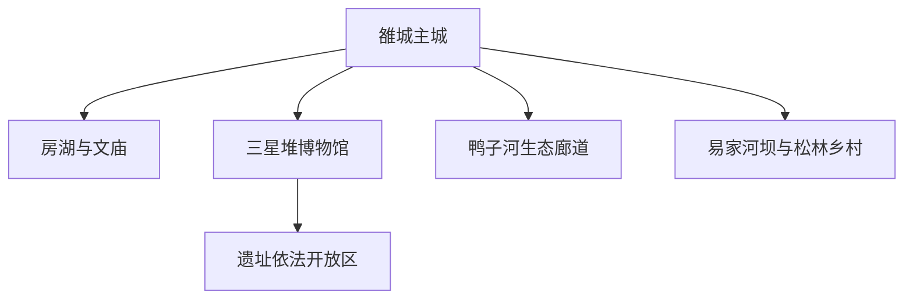
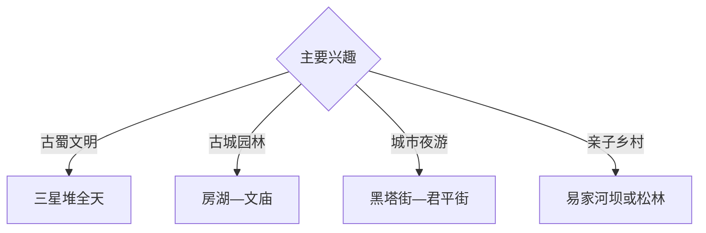

# 广汉旅行指南

广汉位于成都平原北部，以三星堆博物馆与遗址保护区、雒城老城、房湖公园、文庙和鸭子河乡村生态形成古蜀文明与川西城市组合。固定快照中的 **Luocheng / GeoNames 1801982** 锚定雒城主城；三星堆是完整遗址博物馆单元，适合单列大半天至一天。

## 城市速览

| 项目 | 信息 |
|---|---|
| 主线 | 雒城主城—房湖—三星堆—鸭子河—乡村体验 |
| 停留 | 三星堆1天；雒城与乡村另留1天 |
| 住宿 | 雒城便于餐饮接驳；遗址周边正规住宿适合早场 |
| 交通 | 城际铁路与公路抵达，景区间使用公交或约车 |
| 季节 | 全年可访馆；节假日及重要展览期提前预约 |
| 预算 | 博物馆预约、讲解和跨点车辆构成主要增量 |

## 城市格局与游览区域

雒城承担住宿、房湖和城市生活；三星堆位于城西，遗址展示与考古保护范围层级不同；易家河坝、松林桃花山等乡村点按季节选择。考古工作区、遗址保护核心范围、河道行洪区、农业生产区和通航作业空间按正式开放边界进入。

## 主要景点

| 景点 | 区域 | 类型 | 核心体验 | 用时 | 环境 | 体力 | 研究价值 | 拥挤 | 优先级 |
|---|---|---|---|---:|---|---|---|---|---|
| 三星堆博物馆 | 三星堆 | 考古与文博 | 青铜器、金器、古蜀文明与考古研究 | 半天至1天 | 室内 | 中 | 很高 | 节假日高 | A |
| 三星堆遗址依法开放区 | 三星堆 | 遗址与保护 | 遗址格局、环境和保护展示 | 2–3小时 | 混合 | 中 | 很高 | 中高 | A |
| 房湖景区 | 雒城 | 园林与古城 | 唐代园林脉络、雒城遗址和湖景 | 2–3小时 | 室外 | 低 | 高 | 周末中 | A |
| 广汉文庙公开区 | 房湖周边 | 古建与教育史 | 文庙建筑、石刻与地方教育 | 1小时 | 混合 | 低 | 高 | 中 | B |
| 黑塔街与君平街公开区 | 雒城 | 街巷与城市 | 老城更新、餐饮和夜间生活 | 2–3小时 | 混合 | 低 | 中高 | 晚间中 | B |
| 易家河坝乡村旅游区 | 三水方向 | 湿地与乡村 | 湖泊湿地、田园和亲子休闲 | 半天 | 室外 | 低 | 中高 | 周末中 | B |
| 松林桃花山正规游览区 | 松林方向 | 花季与乡村 | 桃花季、川西田园与村落 | 半天 | 室外 | 低中 | 中 | 花期高 | B |

## 美食与餐饮

广汉缠丝兔、连山回锅肉、金丝面、火锅和川西小吃适合在雒城与连山方向体验。三星堆参观日按预约时间安排正餐；乡村采摘和农餐选择正规接待点。

## 经典行程

### 三星堆深度线
**路线**：博物馆—遗址公开展示—文创与资料整理。**逻辑**：为核心馆藏和考古背景留足时间。**预约锚点**：实名票和讲解。**休息**：馆区服务点。**删除条件**：限流时按预约场次压缩外围段。

### 雒城古韵线
**路线**：房湖—文庙—雒城遗址公开段—老街。**逻辑**：用半天理解三星堆之外的城市历史。**预约锚点**：文庙开放。**休息**：房湖周边。**删除条件**：雨天缩短园林段。

### 城市夜游线
**路线**：房湖傍晚—黑塔街—君平街—主城餐饮。**逻辑**：把古城更新与地方饮食连接。**预约锚点**：活动日程。**休息**：雒城。**删除条件**：大型活动管制时选择其他公开街区。

### 易家河坝亲子线
**路线**：主城—易家河坝正规入口—湿地科普—返城。**逻辑**：以低体力补充自然观察。**预约锚点**：景区活动。**休息**：游客服务点。**删除条件**：暴雨或河道高水位时取消。

### 松林花季线
**路线**：主城—松林桃花山开放区—乡村正规接待点。**逻辑**：围绕花期安排半日田园体验。**预约锚点**：花情和交通。**休息**：正规农庄。**删除条件**：非花期改易家河坝。

### 低体力文博线
**路线**：三星堆核心展馆—午餐—房湖短段。**逻辑**：把主要体力留给博物馆。**预约锚点**：无障碍与讲解服务。**休息**：馆内休息区。**删除条件**：疲劳时删房湖。

### 两日组合线
**路线**：首日三星堆；次日房湖、文庙和乡村点。**逻辑**：遗址与城市生活分日。**预约锚点**：首日博物馆。**休息**：雒城连续住宿。**删除条件**：一天时只保留三星堆。

## 住宿区域

雒城主城适合铁路接驳、餐饮和夜游；三星堆周边正规住宿便于早场参观。订房核对景区交通、停车、消防、早餐和节假日退改。

## 市内交通

广汉北站等铁路节点与主城、三星堆距离不同，购票后核对接驳。景区公交和旅游专线以当日公告为准；乡村点按方向安排约车或自驾。

## 不同旅行者须知

考古爱好者给三星堆完整一天；亲子家庭利用正式研学和乡村科普；长者优先馆内休息与房湖平缓段；摄影者按文物展厅规则拍摄。考古工地、遗址核心保护范围、文物本体、河道行洪区和农业生产空间保留明确限制。

## 行前核对

- 核对三星堆实名预约、讲解、行李与拍摄规则。
- 核对房湖、文庙、老街活动和乡村景区开放。
- 核对铁路站点、旅游专线、返程与住宿。
- 核对暴雨、河流水位、节假日限流和高温预警。

## 来源与更新记录

| 来源 | 支持内容 | 核验日期 |
|---|---|---|
| [广汉市政府：房湖景区](https://www.guanghan.gov.cn/gk/jczwgkbzml/lybl/whll/ggbw/ajlljfjbqk/1651033.htm) | 房湖、雒城遗址、文庙与非遗活动 | 2026-09-03 |
| [广汉市政府：旅游景点](https://www.guanghan.gov.cn/info/iList.jsp?cat_id=25338) | 三星堆、房湖、易家河坝与松林桃花山 | 2026-09-03 |
| [GeoNames 1801982](https://www.geonames.org/1801982/) | Luocheng 固定人口点与广汉主城位置 | 2026-09-03 |

