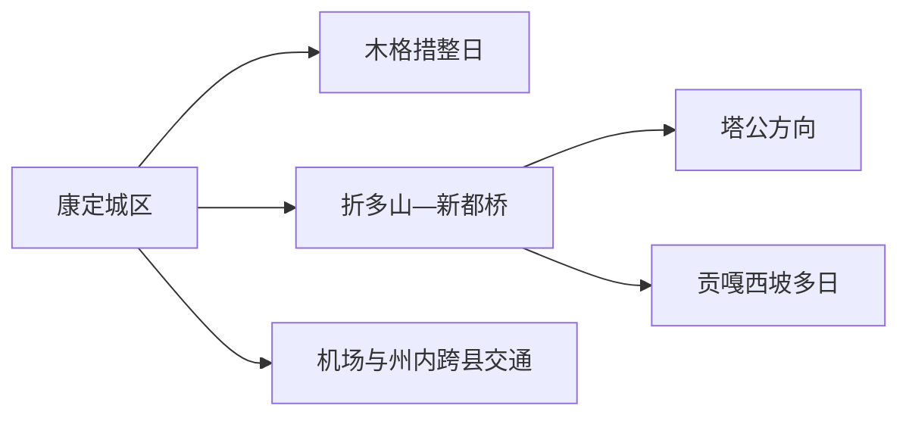
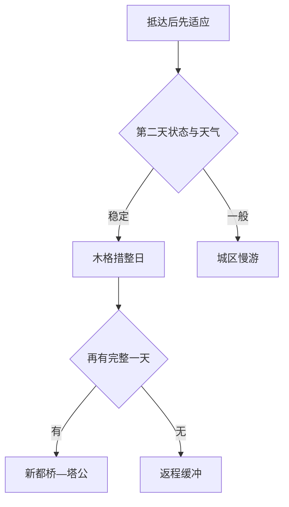

# 康定旅行指南

康定是甘孜州府，也是从大渡河谷进入川西高原的重要转换点。旅行可分为三层：康定城区适合用溜溜城、地方文博与寺院认识州府生活；木格措是独立整日景区；新都桥—塔公以及贡嘎西坡各是更远的高原线路。先留一晚适应海拔，再按天气选一条远线，通常比连续翻越多个垭口更舒服。

> 建议停留：城区 1 天；木格措、新都桥—塔公各另留 1 天；贡嘎西坡另作多日计划 
> 旅行关键词：州府河谷、情歌文化、木格措、新都桥、塔公草原、贡嘎山、高海拔公路 
> 主要体力：城区中等；景区与高原远线中至高，海拔反应会放大体力消耗 
> 最近研究：2026-08-13

## 城市速览

| 项目 | 旅行信息 |
|---|---|
| 主要旅行价值 | 以州府城市生活为起点，分日进入湖泊森林、摄影走廊、草原寺院与贡嘎山地 |
| 建议停留 | 3 天可安排城区、木格措、新都桥—塔公；深度山地需另加天数 |
| 交通 | 成都方向道路为主，康定机场受高原天气影响明显；铁路建设信息不等于已开通 |
| 海拔 | 城区已属高海拔，第一天降低强度；更高垭口和景区按身体反应取舍 |
| 季节 | 雨雪、结冰、落石、强紫外线和昼夜温差全年都可能改变路线 |
| 预算 | 跨片区车辆、景区接驳和高原住宿是主要支出 |
| 步行 | 城区坡路多，景区栈道和草原步道受海拔与天气影响 |
| 无障碍 | 城区和景区部分节点可接驳，连续动线、氧气与轮椅服务需逐点确认；设施连续性需向官方确认 |
| 亲子 | 先适应城区，远线只选一处；幼儿与有基础疾病者先咨询专业意见 |
| 行前核心 | 每天核天气、道路、景区、海拔适应与返程，不用固定网红机位替代正式入口 |

## 城市格局与游览区域

康定市法定代码 `513301`，GeoNames `1802171` 与 Wikidata `Q1013814` 的 `P1566` 精确对应。县级市同时是甘孜州首府，但州内泸定、丹巴、道孚、雅江等县仍是独立旅行范围。

| 区域 | 旅行重点 | 建议安排 | 关键条件 |
|---|---|---|---|
| 康定城区 | 溜溜城、地方文化、寺院、河谷街巷 | 抵达与适应日 | 坡路、拥堵、停车与高反 |
| 木格措 | 湖泊、森林、温泉景观与景区接驳 | 独立整日 | 门票接驳、天气、海拔 |
| 新都桥 | 高原聚落、河谷、摄影与住宿集散 | 住一晚更从容 | 道路、观景点边界、农牧生产 |
| 塔公方向 | 草原、寺院与高原文化 | 与新都桥组成整日 | 尊重宗教、牧场与交通规则 |
| 贡嘎西坡 | 高山观景、村落与长距离山路 | 多日专题 | 正式线路、向导、天气与补给 |

高原草场、农牧村落、寺院、自然保护地和矿业设施各有管理边界。旅行使用公开道路、正式观景台和运营景区；草场围栏、施工便道、矿区及未开放山径以现场准入为准。

## 主要景点

| 名称 | 区域 | 类型 | 旅行价值 | 建议时长 | 室内外 | 体力 | 无障碍 | 预约 | 优先级 |
|---|---|---|---|---:|---|---|---|---|---|
| 溜溜城—情歌广场城市线 | 城区 | 街区、文化 | 认识康定河谷州府与公共文化 | 2–4小时 | 混合 | 中 | 中 | 通常无需 | A |
| 跑马山当期开放区域 | 城区 | 山地、文化 | 俯瞰城区并连接情歌文化 | 3–5小时 | 室外 | 中至高 | 逐项确认 | 建议 | B |
| 康定地方文博与非遗展陈 | 城区 | 文博 | 建立藏汉交流与地方史背景 | 1–3小时 | 室内 | 低 | 中 | 建议 | A |
| 南无寺、金刚寺等开放寺院 | 城区 | 宗教、建筑 | 观察州府宗教与社区生活 | 1–2小时 | 混合 | 中 | 低至中 | 通常无需 | B |
| 木格措景区 | 城北 | 湖泊、森林 | 康定最完整的高原自然景区日 | 6–9小时 | 室外 | 中至高 | 中 | 建议 | A |
| 新都桥正式公共观景点 | 西部 | 河谷、聚落 | 高原光影、聚落与摄影走廊 | 半日至1天 | 室外 | 中 | 低 | 住宿建议 | A |
| 塔公寺与公开草原观景带 | 塔公方向 | 寺院、草原 | 宗教文化与高原开阔景观 | 半日至1天 | 混合 | 中 | 低 | 建议核对 | A |
| 折多山正式观景与服务点 | G318方向 | 垭口、山景 | 感受地形与海拔转换 | 0.5–1小时 | 室外 | 中至高 | 低 | 看路况 | B |

木格措按一个完整父景区计算，内部湖泊、温泉和接驳站不重复拆分。新都桥是较广的镇域与摄影走廊，选择公开观景点和持证住宿，不把居民院落、农田或草场当作无条件拍摄场地。

## 美食与餐饮

城区适合寻找牦牛肉、藏式面食、川菜和酥油茶，新都桥与塔公方向宜在镇区或住宿地预订正餐。高海拔第一天选清淡、熟食和小份量更易适应。

| 类型 | 点法 | 注意 |
|---|---|---|
| 牦牛肉汤锅 | 2人以上更合适，也可点小锅 | 汤底高盐，蘸料含大豆、芝麻或花生 |
| 藏面与面食 | 一人一份 | 含小麦，汤底通常非素食 |
| 糌粑、酥油茶 | 先小份体验 | 含乳制品与青稞，奶过敏者确认替代 |
| 川菜与菌菇 | 按人数少量点 | 菌类充分加热，过敏和辛辣需求提前说明 |

## 经典行程

### 一日经典
**路线**：地方文博 → 城区午餐 → 溜溜城与河谷街巷 → 开放寺院
- **串联逻辑**：全程留在城区，适合作为海拔适应日。
- **预约锚点**：核对场馆、跑马山和寺院开放。
- **休息安排**：午间长休，坡路分段走。
- **时间不足时**：保留文博与溜溜城。

### 两日
**第1天**城区适应；**第2天**木格措整日往返。
- **串联逻辑**：先理解城市，再进入完整自然景区。
- **预约锚点**：木格措票务、接驳和返程车辆。
- **休息安排**：景区内每次上升后停留观察身体反应。
- **时间不足时**：取消跑马山，保留城区文博和木格措。

### 三日
**第3天**：新都桥 → 正式观景点 → 塔公寺与公开草原 → 新都桥或康定住宿。
- **适用条件**：道路正常且身体适应高海拔。
- **串联逻辑**：沿同一西向走廊连接聚落、草原与寺院。
- **预约锚点**：车辆、住宿、寺院与沿线管制。
- **休息安排**：新都桥午餐，减少垭口停留。
- **时间不足时**：新都桥与塔公二选一。

### 雨雪天
**路线**：住宿 → 就近文博 → 午餐 → 溜溜城短线。
- **适用条件**：城区交通正常；道路预警时留在住宿附近。
- **串联逻辑**：降低海拔变化和山路暴露。
- **预约锚点**：核场馆和道路公告。
- **休息安排**：室内为主，及时保暖。
- **时间不足时**：只保留一个室内场馆。

### 亲子
**路线**：地方文博 → 城区午餐 → 河谷公共空间短线。
- **适用条件**：儿童已适应海拔；自然景区另日安排。
- **串联逻辑**：用短距离文化体验替代连续翻山。
- **预约锚点**：场馆活动和儿童规则。
- **休息安排**：午睡与补水优先。
- **时间不足时**：保留文博。

### 长者与低体力
**路线**：车辆到文博 → 午餐长休 → 溜溜城一段 → 返回。
- **适用条件**：可落实点到点车辆和氧气支持信息。
- **串联逻辑**：以低坡度单点代替山地串游。
- **预约锚点**：电梯、轮椅、卫生间和医疗点。
- **休息安排**：每小时休息并观察身体状态。
- **时间不足时**：一馆一餐即可。

## 住宿区域

| 区域 | 优势 | 取舍 | 适合人群 | 交通提示 |
|---|---|---|---|---|
| 康定老城 | 餐饮、州府生活和步行线集中 | 坡路、停车和隔音差异大 | 初访、公共交通 | 核对车辆停靠与楼梯 |
| 康定新城 | 酒店和道路条件较新 | 去老城需车辆 | 自驾、低体力 | 高峰拥堵留缓冲 |
| 新都桥 | 西向线路与摄影早晚方便 | 海拔更高、旺季价格波动 | 摄影、自驾 | 核住宿供暖、氧气与停车 |
| 塔公或乡村民宿 | 接近草原和寺院 | 服务与医疗较少 | 深度慢游 | 只订持证住宿并落实返程 |

## 市内交通

| 场景 | 推荐做法 | 核对重点 |
|---|---|---|
| 成都—康定 | 正规客运或自驾，预留堵车与天气缓冲 | 道路、管制、服务区 |
| 康定机场 | 仅按实际航班安排接送 | 高原天气、取消、机场道路 |
| 城区—木格措 | 景区接驳或合规车辆 | 票务、入口、末班 |
| 城区—新都桥—塔公 | 包车或自驾分日 | 垭口天气、道路、司机休息 |
| 贡嘎西坡 | 采用成熟线路、合规车辆与必要向导 | 许可、通信、补给、住宿 |

## 不同旅行者须知

| 旅行者 | 怎么选 | 核对重点 |
|---|---|---|
| 独行 | 城区与正规景区，远线拼合规车辆 | 通信、返程、住宿登记 |
| 亲子 | 先城区适应，再选木格措或新都桥一处 | 海拔、保暖、用药咨询 |
| 长者 | 城区单点与车辆接驳 | 心肺状况、氧气与医疗 |
| 摄影 | 新都桥公开点、塔公公共区域 | 肖像、无人机、草场边界 |
| 自驾 | 每天一条主线 | 疲劳、结冰、落石与加油 |
| 预算有限 | 城区住宿、公共文化和正规拼车 | 低价包车范围、保险与退改 |

## 行前核对

| 项目 | 时点 | 官方入口 |
|---|---|---|
| 景区开放与票务 | 订房前、前一日 | [康定市政府](https://www.kangding.gov.cn/) |
| 道路与地灾 | 每天出发前 | [四川交通](https://jtt.sc.gov.cn/)；[四川自然资源](https://dnr.sc.gov.cn/) |
| 天气与高原预警 | 出发前三日及当天 | [四川气象](https://sc.cma.gov.cn/) |
| 航班 | 购票与当天 | [中国民航局](https://www.caac.gov.cn/) |
| 行政边界 | 规划州内跨县线时 | [民政部查询](https://dmfw.mca.gov.cn/xzqh/getList?code=513300&trimCode=false&maxLevel=3) |

## 来源与更新记录

### 主要来源
| 来源 | 支持内容 | 核验日期 |
|---|---|---|
| [康定市旅游线路](https://www.kangding.gov.cn/kdlyxl/article/107031) | 城区、木格措、新都桥、塔公与贡嘎方向 | 2026-08-13 |
| [康定文旅规划](https://www.kangding.gov.cn/kdfdzdgknrghjhfzgh/article/488086) | 空间格局、保护地与交通尺度 | 2026-08-13 |
| [康定旅游文化资源](https://www.kangding.gov.cn/kdwhzy/article/107020) | 主要景观与地方文化 | 2026-08-13 |
| [2026文旅保障](https://www.kangding.gov.cn/bmdt/article/711501) | 当前运营、服务点与高原安全 | 2026-08-13 |
| [GeoNames 1802171](https://www.geonames.org/1802171/) | 城市点 | 2026-08-13 |
| [Wikidata Q1013814](https://www.wikidata.org/wiki/Q1013814) | 实体与P1566 | 2026-08-13 |
| [行政区划513300](https://dmfw.mca.gov.cn/xzqh/getList?code=513300&trimCode=false&maxLevel=3) | 康定513301与州内边界 | 2026-08-13 |

### 更新记录
| 日期 | 更新 |
|---|---|
| 2026-08-13 | 首次完成康定市旅行研究；按城区、木格措、新都桥—塔公和贡嘎西坡分层，补充高海拔、道路、宗教与生产保护边界 |
