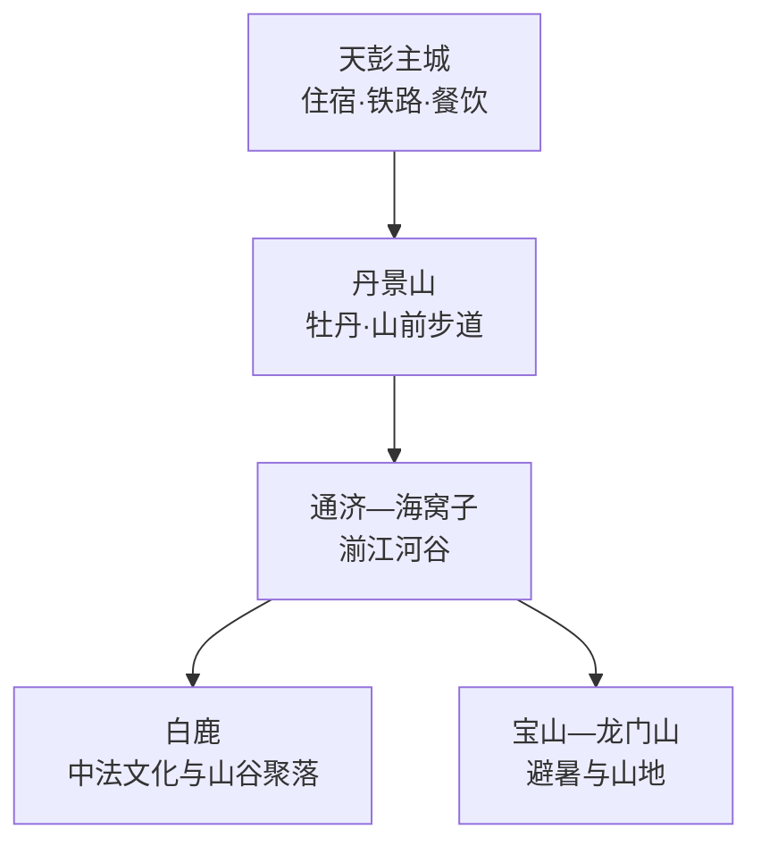
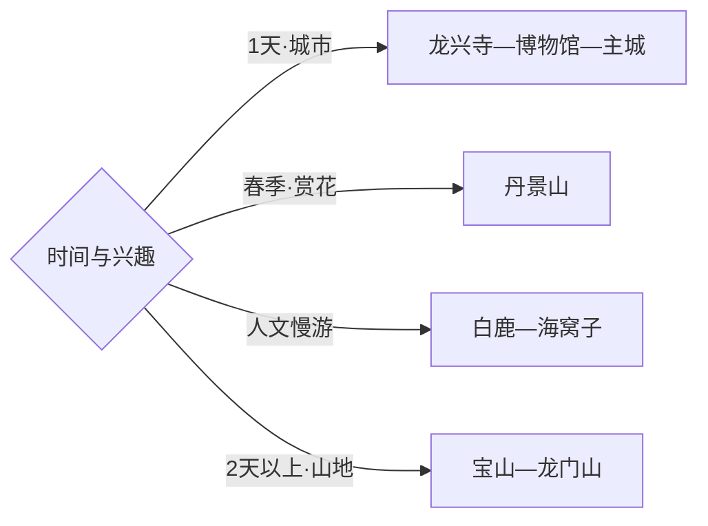

# 彭州旅行指南

彭州位于成都平原西北缘，从天彭主城向北依次进入丹景山、湔江河谷、白鹿与龙门山。首访可用一天认识主城与牡丹文化，再把山前花季、白鹿人文或龙门山避暑各拆成独立一天。固定快照中的 **Tianpeng / GeoNames 1792916** 对应彭州主城；成都中心城区、都江堰和什邡均是市界外的独立旅行单元。

> 建议停留：2–4 天\
> 旅行关键词：天彭牡丹、龙兴寺、白鹿、湔江河谷、龙门山\
> 主要体力：主城低至中等；山地中等至较高\
> 最近研究：2026-09-03

## 城市速览

| 项目 | 旅行信息 |
|---|---|
| 主要旅行价值 | 以牡丹文化为城市入口，串联川西坝子、宗教建筑、山前古镇与龙门山生态 |
| 建议停留 | 2天覆盖主城和一条山前线；3–4天可加入白鹿、宝山或龙门山 |
| 较舒适季节 | 春季适合牡丹与乡村花事；夏季山地较凉爽；雨季把道路条件放在路线选择之前 |
| 预算特点 | 主城支出温和，远线车辆、山地住宿和节庆房价是主要变量 |
| 步行强度 | 主城较低；丹景山有连续坡路和台阶；龙门山线路随入口与开放段变化 |
| 主要天气风险 | 暴雨、山洪、落石、雷电、冬季结冰与森林火险 |
| 独行旅行 | 主城点餐和移动方便；远线适合提前落实返程与正规接驳 |
| 亲子旅行 | 主城场馆、白鹿和河谷休闲段较易安排；登山线按儿童体力缩短 |
| 长者与低体力旅行 | 选择龙兴寺—博物馆—城市公园，山地以正式接驳和短步道为主 |
| 无障碍信息 | 新建公共空间相对友好，古寺、山地和村落的连续性需向运营方确认 |

## 城市格局与游览区域

| 区域 | 主要内容 | 游览特点 | 与其他区域的关系 |
|---|---|---|---|
| 天彭主城 | 龙兴寺、彭州博物馆、城市街区 | 适合连续步行与公交组合 | 作为所有远线的住宿和补给基地 |
| 丹景山 | 牡丹文化、山前景观、正式登山线 | 花期人流集中，坡路和台阶明显 | 可与主城组合为一日，花季宜给足时间 |
| 通济—海窝子 | 湔江河谷、古镇和公共休闲空间 | 需要公路接驳，适合慢游 | 位于主城前往白鹿和龙门山的过渡带 |
| 白鹿 | 音乐小镇、历史建筑与山谷景观 | 街区步行负担较低，周末较热闹 | 与丹景山方向不同，适合独立成日 |
| 宝山—龙门山 | 正规景区、温泉民宿、山地生态 | 距离长，天气和道路决定可执行范围 | 适合住宿一晚，按开放入口选择线路 |

## 主要景点

| 景点 | 区域 | 类型 | 主要看点 | 建议用时 | 室内外 | 体力 | 预约风险 | 天气影响 | 优先级 |
|---|---|---|---|---:|---|---|---|---|---|
| 龙兴寺及公开街区 | 天彭主城 | 宗教建筑与街区 | 寺院格局、舍利宝塔与主城历史 | 1–2小时 | 混合 | 低 | 低 | 低 | A |
| 彭州博物馆 | 天彭主城 | 博物馆 | 地方历史、考古与牡丹文化线索 | 1.5–2小时 | 室内 | 低 | 中 | 低 | A |
| 丹景山景区 | 丹景山镇 | 山岳与花事 | 天彭牡丹、山前景观和登山步道 | 半天–1天 | 室外 | 中高 | 花期中 | 高 | A |
| 白鹿音乐旅游景区 | 白鹿镇 | 聚落与文化 | 中法交流遗存、街区与音乐活动 | 半天 | 混合 | 低中 | 活动期中 | 中 | A |
| 海窝子古镇公开区 | 通济方向 | 古镇 | 湔江河谷聚落、街巷与地方饮食 | 2–3小时 | 混合 | 低 | 低 | 中 | B |
| 宝山旅游景区正式开放区 | 龙门山镇 | 山地度假 | 河谷、森林、温泉与乡村度假 | 1天 | 混合 | 中 | 节假日中 | 高 | B |
| 葛仙山正规乡村游点 | 葛仙山镇 | 丘陵与花果 | 花果田园、丘陵步道与季节活动 | 半天 | 室外 | 低中 | 季节中 | 中高 | B |
| 龙门山公开游线 | 北部山区 | 地质与生态 | 龙门山地貌、森林和山谷环境 | 1天 | 室外 | 高 | 高 | 很高 | C |

## 美食与餐饮

| 菜品或餐饮类型 | 常见区域 | 一个人用餐与常见份量 | 风味、过敏原与饮食限制 | 排队风险与替代方法 |
|---|---|---|---|---|
| 军屯锅魁 | 主城、交通节点 | 单份易点，可作早餐或加餐 | 常见猪肉、牛肉与面筋，素馅需确认 | 早午高峰稍忙，可选现做同类铺 |
| 九尺板鸭与鹅肠火锅 | 九尺、主城 | 板鸭适合分享；独行可选小份熟食或小锅 | 卤味偏咸，火锅常含动物油和辣椒 | 晚餐高峰提前到店，优先按锅底和份量选店 |
| 湔江河谷冷水鱼 | 通济、龙门山正规餐饮点 | 多按条计价，适合两人以上 | 鱼刺、辣椒与计价方式先确认 | 选择明码标价餐馆，独行可改家常川菜 |
| 牡丹主题点心与茶饮 | 丹景山、主城 | 单份友好 | 花香原料、糖和奶制品按配料选择 | 花期热门店排队时选择同街区替代 |
| 川芎、蔬菜等乡土菜 | 主城与正规乡村接待点 | 家常菜适合共享，可要求小份 | 药食原料按个人体质选择，过敏者先询问 | 以当季菜单为准，不把采摘园当作固定餐厅 |

## 经典行程

### 一日经典路线

**路线**：龙兴寺及公开街区 → 彭州博物馆 → 主城午餐 → 丹景山正式游线

- **串联逻辑**：上午用主城历史建立背景，下午沿彭白方向进入牡丹与山前景观。
- **预约锚点**：博物馆开放、丹景山票务与花情。
- **休息安排**：主城午餐；丹景山游客服务区补给。
- **时间不足时**：先删丹景山高处步道，保留主城与山脚花事。

### 两日城市路线

**第 1 天**：龙兴寺 → 彭州博物馆 → 主城街区。\
**第 2 天**：丹景山 → 通济或海窝子 → 返回主城。

- **串联逻辑**：城市文化与山前河谷分日，减少往返和天气干扰。
- **预约锚点**：博物馆、丹景山开放和第二日车辆。
- **休息安排**：两晚住主城；第二日在正规服务点午休。
- **时间不足时**：第二日只保留丹景山，海窝子作为弹性项。

### 三日深度路线

**第 1 天**：天彭主城。\
**第 2 天**：丹景山—通济—海窝子。\
**第 3 天**：白鹿，或按天气选择宝山正式开放区。

- **串联逻辑**：主城、山前河谷和北部人文/生态各占一天。
- **预约锚点**：第三日住宿、接驳及景区开放。
- **休息安排**：主城连住最稳妥；选择龙门山住宿时确认退改。
- **时间不足时**：先删第三日，再把第二日收缩为丹景山单点。

### 雨天路线

**路线**：彭州博物馆 → 主城午餐 → 龙兴寺开放室内段 → 城市休闲空间

- **适用条件**：普通降雨采用城市线；暴雨、山洪或地灾预警时留在主城并缩短移动。
- **预约锚点**：场馆临时闭馆与寺院活动。
- **休息安排**：博物馆周边和主城商业区。
- **时间不足时**：保留博物馆，其他项目按开放情况顺延。

### 亲子或低体力路线

**亲子路线**：彭州博物馆 → 主城午餐 → 白鹿街区短线。\
**低体力路线**：龙兴寺平缓公开区 → 博物馆 → 主城休息。

- **减负方式**：亲子线预留车程和洗手间；低体力线用车辆连接两点，把山地台阶留作可选项。
- **预约锚点**：博物馆儿童规则、白鹿活动与停车信息。
- **休息安排**：主城和白鹿正规商业区。
- **时间不足时**：亲子线删白鹿，低体力线保留博物馆单点。

### 远郊一日路线

**路线**：主城出发 → 宝山或龙门山正式开放入口 → 河谷/森林公开游线 → 返回或正规住宿

- **适用条件**：适合道路、天气和开放信息稳定的日期，山区给返程留出充足余量。
- **预约锚点**：景区、住宿、道路和森林防火公告。
- **休息安排**：游客中心、正规民宿或餐饮点。
- **时间不足时**：远郊整段删除，改为丹景山或主城。

### 花季与乡村路线

**路线**：丹景山赏牡丹 → 葛仙山正规乡村游点 → 主城晚餐

- **串联逻辑**：围绕春季花事选两个山前方向，出发前按花情取舍其一。
- **预约锚点**：牡丹花会日期、景区容量和乡村接待。
- **休息安排**：丹景山游客区或葛仙山正规接待点。
- **时间不足时**：保留花情更佳的一处，另一处留到下次。

## 住宿区域

| 区域 | 优点 | 缺点 | 适合人群 | 交通特点 |
|---|---|---|---|---|
| 天彭主城 | 餐饮、铁路和公交选择集中 | 前往北部山区需较早出发 | 首访、独行、公共交通旅行者 | 适合作为多条线路共同基地 |
| 丹景山—通济 | 靠近花事与河谷 | 夜间选择少于主城 | 花季、慢游和自驾旅行者 | 沿彭白—湔江方向移动较顺 |
| 白鹿 | 夜晚较安静，适合人文度假 | 与主城往返时间较长 | 周末度假、摄影与亲子 | 依赖公路和末端接驳 |
| 宝山—龙门山正规住宿 | 便于避暑与山地早出发 | 天气、道路与旺季退改影响大 | 计划完整山地日的旅行者 | 订房前确认具体村镇、入口和停车 |

## 市内交通

| 场景 | 建议与取舍 | 行前需要重查的内容 |
|---|---|---|
| 从成都抵达 | 铁路、公路客运或自驾均可，先确定到达的是彭州主城还是山地方向 | 车次、客运站点、末班与施工 |
| 跨片区移动 | 主城公交承担近距离，丹景山、白鹿和龙门山以公路接驳为主 | 景区专线、活动交通、返程班次 |
| 片区内游览 | 主城适合步行，古镇与景区按正式游线行走 | 步道维护、河岸封闭和入口调整 |
| 自驾 | 远线更灵活，花期和周末需预留停车与拥堵时间 | 山路、停车、地灾预警和临时管制 |

## 不同旅行者须知

| 旅行维度 | 可行条件 | 主要取舍 | 需额外核对 |
|---|---|---|---|
| 独行旅行 | 主城住宿餐饮完善 | 北部山区返程选择较少 | 最晚班次、民宿位置与接驳 |
| 亲子旅行 | 博物馆、白鹿和平缓河谷可组合 | 山地台阶与车程影响体验 | 儿童规则、卫生间和防滑条件 |
| 长者或低体力旅行 | 主城双点与白鹿短线负担较低 | 丹景山高处和龙门山徒步较重 | 接驳车、坡度和休息点 |
| 无障碍需求 | 主城新建场馆优先 | 古寺、古镇和山地连续通行有限 | 电梯、无障碍入口及卫生间 |
| 摄影旅行 | 牡丹、街区与河谷题材丰富 | 花期拥挤，山谷光线变化快 | 三脚架、航拍和活动拍摄规则 |
| 预算有限 | 主城公共空间和公交成本较低 | 远线包车与住宿抬高总支出 | 联程交通和退改条件 |
| 晚出发或紧凑行程 | 主城可保留单一半日线 | 山区往返不适合压缩 | 场馆最晚入场与返程时间 |
| 特殊天气或自然条件 | 普通小雨转城市线 | 暴雨、山洪、落石与火险会改变山地开放 | 气象、应急、道路和景区公告 |

景区、宗教场所、森林与大熊猫国家公园相关区域均按正式开放入口和游线进入；河道行洪空间、地灾治理区、矿山、采石场、施工区、农田与工业生产区保留明确边界。

## 行前核对

| 核对事项 | 为什么需要重查 | 建议核对时间 | 官方入口 |
|---|---|---|---|
| 博物馆与寺院开放 | 闭馆、法会和维护会影响主城路线 | 排入行程前及到访前一日 | [彭州市人民政府](https://www.pengzhou.gov.cn/) |
| 丹景山花情与运营 | 花期、票务和步道状态具有季节性 | 出发前一周及当天 | [四川省文化和旅游厅](https://wlt.sc.gov.cn/) |
| 丹景山、白鹿与河谷活动 | 花期、活动和接驳安排会调整 | 出发前一周及当天 | [成都发布：2026彭州牡丹花会](https://news.chengdu.cn/2026/0316/69b804023a56c94052c41e6a.shtml) |
| 山区道路与天气 | 暴雨、落石、火险和冬季结冰会改变路线 | 出发前三日及当天 | [四川省气象局](https://sc.cma.gov.cn/) |
| 铁路与接驳 | 班次、站点和活动专线会变化 | 购票前及当天 | [中国铁路12306](https://www.12306.cn/) |

## 来源与更新记录

### 主要来源

| 来源 | 类型 | 支持内容 | 核验日期 |
|---|---|---|---|
| [彭州市人民政府](https://www.pengzhou.gov.cn/) | 政府 | 市域管理、公共服务与动态公告入口 | 2026-09-03 |
| [成都发布：2026彭州牡丹花会](https://news.chengdu.cn/2026/0316/69b804023a56c94052c41e6a.shtml) | 政务新闻 | 丹景山花事、葛仙山、海窝子、白鹿与活动接驳 | 2026-09-03 |
| [四川省普通省道网布局规划](https://www.sc.gov.cn/10462/c108551/2022/3/11/1ad96a57df484ba49e0bbde0acc4b67f/files/078d7aadb7224d09b3a677e45f444e1c.pdf) | 政府规划 | 丹景山—通济—龙门山交通走向 | 2026-09-03 |
| [GeoNames 1792916](https://www.geonames.org/1792916/) | 开放数据 | Tianpeng 固定人口点、坐标与行政代码 | 2026-09-03 |

### 更新记录

| 日期 | 更新内容 |
|---|---|
| 2026-09-03 | 首次完成资料研究、空间拆分、七条路线与县级市映射 |
