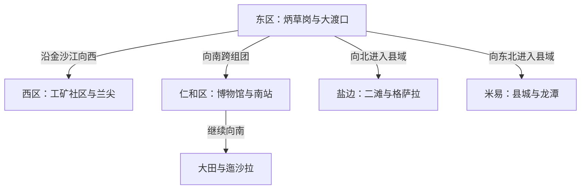

# 攀枝花旅行指南

攀枝花位于川滇交界的金沙江、雅砻江河谷，是因三线建设、矿产开发和钢铁工业迅速成长起来的山地城市。城市沿江谷和山坡分成多个组团，博物馆、工业遗产、生活城区与两座县城并不连续；冬半年阳光、地方水果和民族村落又构成另一条旅行线索。第一次到访宜先理解三线建设与河谷城市格局，再从盐边、米易或仁和南部远线中选择一个方向。

> 建议停留：2–4 天 
> 旅行关键词：三线建设、钢铁工业、金沙江河谷、阳光、芒果、民族村落 
> 主要体力：中等至较高；跨组团依赖车辆，公园、村落和远郊多坡道与台阶 
> 最近研究：2026-07-31

## 城市速览

| 项目 | 旅行信息 |
|---|---|
| 主要旅行价值 | 以攀枝花中国三线建设博物馆认识一座工业城市的形成，在东区公共公园和城市街区观察河谷组团与工业城市生活，再用苴却砚、芒果及川滇交界民族文化补足地方面貌；兰尖工业旅游仅在运营方确认当期接待条件后作为兴趣补充 |
| 建议停留 | 1 天可完成三线博物馆与仁和文化点；2 天可增加东区公共城市空间；3–4 天适合在迤沙拉、二滩、格萨拉和米易中选择一条远线。不同县域方向不宜压入同一天 |
| 较舒适季节 | 秋末至春季通常适合晒太阳和城市步行，但干季日照强、昼夜温差大，并可能进入森林草原高火险时段；6—10 月降雨集中，河谷仍可能闷热，县域山路需防强降雨、山洪和地质灾害。任何月份都要按当期预警调整 |
| 预算特点 | 主城公交、粉面和公共文化空间可组成中低至中等预算路线；机场接驳、跨组团叫车、条件性工业旅游、县域包车、景区交通和远线住宿是主要增量 |
| 步行强度 | 单座博物馆为低至中等；东区、西区和仁和之间不宜连续步行，城市公园、迤沙拉、洞穴、森林公园及峡谷道路为中等至较高体力 |
| 主要天气风险 | 河谷在晴热过程可能出现显著高温和强紫外线；干季有森林草原火险，雨季有短时强降雨、山洪、滑坡、落石和道路中断风险。市域海拔差很大，山顶机场与县域高地的气温、风和体感不能用主城天气代替 |
| 独行旅行 | 主城粉面、公交和叫车较方便；远县、村落和景区末班交通少，单人包车成本较高，夜间不应进入工业区、河岸或山路 |
| 亲子旅行 | 三线博物馆、苴却砚文化展示主题清楚；只有获得运营方当期接待确认的工业科普线路才可考虑，矿山、钢厂、水电站、洞穴、临水空间和山路必须按开放边界看护，生产区不属于自由研学场所 |
| 长者与低体力旅行 | 可用“半天一座场馆＋车辆接驳”降低负担，住宿优先选东区或仁和服务区；完整登山、洞穴、格萨拉长途和一天串联多个组团不宜作为默认安排 |
| 无障碍信息 | 公开资料不足以证明机场、铁路站、山坡街道、工业旅游车辆、历史村落和远郊景区全过程连续无障碍；电梯、轮椅、无障碍卫生间、观光车、落客点和陪同规则需逐个向运营方确认 |

## 城市格局与游览区域

攀枝花法定市域包括东区、西区、仁和区，以及米易县、盐边县，没有县级市。旅行意义上的主城沿金沙江河谷呈多组团形态：东区的炳草岗、大渡口一带承担主要商业和城市服务，西区保留密集的工矿城市景观，仁和区连接三线博物馆、苴却砚文化展示与攀枝花南站。米易、盐边各有独立县城和远郊景区，不能因同属攀枝花就当作主城近郊。

下图只表达旅行方向，不表示比例或实时车程。真正决定路线的是山体、河流、桥隧和道路条件。

东区、西区和仁和之间都应预留地面接驳；格萨拉、米易龙潭和迤沙拉分别是不同公路方向，图上的相邻关系不代表可以顺路连游。

| 区域 | 主要内容 | 游览特点 | 与其他区域的关系 |
|---|---|---|---|
| 东区炳草岗—大渡口 | 城市商业、攀枝花公园、竹湖园、金沙江城市观察点 | 服务最集中，但街区依山起伏；只有公园和短街段适合连续步行 | 适合作为首访住宿基地；前往机场、西区、仁和和县域都需车辆 |
| 东区兰尖—瓜子坪方向 | 工矿社区、城市原点相关历史线索，以及条件性兰尖工业旅游 | 工业遗产与在产矿山、厂区、专用铁路交织；本页未核实兰尖当前公众接待方式 | 默认不纳入路线；只有运营方明确确认当期开放、预约渠道、接待边界和集合点后，才作为兴趣补充 |
| 西区清香坪—河门口 | 工矿城市生活、三线建设社区与西向门户 | 城区狭长、坡度明显，生产交通密集，观景与通勤道路边界需区分 | 与东区不是一段轻松步行线；去格里坪及更远方向需另核对道路 |
| 仁和—花城新区—攀枝花南站 | 攀枝花中国三线建设博物馆、苴却砚文化旅游区、铁路门户、住宿餐饮 | 场馆主题集中但点位仍需车辆连接，适合作为完整一日 | 与东区可分两天；抵离日可围绕南站安排一座场馆，不跨到远县 |
| 仁和南部大田—平地 | 大田会议纪念馆、迤沙拉历史文化景区、乡村与民族文化 | 公路里程、坡弯、节庆客流和返程时间决定可游范围 | 宜独立一日；不与格萨拉、二滩或米易硬拼 |
| 盐边县城—二滩—红格 | 二滩国家森林公园与正式水电科普区域、盐边饮食、温泉度假 | 县城、库区、坝区和红格并非一个步行景区；水电生产区与游客区严格分开 | 可安排一个盐边日或在当地住宿；格萨拉还在更远的西北方向 |
| 盐边格萨拉方向 | 格萨拉生态旅游区及高海拔山地、彝族乡村景观 | 从主城距离长，天气、火险、道路和住宿条件比城市路线更重要 | 至少占用完整一日，稳妥做法是增加一晚；不与二滩当天串联 |
| 米易县城—白马镇方向 | 米易县城、迷昜古城旅游休闲街区、颛顼龙洞与季节性山地景观 | 县城可作独立基地，溶洞和梯田还需二次接驳；洞穴湿滑且有台阶 | 适合作为一晚以上的县域延伸，不是攀枝花南站旁的半日项目 |

工业城市景观必须在安全边界内观察。兰尖工业旅游基地虽是省级工业旅游示范基地，但现有官方来源只证明其示范基地身份，未证明当前面向公众开放，也未提供可核实的预约方式、联系方式或集合点。因此它不是默认路线锚点；只有取得运营方对当期开放、接待对象、预约渠道、接待边界和集合方式的有效确认后，才可作为兴趣补充。基地称号不等于矿山、采场、选矿区、攀钢厂区、尾矿库、料场、专用铁路、桥下作业区和生产岸线开放。不得翻越围挡、沿铁路行走、接近爆破与大型设备、进入厂矿道路或擅自拍摄受限生产设施；若获准参观，基地内的城市原点、观景台、展馆和生产实景线路仍按一个项目记录，不拆成多个景点。

二滩同样需要区分森林公园、公开展陈和水电生产设施。游客只能进入当期明确开放的观景、展览和游船项目；大坝作业面、控制室、变电设施、库岸禁入段、生产码头和非持证船舶均不属于公共游览空间。苏铁自然保护区、大黑山等自然保护地也不能仅凭地图标注进入，须以管理机构公布的开放区域和防火要求为准。

## 主要景点

优先级用于安排时间：**A** 为首访核心，**B** 为按兴趣补充，**C** 为远郊、季节性或通常需要独立半天以上的目的地。“路线节点”用于公园、车站和公共街段，不作为独立景点项目。同一景区、博物馆或工业旅游基地的内部展厅、观景台和体验点只记录一次。

### 主城、三线建设与工业文化

| 景点 | 区域 | 类型 | 主要看点 | 建议用时 | 室内外 | 体力 | 预约风险 | 天气影响 | 优先级 |
|---|---|---|---|---:|---|---|---|---|---|
| 攀枝花中国三线建设博物馆 | 仁和区花城新区 | 主题博物馆 | 全国三线建设背景、攀枝花开发建设、工业与城市生活实物；室内外展区合并记录 | 3–5 小时 | 混合 | 低至中 | 中至高 | 中 | A |
| 仁和区苴却砚文化旅游区 | 仁和区 | 专题展示、传统美术 | 苴却砚石材、雕刻工艺和地方砚文化；博物馆、展厅和文化区合并记录 | 1.5–3 小时 | 室内为主 | 低 | 中至高 | 低 | B |
| 兰尖工业旅游基地 | 东区兰尖方向 | 条件性工业旅游、矿业与钢铁科普 | 现有官方资料可支持其示范基地身份和工业遗产主题，但不能证明当前公众开放；仅在运营方确认当期开放、预约方式、接待边界和集合点后加入 | 以当期接待安排为准 | 混合 | 中 | 极高 | 中至高 | B |
| 攀枝花公园—竹湖园公共城市段 | 东区炳草岗 | 城市公园、城市观察 | 山地城市绿化、公共休息空间和河谷组团关系；两处可按体力择一，不强求全部走完 | 1.5–3 小时 | 室外为主 | 中 | 低 | 高 | 路线节点 |

### 仁和南部的历史村落

| 景点 | 区域 | 类型 | 主要看点 | 建议用时 | 室内外 | 体力 | 预约风险 | 天气影响 | 优先级 |
|---|---|---|---|---:|---|---|---|---|---|
| 迤沙拉历史文化景区 | 仁和区平地镇 | 历史文化名村、民族文化 | 村落格局、传统民居与地方文化；公共街巷、展馆、活动和生活院落边界需现场辨认 | 6–9 小时（含往返） | 室外为主 | 中至高 | 中 | 高 | C |
| 大田会议纪念馆 | 仁和区大田镇 | 纪念馆、三线建设史 | 攀枝花开发建设的重要会议史料；与三线博物馆本馆不同址，开放安排由同一馆群公告核对 | 4–7 小时（含往返） | 室内为主 | 低至中 | 高 | 中至高 | C |

### 盐边与米易远线

| 景点 | 区域 | 类型 | 主要看点 | 建议用时 | 室内外 | 体力 | 预约风险 | 天气影响 | 优先级 |
|---|---|---|---|---:|---|---|---|---|---|
| 二滩国家森林公园与正式工业科普区 | 盐边县、米易县交界方向 | 森林公园、水电工业旅游 | 雅砻江高峡平湖、森林与水电建设科普；公园内部景区和正式展陈按一个远线项目处理 | 7–10 小时（含往返） | 室外为主 | 中 | 中至高 | 高 | C |
| 格萨拉生态旅游区 | 盐边县格萨拉彝族乡 | 山地生态、民族地区 | 高海拔山地、草场和生态景观；景观受季节、火险和天气影响明显 | 完整一日或 1–2 天 | 室外 | 中至高 | 中至高 | 高 | C |
| 米易县城—迷昜古城公共片区 | 米易县城 | 县城生活、休闲街区 | 安宁河谷县城、地方展陈、夜间公共空间和餐饮；节庆活动不是常设内容 | 4–7 小时（不含主城往返） | 混合 | 低至中 | 低 | 中 | C |
| 颛顼龙洞旅游景区 | 米易县白马镇 | 喀斯特洞穴、地质景观 | 溶洞空间与地质观察；洞内台阶、湿滑、照明和封闭环境是主要门槛 | 3–5 小时（不含县际接驳） | 室内洞穴 | 中至高 | 中至高 | 中至高 | C |

芒果园、枇杷园、梯田和花海只有在经营方明确接待、道路开放且季相合适时才可加入路线。不得进入私人果园采摘、在公路边停车拍摄或跨越灌溉设施。水果上市期因品种、海拔和当年天气变化，不把某个月份写成保证成熟的承诺。

## 美食与餐饮

攀枝花饮食融合川味、盐边地方菜、河谷物产和多地建设者带来的城市移民饮食。东区炳草岗、仁和城区、盐边县城和米易县城都能寻找本地菜，但远县特色不必追逐单一名店。点餐时先问辣度、动物油、内脏、花生芝麻、豆瓣酱和共享锅底；山区“野味”、来源不明的野生菌及非法捕捞水产品不作为旅行体验。

| 菜品或餐饮类型 | 常见区域 | 一个人用餐与常见份量 | 风味、过敏原与饮食限制 | 排队风险与替代方法 |
|---|---|---|---|---|
| 盐边羊肉米线 | 全城粉面店、盐边县城 | 很适合一人，一碗即一餐，可另加羊肉 | 羊肉汤、豆瓣、花椒和辣椒常见；清真、低盐、少辣及是否含香菜需逐店确认 | 早餐与节假日热门店易排队，选择有明码标价和高翻台的同类店即可 |
| 盐边菜与油底肉 | 盐边风味餐馆、主城地方菜馆 | 多为共享菜，独行宜点小份并搭配蔬菜 | 油底肉以猪肉和油脂为主，盐分和油量通常较高；素食者需询问炒菜是否使用猪油或肉汤 | 不必把县城老店当唯一答案，优先选菜单清楚、可做小份的地方菜馆 |
| 铜火锅、牛羊肉汤锅 | 仁和、米易、盐边及主城聚餐区 | 通常适合两人以上，部分店可做小锅 | 共享锅底可能较辣，牛羊肉、动物油、豆制品、芝麻和花生蘸料需确认；生熟食夹具分开 | 晚餐和节庆坝坝宴客流高，可提前订位或改吃单人米线、盖饭 |
| 鸡枞卷粉、热凉粉与地方小吃 | 市场周边、县城街区 | 多为一人份，适合少量组合 | 酱料可能含花生、芝麻、豆类和辣椒；“鸡枞”名称不代表每家配方一致，应询问实际原料 | 选择卫生公示完整、现做现售的摊店，同类型替代通常充足 |
| 烧烤与麻辣鱼类 | 主城夜间餐饮区、盐边和米易 | 多为共享，独行先确认起点份量 | 鱼刺、辣椒、花椒、酒精和交叉接触是主要限制；水产品来源需合法、可追溯 | 夜宵高峰可能排队，改选白天营业的地方菜馆，不追逐单一“网红街” |
| 攀枝花芒果及其他时令水果 | 正规农贸市场、水果店、获准采摘园 | 适合一人购买小份，不宜一次囤积过多成熟果 | 品种、成熟度和过敏反应因人而异；切果需注意冷藏与刀具卫生，寄递前核对包装和承运规则 | 上市期随品种和天气移动，比较多家明码标价摊位；未到季时选择其他本地时果 |

## 经典行程

### 一日经典路线

**路线**：攀枝花中国三线建设博物馆 → 仁和区午餐 → 仁和区苴却砚文化旅游区 → 东区炳草岗用餐或短走公园

- **串联逻辑**：前两座场馆都在仁和方向，先用完整半天理解城市起源，再看地方工艺；傍晚乘车回东区，只在温度和光线合适时增加短步行。
- **预约锚点**：三线建设博物馆的当日开放、实名或团队讲解规则；苴却砚场馆也需确认闭馆日。
- **休息安排**：午餐和长休息放在仁和城区，转往东区后以商业区为补给点，不在江岸或工业道路临停。
- **时间不足时**：先删东区公园，再删苴却砚文化区；三线建设博物馆保留完整参观时间。

### 两日城市路线

**第 1 天**：三线建设博物馆 → 仁和午餐 → 苴却砚文化旅游区 
**第 2 天**：攀枝花公园或竹湖园 → 炳草岗午餐与长休息 → 另一处公园短线或公共城市街区

- **串联逻辑**：第一天用仁和场馆理解城市历史，第二天留在东区公共空间观察山地组团和城市生活；两座公园都靠近主要城市服务区，可按体力只走一处，不需要进入工业道路。
- **预约锚点**：第二天没有预约锚点；出发前只需重查公园开放、天气和临时施工。若另行取得兰尖运营方当前有效的开放与接待确认，可用条件性工业线路替换第二天整段，不与公园线叠加。
- **休息安排**：午餐和长休息放在炳草岗商业区，公园内只走有明确开放边界、照明和补水条件的公共步道。
- **时间不足时**：先删第二处公园或公共街区，只保留一处东区公园；未取得兰尖当期官方接待确认时，不前往厂矿“补看”。

### 三日深度路线

**第 1 天**：三线建设博物馆 → 苴却砚文化旅游区 
**第 2 天**：攀枝花公园或竹湖园 → 炳草岗城市公共空间 
**第 3 天**：在“迤沙拉历史文化景区”与“二滩国家森林公园正式开放区”中二选一

- **串联逻辑**：主城两天分别处理历史知识与公共城市空间，第三天只走一个公路方向；若选择格萨拉或米易，最好把第三天连同当地住宿重组为 1–2 天。只有获得兰尖运营方当前有效的开放、预约、接待边界和集合信息后，才可用它替换第二天全部东区公园线。
- **预约锚点**：第三天景区的开放公告、正规接驳或停车安排；默认第二天没有预约项目。
- **休息安排**：远线在县城、游客中心或正式服务点休息，不把路边观景、矿区入口和库岸当休息区。
- **时间不足时**：先删第三天远线，再把第二天缩为一处东区公园；不以夜间赶山路换取景点数量。

### 雨天路线

**路线**：三线建设博物馆 → 仁和区午餐 → 苴却砚文化旅游区

- **适用条件**：只适用于普通降雨且城市道路、场馆正常开放。出现暴雨、雷电、山洪或地质灾害预警时，不前往洞穴、森林公园、村落、库区和山路。
- **预约锚点**：两座场馆的开闭馆与临时活动；工业线路不作为雨天保底项目。
- **休息安排**：用车辆点到点连接，入口附近上下车，避免湿滑坡道和积水路段。
- **时间不足时**：只保留三线建设博物馆，苴却砚文化区顺延。

### 亲子或低体力路线

**亲子路线**：三线建设博物馆的适龄展厅 → 馆内或仁和城区休息 → 苴却砚文化展示短线

**低体力路线**：车辆抵达三线建设博物馆最近落客点 → 只看一至两个核心展厅 → 仁和城区长休息 → 返回住宿地

- **减负方式**：亲子路线不把在产厂矿、尾矿库、水电作业区和洞穴当作自由探索空间；低体力路线不追加公园登高、迤沙拉石阶或跨县当天往返。
- **预约锚点**：场馆儿童预约、推车、电梯、轮椅和讲解规则；需要无障碍协助时提前联系。
- **休息安排**：馆内座椅与仁和商业区为主要休息点，防晒、补水和昼夜温差衣物随身携带。
- **时间不足时**：两类路线都只保留三线建设博物馆，不用晚间户外补时。

### 远郊一日路线

**路线**：主城出发 → 迤沙拉历史文化景区 → 景区或平地镇正规餐饮与休息 → 原路返回

- **适用条件**：需完整白天、可确认的往返车辆，以及无高温、暴雨、山洪、地灾或高火险限制；村落节庆日还要预留交通管制和客流冗余。
- **预约锚点**：景区开放范围、停车或接驳、馆舍和活动安排；住宿游客另核对夜间抵达。
- **休息安排**：只在景区服务点、乡镇公共服务区和正规餐饮处休息，不进入生活院落、农田、果园或未开放山地。
- **时间不足时**：整段取消，不再临时改去格萨拉、二滩或米易，也不在返程后追加工业区夜游。

## 住宿区域

| 区域 | 优点 | 缺点 | 适合人群 | 交通特点 |
|---|---|---|---|---|
| 东区炳草岗—攀枝花公园周边 | 餐饮、商业、医院和城市服务集中，适合作为跨组团基地 | 山坡道路和临街噪声差异大；到南站、三线博物馆和县域仍需较长接驳 | 首访、独行、晚餐选择多、需要稳定城市服务者 | 公交和叫车选择相对多；机场路、桥隧和高峰拥堵需重查 |
| 仁和城区—花城新区 | 靠近三线博物馆、苴却砚文化区和部分新城服务，路线节奏较缓 | 与东区商业核心和西区有距离，夜间选择因街区而异 | 场馆旅行、亲子、低体力、希望减少第一天换乘者 | 适合车辆连接场馆；不要把“新区内”理解为全程步行可达 |
| 攀枝花南站周边 | 铁路抵离方便，适合早晚班次和南向县域接驳 | 与东区、机场和多数景点仍有距离，部分地段以交通功能为主 | 铁路中转、抵离日、第二天去仁和南部者 | 购票和订房同时确认完整站名、出站口与实际道路距离 |
| 西区清香坪—河门口 | 便于观察工矿城市生活和西向工业文化 | 到三线博物馆、南站、机场及盐边东部方向通勤较长，环境更偏生产城市 | 工业史兴趣、办事或探访西区者 | 车辆为主；大型货车、厂区交通和道路施工需留冗余 |
| 盐边县城或红格 | 便于二滩、盐边饮食和温泉度假分段，能减少主城当天往返 | 县城、红格、二滩和格萨拉彼此仍有距离，夜间交通少于主城 | 盐边一至两日、康养度假、自驾分段者 | 需按实际景区入口和住宿地规划，不能只看“盐边”标签 |
| 米易县城 | 县城服务完整，适合安宁河、迷昜古城和米易远线 | 与攀枝花主城是独立住宿基地，去龙洞、梯田仍需接驳 | 米易一至两日、慢旅行、县域餐饮与节庆兴趣者 | 铁路、公路和景区接驳分别核对；不把米易站等同于景区入口 |
| 迤沙拉或格萨拉正规住宿点 | 可减少长途当天往返，便于早晚观察村落与山地 | 房量、餐饮、医疗、网络、消防和退改条件有限且季节性强 | 自驾、摄影、完整远线且能接受乡村服务差异者 | 订房前确认运营资质、夜间到达、停车、接送和恶劣天气取消 |

不推荐未经核验的具体酒店。订房时核对电梯、无障碍客房、空调、遮光、临街和工业噪声、停车与充电、夜间前台、行李寄存及退改规则；乡村和山地住宿还应确认消防疏散、稳定供水供电、通讯和最近医疗点。

## 市内交通

| 场景 | 建议与取舍 | 行前需要重查的内容 |
|---|---|---|
| 攀枝花保安营机场抵达 | 机场位于约 1980 米的山顶，落地后仍需沿山地公路进入城市组团；海拔、风、低云和主城天气可能不同，航班与接驳必须留冗余 | 实际执飞、天气运行、值机截止、机场巴士或公交、出租车与网约车上客点、夜间接驳和特殊旅客服务 |
| 攀枝花南站及其他铁路站名 | 攀枝花南站是常见客运门户，但购票必须以 12306 显示的完整站名和实际车次为准；“到攀枝花”不等于到东区中心 | 车次、站名、进出站口、公交与叫车、无障碍协助、施工和夜间到达 |
| 主城跨组团移动 | 城市没有可替代所有接驳的地铁网络，公交、出租车和合规网约车共同承担东区、西区、仁和之间移动 | 线路、首末班、道路施工、桥隧管制、高峰拥堵、叫车落点和无障碍车辆 |
| 片区内步行 | 炳草岗公园周边、仁和场馆周边可分段步行，但山坡、台阶、过街和不连续人行道会放大负担 | 坡度、台阶、电梯、遮阴、夜间照明、临时围挡和高温时段 |
| 条件性工业旅游 | 本页未核实兰尖当前面向散客或团队的公众接待方式；未取得运营方当前有效确认时，不前往，也不把工业专用铁路、矿山便道、厂区班车和生产码头当作公共交通 | 是否当期开放、接待对象、官方联系方式、预约渠道、集合点、指定车辆、证件、防护、摄影和临时生产管控 |
| 盐边、米易和仁和南部 | 县际客运、旅游接驳、自驾或合规车辆各有适用条件；到县城后通常仍需二次接驳到景区 | 客运站、班次、末班、正规车辆、景区入口、返程备用、行李和夜间落客 |
| 自驾 | 多人去迤沙拉、二滩、格萨拉或米易时较灵活，但峡谷道路坡陡弯急，货车、落石、雾和暴雨后路况增加负担 | 高速与国省县道施工、限行、停车、充电加油、火险和地灾预警、救援方式；不在不熟悉的山路疲劳或夜间赶行程 |
| 金沙江、雅砻江及库区水上活动 | 只参加持证运营方公布的码头、船舶和航次；河流、库区、生产岸线及水电设施不提供默认公共游览权 | 水位、大风雷暴、停航、救生装备、登船证件、码头位置和无障碍登船 |

铁路动态查询统一使用[中国铁路 12306](https://www.12306.cn/)。机场与县域道路都可能因天气改变运行，地图预计时间不能替代当日运营和交通部门公告。

## 不同旅行者须知

| 旅行维度 | 可行条件 | 主要取舍 | 需额外核对 |
|---|---|---|---|
| 独行旅行 | 东区和仁和的场馆、粉面、公交与叫车较方便，可建立固定住宿基地 | 远县单人用车成本高，山路与景区末班后替代少；不独自进入厂矿、河滩和非开放山地 | 末班、正规车辆、住宿入住、景区信号、应急点和夜间返程 |
| 亲子旅行 | 三线建设博物馆、苴却砚文化展示有明确知识主题；工业科普只考虑获得运营方当期正式接待确认的线路 | 生产设备、铁路、临水、高温、洞穴和长时间乘车提高看护负担 | 儿童预约、推车、电梯、卫生间、防护装备、年龄身高和研学团队规则 |
| 长者或低体力旅行 | 每半天一座场馆、点到点车辆、东区或仁和长休息较可行 | 公园登高、经确认的完整工业线路、洞穴、迤沙拉和格萨拉应主动删减 | 最近落客点、座椅、电梯、轮椅、无障碍卫生间、观光车和陪同要求 |
| 无障碍需求 | 优先联系机场、铁路站、三线博物馆和住宿安排协助 | 公开资料不能证明山坡街道、工业车辆、历史村落、洞穴和县域景交车全过程连续可达 | 需逐点确认轮椅尺寸、坡度、升降设备、换乘、卫生间和应急疏散 |
| 摄影旅行 | 公共公园、城市观景点、迤沙拉和正式景区可提供工业城市、村落与山地题材 | 烟霞、花期、果期和库区水色不可保证；厂矿、机场、铁路、水电站与无人机有严格限制 | 日出前后开放、三脚架、商业拍摄、无人机空域、生产保密和夜间返程 |
| 预算有限 | 主城公交、公共公园、粉面和免费或低成本场馆可控制花费 | 远县包车、条件性工业旅游团、景交车和两地住宿会显著增加总成本 | 免费预约、优惠资格、正规交通总价、退改与是否真的需要套票 |
| 晚出发或紧凑行程 | 半天只选三线建设博物馆或东区公共空间中的一个 | 午后不再前往迤沙拉、二滩、格萨拉或米易，不以末班县际交通作唯一退路 | 最晚入场、闭馆日、公交末班、叫车和次日首班 |
| 高温与强日照 | 把城市户外放在较凉时段，中午进入场馆，车辆代替无意义爬坡 | 河谷高温可与“冬季温暖”的城市印象同时存在，缺少遮阴会快速增加体力和补水需求 | 攀枝花气象预警、场馆空调、饮水点、防晒、药品储存和车辆等待位置 |
| 雨季、火险与海拔差 | 只有在道路、景区和林区确认开放时进入远线；不同海拔分别准备衣物 | 雨停不代表山洪、落石和滑坡风险立即解除；干季高火险会限制林区活动和用火 | 气象、应急、自然资源、林草、交通和景区公告，以及机场、主城、格萨拉等点位天气 |

## 行前核对

| 核对事项 | 为什么需要重查 | 建议核对时间 | 官方入口 |
|---|---|---|---|
| 攀枝花中国三线建设博物馆及馆群 | 闭馆日、实名登记、讲解、团队预约、临展、室外展区和大田会议纪念馆安排会调整 | 确定日期后、到访前三日及当天 | [攀枝花中国三线建设博物馆](https://pzhsxjs.museum.chaoxing.com/node/12_3.jspx)及[攀枝花文旅](https://wglj.panzhihua.gov.cn/lyfw/) |
| 苴却砚文化旅游区 | 馆舍、展厅、活动、开放时段和团体接待并非永久固定 | 排入路线前、到访前一日 | 仁和区文化旅游主管部门、景区运营方及[四川省 A 级景区名录](https://wlt.sc.gov.cn/scwlt/c100297/introduce.shtml) |
| 兰尖工业旅游基地（条件性兴趣补充） | 现有官方来源只证明示范基地身份，未证明当前公众开放，也未给出可核实的预约渠道、联系方式或集合点；这些信息未由运营方确认前不排入路线 | 只有获得运营方当前有效的官方公告或直接确认后 | [四川省工业旅游示范基地名单](https://jxt.sc.gov.cn/scjxt/wjfb/2024/1/4/25ca8b3c1b4b4f84b6da335c29017003/files/%E9%99%84%E4%BB%B6%EF%BC%9A2023%E5%B9%B4%E5%9B%9B%E5%B7%9D%E7%9C%81%E5%B7%A5%E4%B8%9A%E6%97%85%E6%B8%B8%E7%A4%BA%E8%8C%83%E5%9F%BA%E5%9C%B0%E5%90%8D%E5%8D%95.pdf)仅用于身份核对，不作为开放或预约凭证；稳定替代为三线建设博物馆、苴却砚文化区、攀枝花公园或竹湖园 |
| 迤沙拉、大田、二滩、格萨拉和米易景区 | 景区、展馆、洞穴、森林与水电展示各有独立开放、票务、接驳和防火边界 | 订房前、到访前三日、前一日及当天 | [攀枝花文旅 A 级景区入口](https://wglj.panzhihua.gov.cn/lyfw/wlml/Ajjq/10114276.shtml)、对应县区政府和运营方 |
| 铁路与攀枝花南站 | 车次、站名、进出站口、改签和到主城接驳共同决定路线 | 购票时、出发前一日及当天 | [中国铁路 12306](https://www.12306.cn/) |
| 攀枝花保安营机场 | 航季、天气运行、值机、山顶道路、机场巴士与特殊旅客服务变化快 | 订票前、起飞前一日及当天 | 承运人、机场渠道及[中国民用航空局机场信息](https://www.caac.gov.cn/GYMH/MHGK/MYJC/XNDQ/SC/201509/t20150923_2165.html) |
| 主城公交、县际客运与自驾道路 | 首末班、施工、节庆管制、货运交通和山路落石会改变接驳 | 出发前一周、前一日及每天出发前 | [攀枝花市交通运输局](https://jtj.panzhihua.gov.cn/)及客运站、景区官方渠道 |
| 高温、暴雨、山洪与地质灾害 | 河谷可能出现高温，仁和、米易、盐边等山地雨季可能出现山洪和地灾风险，预警会直接改变远线路线 | 出发前三日、每日早晨及进入山区前 | [攀枝花气象服务](https://sc.weather.com.cn/panzhihua/index.shtml)、四川及攀枝花应急、自然资源、水利部门 |
| 森林草原火险 | 攀西干季火险突出，保护地、森林公园、村落和户外项目可能限流、禁火或关闭 | 订房前、到访前三日及每天进山前 | [四川省森林草原防火命令解读](https://www.sc.gov.cn/10462/10464/13298/14097/2026/1/4/495f80b717b04dddb3838f90a52500b0.shtml)及当地林草、景区公告 |
| 海拔差与天气分区 | 主城、山顶机场、格萨拉和米易山地的温度、风、紫外线和体感可能明显不同 | 打包前及每天出发前 | 中国气象局渠道、机场与景区公告；按具体点位查询，不只看“攀枝花市区” |
| 芒果、采摘与餐饮 | 品种成熟期、采摘接待、寄递、餐厅营业、辣度和过敏原随季节与经营者变化 | 排入餐单或采摘前 | 攀枝花农业农村、市场监管、文旅部门及经营者公示信息 |
| 无障碍连续性 | 单个场所有电梯或观光车，不等于从车站到核心展项全程可独立通行 | 订票、订房和用车前逐个联系 | 机场、铁路、场馆、景区、住宿和交通运营方官方客服 |
| 入境、签证与证件规则 | 仅国际旅行者需要；规则随国籍、证件、口岸和承运人变化，支线机场不能默认提供所需入境服务 | 订票前及出发前 | [国家移民管理局](https://www.nia.gov.cn/)及承运人官方渠道 |

## 来源与更新记录

### 标识与行政边界说明

本页 `geonames_id` 使用 2026-07-30 GeoNames 固定快照中的攀枝花城市居民点记录 `6929460`，坐标约为北纬 26.58509、东经 101.71276，要素代码为 `P/PPLA2`。它用于定位城市点，不等同于攀枝花市完整行政边界。四川省民政厅截至 2025 年 12 月 31 日的行政区划代码表确认攀枝花市代码为 `510400`；市域下辖东区、西区、仁和区、米易县和盐边县，没有县级市。

Wikidata `Q425415` 对应四川省地级市攀枝花市。页面以法定市域解释行政归属，以实际道路和运营边界解释旅行范围；东区、西区、仁和区是主城组团和市辖区，米易县、盐边县则是各有县城与远线景区的普通县，不能混作一片连续城区。

### 主要来源

| 来源 | 类型 | 支持内容 | 核验日期 |
|---|---|---|---|
| [四川省行政区划代码信息表（截至 2025 年 12 月 31 日）](https://mzt.sc.gov.cn/scmzt/quhuaxinxi/2026/1/28/fccc0ed4b8fe4655a3b946c6d8e9e1ed.shtml) | 省级民政主管部门 | 攀枝花市 `510400` 及 3 个市辖区、2 个县的现行法定结构 | 2026-07-31 |
| [四川省人民政府关于《攀枝花市国土空间总体规划（2021—2035 年）》的批复](https://www.sc.gov.cn/10462/zfwjts/2024/3/1/7edfe81c741649a38c20e0f7c9689a5e.shtml) | 省政府、法定规划批复 | 市域空间格局、川滇交界区域中心定位，以及迤沙拉、三线工业遗产等保护边界 | 2026-07-31 |
| [攀枝花市人民政府：城市概况](https://www.panzhihua.gov.cn/PeoplesGovernmentofPanzhihuaMunicipal/index.shtml) | 市政府 | 金沙江与雅砻江、山地峡谷、立体气候、行政区划、格萨拉、二滩、颛顼龙洞及地方物产 | 2026-07-31 |
| [攀枝花中国三线建设博物馆](https://pzhsxjs.museum.chaoxing.com/node/12_3.jspx) | 场馆官网 | 博物馆机构与展陈入口、三线建设主题和馆群动态核对 | 2026-07-31 |
| [四川省文化和旅游厅：攀枝花中国三线建设博物馆](https://wlt.sc.gov.cn/scwlt/wlyw/2021/4/23/d068c61739c14c739e3eb54b8766e23e.shtml) | 省级文旅主管部门 | 场馆性质、位置、展陈主题及地方美食与远郊景区线索 | 2026-07-31 |
| [四川省 A 级旅游景区名录](https://wlt.sc.gov.cn/scwlt/c100297/introduce.shtml) | 省级文旅主管部门 | 三线建设博物馆、苴却砚文化旅游区、迤沙拉及其他正式景区名称与行政归属 | 2026-07-31 |
| [四川省 2023 年工业旅游示范基地名单](https://jxt.sc.gov.cn/scjxt/wjfb/2024/1/4/25ca8b3c1b4b4f84b6da335c29017003/files/%E9%99%84%E4%BB%B6%EF%BC%9A2023%E5%B9%B4%E5%9B%9B%E5%B7%9D%E7%9C%81%E5%B7%A5%E4%B8%9A%E6%97%85%E6%B8%B8%E7%A4%BA%E8%8C%83%E5%9F%BA%E5%9C%B0%E5%90%8D%E5%8D%95.pdf) | 省级经济和信息化、文旅主管部门 | 只支持兰尖工业旅游基地的示范基地身份，不支持当前公众开放、预约方式、联系方式或集合点 | 2026-07-31 |
| [文化和旅游部：攀枝花三线建设文化遗产保护利用](https://www.mct.gov.cn/whzx/qgwhxxlb/sc/201908/t20190828_845918.htm) | 国家文旅主管部门 | 城市原点、兰尖铁矿、攀钢工业遗产与三线建设城市文化关系；历史资料不支持当前公众接待状态 | 2026-07-31 |
| [攀枝花文旅：二滩国家森林公园](https://wglj.panzhihua.gov.cn/lyfw/wlml/Ajjq/10114276.shtml) | 市级文旅主管部门 | 二滩森林公园、高峡平湖与正式工业科普旅游范围 | 2026-07-31 |
| [四川省林业和草原局：攀枝花自然保护地防火与安全检查](https://lcj.sc.gov.cn/scslyt/sxdt/2024/2/8/50ed471ed71c4ed29176957f1b060ec2.shtml) | 省级林草主管部门 | 苏铁保护区、二滩、大黑山、龙潭等自然保护地的火源管控和安全边界 | 2026-07-31 |
| [攀枝花市交通运输局：2026 年清明及春假出行指南](https://jtj.panzhihua.gov.cn/zfxxgk/tzgg/10283122.shtml) | 市级交通主管部门 | 高速、国省县道、空铁公水客运和旅游线路动态核对方法 | 2026-07-31 |
| [中国民用航空局：攀枝花保安营机场](https://www.caac.gov.cn/GYMH/MHGK/MYJC/XNDQ/SC/201509/t20150923_2165.html) | 国家民航主管部门 | 攀枝花现行民航机场名称与官方入口 | 2026-07-31 |
| [中国民用航空局：高原机场规划建设技术资料](https://www.caac.gov.cn/HDJL/YJZJ/202407/P020240726623847885542.pdf) | 国家民航主管部门 | 保安营机场约 1980 米海拔、山顶和复杂地形条件，支持接驳与天气冗余提示 | 2026-07-31 |
| [中国铁路 12306](https://www.12306.cn/) | 国家铁路官方查询平台 | 攀枝花南站等完整站名、实际车次与动态票务核对 | 2026-07-31 |
| [中国天气网：攀枝花气候背景](https://www.weather.com.cn/cityintro/101270201.shtml) | 中国气象局公共气象服务 | 干雨季、日照、强辐射、降雨集中和垂直气候差异 | 2026-07-31 |
| [中国天气网：攀枝花高温红色预警案例](https://sc.weather.com.cn/tqyw/05/3624853.shtml) | 中国气象局公共气象服务 | 河谷晴热过程可出现显著高温，不能以年均温替代逐日预警 | 2026-07-31 |
| [四川省人民政府：2026 年森林与草原防火命令解读](https://www.sc.gov.cn/10462/10464/13298/14097/2026/1/4/495f80b717b04dddb3838f90a52500b0.shtml) | 省政府、应急管理部门 | 防火期、火险预警响应和林区火源管控的动态依据 | 2026-07-31 |
| [四川省文化和旅游厅：攀枝花山洪与地质灾害旅游风险提示](https://wlt.sc.gov.cn/scwlt/gsgg/2025/6/21/bbd296234f804df888f2b999f576b05a.shtml) | 省级文旅主管部门 | 仁和、盐边、米易在强降雨条件下的山洪和地质灾害风险及避让原则 | 2026-07-31 |
| [攀枝花文旅：地方水果与上市期](https://wglj.panzhihua.gov.cn/lyfw/xccx/10208174.shtml) | 市级文旅主管部门 | 芒果等地方水果、品种与季节变化，支持不把单一月份写成保证成熟 | 2026-07-31 |
| [GeoNames：Panzhihua](https://www.geonames.org/6929460/panzhihua.html) | 开放地名数据 | 城市居民点 `6929460` 的位置和要素记录；同时核对固定快照 | 2026-07-31 |
| [Wikidata：Q425415](https://www.wikidata.org/wiki/Q425415) | 开放结构化数据 | 攀枝花市实体标识与多语名称交叉核对 | 2026-07-31 |

### 更新记录

| 日期 | 更新内容 |
|---|---|
| 2026-07-31 | 建立东区—西区—仁和多组团与米易、盐边远线关系，整理三线建设、苴却砚、条件性工业旅游、历史村落、二滩与县域景区；补充兰尖当前公众接待证据边界与稳定替代路线，以及厂矿、专用铁路、尾矿库、水电生产区和自然保护地禁入边界、高温、森林火险、雨季山洪地灾、机场海拔差、芒果季节性和无障碍信息 |
